# Bug Bounty Automation Toolkit / 버그바운티 자동화 툴킷

[](https://nodejs.org/)
[](https://playwright.dev/)
[](https://go.dev/)
[](https://github.com/features/actions)
[](https://openssf.org/)
[](https://cliproxy.jclee.me)
[](LICENSE)

---

## Table of Contents / 목차

- [Overview / 개요](#overview--개요)
- [Features / 주요 기능](#features--주요-기능)
- [Architecture / 아키텍처](#architecture--아키텍처)
- [Automation Inventory / 자동화 목록](#automation-inventory--자동화-목록)
- [Quick Start / 빠른 시작](#quick-start--빠른-시작)
- [Local Development / 로컬 개발](#local-development--로컬-개발)
- [Commands Reference / 명령어 참조](#commands-reference--명령어-참조)
- [Repository Structure / 저장소 구조](#repository-structure--저장소-구조)
- [Contribution Guide / 기여 가이드](#contribution-guide--기여-가이드)

---

## Overview / 개요

### English

**Bug Bounty Automation Toolkit** is a local automation workspace for authorized web security research, vulnerability-study exercises, and lab-solving workflows. The repository combines:

- **Node.js ESM scripts** for PortSwigger/Web Security Academy style lab automation using Playwright
- **Go helper programs** for monitoring and vulnerability-hunting command orchestration
- **GitHub Actions workflows** (30 total) for PR checks, security scanning, PR review automation, issue management, release automation, documentation sync, and CI auto-healing
- **Bot-side helper scripts** in `_bot-scripts/` for README generation, PR review execution, workflow validation, and repository analysis

### 한국어

**버그 바운티 자동화 툴킷**은 권한이 있는 웹 보안 연구, 취약점 학습 연습, 랩求解 워크플로우를 위한 로컬 자동화 작업 공간입니다. 이 저장소는 다음을 결합합니다:

- **Node.js ESM 스크립트** - Playwright를 사용한 PortSwigger/Web Security Academy 스타일 랩 자동화
- **Go 헬퍼 프로그램** - 모니터링 및 취약점 헌팅 명령 오케스트레이션
- **GitHub Actions 워크플로우** (총 30개) - PR 검사, 보안 스캐닝, PR 리뷰 자동화, 이슈 관리, 릴리스 자동화, 문서 동기화, CI 자동 복구
- **`_bot-scripts/`** 내의 봇 사이드 헬퍼 스크립트 - README 생성, PR 리뷰 실행, 워크플로우 검증, 저장소 분석

---

## Features / 주요 기능

### English

| Category | Description |
|----------|-------------|
| **Lab Automation** | Automated PortSwigger Web Security Academy lab solving using Playwright and Node.js ESM scripts |
| **Recon Pipeline** | 5-phase recon: subdomain enumeration → port scanning → technology detection → content discovery → nuclei scan |
| **Diff Monitoring** | Detects new subdomains and endpoints by comparing timestamped baseline scans against current state |
| **Vulnerability Hunting** | Targeted scanning for SSRF, IDOR, SQLi, XSS, Command Injection, and more via nuclei templates |
| **PR Automation** | Auto-assign reviewers, apply semantic labels, auto-merge dependabot updates, cleanup merged PRs |
| **Security Scanning** | gitleaks (secret detection), CodeQL (static analysis), Scorecard (supply-chain security), Dependency Review |
| **PR Review Bot** | AI-powered PR reviews via `pr-agent` integration through CLIProxy API (`cliproxy.jclee.me`) |
| **Issue Management** | Automated issue classification, backfill from labels, health checks on downstream dependencies |
| **CI Auto-Heal** | Automatic recovery from flaky or broken CI runs via `60_ci-auto-heal.yml` |
| **Documentation Sync** | Automatic README regeneration and docs synchronization across workflows |

### 한국어

| 카테고리 | 설명 |
|----------|-------------|
| **랩 자동화** | Playwright 및 Node.js ESM 스크립트를 사용한 PortSwigger Web Security Academy 랩 자동求解 |
| **Recon 파이프라인** | 5단계 reconnaissance: 서브도메인 열거 → 포트 스캐닝 → 기술 탐지 → 콘텐츠 발견 → nuclei 스캐닝 |
| **Diff 모니터링** | 타임스탬프된 베이스라인 스캔과 현재 상태를 비교하여 새 서브도메인 및 엔드포인트 감지 |
| **취약점 헌팅** | nuclei 템플릿을 통한 SSRF, IDOR, SQLi, XSS, 명령 인젝션 등에 대한 타겟 스캐닝 |
| **PR 자동화** | 리뷰어 자동 배정, 시맨틱 라벨 적용, dependabot 업데이트 자동 병합, 병합된 PR 정리 |
| **보안 스캐닝** | gitleaks (시크릿 탐지), CodeQL (정적 분석), Scorecard (공급망 보안), Dependency Review |
| **PR 리뷰 봇** | CLIProxy API (`cliproxy.jclee.me`)를 통한 `pr-agent` 통합 AI 기반 PR 리뷰 |
| **이슈 관리** | 자동 이슈 분류, 라벨からの 백필, 하위 스트림 의존성 건강 검사 |
| **CI 자동 복구** | `60_ci-auto-heal.yml`를 통한 불안정하거나 고장난 CI 실행의 자동 복구 |
| **문서 동기화** | 워크플로우 전반의 자동 README 재생성 및 문서 동기화 |

---

## Architecture / 아키텍처

### English

The system consists of two layers: **GitHub Actions** (repository-side automation) and **Bot-side helpers** (`_bot-scripts/`), orchestrated via GitHub Events and the CLIProxy API.

### 한국어

시스템은 **GitHub Actions** (저장소 측 자동화)와 **Bot-side 헬퍼** (`_bot-scripts/`)의 두 레이어로 구성되며, GitHub Events 및 CLIProxy API를 통해 오케스트레이션됩니다.

```mermaid
flowchart TB
    subgraph GHA["GitHub Actions Layer"]
        E1["push / pull_request\nEvent"]
        E2["issues Event"]
        E3["workflow_dispatch\nEvent"]

        W1["01_branch-to-pr.yml"]
        W2["02_issue-to-branch.yml"]
        W3["03_pr-checks.yml"]
        W4["04_actionlint.yml"]
        W5["05_gitleaks.yml"]
        W6["06_codeql.yml"]
        W7["07_dependency-review.yml"]
        W8["08_scorecard.yml"]
        W9["09_semantic-pr.yml"]
        W10["10_pr-review.yml"]
        W11["12_dependabot-auto-merge.yml"]
        W12["13_pr-auto-merge.yml"]
        W13["14_bot-auto-fix.yml"]
        W14["15_merged-pr-cleanup.yml"]
        W15["18_issue-management.yml"]
        W16["19_issue-backfill.yml"]
        W17["20_readme-gen.yml"]
        W18["21_docs-sync.yml"]
        W19["24_release-notes.yml"]
        W20["25_release-publish.yml"]
        W21["29_downstream-health-check.yml"]
        W22["37_ci-failure-issues.yml"]
        W23["42_reusable-docs-sync.yml"]
        W24["43_reusable-issue-management.yml"]
        W25["44_reusable-pr-checks.yml"]
        W26["45_reusable-gitleaks.yml"]
        W27["60_ci-auto-heal.yml"]
        W28["91_issue-classification.yml"]
        W29["ci.yml"]
        W30["security/11_pr-review.yml"]
    end

    subgraph BOT["Bot-Side Layer\n(_bot-scripts/)"]
        B1["generate_readme.py\nREADME regeneration"]
        B2["pr_review_runner.py\nPR review execution"]
        B3["check_workflow_scripts.py\nWorkflow validation"]
        B4["repo_review.py\nRepo analysis"]
        B5["check_hardcode_scan_patterns_test.py"]
        B6["check_private_ips.py\nIP exposure scan"]
        B7["issue_classification_workflow_test.py"]
        B8["pr_review_runner_test.py"]
        B9["redact_exposed_secrets.py\nSecret redaction"]
    end

    subgraph EXT["External Services"]
        API["CLIProxy API\ncliproxy.jclee.me"]
        PRAGENT["qodo-ai/pr-agent\nAI review provider"]
        DSC["Discord\nNotification"]
        CRT["crt.sh\nCertificate enum"]
    end

    E1 --> W1
    E1 --> W2
    E2 --> W16
    E2 --> W17
    E2 --> W28
    E3 --> W27

    W1 --> W3
    W2 --> W3

    W3 --> W4
    W3 --> W5
    W3 --> W6
    W3 --> W7
    W3 --> W8
    W3 --> W9
    W3 --> W10

    W10 --> B2
    B2 --> API
    API --> PRAGENT

    W17 --> B1

    W18 --> B3

    W22 --> B4

    W23 --> B4

    W25 --> W5

    W27 --> DSC

    W28 --> B5
    W28 --> B6

    W29 --> DSC

    style GHA fill:#1a1a2e,color:#fff
    style BOT fill:#16213e,color:#fff
    style EXT fill:#0f3460,color:#fff
```



---

## Automation Inventory / 자동화 목록

### GitHub Actions Workflows / GitHub Actions 워크플로우

#### Pull Request Automation / PR 자동화

| File | Description |
|------|-------------|
| `01_branch-to-pr.yml` | Convert branch to PR with auto-description |
| `03_pr-checks.yml` | Central PR validation: lint, tests, security |
| `04_actionlint.yml` | GitHub Actions workflow syntax validation |
| `05_gitleaks.yml` | Secret detection in commits and code |
| `06_codeql.yml` | CodeQL static analysis |
| `07_dependency-review.yml` | Dependency vulnerability review |
| `08_scorecard.yml` | OpenSSF Scorecard supply-chain assessment |
| `09_semantic-pr.yml` | Enforce conventional commit / semantic PR titles |
| `10_pr-review.yml` | AI-powered PR review via pr-agent |
| `12_dependabot-auto-merge.yml` | Auto-merge dependabot PRs |
| `13_pr-auto-merge.yml` | Auto-merge PRs meeting criteria |
| `14_bot-auto-fix.yml` | Bot-triggered auto-fix on failure |
| `15_merged-pr-cleanup.yml` | Cleanup branches after PR merge |
| `44_reusable-pr-checks.yml` | Reusable workflow for PR checks |
| `45_reusable-gitleaks.yml` | Reusable workflow for secret scanning |
| `security/11_pr-review.yml` | Security-specific PR review |

#### Issue Management / 이슈 관리

| File | Description |
|------|-------------|
| `02_issue-to-branch.yml` | Create branch from issue |
| `18_issue-management.yml` | Issue lifecycle management |
| `19_issue-backfill.yml` | Backfill issues from labels |
| `37_ci-failure-issues.yml` | Create issue on CI failure |
| `43_reusable-issue-management.yml` | Reusable issue management workflow |
| `91_issue-classification.yml` | AI-driven issue classification |

#### Release Automation / 릴리스 자동화

| File | Description |
|------|-------------|
| `24_release-notes.yml` | Auto-generate release notes |
| `25_release-publish.yml` | Publish release artifacts |

#### Documentation / 문서

| File | Description |
|------|-------------|
| `20_readme-gen.yml` | Auto-regenerate README via generate_readme.py |
| `21_docs-sync.yml` | Sync documentation across branches |
| `42_reusable-docs-sync.yml` | Reusable docs sync workflow |

#### CI Health / CI 건강

| File | Description |
|------|-------------|
| `29_downstream-health-check.yml` | Health check on downstream repos |
| `60_ci-auto-heal.yml` | Auto-heal broken CI runs |
| `ci.yml` | Core CI pipeline |

### Bot-Side Helper Scripts / 봇 사이드 헬퍼 스크립트

| Script | Purpose |
|--------|---------|
| `generate_readme.py` | README regeneration (model: minimax-m2.7 via CLIProxy) |
| `pr_review_runner.py` | Execute PR reviews via CLIProxy API |
| `check_workflow_scripts.py` | Validate workflow script patterns |
| `repo_review.py` | Repository-level analysis |
| `check_private_ips.py` | Scan for RFC1918 IP exposure |
| `check_hardcode_scan_patterns_test.py` | Hardcoded pattern validation |
| `issue_classification_workflow_test.py` | Issue classification testing |
| `pr_review_runner_test.py` | PR review runner tests |
| `redact_exposed_secrets.py` | Redact exposed secrets from logs |

### Local Automation Tools / 로컬 자동화 도구

| Tool | Language | Purpose |
|------|----------|---------|
| `setup.go` | Go | Tool verification and wordlist download |
| `recon.go` | Go | 5-phase recon pipeline |
| `monitor.go` | Go | Diff-based change detection + crt.sh + Discord alerts |
| `hunt.go` | Go | Targeted vulnerability hunting |
| `lib.go` | Go | Shared helpers (queryCrtSh, mergeFiles, writeLines, etc.) |
| `lab-runner.mjs` | Node.js | PortSwigger lab solver via Playwright |
| `lab-solver.mjs` | Node.js | Custom Playwright lab solvers |
| `lab-gap-solver.mjs` | Node.js | Gap solver for labs without Python scripts |

---

## Quick Start / 빠른 시작

### Prerequisites / 사전 요구사항

- Go 1.21+
- Node.js 18+ (ESM)
- [Playwright](https://playwright.dev/) (`npx playwright install`)
- Tools: `nuclei`, `subfinder`, `amass`, `naabu`, `wappalyzer` (see `setup.go`)

### First-Time Setup / 최초 설정

```bash
# Clone the repository
git clone https://github.com/jclee941/.github
cd bug

# Install Node.js dependencies
npm install

# Download Playwright browsers
npx playwright install --with-deps

# Run first-time setup (verify tools, download SecLists)
make setup
```

### Basic Workflows / 기본 워크플로우

```bash
# Full recon on a target
make recon TARGET=example.com

# Monitor for changes (diff against previous scan)
make monitor TARGET=example.com

# Hunt vulnerabilities
make hunt TARGET=example.com

# Combined recon + hunt
make full-scan TARGET=example.com

# Solve a PortSwigger lab
node scripts/lab-runner.mjs --lab <lab-name>
```

---

## Local Development / 로컬 개발

### Repository Structure / 저장소 구조

```
bug/
├── _bot-scripts/              # Bot-side automation helpers
│   ├── scripts/               # Python/Shell helpers for GitHub Actions
│   │   ├── generate_readme.py
│   │   ├── pr_review_runner.py
│   │   ├── check_workflow_scripts.py
│   │   ├── repo_review.py
│   │   ├── check_private_ips.py
│   │   ├── redact_exposed_secrets.py
│   │   └── *_test.py          # Unit tests
│   ├── Dockerfile.github_action
│   ├── Dockerfile.github_app
│   ├── docker-compose.github_app.yml
│   ├── filebeat.yml
│   ├── pyproject.toml
│   ├── requirements.txt
│   └── requirements-dev.txt
├── scripts/                   # Local automation scripts
│   ├── *.go                   # Go-based tools (recon, monitor, hunt, setup)
│   ├── lib.go                 # Shared Go library
│   ├── *.mjs                  # Node.js lab solvers
│   ├── *.cjs                  # Node.js batch scripts
│   └── *.sh                   # Shell wrappers
├── config/
│   └── targets.json           # Target and notification configuration
├── notes/
│   ├── phase2-checklist.md     # Learning checklist
│   ├── report-template.md      # Bug report template
│   └── vulnerability-study.md  # Vulnerability research notes
├── .github/
│   └── workflows/             # 30 GitHub Actions workflows
├── Makefile                  # Orchestration entry point
├── package.json              # Node.js dependencies (playwright)
├── AGENTS.md                 # Agent knowledge base
├── CONTRIBUTING.md           # Contribution guidelines
└── LICENSE                   # ISC License
```

### Running Scripts Locally / 로컬에서 스크립트 실행

```bash
# Go scripts (no go.mod — run via go run)
go run scripts/setup.go scripts/lib.go
go run scripts/recon.go scripts/lib.go -d example.com
go run scripts/monitor.go scripts/lib.go -d example.com
go run scripts/hunt.go scripts/lib.go -d example.com

# Node.js scripts
node scripts/lab-runner.mjs --lab sql-injection-lab
node scripts/lab-batch-solver.mjs --batch batch-a.cjs

# Bot-side Python helpers (run inside _bot-scripts container or venv)
cd _bot-scripts
pip install -r requirements.txt
python scripts/generate_readme.py
python scripts/pr_review_runner.py --pr-url <url>
```

### Running Tests / 테스트 실행

```bash
# Go script tests
go test ./scripts/*_test.go

# Python bot tests
cd _bot-scripts
pip install -r requirements-dev.txt
pytest scripts/ -v

# Node.js (no test runner configured — see package.json)
```

---

## Commands Reference / 명령어 참조

### Makefile Targets / Makefile 타겟

| Command | Description |
|---------|-------------|
| `make help` | Show all available commands |
| `make setup` | First-time setup: verify tools + download wordlists |
| `make recon TARGET=domain.com` | Full 5-phase recon pipeline |
| `make recon-fast TARGET=domain.com` | Recon without nuclei scan |
| `make monitor TARGET=domain.com` | Diff monitoring — detect new findings |
| `make hunt TARGET=domain.com` | All vulnerability categories |
| `make hunt-idor TARGET=domain.com` | IDOR vulnerabilities only |
| `make hunt-ssrf TARGET=domain.com` | SSRF vulnerabilities only |
| `make full-scan TARGET=domain.com` | Recon + hunt combined |
| `make clean` | Remove scan results (recon/, targets/, reports/) |

### Go Scripts Direct Usage / Go 스크립트 직접 사용

```bash
# setup.go — verify tools and download wordlists
go run scripts/setup.go scripts/lib.go

# recon.go — full recon pipeline
go run scripts/recon.go scripts/lib.go -d example.com
go run scripts/recon.go scripts/lib.go -d example.com -skip-nuclei

# monitor.go — diff monitoring
go run scripts/monitor.go scripts/lib.go -d example.com

# hunt.go — vulnerability hunting
go run scripts/hunt.go scripts/lib.go -d example.com
go run scripts/hunt.go scripts/lib.go -d example.com -type idor
go run scripts/hunt.go scripts/lib.go -d example.com -type ssrf
go run scripts/hunt.go scripts/lib.go -d example.com -type sqli
go run scripts/hunt.go scripts/lib.go -d example.com -type xss
go run scripts/hunt.go scripts/lib.go -d example.com -type cmd-injection
```

### Node.js Lab Scripts / Node.js 랩 스크립트

```bash
# Single lab solver
node scripts/lab-runner.mjs --lab <lab-name>

# Batch lab solvers
node scripts/lab-batch-solver.mjs --batch scripts/batch-a.cjs
node scripts/lab-batch-oob.mjs
node scripts/lab-batch-smuggling.mjs

# Gap solver (labs without Python scripts)
node scripts/lab-gap-solver.mjs --target <lab-url>

# Interactsh wrapper for OOB testing
bash scripts/interactsh-wrapper.sh
```

---

## Contribution Guide / 기여 가이드

### English

Contributions are welcome. Please follow these guidelines:

1. **Fork and branch** — create a feature branch from `main`
2. **Follow conventions** — Go scripts use stdlib only, no external dependencies; Node.js scripts use ESM
3. **Test your changes** — run `go test ./scripts/*_test.go` and `pytest _bot-scripts/scripts/` before submitting
4. **Do not commit scan results** — `recon/`, `targets/`, `reports/` are gitignored
5. **Do not hardcode targets** — use `config/targets.json` or CLI flags
6. **Security first** — never run scans without explicit program authorization; respect rate limits
7. **PR automation rules** — workflow files are sorted by numeric prefix; do not rename or remove prefixes

See [CONTRIBUTING.md](CONTRIBUTING.md) for full details.

### 한국어

기여를 환영합니다. 다음 가이드라인을 따라 주세요:

1. **Fork 및 브랜치** — `main`에서_feature 브랜치를 생성하세요
2. **규칙 준수** — Go 스크립트는 stdlib만 사용, 외부 의존성 없음; Node.js 스크립트는 ESM 사용
3. **변경사항 테스트** — 제출 전 `go test ./scripts/*_test.go` 및 `pytest _bot-scripts/scripts/` 실행
4. **스캔 결과 커밋 금지** — `recon/`, `targets/`, `reports/`는 gitignored
5. **타겟 하드코딩 금지** — `config/targets.json` 또는 CLI 플래그 사용
6. **보안 우선** — 명시적인 프로그램 승인 없이 스캔 실행 금지; rate limit 준수
7. **PR 자동화 규칙** — 워크플로우 파일은 숫자 prefix로 정렬됨; prefix 제거 또는 이름 변경 금지

자세한 내용은 [CONTRIBUTING.md](CONTRIBUTING.md)를 참조하세요.

---

## License / 라이선스

This project is licensed under the **ISC License**. See [LICENSE](LICENSE) for details.

---

## External Resources / 외부 리소스

- **README Model API**: [cliproxy.jclee.me](https://cliproxy.jclee.me) — powers `generate_readme.py`
- **PR Review Provider**: [qodo-ai/pr-agent](https://qodo-ai/pr-agent) — AI-powered reviews via `10_pr-review.yml`
- **Bot Dashboard**: [bot.jclee.me](https://bot.jclee.me) — monitoring and status
- **PortSwigger Labs**: [portswigger.net/web-security](https://portswigger.net/web-security) — lab environment
- **OpenSSF Scorecard**: [openssf.org](https://openssf.org/) — supply-chain security assessment
