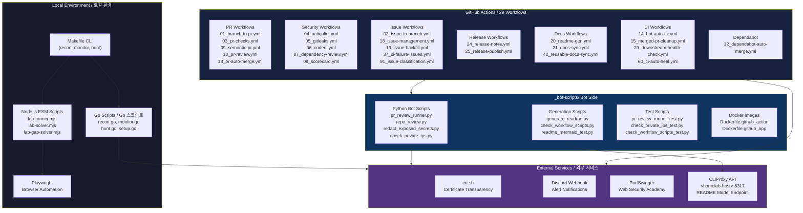

# Bug Bounty Automation Toolkit / 버그바운티 자동화 툴킷

[](https://nodejs.org/)
[](https://playwright.dev/)
[](https://go.dev/)
[](https://github.com/features/actions)
[](https://openssf.org/)
[](https://cliproxy.jclee.me)
[](LICENSE)

---

## Table of Contents / 목차

- [Overview / 개요](#overview--개요)
- [Features / 주요 기능](#features--주요-기능)
- [Architecture / 아키텍처](#architecture--아키텍처)
- [Automation Inventory / 자동화 목록](#automation-inventory--자동화-목록)
- [Quick Start / 빠른 시작](#quick-start--빠른-시작)
- [Local Development / 로컬 개발](#local-development--로컬-개발)
- [Commands Reference / 명령어 참조](#commands-reference--명령어-참조)
- [Repository Structure / 저장소 구조](#repository-structure--저장소-구조)
- [Contribution Guide / 기여 가이드](#contribution-guide--기여-가이드)

---

## Overview / 개요

### English

**Bug Bounty Automation Toolkit** is a local automation workspace for authorized web security research, vulnerability-study exercises, and lab-solving workflows. The repository combines:

- **Node.js ESM scripts** for PortSwigger/Web Security Academy style lab automation using Playwright
- **Go helper programs** for monitoring and vulnerability-hunting command orchestration
- **GitHub Actions workflows** (30 total) for PR checks, security scanning, PR review automation, issue management, release automation, documentation sync, and CI auto-healing
- **Bot-side helper scripts** in `_bot-scripts/` for README generation, PR review execution, repository review, secret redaction, and private IP checks

The toolkit supports the full hunting workflow: `recon → monitoring → vulnerability hunting → reporting`.

> **Warning**: This project is designed for authorized testing only. Do not run scans, lab payloads, or automated browser actions against systems you do not own or have explicit permission to test.

### 한국어

**Bug Bounty Automation Toolkit**은 허가된 웹 보안 연구, 취약점 학습, 실습 랩 자동화를 위한 로컬 자동화 워크스페이스입니다. 다음 구성요소를 포함합니다:

- **Node.js ESM 스크립트**: Playwright를 사용한 PortSwigger/Web Security Academy 스타일 랩 자동화
- **Go 헬퍼 프로그램**: 모니터링 및 취약점 탐지 명령 오케스트레이션
- **GitHub Actions 워크플로우** (총 30개): PR 검사, 보안 스캐닝, PR 리뷰 자동화, 이슈 관리, 릴리스 자동화, 문서 동기화, CI 자동 복구
- **`_bot-scripts/`** 내의 봇 사이드 헬퍼 스크립트: README 생성, PR 리뷰 실행, 저장소 리뷰, 시크릿 수정, 사설 IP 검사

툴킷은 전체 헌팅 워크플로우를 지원합니다: `리콘 → 모니터링 → 취약점 탐지 → 리포팅`.

---

## Features / 주요 기능

### English

- **Full Recon Pipeline**: Automated subdomain enumeration, port scanning, and service discovery
- **Diff Monitoring**: Detect new subdomains and endpoints over time via crt.sh integration and Discord notifications
- **Targeted Vulnerability Hunting**: IDOR, SSRF, SQL injection, XSS, and more vulnerability categories
- **PortSwigger Lab Automation**: Playwright-based solvers for Web Security Academy labs
- **GitHub Automation**: 30 reusable workflows covering PR checks, security scanning, issue management, and release processes
- **Bot-Side Scripts**: Automated PR review, README generation, repository auditing, and secret redaction

### 한국어

- **전체 리콘 파이프라인**: 자동 서브도메인 열거, 포트 스캐닝, 서비스 발견
- **차등 모니터링**: crt.sh 통합 및 Discord 알림을 통한 새 서브도메인 및 엔드포인트 감지
- **대상 취약점 탐지**: IDOR, SSRF, SQL 인젝션, XSS 등 다양한 취약점 카테고리
- **PortSwigger 랩 자동화**: Web Security Academy 랩용 Playwright 기반 솔버
- **GitHub 자동화**: PR 검사, 보안 스캐닝, 이슈 관리, 릴리스 프로세스를 다루는 30개의 재사용 가능한 워크플로우
- **봇 사이드 스크립트**: 자동 PR 리뷰, README 생성, 저장소 감사, 시크릿 수정

---

## Architecture / 아키텍처

### English

The system consists of four primary layers: **Local CLI Tools**, **GitHub Actions Workflows**, **Bot-Side Helper Scripts**, and **External Services**.

### 한국어

시스템은 네 가지 주요 레이어로 구성됩니다: **로컬 CLI 도구**, **GitHub Actions 워크플로우**, **봇 사이드 헬퍼 스크립트**, **외부 서비스**.



---

## Automation Inventory / 자동화 목록

### GitHub Actions Workflows / GitHub Actions 워크플로우 (30 Total)

#### Pull Request Workflows

| File | Description |
|------|-------------|
| `01_branch-to-pr.yml` | Sync feature branch to PR when ready |
| `03_pr-checks.yml` | Core PR validation: lint, test, build |
| `09_semantic-pr.yml` | Enforce semantic commit message format |
| `10_pr-review.yml` | Automated PR review via bot |
| `13_pr-auto-merge.yml` | Auto-merge PRs meeting criteria |
| `14_bot-auto-fix.yml` | Bot-initiated fix branches |
| `15_merged-pr-cleanup.yml` | Clean up branches after merge |
| `44_reusable-pr-checks.yml` | Reusable PR validation workflow |
| `security/11_pr-review.yml` | Security-focused PR review |

#### Security Scanning Workflows

| File | Description |
|------|-------------|
| `04_actionlint.yml` | GitHub Actions workflow linting |
| `05_gitleaks.yml` | Secret/leak detection in commits |
| `06_codeql.yml` | CodeQL static analysis |
| `07_dependency-review.yml` | Dependency vulnerability review |
| `08_scorecard.yml` | OpenSSF Scorecard security assessment |
| `45_reusable-gitleaks.yml` | Reusable gitleaks workflow |

#### Issue Management Workflows

| File | Description |
|------|-------------|
| `02_issue-to-branch.yml` | Create branch from issue |
| `18_issue-management.yml` | Issue lifecycle automation |
| `19_issue-backfill.yml` | Backfill issue metadata |
| `37_ci-failure-issues.yml` | Auto-create issues from CI failures |
| `43_reusable-issue-management.yml` | Reusable issue workflow |
| `91_issue-classification.yml` | AI-powered issue classification |

#### Release Workflows

| File | Description |
|------|-------------|
| `24_release-notes.yml` | Automated release notes generation |
| `25_release-publish.yml` | Publish release artifacts |

#### Documentation Workflows

| File | Description |
|------|-------------|
| `20_readme-gen.yml` | Auto-generate README updates |
| `21_docs-sync.yml` | Sync documentation across repos |
| `42_reusable-docs-sync.yml` | Reusable docs sync workflow |

#### CI/CD Workflows

| File | Description |
|------|-------------|
| `12_dependabot-auto-merge.yml` | Auto-merge Dependabot updates |
| `29_downstream-health-check.yml` | Monitor downstream repo health |
| `60_ci-auto-heal.yml` | Automatic CI failure recovery |
| `ci.yml` | Primary CI workflow |

### Bot-Side Scripts / 봇 사이드 스크립트

#### Python Scripts (`_bot-scripts/scripts/`)

| Script | Purpose |
|--------|---------|
| `pr_review_runner.py` | Execute automated PR reviews |
| `repo_review.py` | Repository review and auditing |
| `redact_exposed_secrets.py` | Detect and redact exposed secrets |
| `check_private_ips.py` | Scan for hardcoded private IPs |
| `generate_readme.py` | Generate README documentation |
| `check_workflow_scripts.py` | Validate workflow script patterns |
| `issue_classification_workflow_test.py` | Test issue classification |
| `readme_mermaid_test.py` | Validate Mermaid diagram syntax |

#### Docker Images

| File | Description |
|------|-------------|
| `Dockerfile.github_action` | Docker image for GitHub Action runner |
| `Dockerfile.github_app` | Docker image for GitHub App runner |

---

## Quick Start / 빠른 시작

### Prerequisites / 사전 요구사항

- **Go** 1.21+
- **Node.js** 18+ (ESM support)
- **Playwright** (`npx playwright install`)
- External tools: `nuclei`, `subfinder`, `amass`, `naabu`, `ffuf`, `sqlmap`

### Setup / 설정

```bash
# Clone the repository
git clone https://github.com/jclee941/.github
cd bug

# First-time setup
make setup
```

### Basic Usage / 기본 사용법

```bash
# Full recon on a target
make recon TARGET=example.com

# Monitor for changes (diff-based)
make monitor TARGET=example.com

# Hunt vulnerabilities
make hunt TARGET=example.com

# Full scan: recon + hunt
make full-scan TARGET=example.com
```

---

## Local Development / 로컬 개발

### Environment Variables / 환경 변수

```bash
# Optional: Custom notification webhook
export DISCORD_WEBHOOK="https://discord.com/api/webhooks/..."

# Optional: Custom nuclei templates path
export NUCLEI_TEMPLATES="/path/to/templates"
```

### Running Individual Scripts / 개별 스크립트 실행

```bash
# Run Go scripts directly
go run scripts/recon.go scripts/lib.go -d example.com
go run scripts/monitor.go scripts/lib.go -d example.com
go run scripts/hunt.go scripts/lib.go -d example.com

# Run Node.js lab scripts
node scripts/lab-runner.mjs
node scripts/lab-solver.mjs
```

### Bot-Side Script Development / 봇 사이드 스크립트 개발

```bash
cd _bot-scripts

# Install dependencies
pip install -r requirements.txt
pip install -r requirements-dev.txt

# Run tests
python -m pytest scripts/

# Generate README
python scripts/generate_readme.py
```

---

## Commands Reference / 명령어 참조

### Makefile Commands

| Command | Description |
|---------|-------------|
| `make help` | Show all available commands |
| `make setup` | First-time setup: verify tools, download wordlists |
| `make recon TARGET=domain.com` | Full 5-phase recon pipeline |
| `make recon-fast TARGET=domain.com` | Quick recon (skip nuclei scan) |
| `make monitor TARGET=domain.com` | Diff monitoring for new findings |
| `make hunt TARGET=domain.com` | All vulnerability categories |
| `make hunt-idor TARGET=domain.com` | IDOR vulnerability hunting only |
| `make hunt-ssrf TARGET=domain.com` | SSRF vulnerability hunting only |
| `make full-scan TARGET=domain.com` | Recon + hunt combined |
| `make clean` | Remove scan results |

### Go Script Flags

```bash
# recon.go
-d      Target domain (required)
-depth  Recon depth (default: 3)
-rate   Rate limit (default: 100)

# monitor.go
-d      Target domain (required)
-since  Baseline timestamp
-webhook Discord webhook URL

# hunt.go
-d      Target domain (required)
-type   Vulnerability type (all, idor, ssrf, sqli, xss)
-severity Minimum severity (low, medium, high, critical)
```

---

## Repository Structure / 저장소 구조

```
bug/
├── AGENTS.md                    # AI agent knowledge base
├── CONTRIBUTING.md              # Contribution guidelines
├── LICENSE                      # ISC License
├── Makefile                     # CLI orchestration
├── README.md                    # This file
├── interactsh_payload.txt       # Interactsh OOB payload reference
├── package.json                 # Node.js package manifest
├── package-lock.json
│
├── _bot-scripts/                # Bot-side automation (CI checkout)
│   ├── AGENTS.md                # Bot agent knowledge base
│   ├── CODE_OF_CONDUCT.md
│   ├── CONTRIBUTING.md
│   ├── Dockerfile.github_action # GitHub Action runner image
│   ├── Dockerfile.github_app    # GitHub App runner image
│   ├── LICENSE
│   ├── MANIFEST.in
│   ├── Makefile
│   ├── NOTICE
│   ├── README.md                # Bot README
│   ├── SECURITY.md
│   ├── docker-compose.github_app.yml
│   ├── docker-compose.github_app.yml.lxc
│   ├── filebeat.yml             # ELK logging configuration
│   ├── pyproject.toml
│   ├── requirements-dev.txt
│   ├── requirements.txt
│   ├── setup.py
│   └── scripts/                 # Bot Python scripts
│       ├── AGENTS.md
│       ├── check_hardcode_scan_patterns_test.py
│       ├── check_private_ips.py
│       ├── check_private_ips_test.py
│       ├── check_workflow_scripts.py
│       ├── check_workflow_scripts_test.py
│       ├── generate_readme.py
│       ├── go.mod
│       ├── issue_classification_workflow_test.py
│       ├── issue_classifier_js_test.py
│       ├── pr_review_runner.py
│       ├── pr_review_runner_test.py
│       ├── readme_mermaid_test.py
│       ├── redact_exposed_secrets.py
│       └── repo_review.py
│
├── config/
│   └── targets.json             # Target configuration
│
├── notes/
│   ├── phase2-checklist.md      # Learning checklist
│   ├── report-template.md       # Bug report template
│   └── vulnerability-study.md   # Vulnerability research notes
│
├── scripts/                     # Main automation scripts
│   ├── auth-solver.cjs
│   ├── batch-a.cjs
│   ├── batch-b-fixed.cjs
│   ├── batch-b.cjs
│   ├── batch-c.cjs
│   ├── batch-collab.cjs
│   ├── batch-d.cjs
│   ├── batch-remaining.cjs
│   ├── batch1-solver.cjs
│   ├── check-form.cjs
│   ├── check-progress.cjs
│   ├── comprehensive-batch.cjs
│   ├── comprehensive-solver.cjs
│   ├── custom-batch2.cjs
│   ├── custom-easy-solver.cjs
│   ├── diagnose-access.cjs
│   ├── diagnose-access2.cjs
│   ├── diagnose-deser.cjs
│   ├── diagnose-essential.cjs
│   ├── diagnose-essential2.cjs
│   ├── diagnose-essential3.cjs
│   ├── diagnose-nav.cjs
│   ├── diagnose-topics.cjs
│   ├── essential-skills-solver.cjs
│   ├── explore-essential.cjs
│   ├── explore-essential2.cjs
│   ├── explore-essential3.cjs
│   ├── explore-race.cjs
│   ├── extended-retry.cjs
│   ├── extract-labs.cjs
│   ├── final-attempt.cjs
│   ├── focused-batch.cjs
│   ├── get-lab-urls.cjs
│   ├── get-lab-urls.sh
│   ├── get-lab-urls2.cjs
│   ├── hunt.go                  # Vulnerability hunting
│   ├── interactsh-wrapper.sh
│   ├── lab-batch-fast.mjs
│   ├── lab-batch-oob.mjs
│   ├── lab-batch-slow.mjs
│   ├── lab-batch-smuggling.mjs
│   ├── lab-batch-solver.mjs
│   ├── lab-gap-helpers.mjs
│   ├── lab-gap-solver.mjs       # Gap solver for labs
│   ├── lab-runner.mjs           # PortSwigger lab runner
│   ├── lab-runner-aggressive.mjs
│   ├── lab-solver.mjs           # Playwright lab solvers
│   ├── lib.go                   # Shared Go utilities
│   └── diagnose-essential2.cjs
│
├── targets/                     # Target baselines (gitignored)
├── recon/                       # Scan results (gitignored)
├── reports/                     # Submitted reports (gitignored)
└── wordlists/                   # SecLists downloads (gitignored)
```

---

## Contribution Guide / 기여 가이드

### English

Contributions are welcome. Please read `CONTRIBUTING.md` before submitting PRs.

**Development Workflow**:

1. Fork the repository
2. Create a feature branch: `git checkout -b feature/my-feature`
3. Make changes and add tests
4. Run checks locally:

   ```bash
   # Lint workflows
   actionlint .

   # Run Go tests
   go test ./...

   # Run bot-side tests
   cd _bot-scripts && pip install -r requirements-dev.txt && pytest
   ```

5. Commit using semantic commits: `feat:`, `fix:`, `docs:`, `refactor:`, `test:`
6. Open a PR with description and reference any related issues

**Coding Conventions**:

- Go scripts: stdlib only, no external dependencies
- Node.js: ESM modules only (`"type": "module"`)
- Workflows: Must pass `actionlint` validation
- All new scripts must include help text (`-h` / `--help`)

### 한국어

기여를 환영합니다. PR을 제출하기 전에 `CONTRIBUTING.md`를 읽어주세요.

**개발 워크플로우**:

1. 저장소를 포크합니다
2. 기능 브랜치 생성: `git checkout -b feature/my-feature`
3. 변경사항 작성 및 테스트 추가
4. 로컬에서 검사 실행:

   ```bash
   # 워크플로우 린트
   actionlint .

   # Go 테스트
   go test ./...

   # 봇 사이드 테스트
   cd _bot-scripts && pip install -r requirements-dev.txt && pytest
   ```

5. 시맨틱 커밋으로 커밋: `feat:`, `fix:`, `docs:`, `refactor:`, `test:`
6. 설명과 관련 이슈 참조를 포함한 PR 열기

**코딩 규칙**:

- Go 스크립트: stdlib만 사용, 외부 의존성 없음
- Node.js: ESM 모듈만 (`"type": "module"`)
- 워크플로우: `actionlint` 검증 통과 필수
- 모든 새 스크립트는 도움말 텍스트 포함 필수 (`-h` / `--help`)

---

## Disclaimer / 면책 조항

> **English**: This toolkit is for authorized security testing only. Unauthorized scanning or testing against systems you do not own or have explicit permission to test is illegal. The maintainers are not responsible for misuse.

> **한국어**: 이 툴킷은 허가된 보안 테스트만을 위한 것입니다. 소유하거나 명시적인 테스트 권한이 없는 시스템에 대한 무단 스캐닝 또는 테스트는 불법입니다. 유지관리자는 오용에 대해 책임지지 않습니다.

---

## License / 라이선스

This project is licensed under the **ISC License**. See `LICENSE` for details.

---

*Generated with [CLIProxy API](https://cliproxy.jclee.me) (minimax-m2.7 model) | 버그바운티 자동화 툴킷*
