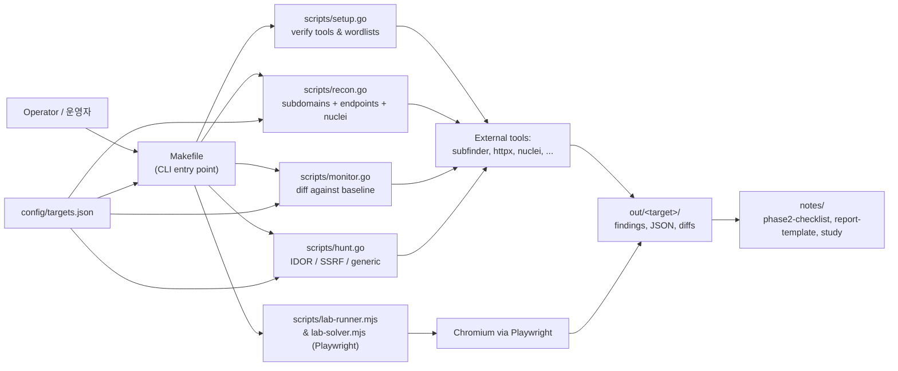

# Bug Bounty Automation Toolkit / 버그 바운티 자동화 툴킷

> Reconnaissance, monitoring, and targeted vulnerability hunting for
> responsible security research and bug bounty programs.
>
> 책임 있는 보안 연구 및 버그 바운티 프로그램을 위한 정찰, 모니터링,
> 표적형 취약점 헌팅 도구 모음입니다.

---

## Overview / 개요

This toolkit orchestrates a complete bug-bounty workflow — from initial
asset discovery and continuous monitoring to targeted vulnerability
scanning (IDOR, SSRF, ...). Performance-critical stages are implemented
as Go binaries, while browser-driven lab exercises run on Node.js +
Playwright. A single `Makefile` provides consistent entry points across
operators and machines.

이 툴킷은 초기 자산 발견과 지속적 모니터링부터 IDOR·SSRF 등 표적형
취약점 스캔에 이르는 버그 바운티 워크플로우를 오케스트레이션합니다.
성능이 중요한 단계는 Go 바이너리로, 브라우저 기반 실습은 Node.js +
Playwright로 구성되어 있으며, 단일 `Makefile`을 통해 운영자와 머신
전체에 일관된 진입점을 제공합니다.

### Intended Audience / 대상 사용자

- Bug bounty hunters running structured engagements / 구조화된 업무를 진행하는 버그 바운티 헌터
- Application security engineers tracking asset changes over time / 자산 변화를 지속적으로 추적하는 애플리케이션 보안 엔지니어
- CTF / lab participants practicing exploitation in safe environments / 안전한 환경에서 익스플로잇을 연습하는 CTF·실습 참여자

### Responsible Use / 책임 있는 사용

Run this toolkit only against systems you are explicitly authorized to
test — your own assets, scoped bug bounty programs, or dedicated lab
platforms such as PortSwigger Web Security Academy, HackTheBox, or
TryHackMe. Unauthorized scanning may violate computer-misuse laws in
your jurisdiction.

본 툴킷은 명시적으로 테스트 권한을 부여받은 시스템(자체 자산, 스코프가
정의된 버그 바운티 프로그램, PortSwigger Web Security Academy ·
HackTheBox · TryHackMe 등 전용 실습 플랫폼)에 대해서만 실행하시기
바랍니다. 권한 없는 스캔은 관련 컴퓨터 오용 법령을 위반할 수 있습니다.

---

## Features / 주요 기능

| Area / 영역 | Capability / 기능 |
|---|---|
| Setup / 설치 | Tool verification and wordlist bootstrap / 도구 검증 및 워드리스트 부트스트랩 |
| Recon / 정찰 | Subdomain enumeration, endpoint discovery, nuclei templates / 서브도메인 열거, 엔드포인트 발견, nuclei 템플릿 |
| Recon-fast | Lightweight recon that skips the nuclei stage / nuclei 단계를 건너뛰는 경량 정찰 |
| Monitor / 모니터 | Differential scanning — surface new subdomains and endpoints / 신규 서브도메인·엔드포인트를 식별하는 차분 스캔 |
| Hunt / 헌팅 | Targeted vulnerability hunting (generic mode) / 표적형 취약점 헌팅(일반 모드) |
| Hunt — IDOR | Insecure Direct Object Reference checks / IDOR 점검 |
| Hunt — SSRF | Server-Side Request Forgery checks / SSRF 점검 |
| Full-scan / 통합 스캔 | End-to-end recon + hunt pipeline / 정찰과 헌팅을 종단간 수행 |
| Lab runner / 실습 러너 | Browser-driven lab exercises via Playwright / Playwright 기반 브라우저 실습 |
| Reporting / 보고 | Markdown checklist, template, and study notes / 마크다운 체크리스트·템플릿·학습 노트 |

---

## Architecture / 아키텍처

The toolkit is a thin orchestration layer over well-known open-source
security tools. Go handles the network-heavy stages, Node.js handles the
browser-heavy lab stages, and the `Makefile` exposes the whole thing as
a small, predictable CLI surface.

본 툴킷은 잘 알려진 오픈소스 보안 도구 위에 얇은 오케스트레이션
계층을 두는 구조입니다. 네트워크 집약적 단계는 Go가 처리하고,
브라우저 집약적 실습 단계는 Node.js가 처리하며, `Makefile`이 전체를
작고 예측 가능한 CLI 표면으로 노출합니다.



### Component Responsibilities / 컴포넌트 책임

- **`Makefile`** — single source of truth for commands; validates
  required `TARGET` variables and forwards flags to the Go entry points.
- **`scripts/setup.go`** — verifies that required CLI tools are present
  and bootstraps wordlists on first run.
- **`scripts/recon.go`** — runs the discovery pipeline. Accepts `-d` for
  the target domain and `-skip-nuclei` for a lighter pass.
- **`scripts/monitor.go`** — compares the current asset surface against
  the previous baseline to highlight new subdomains and endpoints.
- **`scripts/hunt.go`** — runs targeted vulnerability checks. Accepts
  `-d` and `-type` (e.g. `idor`, `ssrf`).
- **`scripts/lab-runner.mjs` / `lab-solver.mjs`** — Playwright-driven
  automation for browser-based CTF / lab environments.
- **`config/targets.json`** — declarative target configuration shared
  across stages.
- **`notes/`** — human-authored workflow artifacts (checklist, report
  template, vulnerability study).

---

## Repository Layout / 저장소 구조

```
.
├── AGENTS.md                 # Operating notes for AI / human contributors
├── Makefile                  # Primary CLI surface
├── README.md                 # This document
├── package.json              # Node.js runtime + Playwright dependency
├── package-lock.json
├── config/
│   └── targets.json          # Target configuration consumed by the scripts
├── notes/
│   ├── phase2-checklist.md   # Engagement workflow checklist
│   ├── report-template.md    # Vulnerability report skeleton
│   └── vulnerability-study.md# Reference notes per vulnerability class
└── scripts/
    ├── hunt.go               # Targeted vuln hunting (IDOR / SSRF / generic)
    ├── lab-runner.mjs        # Playwright lab runner
    ├── lab-solver.mjs        # Playwright lab solver
    ├── monitor.go            # Differential asset monitor
    ├── recon.go              # Recon pipeline
    └── setup.go              # One-time setup and tool check
```

---

## Quick Start / 빠른 시작

### Prerequisites / 사전 요구 사항

- **Go** 1.21+ — for the recon / monitor / hunt / setup binaries.
- **Node.js** 18+ and **npm** — for the Playwright-based lab scripts.
- **External CLI tools** that the Go scripts shell out to (for example
  `subfinder`, `httpx`, `nuclei`). The exact set is verified by
  `make setup` on first run.
- A `TARGET` you are authorized to test.

### 1. Clone and bootstrap / 클론 및 부트스트랩

```bash
git clone <repo-url> bug
cd bug
make setup
```

`make setup` checks for required external tools and downloads any
missing wordlists into a local cache.

`make setup`은 필요한 외부 도구를 확인하고 누락된 워드리스트를 로컬
캐시로 내려받습니다.

### 2. Install Node dependencies / Node 의존성 설치

```bash
npm install
npx playwright install chromium
```

### 3. Run your first recon / 첫 정찰 실행

```bash
make recon TARGET=example.com
```

The output, intermediate JSON, and any captured findings are written
under `out/example.com/` (created on first run).

결과물, 중간 JSON, 수집된 발견 사항은 `out/example.com/` 아래에
기록됩니다(첫 실행 시 자동 생성).

### 4. Run the full pipeline / 전체 파이프라인 실행

```bash
make full-scan TARGET=example.com
```

---

## Configuration / 설정

### `config/targets.json`

`config/targets.json` is the single declarative source for the targets
under engagement. Each entry typically carries the canonical domain,
optional wildcard roots, scope notes, and per-target flags consumed by
the Go scripts. Edit this file to onboard a new program; the Makefile
targets then read from it when `TARGET` matches a configured key.

`config/targets.json`은 진행 중인 타겟에 대한 단일 선언적 소스입니다.
각 항목은 일반적으로 공식 도메인, 선택적 와일드카드 루트, 스코프 메모,
Go 스크립트가 소비하는 타겟별 플래그를 포함합니다. 새 프로그램을
등록할 때 이 파일을 편집하면, `Makefile` 타겟이 `TARGET`이 설정된
키와 일치할 때 이를 읽어 들입니다.

### Makefile Variables / Makefile 변수

- `TARGET` — the domain or program key to operate on. Required for
  every command except `help`, `setup`, and `clean`.
- `SCRIPTS` — directory containing the Go entry points (default
  `scripts`).
- `GO` — Go runner prefix (default `go run`).

Example: pass extra flags through a wrapper variable when integrating
with CI.

```make
make recon TARGET=example.com EXTRA_FLAGS="-threads 25"
```

### Environment / 환경

- All filesystem output is local; no telemetry leaves the host.
- Run from a network you are comfortable associating with your
  recon traffic (a VPN endpoint is recommended for public programs).

---

## Commands Reference / 명령어 레퍼런스

All commands are dispatched through `make`. Run `make help` for the
always-up-to-date list. The table below mirrors the Makefile.

모든 명령은 `make`를 통해 실행됩니다. 최신 목록은 `make help`로
확인할 수 있습니다. 아래 표는 Makefile을 그대로 반영합니다.

| Command / 명령 | Purpose / 용도 | Requires `TARGET` |
|---|---|---|
| `make help` | Show available commands / 사용 가능한 명령 표시 | No |
| `make setup` | Verify tools, download wordlists / 도구 검증, 워드리스트 다운로드 | No |
| `make recon` | Full recon pipeline on `TARGET` / `TARGET`에 대한 전체 정찰 | Yes |
| `make recon-fast` | Recon without the nuclei stage / nuclei 단계 생략 정찰 | Yes |
| `make monitor` | Detect new subdomains / endpoints / 신규 서브도메인·엔드포인트 탐지 | Yes |
| `make hunt` | Targeted vulnerability hunting (generic) / 표적형 취약점 헌팅(일반) | Yes |
| `make hunt-idor` | IDOR-only hunt / IDOR 전용 헌팅 | Yes |
| `make hunt-ssrf` | SSRF-only hunt / SSRF 전용 헌팅 | Yes |
| `make full-scan` | Recon + hunt end-to-end / 정찰과 헌팅 종단간 수행 | Yes |
| `make scan-target` | Scan a single target from `config/targets.json` / 단일 타겟 스캔 | Yes |
| `make clean` | Remove generated artifacts / 생성된 산출물 제거 | No |

### Command Examples / 명령 예시

```bash
# Full recon on a scoped domain
make recon TARGET=example.com

# Lighter recon without nuclei
make recon-fast TARGET=example.com

# Detect newly exposed assets since the last run
make monitor TARGET=example.com

# Generic vulnerability hunting
make hunt TARGET=example.com

# Narrow hunt to a single vulnerability class
make hunt-idor TARGET=example.com
make hunt-ssrf TARGET=example.com

# Everything at once
make full-scan TARGET=example.com
```

### Lab Scripts / 실습 스크립트

The Playwright-driven lab helpers are not wrapped by the Makefile. Run
them directly with Node:

`Makefile`로 감싸지 않은 Playwright 기반 실습 헬퍼는 Node로 직접
실행합니다.

```bash
node scripts/lab-runner.mjs   # drive the lab UI
node scripts/lab-solver.mjs   # solve a configured lab scenario
```

---

## Local Development / 로컬 개발

### Editing the Go scripts / Go 스크립트 편집

The Go files are written to be run with `go run scripts/<name>.go`,
which means there is no separate build step. Iterate with:

Go 파일은 `go run scripts/<name>.go` 형태로 실행되도록 작성되어
별도의 빌드 단계가 없습니다. 다음 흐름으로 반복 개발합니다.

```bash
go vet scripts/...
go run scripts/recon.go -d example.com -skip-nuclei
```

If you prefer a compiled binary for repeated runs:

```bash
go build -o bin/recon scripts/recon.go
./bin/recon -d example.com
```

### Editing the Node scripts / Node 스크립트 편집

```bash
npm install
npx playwright install chromium
node scripts/lab-runner.mjs
```

### Adding a new hunt type / 새 헌팅 유형 추가

1. Implement the check inside `scripts/hunt.go` and register it under
   the `-type` flag.
2. Document the new flag in this README's command table.
3. Add an entry to `notes/vulnerability-study.md` describing the
   class, the heuristic, and the remediation.

### Updating workflow notes / 워크플로 노트 갱신

- `notes/phase2-checklist.md` — track engagement progress.
- `notes/report-template.md` — keep aligned with the disclosure
  platform's required fields.
- `notes/vulnerability-study.md` — capture patterns and references
  per vulnerability class.

---

## Testing / 테스트

The repository does not ship with a long-form automated test suite —
the canonical "test" is a scoped engagement against an authorized
target. For development, smoke-test each entry point against a
harmless local target (for example `localhost` or a dedicated lab
host).

이 저장소는 자동화된 회귀 테스트 모음을 기본 제공하지 않습니다.
표준 "테스트"는 권한을 부여받은 타겟에 대한 스코프가 정의된
진행입니다. 개발 시에는 무해한 로컬 타겟(예: `localhost` 또는 전용
실습 호스트)에 대해 각 진입점을 스모크 테스트하세요.

```bash
# Smoke test
go run scripts/setup.go
go run scripts/recon.go -d localhost -skip-nuclei
go run scripts/monitor.go -d localhost
go run scripts/hunt.go -d localhost -type idor
node scripts/lab-runner.mjs
```

When adding logic that can be tested without touching the network,
prefer a small `*_test.go` next to the source file and run it with
`go test ./scripts/...`.

네트워크에 의존하지 않고 검증 가능한 로직을 추가할 때는 소스 파일
옆에 `*_test.go`를 두고 `go test ./scripts/...`로 실행해 주세요.

---

## Contribution Guide / 기여 가이드

1. **Scope first / 스코프 우선** — never commit findings, screenshots,
   or request/response samples from real engagements. Public artifacts
   must come from labs, CTFs, or your own assets.
2. **One change per pull request / PR당 한 가지 변경** — keep diffs
   reviewable; split refactors, new hunt types, and doc updates.
3. **Match the existing style / 기존 스타일 유지** — Go code follows
   `gofmt`; Node code uses ES modules (`.mjs`) to stay consistent with
   the existing lab scripts.
4. **Update the docs / 문서 갱신** — every new Makefile target, hunt
   type, or config field must be reflected in this README and, where
   relevant, in `notes/`.
5. **Run a smoke test / 스모크 테스트 수행** — at minimum,
   `make setup` and one targeted command against a safe host must
   succeed before opening a PR.

---

## License / 라이선스

This project is released under the **ISC License**, as declared in
`package.json`. External tools invoked by the Go scripts (nuclei,
subfinder, httpx, ...) are distributed under their own licenses; review
those before redistribution.

본 프로젝트는 `package.json`에 명시된 **ISC License** 하에 배포됩니다.
Go 스크립트가 호출하는 외부 도구(nuclei, subfinder, httpx 등)는 각
자체 라이선스를 따르며, 재배포 전에 해당 라이선스를 검토하시기
바랍니다.