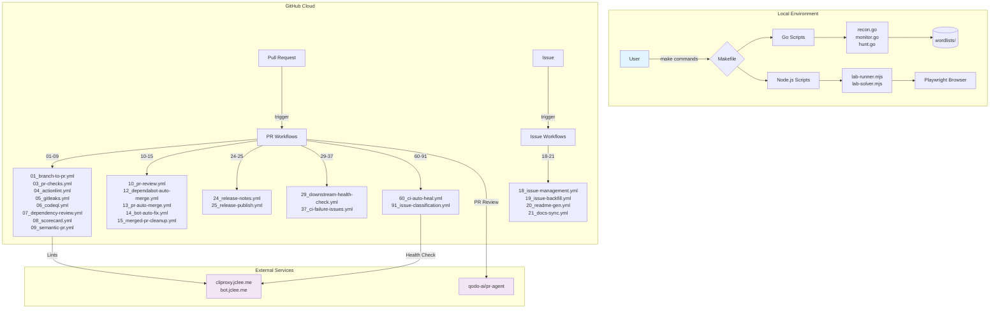

# Bug Bounty Automation Toolkit / 버그바운티 자동화 툴킷

[](https://nodejs.org/)
[](https://playwright.dev/)
[](https://go.dev/)
[](https://github.com/features/actions)
[](https://openssf.org/)
[](https://cliproxy.jclee.me)

---

## Overview / 개요

### English

**Bug Bounty Automation Toolkit** is a local automation workspace for authorized web security research, vulnerability-study exercises, and lab-solving workflows. The repository combines:

- **Node.js ESM scripts** for PortSwigger/Web Security Academy style lab automation using Playwright
- **Go helper programs** for monitoring and vulnerability-hunting command orchestration
- **GitHub Actions workflows** (30 total) for PR checks, security scanning, PR review automation, issue management, release automation, documentation sync, and CI auto-healing
- **Bot-side helper scripts** for README generation, PR review execution, repository review, secret redaction, and private IP checks

The toolkit supports the full hunting workflow: `recon → monitoring → vulnerability hunting → reporting`.

> **⚠️ Warning**: This project is designed for authorized testing only. Do not run scans, lab payloads, or automated browser actions against systems you do not own or have explicit permission to test.

### 한국어

**Bug Bounty Automation Toolkit**은 허가된 웹 보안 연구, 취약점 학습, 실습 랩 자동화를 위한 로컬 자동화 워크스페이스입니다. 다음 구성요소를 포함합니다:

- **Node.js ESM 스크립트**: Playwright를 활용한 PortSwigger/Web Security Academy 스타일의 랩 자동화
- **Go 헬퍼 프로그램**: 모니터링 및 취약점 헌팅 명령 오케스트레이션
- **GitHub Actions 워크플로** (30개): PR 검사, 보안 스캔, PR 리뷰 자동화, 이슈 관리, 릴리스 자동화, 문서 동기화, CI 자동 복구
- **봇 보조 스크립트**: README 생성, PR 리뷰 실행, 저장소 리뷰, 시크릿 마스킹, 사설 IP 검사

전체 헌팅 워크플로 (`recon → monitoring → vulnerability hunting → reporting`)를 지원합니다.

> **⚠️ 경고**: 이 프로젝트는 반드시 허가된 테스트에만 사용해야 합니다. 소유하거나 명시적 허가를 받지 않은 시스템에 스캔, 랩 페이로드 또는 자동화된 브라우저 동작을 실행하지 마십시오.

---

## Features / 기능

### Core Automation / 핵심 자동화

| Feature | Description |
|---------|-------------|
| **Recon Pipeline** | 5-phase recon: subdomain enumeration → port scanning →Screenshot capture → nuclei scan → report generation |
| **Diff Monitoring** | crt.sh-based change detection with Discord webhook notifications |
| **Vulnerability Hunting** | 4-phase targeted scan: IDOR, SSRF, SQLi, XSS detection |
| **Lab Solver** | PortSwigger lab automation using Playwright browser automation |
| **Gap Solver** | Specialized solver for labs without official Python scripts |

### CI/CD Automation / CI/CD 자동화

| Category | Workflows |
|----------|-----------|
| **PR Automation** | Branch creation, PR checks, auto-merge, review automation, merged PR cleanup |
| **Security Scanning** | gitleaks, CodeQL, Dependency Review, Scorecard |
| **Issue Management** | Issue classification, backfill, lifecycle management |
| **Documentation** | README auto-generation, docs sync |
| **Release** | Release notes generation, publishing |
| **CI Health** | Auto-heal on failure, downstream health checks |

---

## Architecture /架构



---

## Automation Inventory / 자동화 인벤토리

### GitHub Actions Workflows (30 total)

#### PR & Branch Automation

| File | Purpose |
|------|---------|
| `01_branch-to-pr.yml` | Create branch and PR from issue |
| `03_pr-checks.yml` | Run standard PR validation checks |
| `09_semantic-pr.yml` | Enforce semantic PR title format |
| `10_pr-review.yml` | Automated PR review via qodo-ai/pr-agent |
| `12_dependabot-auto-merge.yml` | Auto-merge Dependabot PRs |
| `13_pr-auto-merge.yml` | Auto-merge PRs meeting criteria |
| `14_bot-auto-fix.yml` | Apply bot-generated fixes |
| `15_merged-pr-cleanup.yml` | Cleanup after PR merge |
| `11_pr-review.yml` (security/) | Security-focused PR review |

#### Security Scanning

| File | Purpose |
|------|---------|
| `04_actionlint.yml` | GitHub Actions YAML linting |
| `05_gitleaks.yml` | Secret scanning via gitleaks |
| `06_codeql.yml` | CodeQL static analysis |
| `07_dependency-review.yml` | Dependency vulnerability review |
| `08_scorecard.yml` | OpenSSF Scorecard security assessment |
| `45_reusable-gitleaks.yml` | Reusable workflow for gitleaks |

#### Issue Management

| File | Purpose |
|------|---------|
| `18_issue-management.yml` | Issue lifecycle management |
| `19_issue-backfill.yml` | Backfill issues from project data |
| `43_reusable-issue-management.yml` | Reusable issue management workflow |
| `91_issue-classification.yml` | ML-based issue classification |

#### Documentation

| File | Purpose |
|------|---------|
| `20_readme-gen.yml` | Auto-generate README.md |
| `21_docs-sync.yml` | Sync documentation across repos |
| `42_reusable-docs-sync.yml` | Reusable docs sync workflow |

#### Release Automation

| File | Purpose |
|------|---------|
| `24_release-notes.yml` | Generate release notes |
| `25_release-publish.yml` | Publish releases |

#### CI Health & Reliability

| File | Purpose |
|------|---------|
| `29_downstream-health-check.yml` | Monitor downstream dependencies |
| `37_ci-failure-issues.yml` | Create issues on CI failures |
| `44_reusable-pr-checks.yml` | Reusable PR checks workflow |
| `60_ci-auto-heal.yml` | Auto-heal failing CI jobs |

#### Other Workflows

| File | Purpose |
|------|---------|
| `02_issue-to-branch.yml` | Convert issues to branches |
| `ci.yml` | Primary CI workflow |

### Go Automation Tools (0 total)

Currently, there are no Go-based automation tools. The Go scripts (`recon.go`, `monitor.go`, `hunt.go`, etc.) are standalone executables orchestrated via the Makefile, not reusable GitHub Action workflows.

### Bot-Side Helper Scripts

Located in the CI runner's `_bot-scripts/` checkout directory:

| Script | Purpose |
|--------|---------|
| `generate_readme.py` | README.md generation model (minimax-m2.7/gpt-5.5) |
| `pr_review_runner.py` | Execute PR review workflows |
| `repo_review.py` | Repository-level security review |
| `redact_exposed_secrets.py` | Redact exposed secrets from logs |
| `check_private_ips.py` | Scan for hardcoded private IPs |
| `check_workflow_scripts.py` | Validate workflow script references |
| `issue_classification_workflow_test.py` | Test issue classification logic |
| `pr_review_runner_test.py` | Test PR review runner |

### Node.js Automation Scripts

| Script | Purpose |
|--------|---------|
| `lab-runner.mjs` | PortSwigger lab solver runner |
| `lab-solver.mjs` | Custom Playwright lab solvers |
| `lab-gap-solver.mjs` | Gap solver for labs without scripts |
| `lab-batch-*.mjs` | Batch lab solving scripts |
| `diagnose-*.cjs` | Diagnostic helper scripts |
| `batch-*.cjs` | Batch execution scripts |

---

## Quick Start / 빠른 시작

### Prerequisites

- Go 1.21+
- Node.js 18+ (ESM support)
- Playwright browser (`npx playwright install chromium`)
- Security tools: `nuclei`, `subfinder`, `httpx`, `amass`, `naabu`, `puredns`, `gitleaks`

### Installation

```bash
# Clone repository
git clone https://github.com/jclee941/.github
cd bug

# First-time setup
make setup

# Install Playwright browsers
npx playwright install chromium
```

### Basic Usage

```bash
# Show all available commands
make help

# Run full recon on target
make recon TARGET=example.com

# Quick recon (skip nuclei)
make recon-fast TARGET=example.com

# Monitor for changes
make monitor TARGET=example.com

# Hunt vulnerabilities
make hunt TARGET=example.com

# Combined recon + hunt
make full-scan TARGET=example.com
```

---

## Local Development / 로컬 개발

### Repository Structure

```
bug/
├── Makefile                  # Orchestration commands
├── package.json              # Node.js dependencies (Playwright)
├── pyproject.toml            # Python project config
├── AGENTS.md                 # Knowledge base / automation inventory
├── CONTRIBUTING.md           # Contribution guidelines
├── config/
│   └── targets.json          # Target & notification config
├── scripts/
│   ├── setup.go              # Tool verification & wordlist download
│   ├── recon.go              # 5-phase recon pipeline
│   ├── monitor.go            # Diff monitoring + crt.sh + Discord
│   ├── hunt.go               # 4-phase vulnerability hunting
│   ├── lib.go                # Shared helper functions
│   ├── *.cjs                 # Diagnostic & batch scripts
│   ├── *.mjs                 # Lab runner & solver scripts
│   └── lib.go                # Go shared library
├── _bot-scripts/             # CI runner checkout (not a real directory)
├── notes/
│   ├── phase2-checklist.md   # Learning checklist
│   ├── report-template.md    # Bug report template
│   └── vulnerability-study.md
└── wordlists/                # SecLists downloads (gitignored)
```

### Environment Variables

| Variable | Description |
|----------|-------------|
| `TARGET` | Target domain for recon/hunt/monitor |
| `DISCORD_WEBHOOK` | Discord notification webhook URL |
| `GITHUB_TOKEN` | GitHub API token (for CI workflows) |
| `CLIPROXY_URL` | CLIProxy endpoint (default: `https://cliproxy.jclee.me/v1`) |

### Running Scripts Directly

```bash
# Run Go scripts directly
go run scripts/recon.go scripts/lib.go -d target.com
go run scripts/monitor.go scripts/lib.go -d target.com
go run scripts/hunt.go scripts/lib.go -d target.com

# Run Node.js lab solvers
node scripts/lab-runner.mjs --lab-id Lab1
node scripts/lab-solver.mjs --target https://target.com
```

---

## Commands Reference / 명령어 참조

### Makefile Commands

| Command | Description |
|---------|-------------|
| `make help` | Show all available commands |
| `make setup` | Initial setup — verify tools, download wordlists |
| `make recon TARGET=x.com` | Full 5-phase recon pipeline |
| `make recon-fast TARGET=x.com` | Recon without nuclei scan |
| `make monitor TARGET=x.com` | Diff monitoring + change detection |
| `make hunt TARGET=x.com` | All vulnerability categories |
| `make hunt-idor TARGET=x.com` | IDOR vulnerabilities only |
| `make hunt-ssrf TARGET=x.com` | SSRF vulnerabilities only |
| `make hunt-sqli TARGET=x.com` | SQL injection only |
| `make hunt-xss TARGET=x.com` | Cross-site scripting only |
| `make full-scan TARGET=x.com` | Recon + hunt combined |
| `make clean` | Remove scan results |

### Go Script Flags

```bash
go run scripts/recon.go scripts/lib.go -d target.com [options]
  -d <domain>       Target domain (required)
  -skip-nuclei      Skip nuclei vulnerability scan
  -o <dir>          Output directory (default: recon/)
  -rate <n>         Rate limit for nuclei (default: 100/s)

go run scripts/monitor.go scripts/lib.go -d target.com [options]
  -d <domain>       Target domain (required)
  -o <dir>          Output directory (default: targets/)
  -webhook <url>    Discord webhook URL for notifications

go run scripts/hunt.go scripts/lib.go -d target.com [options]
  -d <domain>       Target domain (required)
  -type <category>  Vulnerability type (idor|ssrf|sqli|xss|all)
  -o <dir>          Output directory (default: vuln/)
```

---

## Configuration / 설정

### targets.json

```json
{
  "targets": [
    {
      "domain": "example.com",
      "program": "example-bb-program",
      "tags": [" Recon", "sensitive"]
    }
  ],
  "notifications": {
    "discordWebhook": "https://discord.com/api/webhooks/..."
  }
}
```

---

## Conventions / 컨벤션

### Script Conventions

- All Go scripts are **standalone executables** — no `go.mod`, run via `go run scripts/x.go`
- Each Go script uses only **Go stdlib** (no external dependencies)
- Tools are invoked via `os/exec` CLI wrappers
- Results stored in **timestamped directories** under `recon/`, `targets/`, `vuln/`
- Sensitive scan data is **gitignored**

### Anti-Patterns

- ❌ Never commit scan results (`recon/`, `targets/`, `reports/`)
- ❌ Never hardcode target domains in scripts
- ❌ Never run scans without explicit program authorization
- ❌ Never exceed rate limits (default: 100 req/s for nuclei)
- ❌ Never use private IPs (10.x.x.x, 172.16-31.x.x, 192.168.x.x)

---

## Contribution Guide / 기여 가이드

### Reporting Issues

1. Check existing issues before creating new ones
2. Use issue templates when available
3. Include reproduction steps and expected behavior

### Submitting Changes

1. Fork the repository
2. Create a feature branch from `main`
3. Make changes following the conventions above
4. Submit a PR with descriptive commit message
5. Ensure all CI checks pass

### Adding New Hunt Types

Edit `scripts/hunt.go` and add to the `huntTypes` slice:

```go
var huntTypes = []HuntType{
    // existing types...
    {"my-new-type", "My New Vulnerability Type", myNewHuntFunc},
}
```

### Adding New Targets

Edit `config/targets.json` to add target configuration.

---

## External Resources / 외부 리소스

- **CLIProxy API**: <https://cliproxy.jclee.me> (README generation model endpoint)
- **Bot Dashboard**: <https://bot.jclee.me> (automation status monitoring)
- **PR Review Agent**: <https://github.com/qodo-ai/pr-agent>
- **PortSwigger Lab Solutions**: <https://portswigger.net/web-security/labs>

---

## License

This project is licensed under the ISC License. See [LICENSE](LICENSE) for details.
