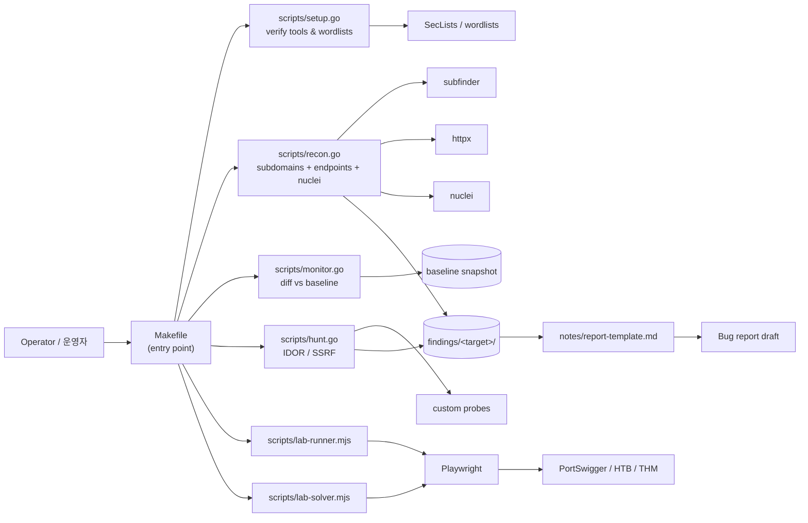

# Bug Bounty Automation Toolkit / 버그 바운티 자동화 툴킷

> Reconnaissance, monitoring, and targeted vulnerability hunting for
> responsible security research and bug bounty programs.
>
> 책임 있는 보안 연구 및 버그 바운티 프로그램을 위한 정찰, 모니터링,
> 표적형 취약점 헌팅 도구 모음입니다.

---

## Overview / 개요

This toolkit orchestrates a complete bug-bounty workflow — from initial
asset discovery and continuous monitoring to targeted vulnerability
scanning (IDOR, SSRF, …) and browser-driven lab exercises.
Performance-critical stages run as Go binaries, while Playwright-based
lab runners operate on safe, scoped platforms. A single `Makefile`
exposes consistent entry points across operators and machines.

이 툴킷은 초기 자산 발견과 지속적 모니터링부터 IDOR·SSRF 등 표적형
취약점 스캔, 브라우저 기반 실습까지 버그 바운티 워크플로우 전체를
오케스트레이션합니다. 성능이 중요한 단계는 Go 바이너리로, 실습
플랫폼에서는 Playwright(Node.js)가 동작하며, 단일 `Makefile`을 통해
운영자와 머신 전체에서 일관된 진입점을 제공합니다.

### Intended Audience / 대상 사용자

- Bug bounty hunters running structured engagements / 구조화된 업무를 진행하는 버그 바운티 헌터
- Application security engineers tracking asset changes over time / 자산 변화를 지속적으로 추적하는 애플리케이션 보안 엔지니어
- CTF / lab participants practicing exploitation in safe environments / 안전한 환경에서 익스플로잇을 연습하는 CTF·실습 참여자

### Responsible Use / 책임 있는 사용

Run this toolkit only against systems you are explicitly authorized to
test — your own assets, scoped bug bounty programs, or dedicated lab
platforms such as PortSwigger Web Security Academy, HackTheBox, or
TryHackMe. Unauthorized scanning may violate computer-misuse laws in
your jurisdiction.

본 툴킷은 명시적으로 테스트 권한을 부여받은 시스템(자체 자산, 스코프가
정의된 버그 바운티 프로그램, PortSwigger Web Security Academy ·
HackTheBox · TryHackMe 등 전용 실습 플랫폼)에 대해서만 실행하시기
바랍니다. 권한 없는 스캔은 관할권의 컴퓨터 오용 법령을 위반할 수
있습니다.

---

## Features / 주요 기능

| Area / 영역 | Capability / 기능 |
|---|---|
| Setup / 설치 | External tool verification, wordlist bootstrap / 외부 도구 검증, 워드리스트 부트스트랩 |
| Recon / 정찰 | Subdomain enumeration, endpoint discovery, nuclei scan / 서브도메인 열거, 엔드포인트 발견, nuclei 스캔 |
| Recon-fast / 빠른 정찰 | Skip nuclei for rapid iteration / nuclei를 건너뛰고 빠른 반복 수행 |
| Monitor / 모니터링 | Diff-based detection of new subdomains & endpoints / 새로운 서브도메인·엔드포인트의 차분 기반 탐지 |
| Hunt / 헌팅 | Targeted IDOR and SSRF scans / IDOR 및 SSRF 표적 스캔 |
| Lab / 실습 | Playwright runners and solvers for scoped exercises / 스코프된 실습용 Playwright 러너·솔버 |
| Reporting / 보고 | Markdown report template and phase checklist / Markdown 보고서 템플릿과 단계별 체크리스트 |

---

## Architecture / 아키텍처

The toolkit is a thin orchestration layer on top of well-known
open-source security tools and the Playwright browser engine. The
`Makefile` is the single user-facing entry point; it dispatches to Go
binaries that drive recon/monitor/hunt stages, and to Node.js
Playwright scripts that solve lab exercises. Configuration is read
from `config/targets.json`, and outputs are written next to the
run-specific working directory.

이 툴킷은 잘 알려진 오픈소스 보안 도구와 Playwright 브라우저 엔진
위에서 동작하는 얇은 오케스트레이션 계층입니다. 단일 진입점인
`Makefile`이 Go 바이너리(정찰·모니터링·헌팅)와 Node.js Playwright
스크립트(실습 솔버)로 작업을 분배하고, `config/targets.json`에서
설정을 읽어 실행별 작업 디렉터리에 결과를 기록합니다.



---

## Quick Start / 빠른 시작

### Prerequisites / 사전 요구 사항

- **Go** 1.21+ (scripts are run with `go run`)
- **Node.js** 18+ and **npm** (Playwright runner)
- External tools expected by `setup.go` (installed/verified on first run):
  - `subfinder`, `httpx`, `nuclei`, `dnsx`, `naabu`
  - `curl`, `jq`, `git`
- A scoped, authorized target (your own asset, a bug-bounty program, or
  a lab platform) / 권한이 부여된 스코프의 타깃(자체 자산, 버그 바운티
  프로그램, 실습 플랫폼)

### Installation / 설치

```bash
git clone https://github.com/jclee941/.github
cd bug
make setup            # verify tools, fetch wordlists
npm install           # install Playwright
npx playwright install chromium
```

### First Run / 첫 실행

```bash
# Full recon on an authorized target
make recon TARGET=example.com

# Fast iteration without nuclei
make recon-fast TARGET=example.com

# Targeted hunt
make hunt TARGET=example.com

# End-to-end: recon + hunt
make full-scan TARGET=example.com
```

Outputs land in a per-target directory next to the scripts; review the
generated Markdown alongside `notes/report-template.md` to draft a
report.

---

## Configuration / 설정

### `config/targets.json`

The central configuration file. Define engagement metadata, scope
allowlists, and per-target tuning here so that recon/monitor/hunt
stages consume a single source of truth.

```json
{
  "targets": [
    {
      "name": "example-program",
      "domain": "example.com",
      "scope": ["*.example.com", "api.example.com"],
      "out_of_scope": ["blog.example.com"],
      "notes": "Authorized via program policy v3"
    }
  ],
  "defaults": {
    "concurrency": 25,
    "rate_limit_rps": 10,
    "nuclei_severity": ["medium", "high", "critical"]
  }
}
```

### Environment Variables / 환경 변수

| Variable / 변수 | Purpose / 용도 | Default / 기본값 |
|---|---|---|
| `TARGET` | Target domain passed to Make recipes / Make 레시피에 전달할 타깃 도메인 | _(required for scan recipes)_ |
| `BUG_OUTPUT_DIR` | Override the per-target output directory / 결과 출력 경로 오버라이드 | `findings/<target>/` |
| `BUG_BASELINE_DIR` | Baseline directory used by `monitor` / 모니터링 베이스라인 디렉터리 | `findings/<target>/baseline` |
| `PLAYWRIGHT_BROWSERS_PATH` | Custom Playwright browser cache / Playwright 브라우저 캐시 경로 | system default |

### `notes/` Templates / `notes/` 템플릿

- `phase2-checklist.md` — engagement checklist for the discovery →
  exploitation → reporting phases / 정찰·익스플로잇·보고 단계 체크리스트
- `report-template.md` — Markdown skeleton for bug reports / 버그 보고서 Markdown 골격
- `vulnerability-study.md` — curated vulnerability class notes used
  when reasoning about findings / 발견 사항 추론 시 참고하는 취약점 노트

---

## Commands Reference / 명령어 레퍼런스

All commands are Makefile targets. Run `make help` at any time for the
up-to-date list.

| Command / 명령어 | Description / 설명 |
|---|---|
| `make help` | Show available recipes and examples / 사용 가능한 레시피와 예제 출력 |
| `make setup` | Verify external tools and download wordlists / 외부 도구 검증 및 워드리스트 다운로드 |
| `make recon TARGET=<domain>` | Full recon pipeline on `TARGET` / `TARGET`에 대한 전체 정찰 파이프라인 |
| `make recon-fast TARGET=<domain>` | Quick recon that skips nuclei / nuclei를 건너뛴 빠른 정찰 |
| `make monitor TARGET=<domain>` | Diff against baseline to surface new assets / 베이스라인 대비 새로운 자산 탐지 |
| `make hunt TARGET=<domain>` | Targeted vulnerability scan on `TARGET` / `TARGET`에 대한 표적형 취약점 스캔 |
| `make hunt-idor TARGET=<domain>` | IDOR-focused scan only / IDOR 스캔만 수행 |
| `make hunt-ssrf TARGET=<domain>` | SSRF-focused scan only / SSRF 스캔만 수행 |
| `make full-scan TARGET=<domain>` | Recon + hunt end-to-end / 정찰과 헌팅을 모두 수행 |

The Go scripts accept their own flags in addition to `TARGET`. Pass
`-h` to any of them for help:

```bash
go run scripts/recon.go -h
go run scripts/hunt.go -h
go run scripts/monitor.go -h
```

---

## Local Development / 로컬 개발

### Repository Layout / 저장소 구조

```
.
├── AGENTS.md              # Agent / contributor guidance for this repo
├── Makefile               # Single entry point — all operator commands
├── README.md              # This document
├── package.json           # Node.js (Playwright) dependencies
├── package-lock.json
├── config/
│   └── targets.json       # Engagement metadata & scope
├── notes/
│   ├── phase2-checklist.md
│   ├── report-template.md
│   └── vulnerability-study.md
└── scripts/
    ├── setup.go           # Tool & wordlist bootstrap
    ├── recon.go           # Subdomain/endpoint/nuclei recon
    ├── monitor.go         # Baseline diff monitoring
    ├── hunt.go            # IDOR / SSRF targeted scans
    ├── lab-runner.mjs     # Playwright lab exercise runner
    ├── lab-solver.mjs     # Playwright lab exercise solver
    └── monitor.go         # Monitoring (see above)
```

### Working on Go Stages / Go 단계 작업

Each Go file is a `package main` entry point invoked via `go run`.
Common workflow when adding a new stage:

```bash
go run scripts/setup.go                  # ensure deps
go run scripts/recon.go -d example.com   # iterate quickly
go vet ./scripts/...                     # static checks
```

### Working on Playwright Labs / Playwright 실습 작업

```bash
npm install
npx playwright install chromium
node scripts/lab-runner.mjs --lab=idor
node scripts/lab-solver.mjs --lab=ssrf
```

Browser artifacts (traces, screenshots) are written to the per-lab
output directory; keep these out of commits by adding them to
`.gitignore`.

### Code Style / 코드 스타일

- Go: standard `gofmt`, idiomatic `package main` entry points
- Node.js: ES modules (`.mjs`), `prettier`-compatible formatting
- Commit messages: imperative mood, scope-prefixed (e.g.
  `recon: parallelize httpx probes`)

---

## Testing / 테스트

The repository mixes orchestration code with operator-facing scripts.
A pragmatic testing strategy:

| Layer / 계층 | Approach / 접근 |
|---|---|
| Go orchestration / Go 오케스트레이션 | Unit-test pure helpers; exercise end-to-end against a local fixture domain or a dedicated lab host / 순수 헬퍼 함수 단위 테스트, 로컬 픽스처 도메인 또는 전용 실습 호스트 대상 E2E |
| Config / 설정 | Validate `config/targets.json` shape with `jq` smoke tests / `jq` 스모크 테스트로 `config/targets.json` 형태 검증 |
| Playwright labs / Playwright 실습 | Run `lab-runner.mjs` / `lab-solver.mjs` against a known lab URL and assert exit code / 알려진 실습 URL에서 실행 후 종료 코드 검증 |
| Reporting / 보고 | Lint generated reports with `markdownlint` / `markdownlint`로 생성된 보고서 린트 |

Before opening a change, run through the checklist in
`notes/phase2-checklist.md` and confirm that the recipe still
completes against an authorized lab target.

---

## Contribution Guide / 기여 가이드

Contributions that improve detection quality, add a clearly-scoped
hunting stage, or expand the Playwright lab catalog are welcome.

1. Fork and create a topic branch: `git checkout -b feat/<topic>`
2. Make changes following the code style above / 위 코드 스타일을 따라 변경
3. Add or update notes in `notes/` when behavior changes / 동작이 바뀌면 `notes/` 갱신
4. Run `make setup` and verify recipes on a lab target / `make setup`을 실행하고 실습 타깃에서 레시피 검증
5. Open a pull request describing the change, the threat model, and
   any new dependencies / 변경 내용, 위협 모델, 새 의존성을 설명하는 PR 제출
6. Respect the responsible-use policy in this README — never commit
   real customer data, raw HTTP responses from unauthorized targets,
   or credentials / 책임 있는 사용 정책을 준수하며, 실제 고객 데이터,
   권한 없는 타깃의 원시 HTTP 응답, 자격 증명은 커밋하지 않습니다.

Please review `AGENTS.md` before substantial changes; it documents
conventions specific to this repository.

---

## License / 라이선스

This project is released under the **ISC License** (as declared in
`package.json`).

본 프로젝트는 `package.json`에 명시된 **ISC 라이선스** 하에 배포됩니다.
See [`package.json`](./package.json) for the canonical declaration.

Repository / 저장소: <https://github.com/jclee941/bug>