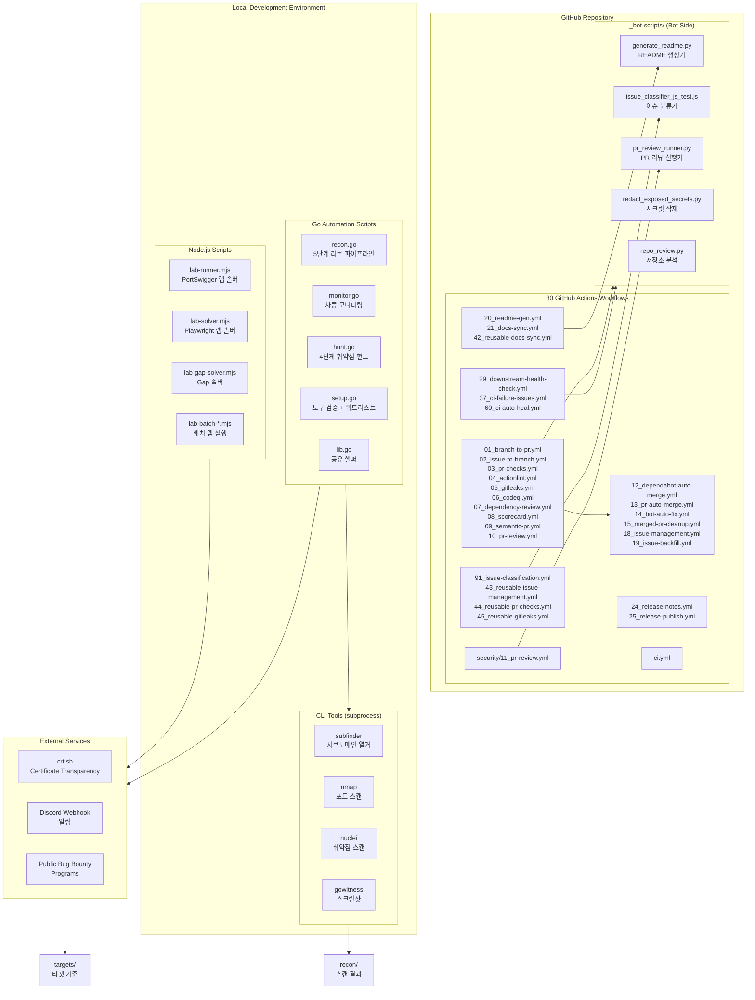

# Bug Bounty Automation Toolkit / 버그바운티 자동화 툴킷

[](https://nodejs.org/)
[](https://playwright.dev/)
[](https://go.dev/)
[](https://github.com/features/actions)
[](https://openssf.org/)
[](https://cliproxy.jclee.me)
[](LICENSE)

---

## Table of Contents / 목차

- [Overview / 개요](#overview--개요)
- [Features / 주요 기능](#features--주요-기능)
- [Architecture / 아키텍처](#architecture--아키텍처)
- [Automation Inventory / 자동화 목록](#automation-inventory--자동화-목록)
- [Quick Start / 빠른 시작](#quick-start--빠른-시작)
- [Local Development / 로컬 개발](#local-development--로컬-개발)
- [Commands Reference / 명령어 참조](#commands-reference--명령어-참조)
- [Repository Structure / 저장소 구조](#repository-structure--저장소-구조)
- [Contribution Guide / 기여 가이드](#contribution-guide--기여-가이드)

---

## Overview / 개요

### English

**Bug Bounty Automation Toolkit** is a local automation workspace for authorized web security research, vulnerability-study exercises, and lab-solving workflows. The repository combines:

- **Node.js ESM scripts** for PortSwigger/Web Security Academy style lab automation using Playwright
- **Go helper programs** for monitoring and vulnerability-hunting command orchestration
- **GitHub Actions workflows** (30 total) for PR checks, security scanning, PR review automation, issue management, release automation, documentation sync, and CI auto-healing
- **Bot-side helper scripts** in `_bot-scripts/` for README generation, PR review execution, secret redaction, and repository analysis

### 한국어

**버그바운티 자동화 툴킷**은 권한 있는 웹 보안 연구, 취약점 학습 연습, лабора 解题 워크플로를 위한 로컬 자동화 작업 공간입니다. 저장소는 다음을 결합합니다:

- **Node.js ESM 스크립트** - Playwright를 사용한 PortSwigger/Web Security Academy 스타일 랩 자동화
- **Go 헬퍼 프로그램** - 모니터링 및 취약점 탐색 명령 오케스트레이션
- **GitHub Actions 워크플로** (30개) - PR 검사, 보안 스캔, PR 리뷰 자동화, 이슈 관리, 릴리스 자동화, 문서 동기화, CI 자동 복구
- **`_bot-scripts/`** 의 봇 사이드 헬퍼 스크립트 - README 생성, PR 리뷰 실행, 시크릿 삭제, 저장소 분석

---

## Features / 주요 기능

### English

| Feature | Description |
|---------|-------------|
| **Recon Pipeline** | 5-phase recon: subdomain enumeration → port scanning → screenshot → nuclei scan → report |
| **Diff Monitoring** | Periodic monitoring with crt.sh queries + Discord webhook alerts for new findings |
| **Vulnerability Hunting** | 4-phase hunt: IDOR, SSRF, XSS, SQL injection, business logic flaws |
| **Lab Solver** | Playwright-based automated solver for PortSwigger Web Security Academy labs |
| **PR Review Automation** | AI-powered PR reviews via [qodo-ai/pr-agent](https://github.com/qodo-ai/pr-agent) |
| **Security Scanning** | gitleaks, CodeQL, Dependency Review, Scorecard on every PR |
| **CI Auto-Heal** | Automatic recovery from flaky/failed CI runs |
| **README Generation** | Automated README updates via [cliproxy.jclee.me](https://cliproxy.jclee.me) |

### 한국어

| 기능 | 설명 |
|------|------|
| **Recon 파이프라인** | 5단계 리콘: 서브도메인 열거 → 포트 스캔 → 스크린샷 → nuclei 스캔 → 보고서 |
| **차등 모니터링** | crt.sh 쿼리 + Discord 웹훅 알림을 통한 주기적 모니터링 |
| **취약점 탐색** | 4단계 헌트: IDOR, SSRF, XSS, SQL 인젝션, 비즈니스 로직 결함 |
| **랩 솔버** | PortSwigger Web Security Academy 랩용 Playwright 기반 자동 솔버 |
| **PR 리뷰 자동화** | [qodo-ai/pr-agent](https://github.com/qodo-ai/pr-agent)를 통한 AI PR 리뷰 |
| **보안 스캔** | 모든 PR에서 gitleaks, CodeQL, Dependency Review, Scorecard 실행 |
| **CI 자동 복구** | 불안정/실패한 CI 실행의 자동 복구 |
| **README 생성** | [cliproxy.jclee.me](https://cliproxy.jclee.me)를 통한 자동화된 README 업데이트 |

---

## Architecture / 아키텍처



---

## Automation Inventory / 자동화 목록

### GitHub Actions Workflows (30 total)

#### PR & Branch Automation

| File | Purpose |
|------|---------|
| `01_branch-to-pr.yml` | Create PR from feature branch |
| `02_issue-to-branch.yml` | Create branch from issue |
| `13_pr-auto-merge.yml` | Auto-merge approved PRs |
| `15_merged-pr-cleanup.yml` | Clean up merged PR branches |

#### PR Checks & Security

| File | Purpose |
|------|---------|
| `03_pr-checks.yml` | Run standard PR checks (reusable) |
| `04_actionlint.yml` | Lint workflow files |
| `05_gitleaks.yml` | Scan for secrets in PR |
| `06_codeql.yml` | CodeQL security analysis |
| `07_dependency-review.yml` | Dependency vulnerability review |
| `08_scorecard.yml` | OpenSSF Scorecard assessment |
| `09_semantic-pr.yml` | Enforce semantic PR titles |
| `10_pr-review.yml` | AI PR review via pr-agent |
| `11_pr-review.yml` (security/) | Security-focused PR review |
| `44_reusable-pr-checks.yml` | Reusable PR checks workflow |
| `45_reusable-gitleaks.yml` | Reusable gitleaks workflow |

#### Issue Management

| File | Purpose |
|------|---------|
| `18_issue-management.yml` | Manage issue lifecycle |
| `19_issue-backfill.yml` | Backfill issues from commits |
| `91_issue-classification.yml` | Classify issues automatically |
| `43_reusable-issue-management.yml` | Reusable issue management |

#### Documentation & README

| File | Purpose |
|------|---------|
| `20_readme-gen.yml` | Auto-generate README |
| `21_docs-sync.yml` | Sync documentation |
| `42_reusable-docs-sync.yml` | Reusable docs sync |

#### Dependency Management

| File | Purpose |
|------|---------|
| `12_dependabot-auto-merge.yml` | Auto-merge Dependabot PRs |
| `14_bot-auto-fix.yml` | Auto-fix vulnerabilities |

#### Release Automation

| File | Purpose |
|------|---------|
| `24_release-notes.yml` | Generate release notes |
| `25_release-publish.yml` | Publish releases |

#### Health & Monitoring

| File | Purpose |
|------|---------|
| `29_downstream-health-check.yml` | Check downstream deps |
| `37_ci-failure-issues.yml` | Create issues for CI failures |
| `60_ci-auto-heal.yml` | Auto-heal CI failures |

#### Root & Utility

| File | Purpose |
|------|---------|
| `ci.yml` | Root CI configuration |

### Bot-Side Helper Scripts (`_bot-scripts/`)

| Script | Purpose | Language |
|--------|---------|----------|
| `generate_readme.py` | Generate comprehensive README | Python |
| `pr_review_runner.py` | Execute PR reviews | Python |
| `pr_review_runner_test.py` | Test PR review runner | Python |
| `redact_exposed_secrets.py` | Redact exposed secrets | Python |
| `repo_review.py` | Review repository health | Python |
| `check_hardcode_scan_patterns_test.py` | Scan for hardcoded patterns | Python |
| `check_private_ips.py` | Detect private IP leaks | Python |
| `check_private_ips_test.py` | Test private IP checker | Python |
| `check_workflow_scripts.py` | Validate workflow scripts | Python |
| `check_workflow_scripts_test.py` | Test workflow script checker | Python |
| `issue_classification_workflow_test.py` | Test issue classifier | Python |
| `issue_classifier_js_test.js` | JavaScript issue classifier | JavaScript |
| `readme_mermaid_test.py` | Validate Mermaid diagrams | Python |

### Go Automation Scripts (Local)

| Script | Purpose | Lines |
|--------|---------|-------|
| `scripts/setup.go` | Tool verification + wordlist download | ~208 |
| `scripts/recon.go` | 5-phase recon pipeline | ~282 |
| `scripts/monitor.go` | Diff monitoring + Discord alerts | ~254 |
| `scripts/hunt.go` | 4-phase vulnerability hunting | ~464 |
| `scripts/lib.go` | Shared helpers | ~114 |
| `scripts/hunt.go` | Alternate hunt implementation | ~509 |

### Node.js Lab Automation Scripts

| Script | Purpose |
|--------|---------|
| `scripts/lab-runner.mjs` | Main PortSwigger lab solver |
| `scripts/lab-solver.mjs` | Custom Playwright lab solvers |
| `scripts/lab-gap-solver.mjs` | Gap solver for labs without scripts |
| `scripts/lab-batch-*.mjs` | Batch lab execution variants |
| `scripts/lab-runner-aggressive.mjs` | Aggressive lab runner |
| `scripts/lab-runner.mjs` | Standard lab runner |

---

## Quick Start / 빠른 시작

### Prerequisites / 전제 조건

- **Go** 1.21+
- **Node.js** 18+ with ESM support
- **Playwright** (`npx playwright install`)
- **Tools**: subfinder, nmap, nuclei, gowitness (auto-installed via `make setup`)

### English

```bash
# Clone the repository
git clone https://github.com/jclee941/.github
cd bug

# First-time setup
make setup

# Run full recon on a target
make recon TARGET=example.com

# Monitor for changes
make monitor TARGET=example.com

# Hunt vulnerabilities
make hunt TARGET=example.com

# Full scan: recon + hunt
make full-scan TARGET=example.com

# Solve a PortSwigger lab
node scripts/lab-runner.mjs --lab https://portswigger.net/lab/123
```

### 한국어

```bash
# 저장소 클론
git clone https://github.com/jclee941/.github
cd bug

# 최초 설정
make setup

# 타겟에 대해 전체 리콘 실행
make recon TARGET=example.com

# 변경 사항 모니터링
make monitor TARGET=example.com

# 취약점 탐색
make hunt TARGET=example.com

# 전체 스캔: 리콘 + 헌트
make full-scan TARGET=example.com

# PortSwigger 랩求解
node scripts/lab-runner.mjs --lab https://portswigger.net/lab/123
```

---

## Local Development / 로컬 개발

### Environment Setup / 환경 설정

```bash
# Install Node.js dependencies
npm install

# Install Go dependencies (none required - stdlib only)
go mod tidy

# Verify all tools are available
make setup
```

### Running Scripts Directly / 스크립트 직접 실행

```bash
# Run Go scripts directly
go run scripts/recon.go scripts/lib.go -d target.com
go run scripts/monitor.go scripts/lib.go -d target.com
go run scripts/hunt.go scripts/lib.go -d target.com

# Run Node.js lab scripts
node scripts/lab-runner.mjs
node scripts/lab-solver.mjs

# Run bot-side scripts
cd _bot-scripts
python3 generate_readme.py
python3 pr_review_runner.py --pr-url https://github.com/owner/repo/pull/123
```

### Testing / 테스트

```bash
# Test Go scripts
go test ./scripts/*_test.go

# Test Node.js scripts
node --test scripts/*.test.mjs 2>/dev/null || node scripts/*.test.mjs

# Test bot scripts
cd _bot-scripts
python3 -m pytest . -v  # if pytest available
python3 check_private_ips_test.py
python3 check_workflow_scripts_test.py
```

---

## Commands Reference / 명령어 참조

### Makefile Commands

```
make help                        # Show all available commands (THIS OUTPUT)
make setup                       # First-time setup — verify tools, download wordlists
make recon TARGET=target.com     # Full recon pipeline (5 phases)
make recon-fast TARGET=target.com # Quick recon — skip nuclei scan
make monitor TARGET=target.com   # Diff-based change detection
make hunt TARGET=target.com      # All vulnerability categories
make hunt-idor TARGET=target.com # IDOR vulnerabilities only
make hunt-ssrf TARGET=target.com # SSRF vulnerabilities only
make full-scan TARGET=target.com # Recon + hunt combined
make clean                       # Remove scan results (recon/, targets/, reports/)
```

### Available Hunt Types / 사용 가능한 헌트 유형

```bash
make hunt TARGET=example.com                    # All types
make hunt TARGET=example.com TYPE=xss           # XSS only
make hunt TARGET=example.com TYPE=sqli          # SQL injection only
make hunt TARGET=example.com TYPE=idor          # IDOR only
make hunt TARGET=example.com TYPE=ssrf          # SSRF only
make hunt TARGET=example.com TYPE=logic         # Business logic only
```

### Bot Scripts Usage / 봇 스크립트 사용법

```bash
# README generation
python3 _bot-scripts/generate_readme.py

# PR review
python3 _bot-scripts/pr_review_runner.py --pr-url <url>

# Secret redaction
python3 _bot-scripts/redact_exposed_secrets.py --file <path>

# Repository review
python3 _bot-scripts/repo_review.py --repo <owner/repo>

# Private IP detection
python3 _bot-scripts/check_private_ips.py --path .
```

---

## Repository Structure / 저장소 구조

```
bug/
├── README.md                      # This file
├── LICENSE                        # ISC License
├── AGENTS.md                      # Knowledge base for AI agents
├── CONTRIBUTING.md                # Contribution guidelines
├── Makefile                       # Orchestration (make help)
├── package.json                   # Node.js ESM project config
├── package-lock.json
├── interactsh_payload.txt         # Interactsh payload for OOB testing
├── output-lab08.png               # Lab output screenshot

├── .github/
│   └── workflows/
│       ├── 01_branch-to-pr.yml
│       ├── 02_issue-to-branch.yml
│       ├── 03_pr-checks.yml
│       ├── 04_actionlint.yml
│       ├── 05_gitleaks.yml
│       ├── 06_codeql.yml
│       ├── 07_dependency-review.yml
│       ├── 08_scorecard.yml
│       ├── 09_semantic-pr.yml
│       ├── 10_pr-review.yml
│       ├── 12_dependabot-auto-merge.yml
│       ├── 13_pr-auto-merge.yml
│       ├── 14_bot-auto-fix.yml
│       ├── 15_merged-pr-cleanup.yml
│       ├── 18_issue-management.yml
│       ├── 19_issue-backfill.yml
│       ├── 20_readme-gen.yml
│       ├── 21_docs-sync.yml
│       ├── 24_release-notes.yml
│       ├── 25_release-publish.yml
│       ├── 29_downstream-health-check.yml
│       ├── 37_ci-failure-issues.yml
│       ├── 42_reusable-docs-sync.yml
│       ├── 43_reusable-issue-management.yml
│       ├── 44_reusable-pr-checks.yml
│       ├── 45_reusable-gitleaks.yml
│       ├── 60_ci-auto-heal.yml
│       ├── 91_issue-classification.yml
│       ├── ci.yml
│       └── security/
│           └── 11_pr-review.yml

├── _bot-scripts/                  # Bot-side helper scripts
│   ├── AGENTS.md
│   ├── CODE_OF_CONDUCT.md
│   ├── CONTRIBUTING.md
│   ├── Dockerfile.github_action
│   ├── Dockerfile.github_app
│   ├── LICENSE
│   ├── Makefile
│   ├── NOTICE
│   ├── README.md
│   ├── SECURITY.md
│   ├── docker-compose.github_app.yml
│   ├── docker-compose.github_app.yml.lxc
│   ├── filebeat.yml
│   ├── pyproject.toml
│   ├── requirements-dev.txt
│   ├── requirements.txt
│   ├── setup.py
│   ├── MANIFEST.in
│   └── scripts/
│       ├── AGENTS.md
│       ├── generate_readme.py
│       ├── pr_review_runner.py
│       ├── pr_review_runner_test.py
│       ├── redact_exposed_secrets.py
│       ├── repo_review.py
│       ├── check_hardcode_scan_patterns_test.py
│       ├── check_private_ips.py
│       ├── check_private_ips_test.py
│       ├── check_workflow_scripts.py
│       ├── check_workflow_scripts_test.py
│       ├── issue_classification_workflow_test.py
│       ├── issue_classifier_js_test.js
│       └── readme_mermaid_test.py

├── scripts/                       # Main automation scripts
│   ├── lib.go                     # Shared Go helpers
│   ├── setup.go                   # Tool verification
│   ├── recon.go                   # Recon pipeline
│   ├── monitor.go                 # Diff monitoring
│   ├── hunt.go                    # Vulnerability hunting
│   ├── lab-runner.mjs             # PortSwigger lab solver
│   ├── lab-solver.mjs             # Custom lab solvers
│   ├── lab-gap-solver.mjs         # Gap solver
│   ├── lab-batch-*.mjs            # Batch runners
│   ├── *.cjs                      # Various batch solvers
│   ├── get-lab-urls.sh
│   └── hunt.go                    # Additional hunt script

├── config/
│   └── targets.json               # Target and notification config

├── notes/
│   ├── phase2-checklist.md        # Learning checklist
│   ├── report-template.md         # Bug report template
│   └── vulnerability-study.md     # Vulnerability research notes

├── wordlists/                     # SecLists downloads (gitignored)
├── recon/                         # Scan results (gitignored)
├── targets/                       # Target baselines (gitignored)
└── reports/                       # Submitted reports (gitignored)
```

---

## Contribution Guide / 기여 가이드

### English

Contributions are welcome! Please follow these guidelines:

1. **Fork** the repository and create a feature branch from `main`
2. **Commit** your changes with clear, descriptive messages
3. **Test** your changes locally before submitting a PR
4. **Submit** a PR with a description of what changed and why
5. **Automation**: All PRs automatically run security scans (gitleaks, CodeQL, Dependency Review) and require at least one approval

### Pull Request Checklist / 풀 리퀘스트 체크리스트

- [ ] No hardcoded private IPs (192.168.x.x, 10.x.x.x, 172.16-31.x.x)
- [ ] No hardcoded target domains in scripts
- [ ] Workflow files pass `actionlint`
- [ ] Go scripts use only stdlib (no external dependencies)
- [ ] Node.js scripts use ESM (`"type": "module"`)
- [ ] Sensitive data (recon/, targets/, reports/) is gitignored

### 한국어

기여를 환영합니다! 다음 가이드라인을 따라 주세요:

1. 저장소를 **Fork**하고 `main`에서 기능 브랜치를 만드세요
2. 명확하고 설명적인 메시지로 변경 사항을 **Commit**하세요
3. PR을 제출하기 전에 로컬에서 변경 사항을 **Test**하세요
4. 변경 내용과 이유를 설명하는 **PR**을 제출하세요
5. **자동화**: 모든 PR은 보안 스캔(gitleaks, CodeQL, Dependency Review)을 자동으로 실행하며 최소 하나의 승인이 필요합니다

### 풀 리퀘스트 체크리스트

- [ ] 하드코딩된 사설 IP 없음 (192.168.x.x, 10.x.x.x, 172.16-31.x.x)
- [ ] 스크립트에 하드코딩된 타겟 도메인 없음
- [ ] 워크플로 파일이 `actionlint` 통과
- [ ] Go 스크립트가 stdlib만 사용 (외부 의존성 없음)
- [ ] Node.js 스크립트가 ESM 사용 (`"type": "module"`)
- [ ] 민감한 데이터(recon/, targets/, reports/)가 gitignored

---

## License / 라이선스

This project is licensed under the **ISC License** — see [LICENSE](LICENSE) for details.

---

## References / 참고 자료

- [PortSwigger Web Security Academy](https://portswigger.net/web-security)
- [qodo-ai/pr-agent](https://github.com/qodo-ai/pr-agent) — AI PR review
- [OpenSSF Scorecard](https://openssf.org/) — Security health metrics
- [nuclei](https://github.com/projectdiscovery/nuclei) — Vulnerability scanner
- [subfinder](https://github.com/projectdiscovery/subfinder) — Subdomain enumeration
- [README Generation API](https://cliproxy.jclee.me) — Automated README updates

```

This README was auto-generated by **minimax-m2.7** model via [CLIProxyAPI](https://cliproxy.jclee.me).
