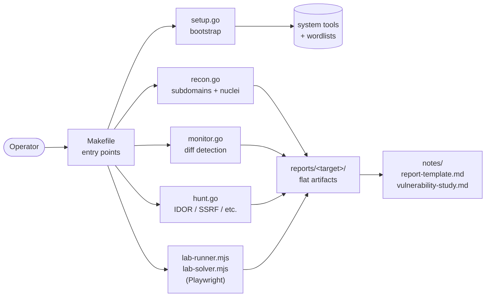

# Bug Bounty Automation Toolkit / 버그 바운티 자동화 툴킷

> Reconnaissance, monitoring, and targeted vulnerability hunting for
> responsible security research and bug bounty programs.
>
> 책임 있는 보안 연구 및 버그 바운티 프로그램을 위한 정찰, 모니터링,
> 표적형 취약점 헌팅 도구 모음입니다.

---

## Overview / 개요

This toolkit orchestrates a complete bug-bounty workflow — from initial
asset discovery and continuous monitoring to targeted vulnerability
scanning (IDOR, SSRF, …) and browser-driven lab exercises. Performance-
critical stages are implemented as Go binaries, while Playwright-based
lab runners solve exercises on safe, scoped platforms. A single
`Makefile` provides consistent entry points across operators and
machines.

이 툴킷은 초기 자산 발견과 지속적 모니터링부터 IDOR·SSRF 등 표적형
취약점 스캔, 브라우저 기반 실습에 이르는 버그 바운티 워크플로우를
오케스트레이션합니다. 성능이 중요한 단계는 Go 바이너리로, Playwright
기반 실습 러너는 Node.js로 구성되어 있으며, 단일 `Makefile`을 통해
운영자와 머신 전체에 일관된 진입점을 제공합니다.

### Intended Audience / 대상 사용자

- Bug bounty hunters running structured engagements / 구조화된 업무를 진행하는 버그 바운티 헌터
- Application security engineers tracking asset changes over time / 자산 변화를 지속적으로 추적하는 애플리케이션 보안 엔지니어
- CTF / lab participants practicing exploitation in safe environments / 안전한 환경에서 익스플로잇을 연습하는 CTF·실습 참여자

### Responsible Use / 책임 있는 사용

Run this toolkit only against systems you are explicitly authorized to
test — your own assets, scoped bug bounty programs, or dedicated lab
platforms such as PortSwigger Web Security Academy, HackTheBox, or
TryHackMe. Unauthorized scanning may violate computer-misuse laws in
your jurisdiction.

본 툴킷은 명시적으로 테스트 권한을 부여받은 시스템(자체 자산, 스코프가
정의된 버그 바운티 프로그램, PortSwigger Web Security Academy ·
HackTheBox · TryHackMe 등 전용 실습 플랫폼)에 대해서만 실행하시기
바랍니다. 권한 없는 스캔은 관련 컴퓨터 오용 법령을 위반할 수 있습니다.

---

## Features / 주요 기능

| Area / 영역 | Capability / 기능 |
|---|---|
| Setup / 설치 | Tool verification, wordlist bootstrap / 도구 검증 및 워드리스트 부트스트랩 |
| Recon / 정찰 | Subdomain enumeration, endpoint discovery, nuclei templates / 서브도메인 열거, 엔드포인트 발견, nuclei 템플릿 |
| Recon-fast / 빠른 정찰 | Lightweight recon skipping heavy nuclei stage / nuclei 단계를 건너뛰는 경량 정찰 |
| Monitor / 모니터링 | Diff-based detection of new subdomains and endpoints / 신규 서브도메인·엔드포인트의 차분 기반 감지 |
| Hunt / 헌팅 | Targeted vulnerability scan with pluggable types / 플러그형 타입의 표적형 취약점 스캔 |
| Hunt-IDOR / IDOR 헌팅 | IDOR-focused vulnerability scan / IDOR 중심의 취약점 스캔 |
| Hunt-SSRF / SSRF 헌팅 | SSRF-focused vulnerability scan / SSRF 중심의 취약점 스캔 |
| Lab runner / 실습 러너 | Playwright-driven browser automation for CTF/lab exercises / CTF·실습 연습을 위한 Playwright 브라우저 자동화 |
| Lab solver / 실습 솔버 | Automated solution runner against lab platforms / 실습 플랫폼 대상 자동 해법 러너 |
| Reporting / 리포팅 | Markdown report scaffolding and phase tracking / 마크다운 리포트 골격 및 단계별 추적 |

---

## Architecture / 아키텍처

The toolkit is intentionally thin: a `Makefile` façade invokes Go
binaries for I/O-heavy stages and Node.js scripts for browser-driven
lab work. Go handles subdomain enumeration, nuclei templating, and
differential monitoring; Playwright (Node.js) drives browser sessions
against scoped lab platforms. All artifacts are emitted as flat files
that operators review and import into their report workflow.

툴킷은 의도적으로 얇게 설계되었습니다. `Makefile` 파사드가 I/O 집약
단계에는 Go 바이너리를 호출하고, 브라우저 기반 실습에는 Node.js
스크립트를 호출합니다. Go는 서브도메인 열거, nuclei 템플릿, 차분
모니터링을 처리하며, Playwright(Node.js)는 스코프된 실습 플랫폼에
대한 브라우저 세션을 구동합니다. 모든 결과물은 운영자가 검토하고
리포트 워크플로우로 가져갈 수 있는 플랫 파일 형태로 출력됩니다.



---

## Repository Structure / 저장소 구조

```
.
├── AGENTS.md                 # Operator/agent conventions (context only)
├── Makefile                  # Single entry point for all workflows
├── README.md                 # This document
├── package.json              # Node.js dependency manifest (playwright)
├── package-lock.json         # Locked dependency graph
├── config/
│   └── targets.json          # Target catalog used by recon/monitor
├── notes/
│   ├── phase2-checklist.md   # Phase-2 deliverable checklist
│   ├── report-template.md    # Vulnerability report scaffolding
│   └── vulnerability-study.md# Per-class vulnerability study notes
└── scripts/
    ├── hunt.go               # Targeted vulnerability scanner
    ├── monitor.go            # Differential monitor (new findings)
    ├── recon.go              # Subdomain + endpoint + nuclei recon
    ├── setup.go              # One-time environment bootstrap
    ├── lab-runner.mjs        # Playwright lab session runner
    └── lab-solver.mjs        # Playwright automated solver
```

---

## Quick Start / 빠른 시작

### Prerequisites / 사전 요구사항

| Tool / 도구 | Purpose / 용도 | Notes / 비고 |
|---|---|---|
| Go (≥ 1.21) | Run recon/monitor/hunt binaries / 정찰·모니터링·헌팅 바이너리 실행 | `go run scripts/*.go` |
| Node.js (≥ 18) | Run lab scripts / 실습 스크립트 실행 | Required by Playwright |
| Playwright | Browser automation / 브라우저 자동화 | `npm install` installs runtime dep |
| External CLIs | subfinder, httpx, nuclei, naabu, etc. | Installed/verified by `make setup` |

Install the Playwright runtime declared in `package.json`:

```bash
npm install
```

### Bootstrap / 부트스트랩

```bash
make setup
```

This invokes `scripts/setup.go`, which verifies required external
binaries and prepares local wordlists used by later stages.

`scripts/setup.go`를 호출하여 필수 외부 바이너리를 검증하고 후속
단계에서 사용할 로컬 워드리스트를 준비합니다.

### First Engagement / 첫 번째 업무

```bash
# Full recon pipeline
make recon TARGET=example.com

# Differential monitoring (second run onward)
make monitor TARGET=example.com

# Targeted vulnerability hunting
make hunt TARGET=example.com

# Everything in one shot
make full-scan TARGET=example.com
```

---

## Configuration / 설정

### `config/targets.json`

The target catalog is the canonical list of in-scope assets. `recon`
and `monitor` read from this file when no explicit target is supplied,
and it is the source of truth for which domains the toolkit may touch.

`config/targets.json`은 스코프 내 자산의 정식 목록입니다. 명시적
타겟이 지정되지 않은 경우 `recon`과 `monitor`가 이 파일을 읽으며,
툴킷이 접근 가능한 도메인에 대한 신뢰 가능한 출처입니다.

Edit the file to reflect your current engagement scope before running
broad-scope commands. The `TARGET=` Makefile variable always takes
precedence over the catalog for single-target runs.

광범위 스캔 명령을 실행하기 전에 현재 업무 스코프에 맞게 파일을
수정하세요. 단일 타겟 실행 시 `TARGET=` Makefile 변수는 항상 카탈로그
보다 우선합니다.

### Environment Variables / 환경 변수

Go scripts accept flags directly (see `scripts/*.go`). Common patterns:

```bash
go run scripts/recon.go -d example.com -skip-nuclei
go run scripts/hunt.go -d example.com -type idor
go run scripts/hunt.go -d example.com -type ssrf
```

---

## Commands Reference / 명령어 참조

All commands are routed through the `Makefile`. Run `make help` to
print the live banner and per-command summaries.

모든 명령은 `Makefile`을 통해 라우팅됩니다. `make help`를 실행하면
현황 배너와 명령별 요약이 출력됩니다.

| Command / 명령어 | Description / 설명 |
|---|---|
| `make help` | Show available targets and usage examples / 사용 가능한 타겟과 사용 예시 출력 |
| `make setup` | Initial bootstrap: verify tools, fetch wordlists / 초기 부트스트랩: 도구 검증, 워드리스트 준비 |
| `make recon TARGET=<domain>` | Full recon pipeline on a target / 타겟에 대한 전체 정찰 파이프라인 |
| `make recon-fast TARGET=<domain>` | Recon without the nuclei scan stage / nuclei 단계 없이 정찰 |
| `make monitor TARGET=<domain>` | Diff monitoring — emit only NEW findings / 차분 모니터링 — 신규 발견만 출력 |
| `make hunt TARGET=<domain>` | Targeted vulnerability hunt (all types) / 표적형 취약점 헌팅(전체 타입) |
| `make hunt-idor TARGET=<domain>` | IDOR-only hunt / IDOR 한정 헌팅 |
| `make hunt-ssrf TARGET=<domain>` | SSRF-only hunt / SSRF 한정 헌팅 |
| `make full-scan TARGET=<domain>` | Recon + hunt end-to-end / 정찰 + 헌팅 종단 실행 |
| `make scan-target TARGET=<domain>` | Alias-style target preset / 타겟 프리셋 별칭 |
| `make clean` | Remove generated artifacts / 생성된 결과물 제거 |

---

## Local Development / 로컬 개발

### Layout / 레이아웃

- **Go stage / Go 단계**: `scripts/*.go` are standalone entry points.
  Each script is invoked via `go run` so no build artifacts are
  committed. Add a new stage by creating `scripts/<stage>.go` and
  registering it in the `Makefile`.

  `scripts/*.go`는 독립 실행 진입점입니다. 각 스크립트는 `go run`으로
  호출되므로 빌드 산출물을 커밋하지 않습니다. `scripts/<stage>.go`를
  새로 만들고 `Makefile`에 등록하여 단계를 추가하세요.

- **Node.js stage / Node.js 단계**: `scripts/lab-*.mjs` use the
  Playwright dependency declared in `package.json`. New browser flows
  should reuse the same ES-module pattern.

  `scripts/lab-*.mjs`는 `package.json`에 선언된 Playwright 의존성을
  사용합니다. 새로운 브라우저 흐름은 동일한 ESM 패턴을 재사용하세요.

- **Configuration / 설정**: `config/targets.json` and per-stage flags.
  Keep secrets out of the repository; pass tokens via environment.

  `config/targets.json`과 단계별 플래그를 사용합니다. 비밀 값은 저장소
  밖에 두고 환경 변수로 전달하세요.

- **Notes / 노트**: `notes/*.md` are operator-facing markdown for
  report scaffolding, phase checklists, and per-vulnerability study.
  These are first-class deliverables and may be committed.

  `notes/*.md`는 리포트 골격, 단계별 체크리스트, 취약점별 연구를 위한
  운영자용 마크다운입니다. 1급 산출물로 커밋할 수 있습니다.

### Adding a New Stage / 새 단계 추가

1. Create `scripts/<stage>.go` (or `scripts/<stage>.mjs` for browser
   work).
2. Register a `Makefile` target that invokes it.
3. Update `notes/phase2-checklist.md` (or a new checklist) so operators
   know when to run the new stage.
4. Document any new flags here and in `make help` output.

---

## Testing / 테스트

The repository currently ships a placeholder `npm test` script
(`package.json`). Go stages are exercised end-to-end against scoped
lab targets before each release.

저장소에는 현재 자리표시자 `npm test` 스크립트(`package.json`)가
포함되어 있습니다. Go 단계는 릴리스 전에 스코프된 실습 타겟에 대해
종단 간 테스트됩니다.

For local smoke tests against a lab target:

```bash
# Verify the bootstrap still passes on a clean machine
make setup

# Run a fast recon to confirm Go entry points compile and run
make recon-fast TARGET=lab.example.com

# Exercise the lab runner against a non-production lab
node scripts/lab-runner.mjs
```

CI integration is intentionally minimal — bug-bounty tooling is
operator-driven and should not hit third-party assets from automated
pipelines.

CI 연동은 의도적으로 최소화되어 있습니다. 버그 바운티 도구는 운영자
주도로 작동하며 자동화 파이프라인에서 제3자 자산을 대상으로 실행되어서는
안 됩니다.

---

## Lab Runners / 실습 러너

Two Playwright-based scripts complement the Go pipeline for browser-
driven exercises:

Playwright 기반 두 스크립트가 브라우저 기반 연습을 위해 Go 파이프라인을
보완합니다:

- `scripts/lab-runner.mjs` — drives a generic lab session
  (login → navigation → evidence capture). Use this for repeatable
  lab flows where you want the script to take screenshots and emit
  per-step logs.

  `scripts/lab-runner.mjs` — 일반적인 실습 세션을 구동합니다(로그인 →
  탐색 → 증거 수집). 스크립트가 스크린샷을 찍고 단계별 로그를
  남기는 반복 가능한 실습 흐름에 사용하세요.

- `scripts/lab-solver.mjs` — attempts to solve a lab end-to-end
  automatically. Reserve for fully scoped, isolated lab targets.

  `scripts/lab-solver.mjs` — 실습을 종단까지 자동 해결을 시도합니다.
  완전히 스코프가 정의되고 격리된 실습 타겟에만 사용하세요.

Always point lab runners at a dedicated practice environment, never a
production asset.

실습 러너는 항상 전용 연습 환경을 대상으로 사용하며, 운영 자산에는
사용하지 마세요.

---

## Reporting / 리포팅

`notes/report-template.md` provides the structure for new vulnerability
reports. `notes/vulnerability-study.md` is the per-class study log
(SSRF, IDOR, authn/authz, etc.). When you finish a stage:

`notes/report-template.md`는 신규 취약점 리포트의 구조를 제공합니다.
`notes/vulnerability-study.md`는 클래스별(SSRF, IDOR, 인증/인가 등)
연구 로그입니다. 단계를 마쳤을 때:

1. Copy `notes/report-template.md` into the report directory.
2. Fill in evidence, reproduction steps, and impact.
3. Cross-link from `notes/phase2-checklist.md` so progress is tracked.

---

## Contribution Guide / 기여 가이드

Bug-bounty tooling rewards precision and restraint. Before opening a
change:

버그 바운티 도구는 정밀함과 절제를 중시합니다. 변경 사항을 제출하기
전에 다음을 확인하세요:

1. **Scope / 스코프** — confirm the change only adds capabilities that
   are safe to run against authorized targets. Do not add features
   that materially increase risk on third-party assets.

   권한 있는 타겟에 대해서만 안전하게 실행 가능한 기능만 추가하세요.
   제3자 자산에 대한 위험을 실질적으로 높이는 기능은 추가하지 마세요.

2. **Style / 스타일** — match existing Go and ES-module patterns in
   `scripts/`. Keep `Makefile` targets self-documenting (the `## `
   help suffix is parsed by `make help`).

   `scripts/`의 기존 Go 및 ESM 패턴을 따르세요. `Makefile` 타겟은
   자체 문서화 형태(`## ` 도움말 접미사는 `make help`에서 파싱됨)를
   유지하세요.

3. **Notes / 노트** — if you add a new vulnerability class, extend
   `notes/vulnerability-study.md` so future operators can build on
   prior work.

   새로운 취약점 클래스를 추가했다면, 향후 운영자가 이전 작업을
   활용할 수 있도록 `notes/vulnerability-study.md`를 확장하세요.

4. **No offensive payloads / 공격 페이로드 금지** — do not commit
   weaponized payloads, real credentials, or unredacted PII.

   무기화된 페이로드, 실제 자격 증명, 비마스킹된 PII는 커밋하지
   마세요.

---

## License / 라이선스

This project is released under the ISC License (see `package.json`).
External tools invoked by the toolkit (subfinder, nuclei, httpx,
naabu, Playwright, …) retain their own respective licenses.

본 프로젝트는 ISC 라이선스(`package.json` 참조) 하에 배포됩니다.
툴킷이 호출하는 외부 도구(subfinder, nuclei, httpx, naabu,
Playwright 등)는 각자의 라이선스를 유지합니다.

Repository / 저장소: <https://github.com/jclee941/bug>