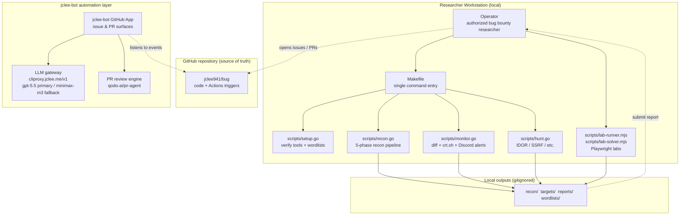

# Bug Bounty Automation Toolkit / 버그 바운티 자동화 툴킷

[](./LICENSE)
[](./scripts/)
[](./package.json)


[](#-contribution-guide--기여-가이드)
[](#-architecture--아키텍처)
[](#-jclee-bot-automation-surfaces--jclee-bot-자동화-표면)
[](https://cliproxy.jclee.me/v1)
[](https://github.com/qodo-ai/pr-agent)

> A Go-driven bug bounty automation toolkit that orchestrates the **recon → monitor → hunt → report** lifecycle, paired with a GitHub App–owned automation layer (`jclee-bot`) that keeps the repository itself healthy.
>
> Go 표준 라이브러리 기반의 버그 바운티 자동화 툴킷. **정찰(recon) → 모니터링(monitor) → 헌팅(hunt) → 리포트(report)** 전 과정을 단일 인터페이스로 오케스트레이션하며, 저장소 자체의 건강 상태를 유지하는 `jclee-bot` 자동화 레이어를 함께 제공합니다.

---

## Table of Contents / 목차

- [Overview / 개요](#overview--개요)
- [Features / 주요 기능](#features--주요-기능)
- [Architecture / 아키텍처](#architecture--아키텍처)
- [Repository Structure / 저장소 구조](#repository-structure--저장소-구조)
- [jclee-bot Automation Surfaces / jclee-bot 자동화 표면](#jclee-bot-automation-surfaces--jclee-bot-자동화-표면)
- [Go Tools / Go 도구](#go-tools--go-도구)
- [Node.js Tools / Node.js 도구](#nodejs-tools--nodejs-도구)
- [Quick Start / 빠른 시작](#quick-start--빠른-시작)
- [Local Development / 로컬 개발](#local-development--로컬-개발)
- [Commands Reference / 명령어 레퍼런스](#commands-reference--명령어-레퍼런스)
- [Configuration / 설정](#configuration--설정)
- [Outputs and Storage / 출력물 및 저장소](#outputs-and-storage--출력물-및-저장소)
- [Conventions / 컨벤션](#conventions--컨벤션)
- [Security and Authorization / 보안 및 권한](#security-and-authorization--보안-및-권한)
- [Contribution Guide / 기여 가이드](#contribution-guide--기여-가이드)
- [License and Maintainer / 라이선스 및 유지보수](#license-and-maintainer--라이선스-및-유지보수)

---

## Overview / 개요

This repository hosts two cooperating systems:

1. **The Bug Bounty Toolkit** — a set of standalone Go programs (stdlib only, no `go.mod`) and a pair of Node.js Playwright labs that together implement the full hunting workflow: tool verification, recon, change monitoring, vulnerability hunting, and report templating.
2. **The `jclee-bot` Automation Layer** — a GitHub App–driven automation surface that owns every mutating action on the repository itself: first-touch greetings, PR normalization, label routing, review, merge, issue lifecycle, and stale sweep.

The toolkit is invoked locally through a thin `Makefile` that maps human-friendly verbs (`make recon`, `make hunt`, `make monitor`) to the right script under `scripts/`. The automation layer is invoked by GitHub Actions triggers, but the **source of truth for behavior is `jclee-bot`**, which is hosted at [bot.jclee.me](https://bot.jclee.me) and routed through the LLM gateway at [cliproxy.jclee.me/v1](https://cliproxy.jclee.me/v1). Review is delegated to [qodo-ai/pr-agent](https://github.com/qodo-ai/pr-agent).

이 저장소는 두 개의 협력 시스템으로 구성됩니다.

1. **버그 바운티 툴킷** — Go 표준 라이브러리만 사용하는 독립 실행형 프로그램(`go.mod` 없음)과 Node.js Playwright 랩으로 구성된 정찰/모니터링/헌팅/리포트 워크플로우.
2. **`jclee-bot` 자동화 레이어** — GitHub App 기반 자동화 표면으로, 신규 기여자 환영, PR 정규화, 라벨 라우팅, 리뷰, 머지, 이슈 생명주기, 스테일 정리 등 저장소 자체의 변형 작업을 단독 소유합니다.

툴킷은 로컬에서 `Makefile`을 통해 호출되며, 자동화 레이어는 GitHub Actions 트리거로 호출되지만 **행위의 진실의 원천(source of truth)은 [bot.jclee.me](https://bot.jclee.me)에 호스팅된 `jclee-bot`** 이며 [cliproxy.jclee.me/v1](https://cliproxy.jclee.me/v1) LLM 게이트웨이를 통해 라우팅됩니다. PR 리뷰는 [qodo-ai/pr-agent](https://github.com/qodo-ai/pr-agent)에 위임됩니다.

---

## Features / 주요 기능

### Toolkit / 툴킷

- **Zero-dependency Go** — every script is a single `.go` file that uses only the standard library and is executed via `go run scripts/<name>.go`. No `go.mod`, no module proxy, no transitive supply chain.
- **Single command surface** — the `Makefile` is the only entry point a researcher needs to remember. `make help` enumerates every verb.
- **Five-phase recon pipeline** — subdomain enumeration → HTTP probing → endpoint discovery → template scan → manual triage hand-off, all wired through `recon.go`.
- **Diff-based monitoring** — `monitor.go` compares current state against the last baseline, alerts on new subdomains/endpoints via Discord webhook, and falls back to `crt.sh` when the local baseline is missing.
- **Targeted vulnerability hunting** — `hunt.go` walks a typed hunt matrix (`huntTypes`) covering at minimum IDOR and SSRF; each hunt type is a self-contained function with its own CLI flag.
- **Playwright labs** — `scripts/lab-runner.mjs` and `scripts/lab-solver.mjs` cover browser-driven scenarios the Go scripts cannot (auth flows, JS-heavy SPAs, screenshot diffing).
- **Gitignored data plane** — recon output, target baselines, submitted reports, and downloaded wordlists never touch git.

### `jclee-bot` automation / `jclee-bot` 자동화

- **App-owned mutating actions** — every write to issues, PRs, labels, branches, and merges is performed by `jclee-bot`. The Actions workflows are only the trigger surface.
- **LLM-driven routing** — triage, PR review, and merge decisions are produced through the [cliproxy.jclee.me/v1](https://cliproxy.jclee.me/v1) gateway with a primary `gpt-5.5` model and a `minimax-m3` fallback.
- **Specialized review pass** — security-sensitive PRs route through a dedicated review lane that augments [qodo-ai/pr-agent](https://github.com/qodo-ai/pr-agent) with policy-aware prompts.

---

## Architecture / 아키텍처



The local workstation (left) is the only place scan traffic is generated. Output never leaves the workstation except as a sanitized report submitted through the operator's normal disclosure channel. The GitHub repository holds code and the automation **triggers**; the automation **behavior** lives entirely in `jclee-bot` (right) and is invoked through [bot.jclee.me](https://bot.jclee.me).

워크스테이션(왼쪽)에서만 스캔 트래픽이 발생하며, 출력물은 운영자의 정상적인 신고 채널을 통해 정제된 리포트로 제출될 때를 제외하고 워크스테이션 밖으로 나가지 않습니다. GitHub 저장소는 코드와 자동화 **트리거**만 보유하며, 자동화 **행위** 전부는 오른쪽의 `jclee-bot`에 존재하고 [bot.jclee.me](https://bot.jclee.me)을 통해 호출됩니다.

---

## Repository Structure / 저장소 구조

The repository reflects the layout below. Anything not listed is generated at runtime and is excluded by `.gitignore`.

```
.
├── AGENTS.md                   # Knowledge base — read this first
├── Makefile                    # Single command surface (make help)
├── README.md                   # This file
├── package.json                # Playwright + lab runner metadata
├── package-lock.json
├── config/
│   └── targets.json            # Authorized targets + notification config
├── notes/
│   ├── phase2-checklist.md     # Learning checklist
│   ├── report-template.md      # Bug report skeleton
│   └── vulnerability-study.md  # Vulnerability class notes
└── scripts/
    ├── hunt.go                 # 4-phase targeted vuln hunting
    ├── lab-runner.mjs          # Node Playwright lab runner
    ├── lab-solver.mjs          # Node Playwright lab solver
    ├── monitor.go              # Diff monitoring + crt.sh + Discord
    ├── recon.go                # 5-phase recon pipeline
    └── setup.go                # Tool verification + wordlist download
```

The directories `recon/`, `targets/`, `reports/`, and `wordlists/` are produced by the toolkit at runtime and are gitignored. The string `_bot-scripts/` is **never** a real directory in this repository — it only ever appears as a transient CI checkout path inside ephemeral runners and must not be created locally.

---

## jclee-bot Automation Surfaces / jclee-bot 자동화 표면

All mutating automation on this repository is owned by the `jclee-bot` GitHub App. GitHub Actions files exist only to **trigger** the bot; they are not the source of truth. The bot itself is reachable at [bot.jclee.me](https://bot.jclee.me) and routed through the LLM gateway at [cliproxy.jclee.me/v1](https://cliproxy.jclee.me/v1).

The automation is organized into the following surfaces. Each surface describes **what behavior is guaranteed**, independent of which trigger fires it.

### Contributor greeting / 기여자 환영

When a first-time contributor opens an issue or PR, `jclee-bot` posts a localized welcome message that links to the contribution guide, the `make help` reference, and the rules of engagement. Returning contributors do not receive the greeting but are still tagged by the triage surface.

### Pull request normalization / PR 정규화

`jclee-bot` enforces PR title conventions (Conventional Commits), normalizes branch names, validates size budgets, and applies the size label. Submissions outside the policy are returned to the author with an inline comment rather than auto-fixed, so the contributor stays in the loop.

### Automated review / 자동 리뷰

Every PR receives a review pass. Standard PRs are reviewed by [qodo-ai/pr-agent](https://github.com/qodo-ai/pr-agent). PRs that touch the `scripts/` directory, the `Makefile`, or any file matching a security-sensitive path receive an additional review lane with policy-aware prompts. Both lanes are dispatched through the LLM gateway.

### Merge automation / 머지 자동화

`jclee-bot` is the only identity permitted to push the merge commit. Merging requires: green review, passing size budget, normalized title, and an allowed base branch. Auto-merge is restricted to a tagged subset (currently `dependencies` and `automated-bot/*`); everything else routes to the author for an explicit click.

### Issue triage and lifecycle / 이슈 분류 및 생명주기

**Issue automation: jclee-bot에의해자동화됨.** `jclee-bot` applies labels on open based on title patterns and body keywords, assigns the appropriate project column, and asks clarifying questions when the body is below a minimum-information threshold. On state changes (`closed`, `reopened`, `transferred`) the bot reconciles labels and posts a status comment in the contributor's locale when locale is detectable.

### Staleness sweep / 스테일 정리

After a configurable idle window, `jclee-bot` labels inactive issues and PRs as `stale`. A second idle window later, the bot closes them with a polite hand-off message linking back to this README so the contributor can re-open if the work is still relevant.

---

## Go Tools / Go 도구

All four Go scripts are standalone — no `go.mod`, no external imports beyond the standard library. Each is invoked by `Makefile` targets and may also be run directly with `go run scripts/<name>.go`.

### `scripts/setup.go` — first-time setup

Verifies that every external binary the pipeline depends on is on `PATH` (e.g. `subfinder`, `amass`, `httpx`, `nuclei`, `katana`), reports missing tools with remediation hints, and downloads the SecLists wordlists the pipeline expects into the gitignored `wordlists/` directory. Run once per workstation.

### `scripts/recon.go` — 5-phase recon pipeline

Walks the recon pipeline: subdomain enumeration, HTTP probing, endpoint discovery, nuclei template scan, and a hand-off summary. Flags include `-d` (target domain) and `-skip-nuclei` (used by the `recon-fast` Make target). Results land in a timestamped directory under `recon/<target>/<timestamp>/`.

### `scripts/monitor.go` — diff monitoring

Compares the current recon snapshot against the last baseline stored under `targets/<target>/`. New subdomains and new live endpoints are emitted as a diff and posted to the Discord webhook configured in `config/targets.json`. When the local baseline is missing, the script falls back to `crt.sh` to seed it before the first comparison. Flag: `-d`.

### `scripts/hunt.go` — targeted vulnerability hunting

Implements a typed hunt matrix (`huntTypes` slice) covering at minimum IDOR and SSRF. Each hunt type is a self-contained function with its own argument parser so that adding a new vulnerability class is a single-function change plus an entry in the slice. Flags: `-d` (target) and `-type` (filter to one class). The `hunt-idor` and `hunt-ssrf` Make targets are thin wrappers.

---

## Node.js Tools / Node.js 도구

The Node tools cover browser-driven scenarios that the Go pipeline cannot reach — authenticated flows, JavaScript-heavy SPAs, and visual regression checks.

### `scripts/lab-runner.mjs`

Drives a Playwright browser through a configurable lab scenario. Used for scenarios that require a real browser session (e.g. logging into a target application before exercising the recon pipeline against an authenticated surface). Reads scenario definitions from `config/targets.json` and writes a structured trace to `reports/`.

### `scripts/lab-solver.mjs`

A counterpart to `lab-runner.mjs` focused on solving — not just observing — challenge-style labs. Designed to be paired with the vulnerability class notes in `notes/vulnerability-study.md`.

Both scripts depend on `playwright` (declared in `package.json`). Install once with `npm install` before invoking them.

---

## Quick Start / 빠른 시작

### Prerequisites / 사전 요구 사항

- **Go** ≥ 1.21 (stdlib only — no `go.mod` is shipped)
- **Node.js** ≥ 18 (for Playwright labs)
- **`make`** (GNU Make)
- The external recon/hunt binaries that `setup.go` checks for. Run `make setup` first to see which ones are missing and how to install them.

### First run / 첫 실행

```bash
# 1. Clone the repository
git clone https://github.com/jclee941/.github
cd bug

# 2. Install Node dependencies (Playwright only)
npm install

# 3. Verify external tools and download wordlists
make setup

# 4. Configure your authorized target
$EDITOR config/targets.json

# 5. Run the full pipeline
make full-scan TARGET=example.com
```

If you only want to validate the environment before touching a real target, the smoke test is:

```bash
make help                 # enumerate every verb
make setup                # tool/wordlist verification
```

---

## Local Development / 로컬 개발

### Editing targets / 타깃 편집

All target and notification settings live in `config/targets.json`. The schema is documented in `AGENTS.md` under the `WHERE TO LOOK` table. Do **not** hardcode targets inside any script — the toolkit refuses to run without an explicit `TARGET=` on the Make command line.

### Editing scripts / 스크립트 편집

- **Recon pipeline** — `scripts/recon.go`. Each phase is a clearly delimited function; preserve the public flag surface (`-d`, `-skip-nuclei`).
- **Monitor logic** — `scripts/monitor.go`. The `crt.sh` fallback is intentional; do not remove it.
- **Hunt matrix** — `scripts/hunt.go`. Add a new vulnerability class by appending one function and one entry to the `huntTypes` slice.
- **Setup checks** — `scripts/setup.go`. Add new tool checks to the verification table; keep the failure messages actionable.

### Working with notes / 노트 작업

`notes/` is the human-facing study surface:

- `phase2-checklist.md` — what to learn next.
- `report-template.md` — copy this into your disclosure draft.
- `vulnerability-study.md` — class-by-class study notes. Reference, not gospel.

### Running without `make` / `make` 없이 실행

Every Make target maps 1:1 to a `go run` command, so you can iterate without the Make layer:

```bash
go run scripts/recon.go -d example.com
go run scripts/recon.go -d example.com -skip-nuclei
go run scripts/monitor.go -d example.com
go run scripts/hunt.go -d example.com -type idor
```

Node labs use the same direct-invocation pattern:

```bash
node scripts/lab-runner.mjs
node scripts/lab-solver.mjs
```

---

## Commands Reference / 명령어 레퍼런스

| Make target | Underlying command | Purpose |
|---|---|---|
| `make help` | `grep` over `Makefile` | Print every verb with its description. |
| `make setup` | `go run scripts/setup.go` | Verify external tools, download wordlists. |
| `make recon TARGET=x` | `go run scripts/recon.go -d x` | Full 5-phase recon pipeline. |
| `make recon-fast TARGET=x` | `go run scripts/recon.go -d x -skip-nuclei` | Recon without the nuclei template scan. |
| `make monitor TARGET=x` | `go run scripts/monitor.go -d x` | Diff current state vs. last baseline; alert on new assets. |
| `make hunt TARGET=x` | `go run scripts/hunt.go -d x` | Run every entry in the `huntTypes` matrix. |
| `make hunt-idor TARGET=x` | `go run scripts/hunt.go -d x -type idor` | IDOR-only sweep. |
| `make hunt-ssrf TARGET=x` | `go run scripts/hunt.go -d x -type ssrf` | SSRF-only sweep. |
| `make full-scan TARGET=x` | recon + hunt | Recon and hunt combined. |
| `make clean` | removes generated output | Wipe `recon/`, `targets/`, `reports/`, `wordlists/`. |

Every target requires an explicit `TARGET=` unless it is `setup`, `help`, or `clean`. Passing an empty target causes the Makefile to fail fast with usage instructions.

---

## Configuration / 설정

`config/targets.json` is the single source of truth for authorized targets and notification destinations. The minimum schema is:

```json
{
  "targets": [
    {
      "domain": "example.com",
      "program": "Example Bug Bounty Program",
      "scope": ["*.example.com", "example.com"],
      "out_of_scope": ["blog.example.com"],
      "rate_limit_rps": 100
    }
  ],
  "notifications": {
    "discord_webhook_url": "https://discord.com/api/webhooks/...",
    "language": "en"
  }
}
```

The Discord webhook is consumed by `scripts/monitor.go` to emit diff alerts. `language` is the locale used by `jclee-bot` for issue triage responses.

---

## Outputs and Storage / 출력물 및 저장소

| Path | Produced by | Gitignored | Notes |
|---|---|---|---|
| `recon/<target>/<timestamp>/` | `recon.go`, `monitor.go` | Yes | Per-run recon artifacts. |
| `targets/<target>/baseline.json` | `monitor.go` | Yes | The diff baseline; treat as sensitive. |
| `reports/` | `hunt.go`, `lab-runner.mjs` | Yes | Drafts and final disclosures. |
| `wordlists/` | `setup.go` | Yes | SecLists snapshots. |

All four directories are recreated locally; **never** commit their contents. If a researcher needs to share artifacts with a teammate, do it out-of-band (encrypted channel, signed archive) — never through the repository.

---

## Conventions / 컨벤션

These are enforced by review, not by tooling, because the toolkit intentionally avoids heavy linting on its Go files.

- **Standalone Go** — every `scripts/*.go` is runnable on its own. Do not introduce a `go.mod`; do not import external packages. Stay on `net/http`, `os/exec`, `encoding/json`, `path/filepath`, `time`, and friends.
- **External tools are CLI** — invoke binaries via `os/exec`. Do not shell out through `bash -c`.
- **Timestamped results** — every script writes to a fresh `<timestamp>/` directory under the appropriate gitignored root.
- **No hardcoded targets** — the `TARGET=` flag is mandatory. Scripts that bypass it should be deleted, not relaxed.
- **Conventional commits** — enforced by `jclee-bot` on PR titles. Use `feat:`, `fix:`, `docs:`, `refactor:`, `test:`, `chore:`.
- **English or bilingual** — comments and doc strings are English; user-facing strings may be bilingual when the audience is mixed.

---

## Security and Authorization / 보안 및 권한

> **Scope matters.** The toolkit is a force multiplier. Running it against an unauthorized target is illegal in most jurisdictions and a violation of every bug bounty program this repository has been built against.

- **Only run against targets listed in `config/targets.json`.** Any target outside that file is out of scope.
- **Honor the rate limit.** The default `rate_limit_rps` is 100. Lower it for targets you have not yet characterized.
- **Respect `out_of_scope` lists.** They are not suggestions.
- **Never commit scan artifacts.** The `.gitignore` rules exist for a reason; do not work around them.
- **Responsible disclosure only.** Use `notes/report-template.md` as the starting point and follow the program's published disclosure policy to the letter.
- **Secrets stay out of git.** The Discord webhook belongs in `config/targets.json` locally, not in a committed sample.

---

## Contribution Guide / 기여 가이드

Contributions that improve the toolkit, the automation surfaces, or the documentation are welcome. Contributions that add hardcoded targets, weaken the authorization checks, or weaken the gitignore rules will be closed without merge.

### Process / 절차

1. **Open an issue first** for non-trivial changes. `jclee-bot` will route it to the right label and column automatically.
2. **Fork and branch.** Branch names must follow `type/short-description` (e.g. `feat/add-sqli-hunt`). `jclee-bot` will normalize names that drift.
3. **Keep PRs small.** The size budget enforced by `jclee-bot` is generous but finite; split large changes into stacked PRs.
4. **Conventional commits on PR titles.** `feat: add sqli hunt` is fine; `Add stuff` is not.
5. **Wait for review.** Standard review is via [qodo-ai/pr-agent](https://github.com/qodo-ai/pr-agent); security-sensitive changes get the additional policy-aware lane.
6. **Do not push the merge commit yourself.** `jclee-bot` is the only identity authorized to merge. Auto-merge is granted only to the tagged subset mentioned above.

### Code style / 코드 스타일

- **Go** — `gofmt` clean; no third-party linters; functions stay under ~80 lines.
- **Node.js** — match the style already in `scripts/lab-*.mjs`; default ESLint config is acceptable if you add it later.
- **Markdown** — bilingual sections where it helps the audience; one sentence per line in commit bodies for clean diffs.

### Testing locally / 로컬 테스트

There is no formal test suite — the toolkit is validated by running it against an authorized target. Before opening a PR:

```bash
make help              # confirm the Makefile still parses
make setup             # confirm external tool checks still pass
make recon-fast TARGET=<your-authorized-test-target>
```

For Node labs:

```bash
npm install
node scripts/lab-runner.mjs --dry-run
node scripts/lab-solver.mjs --dry-run
```

### Reporting bugs in this repository / 저장소 버그 신고

Open an issue. For security-relevant bugs in the automation layer, mark the title with `security:` so the triage surface flags it for the policy-aware review lane.

---

## License and Maintainer / 라이선스 및 유지보수

- **License:** ISC. See `LICENSE` if present in your checkout.
- **Maintainer:** [`jclee941`](https://github.com/jclee941).
- **Automation owner:** `jclee-bot` (GitHub App, hosted at [bot.jclee.me](https://bot.jclee.me)).
- **LLM gateway:** [cliproxy.jclee.me/v1](https://cliproxy.jclee.me/v1) — primary `gpt-5.5`, fallback `minimax-m3`.
- **PR review engine:** [qodo-ai/pr-agent](https://github.com/qodo-ai/pr-agent).