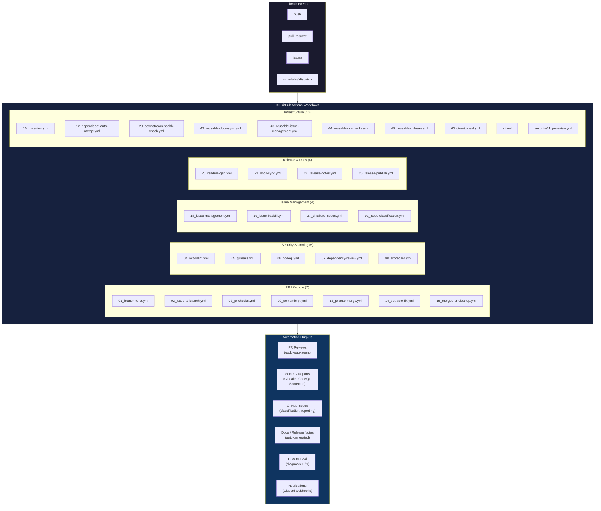
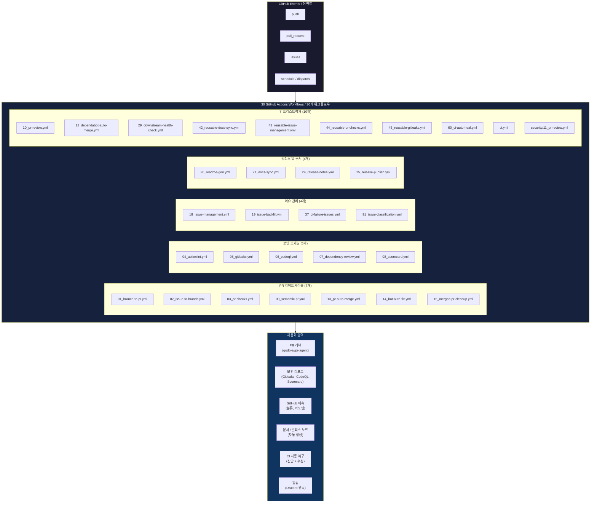

# Bug Bounty Automation Toolkit / 버그바운티 자동화 툴킷

[](https://nodejs.org/)
[](https://playwright.dev/)
[](https://go.dev/)
[](https://github.com/features/actions)
[](https://openssf.org/)
[](https://cliproxy.jclee.me)
[](LICENSE)

---

## Table of Contents / 목차

- [Overview / 개요](#overview--개요)
- [Features / 주요 기능](#features--주요-기능)
- [Architecture / 아키텍처](#architecture--아키텍처)
- [Automation Inventory / 자동화 목록](#automation-inventory--자동화-목록)
- [Quick Start / 빠른 시작](#quick-start--빠른-시작)
- [Local Development / 로컬 개발](#local-development--로컬-개발)
- [Commands Reference / 명령어 참조](#commands-reference--명령어-참조)
- [Repository Structure / 저장소 구조](#repository-structure--저장소-구조)
- [Contribution Guide / 기여 가이드](#contribution-guide--기여-가이드)

---

## Overview / 개요

### English

**Bug Bounty Automation Toolkit** is a local automation workspace for authorized web security research, vulnerability-study exercises, and lab-solving workflows. The repository combines:

- **Node.js ESM scripts** for PortSwigger/Web Security Academy style lab automation using Playwright
- **Go helper programs** for monitoring and vulnerability-hunting command orchestration
- **GitHub Actions workflows** (30 total) for PR checks, security scanning, PR review automation, issue management, release automation, documentation sync, and CI auto-healing
- **Bot-side helper scripts** for README generation, PR review enrichment, secret redaction, and repository analysis

### 한국어

**버그바운티 자동화 툴킷**은 합법적인 웹 보안 연구, 취약점 학습 연습, 랩求解 워크플로우를 위한 로컬 자동화 작업 공간입니다. 저장소는 다음을 결합합니다:

- **Node.js ESM 스크립트**: Playwright를 사용한 PortSwigger/Web Security Academy 스타일 랩 자동화
- **Go 헬퍼 프로그램**: 모니터링 및 취약점 탐색 명령 오케스트레이션
- **GitHub Actions 워크플로우** (30개): PR 검사, 보안 스캔, PR 리뷰 자동화, 이슈 관리, 릴리스 자동화, 문서 동기화, CI 자동 복구
- **README 생성, PR 리뷰 보강, 시크릿 삭제, 저장소 분석을 위한 봇 사이드 헬퍼 스크립트**

---

## Features / 주요 기능

### English

| Category | Description |
|----------|-------------|
| **Lab Automation** | Solve PortSwigger Web Security Academy labs automatically using Playwright-driven Node.js scripts |
| **Recon Pipeline** | 5-phase recon: subdomain enumeration → port scanning → screenshot → nuclei scan → reporting |
| **Diff Monitoring** | Detect NEW subdomains and endpoints via crt.sh polling with Discord notifications |
| **Vulnerability Hunting** | Targeted scanning for IDOR, SSRF, SQLi, XSS, LFI, RCE, and more |
| **PR Automation** | Auto-branch, semantic PR titles, auto-merge, bot auto-fix, merged-PR cleanup |
| **Security Scanning** | Gitleaks (secrets), CodeQL (code analysis), Dependency Review, Scorecard |
| **Issue Management** | Auto-create issues on CI failure, backfill issues, classify via ML |
| **Documentation Sync** | Auto-sync README, docs, and release notes across branches |
| **CI Auto-Heal** | Self-healing pipeline that automatically diagnoses and fixes failing CI runs |

### 한국어

| 카테고리 | 설명 |
|----------|-------------|
| **랩 자동화** | Playwright 기반 Node.js 스크립트로 PortSwigger Web Security Academy 랩 자동求解 |
| **Recon 파이프라인** | 5단계 리кон: 서브도메인 열거 → 포트 스캔 → 스크린샷 → nuclei 스캔 → 리포팅 |
| **차등 모니터링** | crt.sh 폴링 및 Discord 알림을 통해 NEW 서브도메인 및 엔드포인트 탐지 |
| **취약점 탐색** | IDOR, SSRF, SQLi, XSS, LFI, RCE 등 타겟 스캔 |
| **PR 자동화** | 자동 브랜치, 시맨틱 PR 타이틀, 자동 병합, 봇 자동 수정, 병합 PR 정리 |
| **보안 스캔** | Gitleaks (시크릿), CodeQL (코드 분석), Dependency Review, Scorecard |
| **이슈 관리** | CI 실패 시 자동 이슈 생성, 백필, ML 기반 분류 |
| **문서 동기화** | README, 문서, 릴리스 노트 자동 브랜치 동기화 |
| **CI 자동 복구** | 실패하는 CI 실행을 자동으로 진단 및 수정하는 자체 복구 파이프라인 |

---

## Architecture / 아키텍처

### English

The system consists of three layers:

1. **Local Automation Layer** — Go scripts (`recon.go`, `monitor.go`, `hunt.go`) orchestrated via Makefile
2. **CI/CD Layer** — 30 GitHub Actions workflows triggered by repository events
3. **Bot Helper Layer** — Python scripts in `_bot-scripts/` for repository-wide automation tasks



### 한국어

시스템은 세 개의 레이어로 구성됩니다:

1. **로컬 자동화 레이어** — Makefile로 오케스트레이션되는 Go 스크립트 (`recon.go`, `monitor.go`, `hunt.go`)
2. **CI/CD 레이어** — 저장소 이벤트에 의해 트리거되는 30개의 GitHub Actions 워크플로우
3. **봇 헬퍼 레이어** — 저장소 전체 자동화 작업을 위한 `_bot-scripts/`의 Python 스크립트



---

## Automation Inventory / 자동화 목록

### English

#### GitHub Actions Workflows (30 total)

| # | Workflow File | Trigger | Purpose |
|---|----------------|---------|---------|
| 1 | `01_branch-to-pr.yml` | push / manual | Create feature branch and open PR |
| 2 | `02_issue-to-branch.yml` | issues | Create branch from issue |
| 3 | `03_pr-checks.yml` | pull_request | Run all PR checks (lint, test, build) |
| 4 | `04_actionlint.yml` | push / pull_request | Lint all workflow files |
| 5 | `05_gitleaks.yml` | push / pull_request | Scan for leaked secrets |
| 6 | `06_codeql.yml` | push / pull_request | CodeQL static analysis |
| 7 | `07_dependency-review.yml` | pull_request | Dependency vulnerability review |
| 8 | `08_scorecard.yml` | push | OpenSSF Scorecard security assessment |
| 9 | `09_semantic-pr.yml` | pull_request | Enforce semantic PR title format |
| 10 | `10_pr-review.yml` | pull_request | Auto PR review via qodo-ai/pr-agent |
| 11 | `12_dependabot-auto-merge.yml` | schedule / dispatch | Auto-merge Dependabot PRs |
| 12 | `13_pr-auto-merge.yml` | pull_request | Auto-merge green PRs |
| 13 | `14_bot-auto-fix.yml` | pull_request | Bot-applied fixes auto-merge |
| 14 | `15_merged-pr-cleanup.yml` | push | Cleanup after PR merge |
| 15 | `18_issue-management.yml` | issues / dispatch | Issue lifecycle management |
| 16 | `19_issue-backfill.yml` | schedule / manual | Backfill missing issue metadata |
| 17 | `20_readme-gen.yml` | push / manual | Auto-generate README.md |
| 18 | `21_docs-sync.yml` | push | Sync documentation across branches |
| 19 | `24_release-notes.yml` | push | Auto-generate release notes |
| 20 | `25_release-publish.yml` | push | Publish release artifacts |
| 21 | `29_downstream-health-check.yml` | schedule / dispatch | Monitor downstream repo health |
| 22 | `37_ci-failure-issues.yml` | workflow_run | Auto-create issue on CI failure |
| 23 | `42_reusable-docs-sync.yml` | workflow_call | Reusable docs sync workflow |
| 24 | `43_reusable-issue-management.yml` | workflow_call | Reusable issue management workflow |
| 25 | `44_reusable-pr-checks.yml` | workflow_call | Reusable PR checks workflow |
| 26 | `45_reusable-gitleaks.yml` | workflow_call | Reusable gitleaks workflow |
| 27 | `60_ci-auto-heal.yml` | workflow_run | Self-healing CI pipeline |
| 28 | `91_issue-classification.yml` | issues / manual | ML-based issue classification |
| 29 | `ci.yml` | push / pull_request | Primary CI pipeline |
| 30 | `security/11_pr-review.yml` | pull_request | Security-focused PR review |

#### Bot-Side Helper Scripts (`_bot-scripts/`)

| Script | Purpose |
|--------|---------|
| `generate_readme.py` | README.md auto-generation |
| `pr_review_runner.py` | PR review orchestration |
| `repo_review.py` | Repository analysis |
| `redact_exposed_secrets.py` | Secret redaction for logs |
| `check_workflow_scripts.py` | Workflow validation |
| `check_hardcode_scan_patterns_test.py` | Scan pattern validation |
| `check_private_ips.py` | Private IP detection |
| `issue_classification_workflow_test.py` | Issue classifier testing |
| `readme_mermaid_test.py` | README Mermaid diagram testing |

#### Reusable Workflows (via workflow_call)

| Workflow | Description |
|----------|-------------|
| `42_reusable-docs-sync.yml` | Sync docs across repos |
| `43_reusable-issue-management.yml` | Manage issue lifecycle |
| `44_reusable-pr-checks.yml` | Shared PR validation |
| `45_reusable-gitleaks.yml` | Shared secrets scanning |

#### External Integrations

| Integration | Used By |
|-------------|---------|
| **qodo-ai/pr-agent** | `10_pr-review.yml`, `security/11_pr-review.yml` |
| **Discord Webhook** | `monitor.go` (diff alerts), `37_ci-failure-issues.yml` |
| **crt.sh API** | `monitor.go` (subdomain enumeration) |

### 한국어

#### GitHub Actions 워크플로우 (30개)

| # | 워크플로우 파일 | 트리거 | 목적 |
|---|----------------|---------|---------|
| 1 | `01_branch-to-pr.yml` | push / manual | 기능 브랜치 생성 및 PR 열기 |
| 2 | `02_issue-to-branch.yml` | issues | 이슈에서 브랜치 생성 |
| 3 | `03_pr-checks.yml` | pull_request | 모든 PR 검사 실행 (lint, test, build) |
| 4 | `04_actionlint.yml` | push / pull_request | 모든 워크플로우 파일 린트 |
| 5 | `05_gitleaks.yml` | push / pull_request | 유출된 시크릿 스캔 |
| 6 | `06_codeql.yml` | push / pull_request | CodeQL 정적 분석 |
| 7 | `07_dependency-review.yml` | pull_request | 의존성 취약점 검토 |
| 8 | `08_scorecard.yml` | push | OpenSSF Scorecard 보안 평가 |
| 9 | `09_semantic-pr.yml` | pull_request | 시맨틱 PR 제목 형식 강제 |
| 10 | `10_pr-review.yml` | pull_request | qodo-ai/pr-agent로 자동 PR 리뷰 |
| 11 | `12_dependabot-auto-merge.yml` | schedule / dispatch | Dependabot PR 자동 병합 |
| 12 | `13_pr-auto-merge.yml` | pull_request | 성공한 PR 자동 병합 |
| 13 | `14_bot-auto-fix.yml` | pull_request | 봇 적용 수정 자동 병합 |
| 14 | `15_merged-pr-cleanup.yml` | push | PR 병합 후 정리 |
| 15 | `18_issue-management.yml` | issues / dispatch | 이슈 라이프사이클 관리 |
| 16 | `19_issue-backfill.yml` | schedule / manual | 누락된 이슈 메타데이터 백필 |
| 17 | `20_readme-gen.yml` | push / manual | README.md 자동 생성 |
| 18 | `21_docs-sync.yml` | push | 브랜치 간 문서 동기화 |
| 19 | `24_release-notes.yml` | push | 자동 릴리스 노트 생성 |
| 20 | `25_release-publish.yml` | push | 릴리스 산출물 게시 |
| 21 | `29_downstream-health-check.yml` | schedule / dispatch | 다운스트림 저장소 상태 모니터링 |
| 22 | `37_ci-failure-issues.yml` | workflow_run | CI 실패 시 자동 이슈 생성 |
| 23 | `42_reusable-docs-sync.yml` | workflow_call | 재사용 문서 동기화 워크플로우 |
| 24 | `43_reusable-issue-management.yml` | workflow_call | 재사용 이슈 관리 워크플로우 |
| 25 | `44_reusable-pr-checks.yml` | workflow_call | 재사용 PR 검사 워크플로우 |
| 26 | `45_reusable-gitleaks.yml` | workflow_call | 재사용 gitleaks 워크플로우 |
| 27 | `60_ci-auto-heal.yml` | workflow_run | 자체 복구 CI 파이프라인 |
| 28 | `91_issue-classification.yml` | issues / manual | ML 기반 이슈 분류 |
| 29 | `ci.yml` | push / pull_request | 기본 CI 파이프라인 |
| 30 | `security/11_pr-review.yml` | pull_request | 보안 중심 PR 리뷰 |

#### 봇 사이드 헬퍼 스크립트 (`_bot-scripts/`)

| 스크립트 | 목적 |
|--------|---------|
| `generate_readme.py` | README.md 자동 생성 |
| `pr_review_runner.py` | PR 리뷰 오케스트레이션 |
| `repo_review.py` | 저장소 분석 |
| `redact_exposed_secrets.py` | 로그용 시크릿 삭제 |
| `check_workflow_scripts.py` | 워크플로우 검증 |
| `check_hardcode_scan_patterns_test.py` | 스캔 패턴 검증 |
| `check_private_ips.py` | 개인 IP 탐지 |
| `issue_classification_workflow_test.py` | 이슈 분류기 테스트 |
| `readme_mermaid_test.py` | README Mermaid 다이어그램 테스트 |

#### 재사용 워크플로우 (workflow_call経由)

| 워크플로우 | 설명 |
|----------|-------------|
| `42_reusable-docs-sync.yml` | 브랜치 간 문서 동기화 |
| `43_reusable-issue-management.yml` | 이슈 라이프사이클 관리 |
| `44_reusable-pr-checks.yml` | 공유 PR 검증 |
| `45_reusable-gitleaks.yml` | 공유 시크릿 스캐닝 |

#### 외부 통합

| 통합 | 사용처 |
|-------------|---------|
| **qodo-ai/pr-agent** | `10_pr-review.yml`, `security/11_pr-review.yml` |
| **Discord Webhook** | `monitor.go` (차등 알림), `37_ci-failure-issues.yml` |
| **crt.sh API** | `monitor.go` (서브도메인 열거) |

---

## Quick Start / 빠른 시작

### English

#### Prerequisites

- Go 1.21+
- Node.js 18+ (for lab automation)
- Python 3.8+ (for bot scripts)
- Required tools: `subfinder`, `nuclei`, `amass`, `naabu`, `httpx`, `排水`

#### Setup

```bash
# Clone the repository
git clone https://github.com/jclee941/.github
cd bug

# First-time setup (verify tools + download wordlists)
make setup

# Run full recon on a target
make recon TARGET=example.com

# Monitor for changes (detect NEW findings)
make monitor TARGET=example.com

# Hunt vulnerabilities
make hunt TARGET=example.com

# Full scan: recon + hunt
make full-scan TARGET=example.com
```

### 한국어

#### 전제 조건

- Go 1.21+
- Node.js 18+ (랩 자동화용)
- Python 3.8+ (봇 스크립트용)
- 필수 도구: `subfinder`, `nuclei`, `amass`, `naabu`, `httpx`, `排水`

#### 설정

```bash
# 저장소 클론
git clone https://github.com/jclee941/.github
cd bug

# 최초 설정 (도구 검증 + 워드리스트 다운로드)
make setup

# 타겟에 대한 전체 리콘
make recon TARGET=example.com

# 변경 사항 모니터링 (NEW 발견 탐지)
make monitor TARGET=example.com

# 취약점 탐색
make hunt TARGET=example.com

# 전체 스캔: 리콘 + 헌트
make full-scan TARGET=example.com
```

---

## Local Development / 로컬 개발

### English

#### Running Go Scripts Directly

All Go scripts are standalone and use only the Go standard library. Run them without a `go.mod`:

```bash
go run scripts/recon.go scripts/lib.go -d target.com
go run scripts/monitor.go scripts/lib.go -d target.com
go run scripts/hunt.go scripts/lib.go -d target.com
```

#### Running Node.js Lab Scripts

```bash
# Solve a specific lab
node scripts/lab-runner.mjs --lab-id=lab123

# Run a batch of labs
node scripts/lab-batch-solver.mjs --batch=batch-a

# OOB testing batch
node scripts/lab-batch-oob.mjs
```

#### Bot Scripts (Python)

```bash
# Generate README
python _bot-scripts/generate_readme.py

# Redact secrets from logs
python _bot-scripts/redact_exposed_secrets.py --input=output.log

# Check for hardcoded patterns
python _bot-scripts/check_workflow_scripts.py
```

### 한국어

#### Go 스크립트 직접 실행

모든 Go 스크립트는 독립형이며 Go 표준 라이브러리만 사용합니다. `go.mod` 없이 실행:

```bash
go run scripts/recon.go scripts/lib.go -d target.com
go run scripts/monitor.go scripts/lib.go -d target.com
go run scripts/hunt.go scripts/lib.go -d target.com
```

#### Node.js 랩 스크립트 실행

```bash
# 특정 랩求解
node scripts/lab-runner.mjs --lab-id=lab123

# 랩 배치 실행
node scripts/lab-batch-solver.mjs --batch=batch-a

# OOB 테스팅 배치
node scripts/lab-batch-oob.mjs
```

#### 봇 스크립트 (Python)

```bash
# README 생성
python _bot-scripts/generate_readme.py

# 로그에서 시크릿 삭제
python _bot-scripts/redact_exposed_secrets.py --input=output.log

# 하드코딩된 패턴 확인
python _bot-scripts/check_workflow_scripts.py
```

---

## Commands Reference / 명령어 참조

### English

Run `make help` to see all available commands:

| Command | Description |
|---------|-------------|
| `make help` | Show all available commands |
| `make setup` | First-time setup — verify tools, download wordlists |
| `make recon TARGET=x.com` | Full 5-phase recon pipeline |
| `make recon-fast TARGET=x.com` | Quick recon — skip nuclei scan |
| `make monitor TARGET=x.com` | Diff monitoring — detect new subdomains/endpoints |
| `make hunt TARGET=x.com` | Targeted vulnerability hunting (all categories) |
| `make hunt-idor TARGET=x.com` | Hunt IDOR vulnerabilities only |
| `make hunt-ssrf TARGET=x.com` | Hunt SSRF vulnerabilities only |
| `make full-scan TARGET=x.com` | Everything: recon + hunt combined |
| `make scan-target TARGET=x.com` | Scan specific target with custom config |
| `make clean` | Remove scan results (recon/, targets/, reports/) |

### 한국어

`make help`를 실행하면 사용 가능한 모든 명령이 표시됩니다:

| 명령어 | 설명 |
|---------|-------------|
| `make help` | 사용 가능한 모든 명령 표시 |
| `make setup` | 최초 설정 — 도구 검증, 워드리스트 다운로드 |
| `make recon TARGET=x.com` | 전체 5단계 리콘 파이프라인 |
| `make recon-fast TARGET=x.com` | 빠른 리콘 — nuclei 스캔 건너뛰기 |
| `make monitor TARGET=x.com` | 차등 모니터링 — 새 서브도메인/엔드포인트 탐지 |
| `make hunt TARGET=x.com` | 타겟 취약점 탐색 (모든 카테고리) |
| `make hunt-idor TARGET=x.com` | IDOR 취약점만 탐색 |
| `make hunt-ssrf TARGET=x.com` | SSRF 취약점만 탐색 |
| `make full-scan TARGET=x.com` | 전체: 리콘 + 헌트Combined |
| `make scan-target TARGET=x.com` | 사용자 정의 설정으로 특정 타겟 스캔 |
| `make clean` | 스캔 결과 삭제 (recon/, targets/, reports/) |

---

## Repository Structure / 저장소 구조

### English

```
bug/
├── AGENTS.md                  # Knowledge base / 에이전트 설정
├── CONTRIBUTING.md            # Contribution guidelines / 기여 가이드
├── LICENSE                    # ISC License
├── Makefile                   # Orchestration (make help for commands)
├── README.md                  # This file
├── interactsh_payload.txt     # OOB testing payload
├── output-lab08.png           # Lab output screenshot
├── package.json               # Node.js project manifest
├── package-lock.json          # Node.js lock file
│
├── .github/
│   └── workflows/             # 30 GitHub Actions workflows
│       ├── 01_branch-to-pr.yml
│       ├── 02_issue-to-branch.yml
│       ├── 03_pr-checks.yml
│       ├── 04_actionlint.yml
│       ├── 05_gitleaks.yml
│       ├── 06_codeql.yml
│       ├── 07_dependency-review.yml
│       ├── 08_scorecard.yml
│       ├── 09_semantic-pr.yml
│       ├── 10_pr-review.yml
│       ├── 12_dependabot-auto-merge.yml
│       ├── 13_pr-auto-merge.yml
│       ├── 14_bot-auto-fix.yml
│       ├── 15_merged-pr-cleanup.yml
│       ├── 18_issue-management.yml
│       ├── 19_issue-backfill.yml
│       ├── 20_readme-gen.yml
│       ├── 21_docs-sync.yml
│       ├── 24_release-notes.yml
│       ├── 25_release-publish.yml
│       ├── 29_downstream-health-check.yml
│       ├── 37_ci-failure-issues.yml
│       ├── 42_reusable-docs-sync.yml
│       ├── 43_reusable-issue-management.yml
│       ├── 44_reusable-pr-checks.yml
│       ├── 45_reusable-gitleaks.yml
│       ├── 60_ci-auto-heal.yml
│       ├── 91_issue-classification.yml
│       ├── ci.yml
│       └── security/
│           └── 11_pr-review.yml
│
├── _bot-scripts/              # Bot-side helper scripts (CI checkout path)
│   ├── AGENTS.md
│   ├── CODE_OF_CONDUCT.md
│   ├── CONTRIBUTING.md
│   ├── Dockerfile.github_action
│   ├── Dockerfile.github_app
│   ├── LICENSE
│   ├── Makefile
│   ├── NOTICE
│   ├── README.md
│   ├── SECURITY.md
│   ├── docker-compose.github_app.yml
│   ├── docker-compose.github_app.yml.lxc
│   ├── filebeat.yml
│   ├── pyproject.toml
│   ├── requirements-dev.txt
│   ├── requirements.txt
│   ├── setup.py
│   └── scripts/
│       ├── AGENTS.md
│       ├── check_hardcode_scan_patterns_test.py
│       ├── check_private_ips.py
│       ├── check_private_ips_test.py
│       ├── check_workflow_scripts.py
│       ├── check_workflow_scripts_test.py
│       ├── generate_readme.py
│       ├── go.mod
│       ├── issue_classification_workflow_test.py
│       ├── issue_classifier_js_test.py
│       ├── pr_review_runner.py
│       ├── pr_review_runner_test.py
│       ├── readme_mermaid_test.py
│       ├── redact_exposed_secrets.py
│       └── repo_review.py
│
├── config/
│   └── targets.json          # Target and notification configuration
│
├── notes/
│   ├── phase2-checklist.md   # Learning checklist
│   ├── report-template.md     # Bug report template
│   └── vulnerability-study.md # Vulnerability study notes
│
└── scripts/
    ├── auth-solver.cjs
    ├── batch-a.cjs
    ├── batch-b-fixed.cjs
    ├── batch-b.cjs
    ├── batch-c.cjs
    ├── batch-collab.cjs
    ├── batch-d.cjs
    ├── batch-remaining.cjs
    ├── batch1-solver.cjs
    ├── check-form.cjs
    ├── check-progress.cjs
    ├── comprehensive-batch.cjs
    ├── comprehensive-solver.cjs
    ├── custom-batch2.cjs
    ├── custom-easy-solver.cjs
    ├── diagnose-access.cjs
    ├── diagnose-access2.cjs
    ├── diagnose-deser.cjs
    ├── diagnose-essential.cjs
    ├── diagnose-essential2.cjs
    ├── diagnose-essential3.cjs
    ├── diagnose-nav.cjs
    ├── diagnose-topics.cjs
    ├── essential-skills-solver.cjs
    ├── explore-essential.cjs
    ├── explore-essential2.cjs
    ├── explore-essential3.cjs
    ├── explore-race.cjs
    ├── extended-retry.cjs
    ├── extract-labs.cjs
    ├── final-attempt.cjs
    ├── focused-batch.cjs
    ├── get-lab-urls.cjs
    ├── get-lab-urls.sh
    ├── get-lab-urls2.cjs
    ├── hunt.go
    ├── interactsh-wrapper.sh
    ├── lab-batch-fast.mjs
    ├── lab-batch-oob.mjs
    ├── lab-batch-slow.mjs
    ├── lab-batch-smuggling.mjs
    ├── lab-batch-solver.mjs
    ├── lab-gap-helpers.mjs
    ├── lab-gap-solver.mjs
    ├── lab-runner-aggressive.mjs
    ├── lab-runner.mjs
    ├── lab-solver.mjs
    └── lib.go
```

### 한국어

```
bug/
├── AGENTS.md                  # 지식 베이스 / 에이전트 설정
├── CONTRIBUTING.md            # 기여 가이드
├── LICENSE                    # ISC 라이선스
├── Makefile                   # 오케스트레이션 (make help로 명령어 확인)
├── README.md                  # 이 파일
├── interactsh_payload.txt     # OOB 테스팅 페이로드
├── output-lab08.png           # 랩 출력 스크린샷
├── package.json               # Node.js 프로젝트 매니페스트
├── package-lock.json          # Node.js 잠금 파일
│
├── .github/
│   └── workflows/             # 30개의 GitHub Actions 워크플로우
│       ├── 01_branch-to-pr.yml
│       ├── 02_issue-to-branch.yml
│       ├── 03_pr-checks.yml
│       ├── 04_actionlint.yml
│       ├── 05_gitleaks.yml
│       ├── 06_codeql.yml
│       ├── 07_dependency-review.yml
│       ├── 08_scorecard.yml
│       ├── 09_semantic-pr.yml
│       ├── 10_pr-review.yml
│       ├── 12_dependabot-auto-merge.yml
│       ├── 13_pr-auto-merge.yml
│       ├── 14_bot-auto-fix.yml
│       ├── 15_merged-pr-cleanup.yml
│       ├── 18_issue-management.yml
│       ├── 19_issue-backfill.yml
│       ├── 20_readme-gen.yml
│       ├── 21_docs-sync.yml
│       ├── 24_release-notes.yml
│       ├── 25_release-publish.yml
│       ├── 29_downstream-health-check.yml
│       ├── 37_ci-failure-issues.yml
│       ├── 42_reusable-docs-sync.yml
│       ├── 43_reusable-issue-management.yml
│       ├── 44_reusable-pr-checks.yml
│       ├── 45_reusable-gitleaks.yml
│       ├── 60_ci-auto-heal.yml
│       ├── 91_issue-classification.yml
│       ├── ci.yml
│       └── security/
│           └── 11_pr-review.yml
│
├── _bot-scripts/              # 봇 사이드 헬퍼 스크립트 (CI 체크아웃 경로)
│   ├── AGENTS.md
│   ├── CODE_OF_CONDUCT.md
│   ├── CONTRIBUTING.md
│   ├── Dockerfile.github_action
│   ├── Dockerfile.github_app
│   ├── LICENSE
│   ├── Makefile
│   ├── NOTICE
│   ├── README.md
│   ├── SECURITY.md
│   ├── docker-compose.github_app.yml
│   ├── docker-compose.github_app.yml.lxc
│   ├── filebeat.yml
│   ├── pyproject.toml
│   ├── requirements-dev.txt
│   ├── requirements.txt
│   ├── setup.py
│   └── scripts/
│       ├── AGENTS.md
│       ├── check_hardcode_scan_patterns_test.py
│       ├── check_private_ips.py
│       ├── check_private_ips_test.py
│       ├── check_workflow_scripts.py
│       ├── check_workflow_scripts_test.py
│       ├── generate_readme.py
│       ├── go.mod
│       ├── issue_classification_workflow_test.py
│       ├── issue_classifier_js_test.py
│       ├── pr_review_runner.py
│       ├── pr_review_runner_test.py
│       ├── readme_mermaid_test.py
│       ├── redact_exposed_secrets.py
│       └── repo_review.py
│
├── config/
│   └── targets.json          # 타겟 및 알림 설정
│
├── notes/
│   ├── phase2-checklist.md   # 학습 체크리스트
│   ├── report-template.md     # 버그 리포트 템플릿
│   └── vulnerability-study.md # 취약점 학습 노트
│
└── scripts/
    ├── auth-solver.cjs
    ├── batch-a.cjs
    ├── batch-b-fixed.cjs
    ├── batch-b.cjs
    ├── batch-c.cjs
    ├── batch-collab.cjs
    ├── batch-d.cjs
    ├── batch-remaining.cjs
    ├── batch1-solver.cjs
    ├── check-form.cjs
    ├── check-progress.cjs
    ├── comprehensive-batch.cjs
    ├── comprehensive-solver.cjs
    ├── custom-batch2.cjs
    ├── custom-easy-solver.cjs
    ├── diagnose-access.cjs
    ├── diagnose-access2.cjs
    ├── diagnose-deser.cjs
    ├── diagnose-essential.cjs
    ├── diagnose-essential2.cjs
    ├── diagnose-essential3.cjs
    ├── diagnose-nav.cjs
    ├── diagnose-topics.cjs
    ├── essential-skills-solver.cjs
    ├── explore-essential.cjs
    ├── explore-essential2.cjs
    ├── explore-essential3.cjs
    ├── explore-race.cjs
    ├── extended-retry.cjs
    ├── extract-labs.cjs
    ├── final-attempt.cjs
    ├── focused-batch.cjs
    ├── get-lab-urls.cjs
    ├── get-lab-urls.sh
    ├── get-lab-urls2.cjs
    ├── hunt.go
    ├── interactsh-wrapper.sh
    ├── lab-batch-fast.mjs
    ├── lab-batch-oob.mjs
    ├── lab-batch-slow.mjs
    ├── lab-batch-smuggling.mjs
    ├── lab-batch-solver.mjs
    ├── lab-gap-helpers.mjs
    ├── lab-gap-solver.mjs
    ├── lab-runner-aggressive.mjs
    ├── lab-runner.mjs
    ├── lab-solver.mjs
    └── lib.go
```

---

## Contribution Guide / 기여 가이드

### English

Contributions are welcome. Please read `CONTRIBUTING.md` before submitting PRs.

#### Adding a New Workflow

1. Follow the naming convention: `{priority}_{category-action}.yml` (e.g., `50_new-workflow.yml`)
2. Add required triggers and permissions
3. Include `actionlint` validation in `04_actionlint.yml` if applicable
4. Update this README's automation inventory section

#### Adding New Hunt Types

Edit `scripts/hunt.go` and add your vulnerability type to the `huntTypes` slice:

```go
var huntTypes = []string{"idor", "ssrf", "sqli", "xss", "lfi", "rce", "new-type"}
```

#### Bot Script Development

- All Python bot scripts live in `_bot-scripts/scripts/`
- Run tests before committing: `python -m pytest _bot-scripts/scripts/`
- Follow the existing pattern for `generate_readme.py` and `pr_review_runner.py`

### 한국어

기여를 환영합니다. PR 제출 전에 `CONTRIBUTING.md`를 읽어주십시오.

#### 새 워크플로우 추가

1.命名 규칙 따르기: `{priority}_{category-action}.yml` (예: `50_new-workflow.yml`)
2. 필수 트리거 및 권한 추가
3. 해당되는 경우 `04_actionlint.yml`에 `actionlint` 검증 포함
4. 이 README의 자동화 목록 섹션 업데이트

#### 새 헌트 유형 추가

`scripts/hunt.go`를 편집하고 `huntTypes` 슬라이스에 취약점 유형 추가:

```go
var huntTypes = []string{"idor", "ssrf", "sqli", "xss", "lfi", "rce", "new-type"}
```

#### 봇 스크립트 개발

- 모든 Python 봇 스크립트는 `_bot-scripts/scripts/`에 있음
- 커밋 전에 테스트 실행: `python -m pytest _bot-scripts/scripts/`
- `generate_readme.py` 및 `pr_review_runner.py`의 기존 패턴 따르기

---

## License / 라이선스

This project is licensed under the **ISC License** — see `LICENSE` for details.

---

*Generated with [minimax-m2.7](https://cliproxy.jclee.me) via CLIProxyAPI · Using [qodo-ai/pr-agent](https://qodo-ai/pr-agent) for PR reviews*
