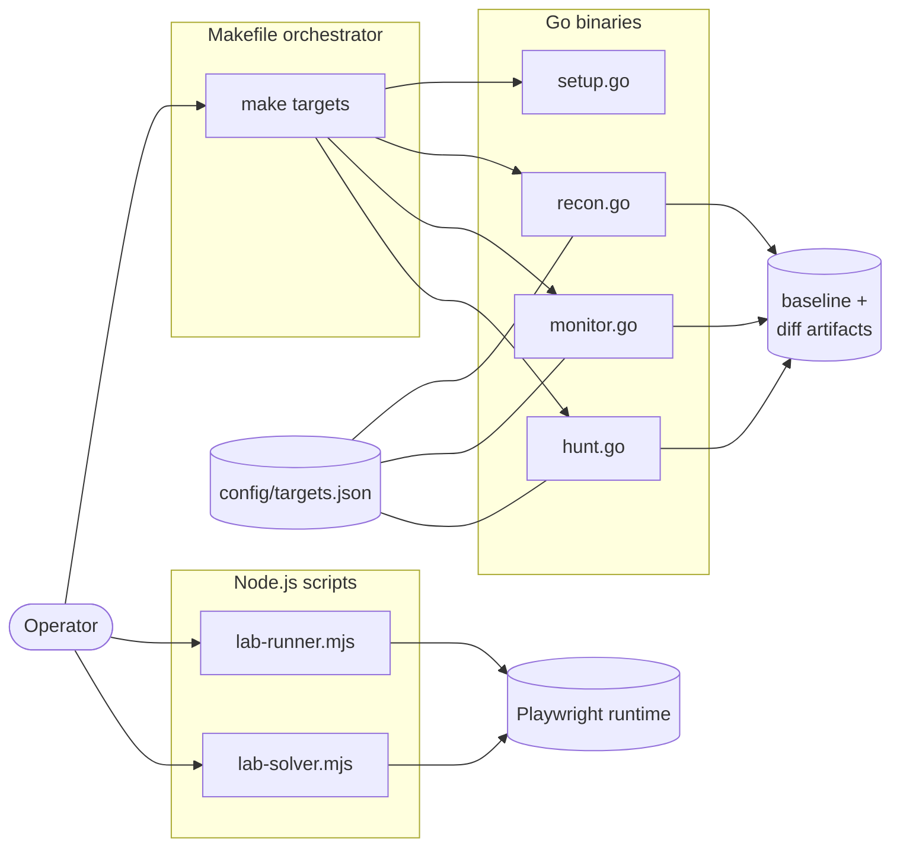

# Bug Bounty Automation Toolkit / 버그 바운티 자동화 툴킷

> Reconnaissance, monitoring, and targeted vulnerability hunting for
> responsible security research and bug bounty programs.
>
> 책임 있는 보안 연구 및 버그 바운티 프로그램을 위한 정찰, 모니터링,
> 표적형 취약점 헌팅 도구 모음입니다.

---

## Overview / 개요

This toolkit orchestrates a complete bug-bounty workflow — from initial
asset discovery and continuous monitoring to targeted vulnerability
scanning (IDOR, SSRF, ...). Performance-critical stages are implemented
as Go binaries, while browser-driven lab exercises run on Node.js +
Playwright. A single `Makefile` provides consistent entry points across
operators.

이 툴킷은 초기 자산 발견과 지속적 모니터링부터 IDOR·SSRF 등 표적형
취약점 스캔에 이르는 버그 바운티 워크플로우를 오케스트레이션합니다.
성능이 중요한 단계는 Go 바이너리로, 브라우저 기반 실습은 Node.js +
Playwright로 구성되어 있으며, 단일 `Makefile`을 통해 일관된 진입점을
제공합니다.

**Intended audience / 대상 사용자**

- Bug bounty hunters running structured engagements
- Application security engineers tracking asset changes over time
- CTF / lab participants practicing exploitation in safe environments

**Responsible use / 책임 있는 사용**

Run this toolkit only against systems you are explicitly authorized to
test — your own assets, scoped bug bounty programs, or dedicated lab
platforms such as PortSwigger Web Security Academy, HackTheBox, or
TryHackMe. Unauthorized scanning may violate computer-misuse laws in
your jurisdiction.

본 툴킷은 명시적으로 테스트 권한을 부여받은 시스템(자체 자산, 스코프가
정의된 버그 바운티 프로그램, PortSwigger Web Security Academy ·
HackTheBox · TryHackMe 등 전용 실습 플랫폼)에 대해서만 실행하시기
바랍니다. 권한 없는 스캔은 관련 컴퓨터 오용 법령을 위반할 수 있습니다.

---

## Features / 주요 기능

| Area / 영역 | Capability / 기능 |
|---|---|
| Setup / 설치 | Tool verification and wordlist bootstrap |
| Recon / 정찰 | Subdomain enumeration, endpoint discovery, nuclei templates |
| Recon-fast | Lightweight recon that skips the nuclei stage |
| Monitor / 모니터 | Differential scanning — surface new subdomains & endpoints |
| Hunt / 헌팅 | Targeted vulnerability hunting (generic mode) |
| Hunt — IDOR | Insecure Direct Object Reference checks |
| Hunt — SSRF | Server-Side Request Forgery checks |
| Lab runner / 실습 실행기 | Playwright-driven browser exercises |
| Lab solver / 실습 솔버 | Automated lab walkthroughs |

All operator-facing entry points are exposed through a single
`Makefile` so the workflow remains consistent regardless of who runs
it.

---

## Architecture / 아키텍처



The Go binaries share `config/targets.json` and write structured
baseline / diff artifacts to a local results directory. The Node.js
lab scripts are independent of the recon pipeline and run on demand.

---

## Repository Structure / 저장소 구조

```
.
├── AGENTS.md                # Contributor / agent guidelines
├── Makefile                 # Single orchestration entry point
├── README.md                # This document
├── package.json             # Node.js metadata + Playwright dependency
├── package-lock.json        # Locked dependency graph
├── config/
│   └── targets.json         # Target definitions shared by Go binaries
├── notes/
│   ├── phase2-checklist.md  # Engagement phase checklist
│   ├── report-template.md   # Vulnerability report template
│   └── vulnerability-study.md
└── scripts/
    ├── setup.go             # Tool verification + wordlist bootstrap
    ├── recon.go             # Recon pipeline (subdomains, endpoints, nuclei)
    ├── monitor.go           # Differential scanning vs. baseline
    ├── hunt.go              # Targeted vulnerability hunting
    ├── lab-runner.mjs       # Playwright lab execution
    └── lab-solver.mjs       # Playwright lab walkthrough automation
```

---

## Quick Start / 빠른 시작

### Prerequisites / 사전 요구사항

| Tool / 도구 | Purpose / 용도 | Notes / 비고 |
|---|---|---|
| Go (≥ 1.21) | Run recon / hunt / monitor binaries | `go run scripts/*.go` style |
| Node.js (≥ 18) | Run lab scripts | Required by Playwright |
| Make | Orchestrate the workflow | Standard on Linux / macOS |
| `nuclei`, `subfinder`, `httpx`, `naabu`, ... | Underlying scanners | Downloaded by `make setup` |

### First-time setup / 최초 설치

```bash
make setup
```

Verifies required external tools and bootstraps any wordlists used by
the recon pipeline.

### Recon on a target / 대상 정찰

```bash
make recon TARGET=example.com
```

Skip the nuclei stage for a quicker pass:

```bash
make recon-fast TARGET=example.com
```

### Continuous monitoring / 지속적 모니터링

```bash
make monitor TARGET=example.com
```

The monitor binary diffs the current run against the stored baseline
and surfaces new subdomains or endpoints.

### Targeted vulnerability hunting / 표적형 취약점 헌팅

```bash
make hunt      TARGET=example.com
make hunt-idor TARGET=example.com
make hunt-ssrf TARGET=example.com
```

### Full engagement / 전체 스캔

```bash
make full-scan TARGET=example.com
```

### Browser-driven labs / 브라우저 기반 실습

```bash
npm install
npx playwright install
node scripts/lab-runner.mjs
node scripts/lab-solver.mjs
```

---

## Configuration / 설정

`config/targets.json` is the single shared configuration consumed by
the Go binaries. Edit it to declare your authorized targets, scope
limits, and any per-target tuning (timeouts, nuclei severity floor,
etc.) before running `recon`, `monitor`, or `hunt`.

`config/targets.json`은 Go 바이너리가 공통으로 참조하는 설정 파일입니다.
권한을 가진 대상, 스코프 제한, 대상별 튜닝(타임아웃, nuclei severity
하한 등)을 사전에 정의한 뒤 recon · monitor · hunt를 실행하세요.

The Node.js lab scripts do not depend on `config/targets.json` and
read their own inputs at runtime.

---

## Commands Reference / 명령어 레퍼런스

| Command / 명령어 | Description / 설명 |
|---|---|
| `make help` | Print available targets with descriptions |
| `make setup` | Verify tools and bootstrap wordlists |
| `make recon TARGET=<domain>` | Run the full recon pipeline |
| `make recon-fast TARGET=<domain>` | Recon without the nuclei stage |
| `make monitor TARGET=<domain>` | Diff current findings vs. baseline |
| `make hunt TARGET=<domain>` | Targeted vulnerability hunting (generic) |
| `make hunt-idor TARGET=<domain>` | Hunt IDOR vulnerabilities only |
| `make hunt-ssrf TARGET=<domain>` | Hunt SSRF vulnerabilities only |
| `make full-scan TARGET=<domain>` | Recon + hunt in one pass |

The Go binaries accept a common `-d <domain>` flag and may expose
additional switches — for example `recon.go -skip-nuclei` and
`hunt.go -type idor`. Run any binary directly to see its full flag
set:

```bash
go run scripts/hunt.go -h
go run scripts/recon.go -h
go run scripts/monitor.go -h
```

---

## Local Development / 로컬 개발

```bash
# Clone
git clone https://github.com/jclee941/.github
cd bug

# Install Node.js dependencies
npm install
npx playwright install

# Run a single Go script during development
go run scripts/setup.go
go run scripts/recon.go  -d example.com
go run scripts/hunt.go   -d example.com -type idor
go run scripts/monitor.go -d example.com

# Edit shared configuration
$EDITOR config/targets.json
```

Iterate by re-running the relevant `make` target after edits; baseline
and diff artifacts are regenerated in place. The Go sources are
self-contained — there is no separate `go.mod` because the scripts
use only the standard library.

---

## Testing / 테스트

This repository does not ship a formal automated test suite. The
`npm test` script is a placeholder that exits non-zero until real
tests are added. Validate changes by running the relevant `make`
target against an authorized lab target and reviewing the generated
artifacts.

본 저장소는 정식 자동화 테스트 스위트를 포함하지 않습니다.
`npm test`는 실제 테스트가 추가될 때까지 비정상 종료하는
플레이스홀더입니다. 변경 사항은 권한이 부여된 실습 대상에 대해 관련
`make` 타겟을 실행하고 생성된 결과물을 검토하여 검증하시기 바랍니다.

---

## Documentation / 문서

The `notes/` directory holds engagement-time documentation:

- `notes/phase2-checklist.md` — engagement phase checklist
- `notes/report-template.md` — vulnerability report template
- `notes/vulnerability-study.md` — vulnerability study notes

Review these before submitting reports or transitioning between
engagement phases.

---

## Contribution Guide / 기여 가이드

1. Fork the repository and create a feature branch.
2. Make focused changes; keep the `Makefile` as the single source of
   operator-facing commands.
3. If you add a new Go binary, wire it into `Makefile` with a clearly
   named target and document the new flags here.
4. If you add a new Node.js lab script, place it under `scripts/` and
   document its invocation.
5. Verify by running the relevant `make` target against a lab target
   before opening a pull request.
6. Open a pull request describing the change, the threat model it
   touches, and the lab evidence you used.

---

## License / 라이선스

This project is released under the ISC License (see `package.json`).

본 프로젝트는 ISC 라이선스 하에 배포됩니다 (`package.json` 참조).