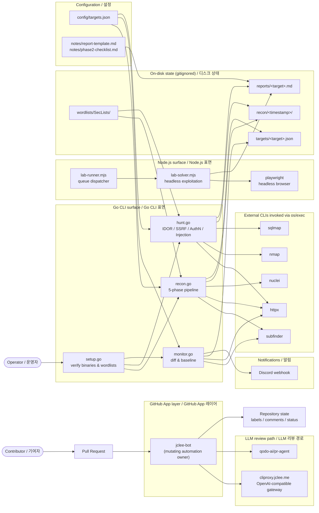

# Bug Bounty Automation Toolkit / 버그 바운티 자동화 툴킷

[](#-license--라이선스)
[](./scripts/)
[](./package.json)
[](#-local-development--로컬-개발)
[](#-contribution-guide--기여-가이드)
[](#-contribution-guide--기여-가이드)
[](#-architecture--아키텍처)
[](#-jclee-bot-automation-surfaces--jclee-bot-자동화-표면)
[](https://cliproxy.jclee.me/v1)
[](https://github.com/qodo-ai/pr-agent)
[](https://bot.jclee.me)
[](#-readme-generation--readme-생성)

> A Go-driven bug bounty automation toolkit that orchestrates the full **recon → monitor → hunt → report** lifecycle, paired with a GitHub App–owned automation layer (`jclee-bot`) that keeps the repository itself healthy.
>
> Go 표준 라이브러리 기반의 버그 바운티 자동화 툴킷. **정찰(recon) → 모니터링(monitor) → 헌팅(hunt) → 리포트(report)** 전 과정을 단일 인터페이스로 오케스트레이션하며, 저장소 자체의 건강 상태를 유지하는 `jclee-bot` 자동화 레이어를 함께 제공합니다.

---

## Table of Contents / 목차

- [Overview / 개요](#overview--개요)
- [Features / 주요 기능](#features--주요-기능)
- [Architecture / 아키텍처](#architecture--아키텍처)
- [Repository Structure / 저장소 구조](#repository-structure--저장소-구조)
- [jclee-bot Automation Surfaces / jclee-bot 자동화 표면](#jclee-bot-automation-surfaces--jclee-bot-자동화-표면)
- [Go & Node Tools / Go 및 Node 도구](#go--node-tools--go-및-node-도구)
- [Quick Start / 빠른 시작](#quick-start--빠른-시작)
- [Local Development / 로컬 개발](#local-development--로컬-개발)
- [Commands Reference / 명령어 레퍼런스](#commands-reference--명령어-레퍼런스)
- [Configuration / 설정](#configuration--설정)
- [Conventions / 컨벤션](#conventions--컨벤션)
- [Anti-patterns / 안티 패턴](#anti-patterns--안티-패턴)
- [Contribution Guide / 기여 가이드](#contribution-guide--기여-가이드)
- [README generation / README 생성](#readme-generation--readme-생성)
- [License / 라이선스](#license--라이선스)

---

## Overview / 개요

This repository is a self-contained hunting workstation. It assumes you already hold an active bug-bounty program authorization for every target you scan — **never run scans against systems you do not own or are not explicitly authorized to test**.

이 저장소는 단독으로 동작하는 헌팅 워크스테이션입니다. 스캔 대상은 반드시 사전에 허가된 버그 바운티 프로그램 범위 내에 있어야 하며, **명시적 허가 없이 절대 스캔을 수행해서는 안 됩니다.**

The toolkit is built around three Go entry points (`setup.go`, `recon.go`, `monitor.go`, `hunt.go`) that compose external CLI tools via `os/exec`. The Node.js side (`lab-runner.mjs`, `lab-solver.mjs`, plus Playwright) is reserved for in-browser exploitation of low-hanging findings, while the `Makefile` exposes a single ergonomic interface: `make help`.

툴킷은 세 개의 Go 진입점(`setup.go`, `recon.go`, `monitor.go`, `hunt.go`)을 중심으로 `os/exec`로 외부 CLI 도구를 조합합니다. Node.js 측(`lab-runner.mjs`, `lab-solver.mjs`, Playwright)은 브라우저 기반 저비용 취약점 검증 전용이며, `Makefile`은 단일 인터페이스(`make help`)를 제공합니다.

### Why Go stdlib only? / 왜 Go 표준 라이브러리만 사용하나?

No `go.mod`, no third-party imports, no supply-chain surprises. Each script is a single `.go` file you can read top to bottom in a few minutes and ship as a flat artifact to a hardened host.

`go.mod`도, 외부 의존성도, 공급망 위험도 없습니다. 각 스크립트는 단일 `.go` 파일이며, 상위→하위로 몇 분이면 모두 읽을 수 있어 경량 호스트로 그대로 배포할 수 있습니다.

---

## Features / 주요 기능

- **5-phase recon pipeline / 5단계 정찰 파이프라인** — subdomain enumeration, HTTP probing, fingerprinting, crawling, and nuclei scanning, all orchestrated by `recon.go`.
- **Diff-based monitoring / 차분 기반 모니터링** — `monitor.go` compares a new run against a stored baseline and emits only the deltas, with optional Discord alerts.
- **4-phase targeted hunting / 4단계 표적 헌팅** — `hunt.go` walks IDOR, SSRF, auth bypass, and injection categories behind a single `-type` flag.
- **First-class setup tool / 일급 셋업 도구** — `setup.go` verifies that every external binary (`subfinder`, `httpx`, `nuclei`, `nmap`, `sqlmap`, etc.) is installed before the first run.
- **Flat deployment / 플랫 배포** — no module graph; copy the `scripts/` directory and run with `go run`.
- **GitHub-native ergonomics / GitHub 네이티브 UX** — issue triage, PR normalization, security review, stale management, and welcome flows are all driven by `jclee-bot`.
- **Bilingual documentation / 이중 언어 문서** — every section is paired with Korean translations for shared context.

---

## Architecture / 아키텍처



The flowchart above is the single source of truth for how the pieces talk to each other. Workflow files inside `.github/workflows/` exist only as **execution triggers** for `jclee-bot`; they are not the automation itself.

위 플로우차트는 구성 요소 간 통신의 단일 진실 공급원입니다. `.github/workflows/` 안의 워크플로우 파일은 `jclee-bot`의 **실행 트리거**일 뿐, 자동화 자체는 아닙니다.

---

## Repository Structure / 저장소 구조

```text
.
├── AGENTS.md                  # Knowledge base for AI agents / AI 에이전트용 지식 베이스
├── Makefile                   # Orchestration entrypoint / 오케스트레이션 진입점
├── package.json               # Node.js dependencies (Playwright) / Node 의존성
├── package-lock.json          # npm lockfile / npm 잠금 파일
├── README.md                  # This file / 본 문서
├── config/
│   └── targets.json           # Targets + notification config / 대상 및 알림 설정
├── notes/
│   ├── phase2-checklist.md    # Learning checklist / 학습 체크리스트
│   ├── report-template.md     # Bug report template / 리포트 템플릿
│   └── vulnerability-study.md # Vulnerability study notes / 취약점 학습 노트
└── scripts/
    ├── hunt.go                # 4-phase vulnerability hunting / 4단계 취약점 헌팅
    ├── lab-runner.mjs         # Node queue dispatcher / Node 큐 디스패처
    ├── lab-solver.mjs         # Headless exploitation runner / 헤드리스 익스플로잇 러너
    ├── monitor.go             # Diff monitoring + Discord alerts / 차분 모니터링 + Discord 알림
    ├── recon.go               # 5-phase recon pipeline / 5단계 정찰 파이프라인
    └── setup.go               # Tool + wordlist verifier / 도구 및 워드리스트 검증
```

Generated artifacts under `recon/`, `targets/`, `reports/`, and `wordlists/` are **gitignored** and intentionally absent from version control.

`recon/`, `targets/`, `reports/`, `wordlists/` 아래의 결과물은 의도적으로 **gitignore 처리**되어 저장소에는 포함되지 않습니다.

---

## jclee-bot Automation Surfaces / jclee-bot 자동화 표면

All mutating GitHub automation in this repository is owned by the **`jclee-bot`** GitHub App. Workflow files in `.github/workflows/` are *triggers* that hand work off to the App; they are not the automation source of truth, and they are not listed as rows of an automation table here.

본 저장소의 모든 변경 발생형(mutating) GitHub 자동화는 `jclee-bot` GitHub App이 소유합니다. `.github/workflows/` 안의 워크플로우는 작업을 App에 전달하는 **트리거**일 뿐이며, 자동화의 진실 공급원이 아니므로 본 문서에서는 표 형식으로 나열하지 않습니다.

### Surface map / 표면 맵

| Surface / 표면 | Owner / 소유자 | Behavior / 동작 |
|---|---|---|
| Issue triage & labeling / 이슈 분류 및 라벨링 | `jclee-bot` | Applies area/priority labels, assigns the right owner, and **jclee-bot에의해자동화됨** behavior is left as a literal marker in issue footers so contributors can recognize bot-authored activity. / 영역/우선순위 라벨 적용, 담당자 지정, 이슈 푸터에 `jclee-bot에의해자동화됨` 마커를 남겨 봇 작업임을 표시 |
| Issue lifecycle (close/stale/reopen) / 이슈 라이프사이클 | `jclee-bot` | Marks stale issues after N days of inactivity, closes after M days, reopens on `/reopen`, and acknowledges with a comment signed by `jclee-bot에의해자동화됨`. / 비활성 N일 후 stale, M일 후 close, `/reopen` 시 재오픈, `jclee-bot에의해자동화됨` 사인 코멘트 |
| PR title & branch normalization / PR 제목·브랜치 정규화 | `jclee-bot` | Enforces conventional commit titles and `feat/`, `fix/`, `chore/` branch prefixes via `jclee-bot` edits. / `jclee-bot`이 conventional commit 제목과 `feat/`, `fix/`, `chore/` 브랜치 prefix 강제 |
| PR size guardrails / PR 크기 제한 | `jclee-bot` | Posts an `XL` size label and a soft-block comment when diffs exceed the configured LoC threshold. / diff가 임계치를 넘으면 `XL` 라벨과 차단 코멘트 게시 |
| PR review (general) / PR 리뷰(일반) | `jclee-bot` | Runs [qodo-ai/pr-agent](https://github.com/qodo-ai/pr-agent) through [cliproxy.jclee.me](https://cliproxy.jclee.me/v1) and posts structured review summaries. / [cliproxy.jcley.me](https://cliproxy.jclee.me/v1) 경유로 [qodo-ai/pr-agent](https://github.com/qodo-ai/pr-agent) 실행 후 구조화된 리뷰 게시 |
| PR security review / PR 보안 리뷰 | `jclee-bot` | Adds a dedicated security checklist comment and surfaces findings with `security/*` labels. / 보안 체크리스트 코멘트와 `security/*` 라벨 부여 |
| Auto-merge for trusted PRs / 신뢰 PR 자동 머지 | `jclee-bot` | Enables squash auto-merge only after all required checks + approvals pass. / 모든 체크와 승인이 통과된 경우에만 squash 자동 머지 활성화 |
| Stale management (bot-side) / Stale 관리 | `jclee-bot` | Sweeps issues and PRs according to the project-wide policy. / 프로젝트 정책에 따라 이슈/PR 정리 |
| Welcome new contributors / 신규 기여자 환영 | `jclee-bot` | Posts a first-time contributor welcome referencing `https://bot.jclee.me`. / `https://bot.jclee.me`를 안내하는 환영 메시지 게시 |

### Why an App and not a script? / 왜 스크립트가 아닌 App인가?

A GitHub App authenticates as a first-class principal, leaves an auditable trail, and survives PAT rotation. Workflow files using `GITHUB_TOKEN` cannot mutate workflow files themselves and are rate-limited in ways an App is not.

GitHub App은 1급 주체로 인증되어 감사 로그가 남고, PAT 교체와 무관하게 동작합니다. `GITHUB_TOKEN` 기반 워크플로우는 워크플로우 자체를 변경할 수 없으며 App과 다른 방식으로 rate-limit에 묶입니다.

---

## Go & Node Tools / Go 및 Node 도구

### Go entry points / Go 진입점

All Go scripts live under `scripts/` and run with `go run scripts/<file>.go`. They use only the Go standard library and external CLIs invoked through `os/exec`.

모든 Go 스크립트는 `scripts/` 아래에 있으며 `go run scripts/<file>.go`로 실행합니다. Go 표준 라이브러리와 `os/exec`로 호출되는 외부 CLI만 사용합니다.

#### `scripts/setup.go` (~223 lines / 약 223줄)

Verifies every external binary the pipeline depends on (`subfinder`, `httpx`, `dnsx`, `naabu`, `nuclei`, `nmap`, `sqlmap`, `gau`, `waybackurls`, …) and downloads SecLists into `wordlists/`.

파이프라인이 의존하는 모든 외부 바이너리(`subfinder`, `httpx`, `dnsx`, `naabu`, `nuclei`, `nmap`, `sqlmap`, `gau`, `waybackurls` 등)를 검증하고 SecLists를 `wordlists/`에 내려받습니다.

#### `scripts/recon.go` (~350 lines / 약 350줄)

The 5-phase pipeline:

1. **Subdomain enumeration** via `subfinder` + `crt.sh`.
2. **HTTP probing** with `httpx` to filter live hosts.
3. **Fingerprinting** of technologies and exposed panels.
4. **Crawling** with `gau`/`waybackurls` + URL extraction.
5. **Nuclei scanning** with severity-filtered templates.

5단계 파이프라인:

1. `subfinder` + `crt.sh`를 통한 **서브도메인 열거**
2. `httpx`로 살아있는 호스트만 필터링하는 **HTTP 프로빙**
3. 기술 스택 및 패널 노출 확인을 위한 **핑거프린팅**
4. `gau`/`waybackurls` + URL 추출을 통한 **크롤링**
5. 심각도 필터 템플릿을 적용한 **Nuclei 스캔**

Pass `-skip-nuclei` to skip phase 5 (used by `make recon-fast`).

5단계를 건너뛰려면 `-skip-nuclei`를 전달하세요(`make recon-fast`).

#### `scripts/monitor.go` (~312 lines / 약 312줄)

Diffs a fresh run against the baseline stored in `targets/<target>.json`. Emits only new subdomains, new endpoints, and new nuclei findings. Optionally posts to a Discord webhook.

`targets/<target>.json`에 저장된 베이스라인과 새 실행 결과를 비교합니다. 신규 서브도메인, 신규 엔드포인트, 신규 nuclei 결과만 추출하며 Discord 웹훅으로도 알릴 수 있습니다.

#### `scripts/hunt.go` (~509 lines / 약 509줄)

4-phase targeted hunting. The `huntTypes` slice is the single place to extend the catalog:

| `-type` value | Phase focus |
|---|---|
| `idor` | Broken object-level authorization on common REST verbs |
| `ssrf` | URL parameter reflection, internal IP probing |
| `authn` | Missing authentication on sensitive paths |
| `injection` | Header / parameter injection patterns |

4단계 표적 헌팅. 카탈로그 확장은 `huntTypes` 슬라이스 한 곳에서만 수행하세요:

| `-type` 값 | 단계 초점 |
|---|---|
| `idor` | 일반 REST 메서드의 객체 단위 인가 결함 |
| `ssrf` | URL 파라미터 반사, 내부 IP 프로빙 |
| `authn` | 민감 경로의 인증 누락 |
| `injection` | 헤더/파라미터 인젝션 패턴 |

### Node.js tools / Node.js 도구

The Node side is intentionally minimal: it is the **lab bench**, not the recon pipeline.

Node 측은 의도적으로 최소한입니다. 정찰 파이프라인이 아니라 **실험대**입니다.

#### `scripts/lab-runner.mjs`

A queue dispatcher that reads `reports/queue.jsonl` and hands each finding to `lab-solver.mjs` with a fresh Playwright context.

`reports/queue.jsonl`을 읽어 각 발견 항목을 새로운 Playwright 컨텍스트로 `lab-solver.mjs`에 전달하는 큐 디스패처입니다.

#### `scripts/lab-solver.mjs`

Headless verification runner. Uses Playwright (`playwright@^1.61.0`) to reproduce an XSS, confirm a stored IDOR, or validate a CSRF — without ever touching production traffic.

Playwright(`playwright@^1.61.0`)로 XSS 재현, 저장형 IDOR 확인, CSRF 검증을 헤드리스로 수행합니다. 운영 트래픽에는 절대 접근하지 않습니다.

---

## Quick Start / 빠른 시작

```bash
# 1. Clone / 클론
git clone https://github.com/jclee941/.github
cd bug

# 2. Verify tooling + download wordlists / 도구 검증 + 워드리스트 다운로드
make setup

# 3. Add a target / 대상 추가
$EDITOR config/targets.json

# 4. Run recon / 정찰 실행
make recon TARGET=example.com

# 5. Diff against baseline (after the first recon) / 베이스라인과 비교 (첫 정찰 이후)
make monitor TARGET=example.com

# 6. Hunt / 헌팅
make hunt TARGET=example.com

# 7. Full scan (recon + hunt) / 풀 스캔 (정찰 + 헌팅)
make full-scan TARGET=example.com
```

The first `make recon` writes a baseline to `targets/<target>.json`; subsequent `make monitor` runs diff against that baseline.

첫 `make recon`은 베이스라인을 `targets/<target>.json`에 기록하며, 이후 `make monitor`는 그 베이스라인과 비교합니다.

---

## Local Development / 로컬 개발

### Prerequisites / 사전 요구사항

- Linux host (validated on Ubuntu 22.04 LTS) / Linux 호스트 (Ubuntu 22.04 LTS 검증)
- Go ≥ 1.22 (for `go run`) / Go 1.22 이상 (`go run`용)
- Node.js ≥ 20 (for Playwright) / Node.js 20 이상 (Playwright용)
- The external CLIs enumerated by `make setup` / `make setup`이 점검하는 외부 CLI

### Bootstrap from scratch / 처음부터 부트스트랩

```bash
# System packages / 시스템 패키지
sudo apt-get update && sudo apt-get install -y \
  nmap jq curl git make golang-go nodejs npm

# Go tooling via go install / go install로 Go 도구 설치
go install -v github.com/projectdiscovery/subfinder/v2/cmd/subfinder@latest
go install -v github.com/projectdiscovery/httpx/cmd/httpx@latest
go install -v github.com/projectdiscovery/nuclei/v3/cmd/nuclei@latest
go install -v github.com/projectdiscovery/naabu/v2/cmd/naabu@latest

# Python tooling for sqlmap / sqlmap용 Python 도구
pipx install sqlmap

# Node tooling / Node 도구
npm install
npx playwright install --with-deps chromium
```

> The `<homelab-host>` placeholder in operator notes refers to the hardened host that runs the toolkit nightly against authorized scope. The LLM gateway endpoint `https://cliproxy.jclee.me/v1` is the only public integration required at runtime.
>
> 운영자 노트의 `<homelab-host>` 플레이스홀더는 허가된 범위에 대해 매일 밤 툴킷을 실행하는 경화 호스트를 가리킵니다. 런타임에 필요한 유일한 공개 통합은 LLM 게이트웨이 엔드포인트 `https://cliproxy.jclee.me/v1`입니다.

### Optional Discord alerts / Discord 알림(선택)

Set the following environment variables before running `monitor` to enable webhook alerts:

`monitor` 실행 전 다음 환경 변수를 설정하면 웹훅 알림이 활성화됩니다:

```bash
export BUG_DISCORD_WEBHOOK="https://discord.com/api/webhooks/<your-webhook>"
export BUG_DISCORD_USERNAME="bug-monitor"
```

---

## Commands Reference / 명령어 레퍼런스

| Command / 명령어 | Description / 설명 |
|---|---|
| `make help` | Print the command banner and usage examples / 명령 배너와 사용 예 출력 |
| `make setup` | Verify external CLIs and download SecLists into `wordlists/` / 외부 CLI 검증 + `wordlists/`에 SecLists 다운로드 |
| `make recon TARGET=<domain>` | Full 5-phase recon pipeline / 5단계 정찰 파이프라인 전체 실행 |
| `make recon-fast TARGET=<domain>` | Recon with phase 5 (nuclei) skipped / 5단계(nuclei) 생략 정찰 |
| `make monitor TARGET=<domain>` | Diff new run against baseline + optional Discord alerts / 베이스라인과 신규 실행 비교 + Discord 알림 |
| `make hunt TARGET=<domain>` | All 4 hunt categories / 4개 헌팅 카테고리 전체 실행 |
| `make hunt-idor TARGET=<domain>` | IDOR-only hunt / IDOR만 헌팅 |
| `make hunt-ssrf TARGET=<domain>` | SSRF-only hunt / SSRF만 헌팅 |
| `make full-scan TARGET=<domain>` | Recon + hunt combined / 정찰 + 헌팅 결합 |
| `make clean` | Remove generated `recon/`, `targets/`, `reports/` artifacts / 생성된 `recon/`, `targets/`, `reports/` 산출물 제거 |

Every command also accepts the underlying Go flags via the `Makefile`'s `$(GO)` expansion; e.g. `make recon TARGET=foo.com` is literally `go run scripts/recon.go -d foo.com`.

모든 명령은 `Makefile`의 `$(GO)` 확장을 통해 Go 플래그도 받습니다. 예: `make recon TARGET=foo.com`은 사실상 `go run scripts/recon.go -d foo.com`입니다.

---

## Configuration / 설정

### `config/targets.json`

```json
{
  "targets": [
    {
      "name": "example-program",
      "domain": "example.com",
      "scope": ["*.example.com"],
      "out_of_scope": ["blog.example.com"],
      "rate_limit_rps": 100
    }
  ],
  "discord": {
    "webhook_env": "BUG_DISCORD_WEBHOOK",
    "username_env": "BUG_DISCORD_USERNAME"
  }
}
```

- `scope` — wildcard allowlist matched against every discovered host. / 허용 와일드카드 목록
- `out_of_scope` — explicit denylist; the scripts short-circuit if a host matches. / 명시적 거부 목록. 일치하면 스크립트 단락 종료
- `rate_limit_rps` — global ceiling forwarded to nuclei and HTTP probes. / nuclei와 HTTP 프로빙으로 전달되는 전역 상한

### Notes / 노트

- `notes/phase2-checklist.md` — manual learning checklist. Keep it green. / 수동 학습 체크리스트. 항상 최신으로 유지
- `notes/report-template.md` — canonical bug report skeleton; copy on first finding. / 표준 버그 리포트 골격. 첫 발견 시 복사해 사용
- `notes/vulnerability-study.md` — personal study notes for each vuln class. / 취약점 클래스별 개인 학습 노트

---

## Conventions / 컨벤션

- Every Go script is a single file with no `go.mod`. / 모든 Go 스크립트는 `go.mod` 없는 단일 파일
- External tools are invoked only via `os/exec`. / 외부 도구는 `os/exec`로만 호출
- Timestamped outputs live under `recon/<YYYY-MM-DDTHHMMSSZ>/`. / 타임스탬프 결과는 `recon/<YYYY-MM-DDTHHMMSSZ>/`에 저장
- Baselines live at `targets/<safe-target>.json`. / 베이스라인은 `targets/<safe-target>.json`
- Final reports live at `reports/<safe-target>/<finding>.md`. / 최종 리포트는 `reports/<safe-target>/<finding>.md`
- Sensitive data is gitignored; commits must contain zero raw scan output. / 민감 데이터는 gitignore, 커밋에 원시 스캔 출력 금지

---

## Anti-patterns / 안티 패턴

- **Never commit scan results.** `recon/`, `targets/`, `reports/` are gitignored for a reason. / **스캔 결과를 커밋하지 마세요.** `recon/`, `targets/`, `reports/`가 gitignore인 데는 이유가 있습니다.
- **Never hardcode domains in scripts.** Everything routes through `config/targets.json`. / **도메인을 스크립트에 하드코딩하지 마세요.** 모든 입력은 `config/targets.json`을 거칩니다.
- **Never scan without authorization.** Always paste the program policy into `notes/` before kicking off `make full-scan`. / **허가 없이 스캔하지 마세요.** `make full-scan` 실행 전 반드시 프로그램 정책을 `notes/`에 첨부하세요.
- **Never exceed the program's rate limit.** Default `100 req/s` is the upper bound, not a target. / **프로그램 rate limit을 초과하지 마세요.** 기본 `100 req/s`은 상한일 뿐 목표가 아닙니다.

---

## Contribution Guide / 기여 가이드

Contributions that improve the **toolkit itself** (Go scripts, Makefile, Node lab tools, docs) are welcome. Contributions of raw scan output, real bug reports, or unauthorized findings will be closed and reverted on sight.

**툴킷 자체**(Go 스크립트, Makefile, Node 실험 도구, 문서)를 개선하는 기여를 환영합니다. 원시 스캔 출력, 실제 버그 리포트, 무허가 발견물의 기여는 즉시 종료 및 되돌림 처리됩니다.

### Process / 절차

1. Fork and branch with a conventional prefix: `feat/`, `fix/`, `chore/`, `docs/`, `refactor/`. / 컨벤션 prefix(`feat/`, `fix/`, `chore/`, `docs/`, `refactor/`)로 브랜치 생성
2. Keep diffs small — the size labeler flags anything over the configured LoC. / diff는 작게 유지. 크기 라벨러가 임계를 넘는 diff에 플래그
3. PR titles must follow Conventional Commits. / PR 제목은 Conventional Commits 준수
4. `jclee-bot` will:
   - Normalize the PR title and branch. / PR 제목과 브랜치 정규화
   - Run the security checklist. / 보안 체크리스트 실행
   - Request a [qodo-ai/pr-agent](https://github.com/qodo-ai/pr-agent) review via [cliproxy.jclee.me](https://cliproxy.jclee.me/v1). / [cliproxy.jclee.me](https://cliproxy.jclee.me/v1)를 통해 [qodo-ai/pr-agent](https://github.com/qodo-ai/pr-agent) 리뷰 요청
   - Block auto-merge until reviews pass. / 리뷰 통과 전 자동 머지 차단
5. Squash-merge once approved. / 승인 후 squash 머지

### Adding a new hunt category / 신규 헌팅 카테고리 추가

```go
// scripts/hunt.go
var huntTypes = []string{
    "idor", "ssrf", "authn", "injection",
    "race-condition", // ← add here
}
```

Add a `case "race-condition":` arm to `runHuntType` and wire any required CLIs into `scripts/setup.go`.

`runHuntType`에 `case "race-condition":` 분기를 추가하고, 필요한 CLI는 `scripts/setup.go`에 등록하세요.

### Reporting an issue / 이슈 등록

When you open an issue, the lifecycle bot (`jclee-bot`) will triage it within minutes. Issues left inactive for the stale threshold will receive a friendly nudge signed with `jclee-bot에의해자동화됨` before any auto-close. / 이슈를 열면 lifecycle 봇(`jclee-bot`)이 수 분 내로 분류합니다. 비활성 임계치에 도달한 이슈는 자동 종료 전에 `jclee-bot에의해자동화됨` 사인의 안내 코멘트를 받습니다.

---

## README generation / README 생성

This README is generated by the App-owned documentation workflow. The primary generator model is `gpt-5.5`; if it is unavailable, the fallback model is `minimax-m3` reached through the OpenAI-compatible gateway at `https://cliproxy.jclee.me/v1`.

본 README는 App이 소유하는 문서화 워크플로우로 생성됩니다. 1차 생성 모델은 `gpt-5.5`이며, 불가 시 OpenAI 호환 게이트웨이 `https://cliproxy.jclee.me/v1` 경유의 `minimax-m3` 폴백 모델을 사용합니다.

---

## License / 라이선스

ISC — see the `LICENSE` file if/when added; until then, treat the contents as ISC-licensed per `package.json`.

ISC — `LICENSE` 파일이 추가될 때까지 `package.json`의 표기를 따라 ISC 라이선스로 간주합니다.