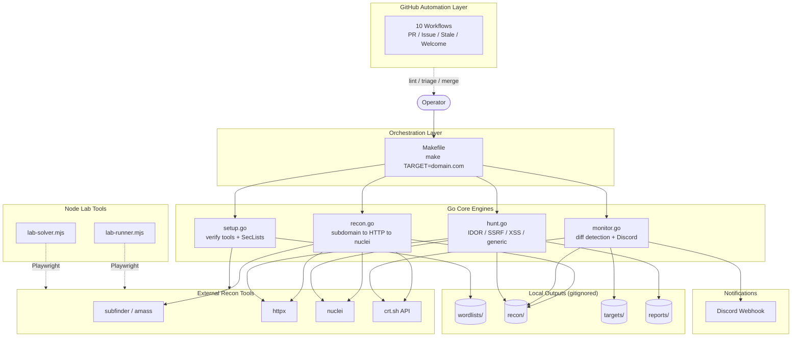

# Bug Bounty Automation Toolkit / 버그 바운티 자동화 툴킷

[](./LICENSE)
[](./scripts/)
[](./package.json)


[](./.github/workflows/welcome.yml)

> A Go-driven bug bounty automation toolkit that orchestrates the **recon → monitor → hunt → report** lifecycle, paired with a GitHub-side automation layer that keeps the repository itself healthy.
>
> Go 표준 라이브러리 기반의 버그 바운티 자동화 툴킷. **정찰 → 모니터링 → 헌팅 → 리포트** 전 과정을 단일 인터페이스로 오케스트레이션하며, 저장소 자체의 건강 상태를 유지하는 GitHub 자동화 레이어를 함께 제공합니다.

---

## Overview

The **Bug Bounty Automation Toolkit** (`jclee941/bug`) is a personal security-research harness written almost entirely with Go's standard library. It wraps industry-standard reconnaissance and exploitation tooling — `subfinder`, `amass`, `httpx`, `nuclei`, `crt.sh`, and friends — behind a single, opinionated `make` interface, and ships with a curated GitHub-side automation layer so that the repository stays tidy while you hunt on real targets.

The toolkit is designed around four operating modes plus a browser-lab surface:

| Mode | Entry Point | Purpose |
|---|---|---|
| `setup` | `make setup` | One-time environment verification + SecLists download |
| `recon` | `make recon TARGET=domain` | 5-phase reconnaissance pipeline |
| `monitor` | `make monitor TARGET=domain` | Diff-based change detection with Discord alerting |
| `hunt` | `make hunt TARGET=domain` | Targeted vulnerability hunting (IDOR, SSRF, XSS, …) |
| Lab | `node scripts/lab-runner.mjs` | Playwright-driven browser verification |

All scan output is gitignored; only code, configuration, templates, and study notes are versioned.

## 개요

**Bug Bounty Automation Toolkit**(`jclee941/bug`)은 Go 표준 라이브러리만으로 작성된 개인용 보안 연구 자동화 도구입니다.业界 표준 정찰 및 공격 도구(`subfinder`, `amass`, `httpx`, `nuclei`, `crt.sh` 등)를 단일 `make` 인터페이스 뒤로 감추고, 저장소 자체의 건강 상태를 유지하는 GitHub 자동화 레이어를 함께 제공합니다.

툴킷은 다음 네 가지 운용 모드와 브라우저 실험실로 구성됩니다.

| 모드 | 진입점 | 목적 |
|---|---|---|
| `setup` | `make setup` | 최초 환경 검증 + SecLists 다운로드 |
| `recon` | `make recon TARGET=domain` | 5단계 정찰 파이프라인 |
| `monitor` | `make monitor TARGET=domain` | 차분 기반 변경 감지 + Discord 알림 |
| `hunt` | `make hunt TARGET=domain` | 표적형 취약점 헌팅(IDOR, SSRF, XSS 등) |
| Lab | `node scripts/lab-runner.mjs` | Playwright 기반 브라우저 검증 |

스캔 결과물은 모두 gitignore 처리되며, 코드 · 설정 · 템플릿 · 학습 노트만 버전 관리에 포함됩니다.

---

## Features / 주요 기능

### English

- **Stdlib-only Go engines.** Every `.go` script runs via `go run scripts/<name>.go` — no `go.mod`, no vendored dependencies, no surprise upgrades.
- **Single-command recon pipeline.** Five phases — subdomain enumeration, HTTP probing, fingerprinting, nuclei scanning, baseline capture — driven by one `make recon TARGET=…` invocation.
- **Continuous surface monitoring.** `monitor.go` diffs new subdomains and endpoints against the previous baseline and ships alerts to Discord the moment new assets appear.
- **Targeted vulnerability hunting.** `hunt.go` runs four hunt categories (IDOR / SSRF / XSS / generic) against an existing recon baseline; per-category entry points are exposed as `hunt-idor`, `hunt-ssrf`, and friends.
- **Playwright lab surface.** Node-based `lab-runner.mjs` and `lab-solver.mjs` scripts let you reproduce browser-side behavior (auth flows, XSS payloads) without leaving the toolkit.
- **Healthy-by-default repository.** Ten GitHub workflows triage issues, normalize PRs, label by file path, gate by size, mark staleness, and welcome first-time contributors automatically.

### 한국어

- **표준 라이브러리 전용 Go 엔진.** 모든 `.go` 스크립트는 `go run scripts/<name>.go`로 실행되며, `go.mod`도 외부 의존성도 없습니다.
- **단일 명령 정찰 파이프라인.** 서브도메인 열거 → HTTP 프로빙 → 핑거프린팅 → nuclei 스캔 → 베이스라인 캡처의 5단계를 `make recon TARGET=…` 한 번으로 구동합니다.
- **지속적 표면 모니터링.** `monitor.go`가 신규 서브도메인/엔드포인트를 이전 베이스라인과 비교하여, 자산이 등장하는 즉시 Discord로 알림을 전송합니다.
- **표적형 취약점 헌팅.** `hunt.go`는 기존 정찰 베이스라인을 기반으로 IDOR / SSRF / XSS / 일반 4개 카테고리를 수행하며, `hunt-idor`, `hunt-ssrf` 등으로 카테고리별 진입이 가능합니다.
- **Playwright 실험실.** Node 기반 `lab-runner.mjs`, `lab-solver.mjs`로 인증 흐름, XSS 페이로드 등 브라우저 측 동작을 툴킷 안에서 재현할 수 있습니다.
- **기본값으로 건강한 저장소.** 이슈 분류, PR 정규화, 파일 경로 기반 라벨링, 크기 게이팅, 스테일 처리, 첫 기여자 환영 등 10개의 GitHub 워크플로우가 자동 동작합니다.

---

## Architecture / 아키텍처



The diagram is intentionally three-layered:

1. **Orchestration** — the `Makefile` is the single front door; the operator never has to remember individual script flags.
2. **Core Engines** — Go scripts own the heavy lifting and call external CLI tools via `os/exec`. Lab scripts (Playwright) are siblings, not children: they verify what the recon/hunt engines find.
3. **Automation Layer** — the GitHub-side workflows don't touch scan output; they only keep the *repository* healthy (labeling, linting, sizing, stale-handling, welcoming).

---

## Repository Structure / 저장소 구조

The repository ships only **code, configuration, templates, and study notes**. All scan artifacts live in directories that are intentionally gitignored.

```text
.
├── AGENTS.md                    # Knowledge base for AI agents / contributors
├── Makefile                     # Orchestration entry point (make help)
├── README.md                    # This file
├── package.json                 # Node tooling (Playwright) metadata
├── package-lock.json            # Locked dependency tree
│
├── config/
│   └── targets.json             # Targets + Discord webhook configuration
│
├── notes/
│   ├── phase2-checklist.md      # Phase-2 learning checklist
│   ├── report-template.md       # Bug-report submission template
│   └── vulnerability-study.md   # Per-class vulnerability study notes
│
└── scripts/
    ├── setup.go                 # Environment verification + SecLists
    ├── recon.go                 # 5-phase recon pipeline
    ├── monitor.go               # Diff monitoring + Discord alerts
    ├── hunt.go                  # Targeted vulnerability hunting
    ├── lab-runner.mjs           # Playwright lab harness (browser)
    └── lab-solver.mjs           # Playwright lab solver (browser)
```

Runtime output directories — created on first run, **gitignored**, never committed:

```text
recon/        # timestamped recon results
targets/      # per-target baseline snapshots
reports/      # submitted bug reports (redacted)
wordlists/    # downloaded SecLists snapshot
```

---

## Automation Inventory / 자동화 인벤토리

### GitHub Workflows (10)

All workflow files live under `.github/workflows/`. File names below are the **real on-disk names** in this repository.

| Workflow File | Purpose |
|---|---|
| `auto-merge.yml` | Auto-merge PRs once all required checks and approvals are satisfied. |
| `issue-label.yml` | Apply topic labels to new issues from the issue body / title. |
| `issue-lifecycle.yml` | Manage issue state transitions (e.g. close on inactivity, link to PRs). |
| `labeler.yml` | Apply path-based labels to PRs from `.github/labeler.yml` rules. |
| `pr-normalize.yml` | Normalize PR titles / branch names to a conventional-commits shape. |
| `pr-review-security.yml` | Security-focused PR review (powered by [qodo-ai/pr-agent](https://github.com/qodo-ai/pr-agent)). |
| `pr-review.yml` | General-purpose automated PR review. |
| `pr-size.yml` | Label every PR with its size bucket (`size/XS` … `size/XL`). |
| `stale.yml` | Mark stale issues and PRs after a configurable idle period. |
| `welcome.yml` | Greet first-time contributors with an orientation message. |

### Go Recon & Hunting Engines (4)

Each script is a standalone file — no `go.mod`, run directly with `go run`.

| Script | Purpose | Key Flags |
|---|---|---|
| `scripts/setup.go` | Verifies required external tools are installed and downloads SecLists. | — |
| `scripts/recon.go` | 5-phase reconnaissance pipeline (subdomain → HTTP → nuclei → baseline). | `-d` (target), `-skip-nuclei` |
| `scripts/monitor.go` | Diff-based change detection against the latest baseline; ships Discord alerts. | `-d` (target) |
| `scripts/hunt.go` | Targeted vulnerability hunting across multiple categories. | `-d` (target), `-type` (idor / ssrf / xss / generic) |

### Node Lab Scripts (2)

| Script | Runtime | Purpose |
|---|---|---|
| `scripts/lab-runner.mjs` | Node + Playwright | Drives a real browser to reproduce authenticated flows and capture client-side behavior. |
| `scripts/lab-solver.mjs` | Node + Playwright | Automated solver for repeatable browser challenges used during research. |

---

## Quick Start / 빠른 시작

### English

1. **Install prerequisites** — Go (≥ 1.21), Node.js (≥ 18), `make`, and the external recon tools (`subfinder`, `amass`, `httpx`, `nuclei`).
2. **Clone the repository.**
   ```bash
   git clone https://github.com/jclee941/.github
   cd bug
   ```
3. **Install Node dependencies** (Playwright + browser binaries).
   ```bash
   npm install
   npx playwright install
   ```
4. **Run first-time setup.**
   ```bash
   make setup
   ```
5. **Edit `config/targets.json`** to add the authorized program and Discord webhook.
6. **Kick off your first recon.**
   ```bash
   make recon TARGET=example.com
   ```

### 한국어

1. **사전 준비물 설치** — Go(≥ 1.21), Node.js(≥ 18), `make`, 그리고 외부 정찰 도구(`subfinder`, `amass`, `httpx`, `nuclei`).
2. **저장소 클론**
   ```bash
   git clone https://github.com/jclee941/.github
   cd bug
   ```
3. **Node 의존성 설치** (Playwright + 브라우저 바이너리)
   ```bash
   npm install
   npx playwright install
   ```
4. **최초 설정 실행**
   ```bash
   make setup
   ```
5. **`config/targets.json`** 을 열어 인가된 프로그램과 Discord 웹훅을 등록합니다.
6. **첫 정찰 시작**
   ```bash
   make recon TARGET=example.com
   ```

---

## Local Development / 로컬 개발

### Editing the Target Configuration

`config/targets.json` is the single source of truth for which domains are in scope and where alerts go. Add a new entry before running any scan — never hardcode a target in a script.

### Adding a Hunt Category

Hunt types live as entries in the `huntTypes` slice inside `scripts/hunt.go`. To add a new category:

1. Append a new `HuntType` struct to the slice with its nuclei templates, request profile, and detector logic.
2. Register a corresponding flag default in the script's `flag.*` block.
3. Add a `make hunt-<name>` rule to the `Makefile` if you want a one-shot entry point.
4. Document the new category in `notes/vulnerability-study.md`.

### Editing the Recon Pipeline

The five phases of `recon.go` are sequential and intentionally easy to swap. Each phase owns its own subprocess invocation and writes its slice of output into a timestamped `recon/<target>/<timestamp>/` directory. To reorder or extend phases, edit the pipeline runner at the top of `scripts/recon.go`.

### Working with the Lab Scripts

`lab-runner.mjs` and `lab-solver.mjs` are intentionally decoupled from the Go engines — they exist for browser-side verification (auth flows, XSS payload confirmation, CSP bypass testing). Import them as ES modules from your own scratch scripts; both expect Playwright to be available via the dev dependency declared in `package.json`.

### Conventions

- **Go scripts use only the standard library.** No `go.mod`, no third-party imports.
- **External tools are invoked via `os/exec`**, never vendored or rewritten in Go.
- **Results are timestamped** under `recon/<target>/<timestamp>/`.
- **Sensitive artifacts are gitignored** (`recon/`, `targets/`, `reports/`, `wordlists/`).
- **Targets are never hardcoded** in any script — always pass via `TARGET=` on the `make` command line or `config/targets.json`.

---

## Commands Reference / 명령어 참조

All commands are routed through the `Makefile`. Run `make help` to print this table from your terminal.

| Command | What it does |
|---|---|
| `make help` | Print available commands and examples. |
| `make setup` | First-time setup — verify external tools, download SecLists. |
| `make recon TARGET=domain.com` | Full 5-phase reconnaissance pipeline on `TARGET`. |
| `make recon-fast TARGET=domain.com` | Recon pipeline with the nuclei phase skipped. |
| `make monitor TARGET=domain.com` | Diff-based change detection + Discord alerting. |
| `make hunt TARGET=domain.com` | Run all hunt categories against the existing baseline. |
| `make hunt-idor TARGET=domain.com` | Hunt IDOR vulnerabilities only. |
| `make hunt-ssrf TARGET=domain.com` | Hunt SSRF vulnerabilities only. |
| `make full-scan TARGET=domain.com` | Combined recon + hunt in one invocation. |
| `make clean` | Remove scan results under `recon/`, `targets/`, `reports/`. |

### Programmatic Entry Points

If you need to bypass `make` (e.g. from CI), each Go engine is runnable directly:

```bash
go run scripts/setup.go
go run scripts/recon.go   -d example.com
go run scripts/recon.go   -d example.com -skip-nuclei
go run scripts/monitor.go -d example.com
go run scripts/hunt.go    -d example.com
go run scripts/hunt.go    -d example.com -type idor
go run scripts/hunt.go    -d example.com -type ssrf
```

```bash
node scripts/lab-runner.mjs
node scripts/lab-solver.mjs
```

---

## Contribution Guide / 기여 가이드

### Safety First

- **Only run scans against targets you are explicitly authorized to test.** Public bug-bounty programs and personal lab targets are in scope. Anything else is not.
- **Respect rate limits.** The default nuclei ceiling is 100 req/s; do not raise it without a written exemption from the program.
- **Never commit scan artifacts.** `recon/`, `targets/`, `reports/`, and `wordlists/` are gitignored for a reason — they may contain customer data, secrets, or PII.
- **Never hardcode target domains** in scripts or commit messages. Always reference the program by its public handle.

### Code Conventions

- **Go engines stay stdlib-only.** If you need a dependency, justify it in the PR description.
- **External tool wrappers** belong at the top of each script and should be the only thing that talks to `os/exec`.
- **Lab scripts** are ESM (`.mjs`) and may use Playwright; do not introduce other browser-automation libraries without discussion.
- **One PR = one concern.** If you are adding a hunt category and refactoring the diff engine, split them.

### Pull Request Workflow

1. Fork the repository and create a topic branch (`feat/<short-name>` or `fix/<short-name>`).
2. Run `make help` to make sure your edits do not break the target guard (`-n "$(TARGET)"`).
3. Open a PR. The following GitHub workflows will run automatically:
   - `pr-normalize.yml` — enforces title/branch shape.
   - `labeler.yml` — applies path-based labels.
   - `pr-size.yml` — sizes the change.
   - `pr-review.yml` + `pr-review-security.yml` — automated review.
   - `auto-merge.yml` — merges once approvals + checks pass.
4. If this is your first contribution, `welcome.yml` will greet you.

### Issue Workflow

- `issue-label.yml` applies topic labels as soon as the issue opens.
- `issue-lifecycle.yml` closes stale items that no longer apply.
- `stale.yml` nudges inactive issues and PRs after the configured idle period.

### Where to Ask Questions

- **Bug in a Go engine** → open an issue with the target handle redacted and the failing command attached.
- **Bug in a GitHub workflow** → open an issue and link to the failed run.
- **Design discussion** (new hunt category, new phase, new output format) → open an issue first; do not send a surprise PR.

---

## License

ISC — see [`LICENSE`](./LICENSE).