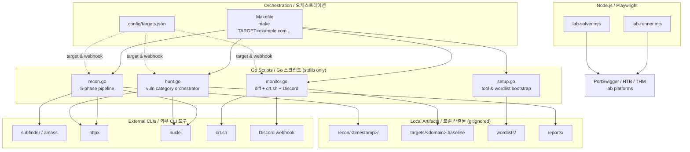

# Bug Bounty Automation Toolkit / 버그 바운티 자동화 툴킷

> Reconnaissance, monitoring, and targeted vulnerability hunting for
> responsible security research and bug bounty programs.
>
> 책임 있는 보안 연구 및 버그 바운티 프로그램을 위한 정찰, 모니터링,
> 표적형 취약점 헌팅 도구 모음입니다.

---

## Overview / 개요

This toolkit orchestrates a complete bug-bounty workflow — from initial
asset discovery and continuous monitoring to targeted vulnerability
scanning (IDOR, SSRF, …) and browser-driven lab exercises.
Performance-critical stages run as Go binaries that wrap external CLI
tools through `os/exec`, while Playwright-based lab runners operate on
safe, scoped platforms. A single `Makefile` exposes consistent entry
points across operators and machines, and every artifact is written to
timestamped, gitignored directories so the working tree stays clean.

이 툴킷은 초기 자산 발견과 지속적 모니터링부터 IDOR·SSRF 등 표적형
취약점 스캔, 브라우저 기반 실습까지 버그 바운티 워크플로우 전체를
오케스트레이션합니다. 성능이 중요한 단계는 `os/exec`로 외부 CLI 도구를
래핑하는 Go 바이너리로, 실습 플랫폼에서는 Playwright(Node.js)가 동작하며,
단일 `Makefile`을 통해 운영자와 머신 전체에서 일관된 진입점을 제공합니다.
모든 결과물은 타임스탬프가 붙은 gitignore 디렉터리에 저장되어 작업 트리를
깔끔하게 유지합니다.

### Intended Audience / 대상 사용자

- **Bug bounty hunters** running structured engagements / 구조화된 업무를 진행하는 버그 바운티 헌터
- **Application security engineers** tracking asset changes over time / 자산 변화를 지속적으로 추적하는 애플리케이션 보안 엔지니어
- **CTF / lab participants** practicing exploitation in safe environments / 안전한 환경에서 익스플로잇을 연습하는 CTF·실습 참여자

### Responsible Use / 책임 있는 사용

Run this toolkit only against systems you are explicitly authorized to
test — your own assets, scoped bug bounty programs, or dedicated lab
platforms such as PortSwigger Web Security Academy, HackTheBox, or
TryHackMe. Unauthorized scanning may violate computer-misuse laws in
your jurisdiction. All scripts default to conservative rate limits
(`nuclei` capped at 100 req/s) and write results locally so nothing
leaves your machine without an explicit forward step.

본 툴킷은 명시적으로 테스트 권한을 부여받은 시스템(자체 자산, 스코프가
정의된 버그 바운티 프로그램, PortSwigger Web Security Academy ·
HackTheBox · TryHackMe 등 전용 실습 플랫폼)에 대해서만 실행하시기
바랍니다. 권한 없는 스캔은 관할권의 컴퓨터 오용 법령을 위반할 수
있습니다. 모든 스크립트는 보수적인 속도 제한(`nuclei`는 100 req/s)을
기본값으로 사용하며, 결과는 로컬에만 기록되어 명시적인 단계 없이는
기기로부터 외부로 전송되지 않습니다.

---

## Features / 주요 기능

| Area / 영역 | Capability / 기능 |
|---|---|
| Setup / 설치 | External tool verification, wordlist bootstrap / 외부 도구 검증, 워드리스트 부트스트랩 |
| Recon / 정찰 | Subdomain enumeration, endpoint discovery, nuclei scan / 서브도메인 열거, 엔드포인트 발견, nuclei 스캔 |
| Recon-fast / 빠른 정찰 | Skip nuclei for quicker triage / nuclei 단계를 건너뛰어 빠른 분류 |
| Monitor / 모니터링 | Diff-based change detection, crt.sh polling, Discord alerts / 차분 기반 변경 감지, crt.sh 폴링, Discord 알림 |
| Hunt / 헌팅 | IDOR, SSRF, and other targeted categories / IDOR·SSRF 등 표적형 카테고리 |
| Hunt-idor / IDOR 헌팅 | Insecure Direct Object Reference checks only / IDOR 검사 전용 |
| Hunt-ssrf / SSRF 헌팅 | Server-Side Request Forgery checks only / SSRF 검사 전용 |
| Full-scan / 전체 스캔 | Recon + Hunt in a single run / 정찰과 헌팅을 한 번에 실행 |
| Lab runner / 실습 러너 | Playwright-driven browser exercises / Playwright 기반 브라우저 실습 |
| Reporting / 보고 | Markdown report template & phase checklists / 마크다운 보고서 템플릿과 단계별 체크리스트 |

---

## Architecture / 아키텍처

The toolkit is intentionally split into a thin orchestration layer
(Makefile + JSON config), stdlib-only Go scripts that shell out to
external scanners, and a Node.js side for browser-based labs. Nothing
in the Go scripts has external module dependencies; everything is
invoked through `go run scripts/<name>.go`.



**Key design choices / 주요 설계 결정**

- **No `go.mod`** — each script is a standalone Go file using only the
  standard library. Run them with `go run scripts/<name>.go` and the
  Go toolchain handles the rest. / **`go.mod` 없음** — 각 스크립트는
  표준 라이브러리만 사용하는 독립 실행형 Go 파일입니다.
- **`os/exec` wrappers** — every scanner is a CLI tool. The Go layer
  parses flags, pipes stdout, and writes structured artifacts; it does
  not reinvent scanning. / **`os/exec` 래퍼** — 모든 스캐너는 CLI 도구입니다.
- **Timestamped output** — recon runs land in `recon/<unix>/`, so
  multiple runs never collide and diffing is trivial. / **타임스탬프
  출력** — 정찰 실행 결과는 `recon/<unix>/`에 저장됩니다.
- **Gitignored scan data** — `recon/`, `targets/`, `reports/`, and
  `wordlists/` are never committed. / **gitignore 처리** — 스캔 결과는
  커밋되지 않습니다.

---

## Repository Structure / 저장소 구조

```
.
├── AGENTS.md                # Knowledge base for contributors / 기여자용 지식 베이스
├── Makefile                 # Entry points and orchestration / 진입점 및 오케스트레이션
├── README.md                # This document / 본 문서
├── package.json             # Node.js deps for lab runner (playwright) / 실습 러너 의존성
├── package-lock.json
├── config/
│   └── targets.json         # Targets + notification settings / 대상 및 알림 설정
├── scripts/
│   ├── setup.go             # Tool & wordlist bootstrap / 도구·워드리스트 부트스트랩
│   ├── recon.go             # 5-phase recon pipeline / 5단계 정찰 파이프라인
│   ├── monitor.go           # Diff monitoring + crt.sh + Discord / 변경 감지·crt.sh·Discord
│   ├── hunt.go              # Targeted vulnerability hunting / 표적형 취약점 헌팅
│   ├── lab-runner.mjs       # Playwright lab runner / Playwright 실습 러너
│   └── lab-solver.mjs       # Playwright lab solver / Playwright 실습 솔버
└── notes/
    ├── phase2-checklist.md  # Learning checklist / 학습 체크리스트
    ├── report-template.md   # Bug report template / 버그 보고서 템플릿
    └── vulnerability-study.md
```

> The following directories are created at runtime and listed in
> `.gitignore`: `recon/`, `targets/`, `reports/`, `wordlists/`.
> / 다음 디렉터리는 실행 시 생성되며 `.gitignore`에 등록되어 있습니다.

---

## Quick Start / 빠른 시작

### Prerequisites / 사전 요구사항

| Tool / 도구 | Version / 버전 | Used by / 사용처 |
|---|---|---|
| Go | 1.21+ | All `scripts/*.go` |
| Node.js | 18+ | `scripts/lab-*.mjs` |
| subfinder / amass | latest | `recon` |
| httpx | latest | `recon`, `hunt` |
| nuclei | latest (templates updated) | `recon`, `hunt` |
| curl | any | `monitor` (crt.sh) |

### First-time setup / 최초 설정

```bash
# 1. Clone
git clone <your-fork-url> bug && cd bug

# 2. Verify Go toolchain and download SecLists wordlists
make setup

# 3. Install Playwright browsers for the lab scripts
npm install
npx playwright install chromium

# 4. Edit config/targets.json with your authorized scope
$EDITOR config/targets.json
```

### First scan / 첫 스캔

```bash
# Quick recon (no nuclei — safe for warm-up)
make recon-fast TARGET=example.com

# Full recon pipeline
make recon TARGET=example.com

# Combine recon + vulnerability hunting
make full-scan TARGET=example.com
```

Results appear under `recon/<timestamp>/` and baselines under
`targets/<domain>.baseline`.

---

## Configuration / 설정

### `config/targets.json`

This file is the single source of truth for targets and notifications.
It is read by `recon.go`, `monitor.go`, and `hunt.go`. The shape is
intentionally small so contributors can extend it without touching
code.

```jsonc
{
  "targets": [
    {
      "domain": "example.com",
      "scope": ["*.example.com", "api.example.com"],
      "out_of_scope": ["blog.example.com"],
      "rate_limit_rps": 100
    }
  ],
  "notifications": {
    "discord_webhook_url": "https://discord.com/api/webhooks/<id>/<token>",
    "only_new_findings": true
  }
}
```

| Field / 필드 | Purpose / 용도 |
|---|---|
| `targets[].domain` | Primary domain / 기본 도메인 |
| `targets[].scope` | Allowlist of host patterns / 허용 호스트 패턴 |
| `targets[].out_of_scope` | Explicit denylist / 명시적 거부 목록 |
| `targets[].rate_limit_rps` | Per-target nuclei rate cap / 대상별 nuclei 속도 상한 |
| `notifications.discord_webhook_url` | Webhook for new-finding alerts / 신규 발견 알림용 웹훅 |
| `notifications.only_new_findings` | Suppress noise on first run / 첫 실행 시 노이즈 억제 |

> Replace `<id>` and `<token>` placeholders with your own webhook — do
> not commit real webhook URLs. / `<id>`와 `<token>`은 본인 웹훅 값으로
> 교체하고, 실제 웹훅 URL은 커밋하지 마세요.

---

## Commands Reference / 명령어 참조

All entry points are exposed through `make`. Every command that takes
a target refuses to run without `TARGET=...`.

```bash
make help                  # Print every command and example
make setup                 # Verify external tools; download wordlists
make recon TARGET=x.com    # Full 5-phase recon pipeline
make recon-fast TARGET=x.com  # Recon without the nuclei stage
make monitor TARGET=x.com  # Diff against baseline; alert on changes
make hunt TARGET=x.com     # Run every category in hunt.go
make hunt-idor TARGET=x.com   # IDOR checks only
make hunt-ssrf TARGET=x.com   # SSRF checks only
make full-scan TARGET=x.com   # recon + hunt combined
make clean                 # Remove generated recon/, targets/, reports/
```

### Pipeline stages / 파이프라인 단계

**Recon (`recon.go`)** runs five phases:

1. Subdomain enumeration via `subfinder` (and `amass` passive if
   present).
2. HTTP probing with `httpx` to filter live hosts.
3. Endpoint discovery (crawling + wordlist-driven probes).
4. `nuclei` template scan (skipped by `recon-fast`).
5. Result aggregation into `recon/<timestamp>/`.

**Monitor (`monitor.go`)** polls `crt.sh` plus the local
`targets/<domain>.baseline`, computes a diff, and posts new findings
to Discord when configured.

**Hunt (`hunt.go`)** iterates a `huntTypes` slice (extend in source).
Each category can be invoked individually via `hunt-idor`,
`hunt-ssrf`, etc.

---

## Local Development / 로컬 개발

### Go scripts / Go 스크립트

There is no `go.mod` on purpose. To work on a script:

```bash
# Run directly
go run scripts/recon.go -d example.com -skip-nuclei

# Format and vet
gofmt -w scripts/
go vet ./scripts/...
```

When adding a new command, edit `Makefile` next to the existing
phony targets and add a `## description` so `make help` picks it up.

When adding a new hunt category, append an entry to the `huntTypes`
slice in `scripts/hunt.go` and add a matching `hunt-<name>` phony
target to the `Makefile`.

### Node.js lab scripts / Node.js 실습 스크립트

```bash
npm install
npx playwright install chromium

# Run a single lab scenario
node scripts/lab-runner.mjs --lab "SQL injection basics"

# Auto-solve a lab (interactive)
node scripts/lab-solver.mjs --lab "Reflected XSS"
```

> These scripts target lab platforms only. They do not accept an
> arbitrary target. / 이 스크립트는 실습 플랫폼 전용이며 임의의 대상을
> 받지 않습니다.

### Updating notes / 노트 갱신

- `notes/phase2-checklist.md` — track learning progress.
- `notes/report-template.md` — copy and fill when submitting a bug.
- `notes/vulnerability-study.md` — running log of vulnerability
  research.

---

## Testing / 테스트

The toolkit itself ships no unit tests by design — every script is a
thin orchestration layer over external CLIs. Validation happens at
three levels:

| Level / 수준 | How / 방법 |
|---|---|
| Static / 정적 | `gofmt -l scripts/` and `go vet ./scripts/...` |
| Dry-run / 드라이런 | `make recon-fast TARGET=localhost` against a controlled host |
| Lab / 실습 | `node scripts/lab-solver.mjs --lab <name>` on a known-good lab |

Before opening a pull request:

```bash
gofmt -l scripts/        # should print nothing
go vet ./scripts/...     # should print nothing
make help                # confirms Makefile parses
```

---

## Contribution Guide / 기여 가이드

1. Fork the repository and create a feature branch.
2. Keep Go scripts stdlib-only. Do not introduce `go.mod` or third-party
   dependencies unless absolutely necessary — discuss in an issue first.
3. New `hunt` categories: add an entry to `huntTypes` in `scripts/hunt.go`
   and a matching `hunt-<name>` target in the `Makefile`.
4. New lab scenarios: extend `scripts/lab-runner.mjs` /
   `scripts/lab-solver.mjs` and document any required environment
   variables in this README.
5. Never commit scan results, baselines, reports, downloaded
   wordlists, or real webhook URLs.
6. Update `AGENTS.md` when you change conventions, command layout, or
   output paths.

### Coding style / 코딩 스타일

- Go: `gofmt` clean, no third-party imports, prefer `os/exec` over
  shelling out through `bash -c`.
- Node.js: ES modules (`type: module` already implied by `.mjs`),
  use Playwright's async API.
- Markdown: one sentence per line for clean diffs in bilingual
  sections.

---

## License / 라이선스

This project is released under the **ISC License** (see `package.json`).
By using this toolkit you agree to test only systems you are
authorized to test.

본 프로젝트는 **ISC License** 하에 배포됩니다(`package.json` 참조).
본 툴킷 사용 시 테스트 권한이 부여된 시스템에 대해서만 테스트하는 데
동의하는 것으로 간주됩니다.