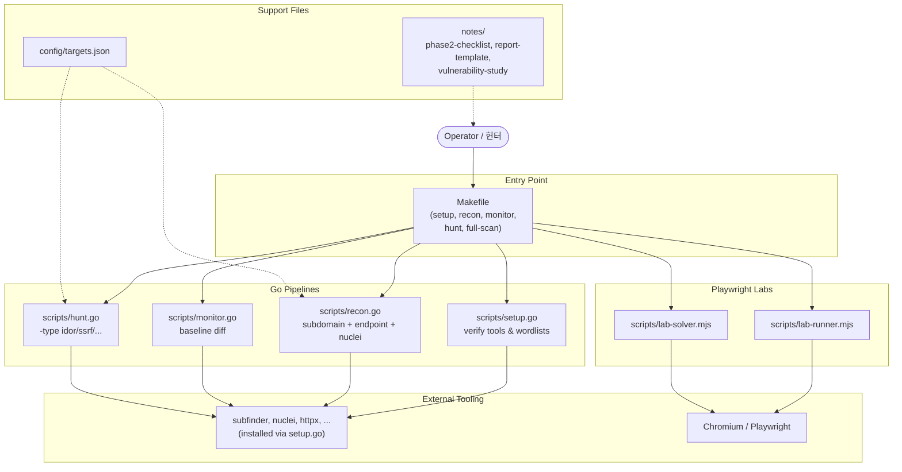

# Bug Bounty Automation Toolkit / 버그 바운티 자동화 툴킷

> Reconnaissance, monitoring, and targeted vulnerability hunting for
> responsible security research and bug bounty programs.
>
> 책임 있는 보안 연구 및 버그 바운티 프로그램을 위한 정찰, 모니터링,
> 표적형 취약점 헌팅 도구 모음입니다.

---

## Overview / 개요

This toolkit orchestrates a complete bug-bounty workflow — from initial
asset discovery and continuous monitoring to targeted vulnerability
scanning (IDOR, SSRF, …) and browser-driven lab exercises. Performance-
critical stages are implemented as Go binaries, while Playwright-based
lab runners solve exercises on safe, scoped platforms. A single
`Makefile` provides consistent entry points across operators and
machines.

이 툴킷은 초기 자산 발견과 지속적 모니터링부터 IDOR·SSRF 등 표적형
취약점 스캔, 브라우저 기반 실습에 이르는 버그 바운티 워크플로우를
오케스트레이션합니다. 성능이 중요한 단계는 Go 바이너리로, Playwright
기반 실습 러너는 Node.js로 구성되어 있으며, 단일 `Makefile`을 통해
운영자와 머신 전체에 일관된 진입점을 제공합니다.

### Intended Audience / 대상 사용자

- Bug bounty hunters running structured engagements / 구조화된 업무를 진행하는 버그 바운티 헌터
- Application security engineers tracking asset changes over time / 자산 변화를 지속적으로 추적하는 애플리케이션 보안 엔지니어
- CTF / lab participants practicing exploitation in safe environments / 안전한 환경에서 익스플로잇을 연습하는 CTF·실습 참여자

### Responsible Use / 책임 있는 사용

Run this toolkit only against systems you are explicitly authorized to
test — your own assets, scoped bug bounty programs, or dedicated lab
platforms such as PortSwigger Web Security Academy, HackTheBox, or
TryHackMe. Unauthorized scanning may violate computer-misuse laws in
your jurisdiction.

본 툴킷은 명시적으로 테스트 권한을 부여받은 시스템(자체 자산, 스코프가
정의된 버그 바운티 프로그램, PortSwigger Web Security Academy ·
HackTheBox · TryHackMe 등 전용 실습 플랫폼)에 대해서만 실행하시기
바랍니다. 권한 없는 스캔은 관련 컴퓨터 오용 법령을 위반할 수 있습니다.

---

## Features / 주요 기능

| Area / 영역 | Capability / 기능 |
|---|---|
| Setup / 설치 | Tool verification, wordlist bootstrap / 도구 검증 및 워드리스트 부트스트랩 |
| Recon / 정찰 | Subdomain enumeration, endpoint discovery, nuclei templates / 서브도메인 열거, 엔드포인트 발견, nuclei 템플릿 |
| Recon-fast / 빠른 정찰 | Lightweight recon without nuclei stage / nuclei 단계를 생략한 경량 정찰 |
| Monitor / 모니터링 | Baseline diffing to detect new subdomains and endpoints / 새로운 서브도메인·엔드포인트 감지를 위한 베이스라인 비교 |
| Hunt / 헌팅 | Targeted vulnerability scan across multiple bug classes / 다양한 버그 클래스에 대한 표적형 스캔 |
| Hunt IDOR / IDOR 헌팅 | Insecure Direct Object Reference checks / IDOR 점검 |
| Hunt SSRF / SSRF 헌팅 | Server-Side Request Forgery checks / SSRF 점검 |
| Full-scan / 전체 스캔 | Combined recon + hunt pipeline / 정찰과 헌팅을 결합한 파이프라인 |
| Lab runner / 실습 러너 | Playwright-driven browser automation for safe lab platforms / 안전한 실습 플랫폼용 Playwright 브라우저 자동화 |
| Lab solver / 실습 솔버 | Auxiliary solver scripts for lab exercises / 실습 문제 보조 솔버 스크립트 |
| Reporting / 보고 | Phase-2 checklist, report template, vulnerability study notes / 2단계 체크리스트, 보고서 템플릿, 취약점 연구 노트 |

---

## Architecture / 아키텍처



### Project Layout / 프로젝트 구조

```
.
├── AGENTS.md                 # Operator / contributor guidance
├── Makefile                  # Unified command surface
├── README.md                 # This document
├── package.json              # Node.js manifest (playwright)
├── package-lock.json
├── config/
│   └── targets.json          # Target inventory consumed by pipelines
├── notes/
│   ├── phase2-checklist.md   # Engagement-phase checklist
│   ├── report-template.md    # Vulnerability report skeleton
│   └── vulnerability-study.md
└── scripts/
    ├── setup.go              # Bootstrap: tools + wordlists
    ├── recon.go              # Discovery: subdomains, endpoints, nuclei
    ├── monitor.go            # Diff: detect new assets vs. baseline
    ├── hunt.go               # Targeted vuln hunting (IDOR, SSRF, ...)
    ├── lab-runner.mjs        # Playwright lab automation
    └── lab-solver.mjs        # Lab solving helpers
```

---

## Quick Start / 빠른 시작

### Prerequisites / 사전 요구 사항

| Requirement / 요구 사항 | Notes / 비고 |
|---|---|
| Go (>= 1.21) | Compiles the recon/monitor/hunt pipelines / 파이프라인 빌드용 |
| Node.js (>= 18) | Runs the Playwright lab scripts / Playwright 실습 스크립트용 |
| `make` | Drives the unified command surface / 통합 명령 인터페이스 |
| `npx` / Playwright browsers | Installed via `playwright` dependency / 의존성으로 설치 |
| Standard recon tooling | `subfinder`, `nuclei`, `httpx`, etc. — provisioned by `setup.go` |

### First Run / 첫 실행

```bash
# 1. Clone the repository / 저장소 복제
git clone https://github.com/jclee941/.github
cd bug

# 2. Install Node dependencies (Playwright) / Node 의존성 설치
npm install
npx playwright install chromium

# 3. Verify Go toolchain and provision external tools + wordlists
make setup
```

### Run a Full Engagement / 전체 점검 실행

```bash
# Full recon on a scoped target
make recon TARGET=example.com

# Detect new findings against a stored baseline
make monitor TARGET=example.com

# Targeted vulnerability hunt
make hunt TARGET=example.com

# Combined: recon + hunt
make full-scan TARGET=example.com
```

---

## Configuration / 설정

### `config/targets.json`

Targets consumed by the Go pipelines. Edit this file to register
authorized scopes before running recon or hunt. The `setup.go` step
verifies that required tooling is reachable; the recon and hunt stages
read the target list from this configuration.

Go 파이프라인이 사용하는 대상 목록입니다. recon 또는 hunt를 실행하기
전에 권한이 있는 스코프를 이 파일에 등록하세요. `setup.go` 단계는
필수 도구의 접근 가능 여부를 확인하고, recon·hunt 단계는 이 설정
파일에서 대상 목록을 읽습니다.

```json
{
  "targets": [
    {
      "name": "example-program",
      "domain": "example.com",
      "scope": ["*.example.com"],
      "out_of_scope": ["blog.example.com"]
    }
  ]
}
```

> Always review your target's program policy before adding a domain.
> 도메인을 추가하기 전에 반드시 해당 프로그램의 정책과 스코프를
> 확인하세요.

---

## Commands Reference / 명령어 레퍼런스

All commands are routed through the `Makefile` so the entry surface
stays consistent.

모든 명령은 일관된 진입점을 위해 `Makefile`을 통해 라우팅됩니다.

| Command / 명령어 | Description / 설명 |
|---|---|
| `make help` | Show the command catalog / 명령어 목록 출력 |
| `make setup` | Verify Go/Node toolchain, install wordlists / 도구 검증, 워드리스트 설치 |
| `make recon TARGET=example.com` | Full recon: subdomains, endpoints, nuclei / 전체 정찰 |
| `make recon-fast TARGET=example.com` | Lightweight recon, skip nuclei / nuclei 생략한 경량 정찰 |
| `make monitor TARGET=example.com` | Diff against baseline, surface new assets / 베이스라인 대비 신규 자산 비교 |
| `make hunt TARGET=example.com` | Targeted vulnerability hunt / 표적형 취약점 헌팅 |
| `make hunt-idor TARGET=example.com` | IDOR-only scan / IDOR 전용 스캔 |
| `make hunt-ssrf TARGET=example.com` | SSRF-only scan / SSRF 전용 스캔 |
| `make full-scan TARGET=example.com` | Recon + hunt combined / 정찰 + 헌팅 결합 |
| `make scan-target TARGET=example.com` | Alias used by extended pipelines / 확장 파이프라인 별칭 |
| `make clean` | Remove generated artifacts / 생성된 산출물 정리 |

### Direct Script Flags / 스크립트 직접 플래그

The Go scripts can also be invoked directly with `go run`:

Go 스크립트는 `go run`으로 직접 호출할 수도 있습니다.

```bash
go run scripts/recon.go   -d example.com
go run scripts/recon.go   -d example.com -skip-nuclei
go run scripts/monitor.go -d example.com
go run scripts/hunt.go    -d example.com
go run scripts/hunt.go    -d example.com -type idor
go run scripts/hunt.go    -d example.com -type ssrf
```

| Flag / 플래그 | Scripts / 적용 스크립트 | Meaning / 의미 |
|---|---|---|
| `-d <domain>` | recon, monitor, hunt | Target domain (required) / 대상 도메인 (필수) |
| `-skip-nuclei` | recon | Skip the nuclei scanning stage / nuclei 단계 생략 |
| `-type <class>` | hunt | Restrict to a bug class (e.g. `idor`, `ssrf`) / 특정 버그 클래스만 수행 |

---

## Local Development / 로컬 개발

### Environment / 환경

- Go modules are not used; each `scripts/*.go` is a standalone entry.
  Run them via `go run` or the `Makefile` wrappers.
- Node.js dependencies are managed through `package.json` /
  `package-lock.json`. Playwright is the only runtime dependency.
- `config/targets.json` is the single source of truth for the
  recon/hunt pipelines — keep it in sync with your authorized scope.

- Go 모듈은 사용하지 않으며, 각 `scripts/*.go`는 독립 실행형
  진입점입니다. `go run` 또는 `Makefile` 래퍼를 통해 실행하세요.
- Node.js 의존성은 `package.json` / `package-lock.json`으로
  관리합니다. 런타임 의존성은 Playwright 하나뿐입니다.
- `config/targets.json`이 recon/hunt 파이프라인의 단일 진실
  소스이므로, 권한이 부여된 스코프와 항상 동기화하세요.

### Adding a New Pipeline Stage / 파이프라인 단계 추가

1. Create a new file under `scripts/` (e.g. `scripts/dast.go`).
2. Add a target in the `Makefile` using the `GO := go run` pattern
   so it appears in `make help`.
3. Document the script's flags in this README's *Direct Script
   Flags* table.
4. Update the architecture diagram if the new stage changes the
   data flow.

1. `scripts/` 아래에 새 파일을 만듭니다 (예: `scripts/dast.go`).
2. `Makefile`의 `GO := go run` 패턴을 사용해 새 타겟을 추가하고
   `make help`에 노출시킵니다.
3. 새 스크립트의 플래그를 본 README의 *Direct Script Flags*
   표에 문서화합니다.
4. 데이터 흐름이 바뀌면 아키텍처 다이어그램도 갱신합니다.

### Notes & Templates / 노트 및 템플릿

- `notes/phase2-checklist.md` — engagement-phase checklist
  점검 단계별 체크리스트
- `notes/report-template.md` — submission-ready vulnerability
  report skeleton
  제출용 취약점 보고서 골격
- `notes/vulnerability-study.md` — study notes for bug classes
  버그 클래스별 연구 노트

---

## Testing / 테스트

The repository does not ship a unit-test harness — the placeholder
`npm test` script in `package.json` exits with a message, and the Go
scripts are designed to be exercised end-to-end against scoped
targets or lab environments. Validate changes by:

이 저장소는 단위 테스트 하네스를 포함하지 않습니다. `package.json`의
`npm test`는 안내 메시지를 출력하고 종료하며, Go 스크립트는 스코프
내 대상 또는 실습 환경에서 종단간(End-to-End)으로 실행하도록 설계되어
있습니다. 변경 사항은 다음 방법으로 검증하세요.

1. `make setup` — confirm tool verification still passes.
   `make setup`을 실행해 도구 검증이 통과하는지 확인합니다.
2. Run a smoke pass against a non-production lab target using
   `make recon-fast` and `make hunt-idor`.
   비운영 실습 대상에 대해 `make recon-fast`와 `make hunt-idor`로
   스모크 테스트를 수행합니다.
3. For Playwright changes, execute the affected `lab-*.mjs` script
   manually after `npx playwright install chromium`.
   Playwright 변경의 경우, `npx playwright install chromium` 후
   영향 받은 `lab-*.mjs` 스크립트를 수동으로 실행합니다.

---

## Contribution Guide / 기여 가이드

1. **Scope discipline** — never commit real customer data, captured
   tokens, or unscoped reconnaissance output. Sanitize examples
   before opening a pull request.
   **스코프 준수** — 실제 고객 데이터, 탈취한 토큰, 권한 없는
   정찰 결과는 커밋하지 마세요. PR을 열기 전에 예시를
   비식별화하세요.
2. **Idempotent setup** — changes to `setup.go` must remain safe
   to re-run on a populated host.
   **멱등한 설치** — `setup.go` 변경은 기존 도구가 설치된
   환경에서도 안전하게 재실행되어야 합니다.
3. **Bilingual docs** — update both the English and Korean
   sections of this README so they stay in sync.
   **이중 언어 문서** — 본 README의 영문·한글 섹션을
   모두 갱신해 동기화 상태를 유지하세요.
4. **Make-first** — add new capabilities as `Makefile` targets so
   they surface in `make help` and stay consistent with the rest
   of the toolkit.
   **Make 우선** — 새로운 기능은 `Makefile` 타겟으로 추가해
   `make help`에 노출하고 툴킷 전체와 일관성을 유지하세요.

Please review `AGENTS.md` in the repository root for additional
contributor notes.

추가 기여자 안내는 저장소 루트의 `AGENTS.md`를 참고하세요.

---

## License / 라이선스

This project is released under the **ISC License** (see
`package.json`). / 본 프로젝트는 **ISC 라이선스** 하에 배포됩니다
(`package.json` 참조).

---

## Disclaimer / 면책 조항

The maintainers of this repository do not condone unauthorized
testing. You are solely responsible for ensuring that every command
you run from this toolkit is permitted by the asset owner, the
applicable bug bounty program policy, and the law in your
jurisdiction.

이 저장소의 유지보수자는 권한 없는 테스트를 권장하지 않습니다.
본 툴킷에서 실행하는 모든 명령이 자산 소유자, 해당 버그 바운티
프로그램 정책, 그리고 귀하의 관할권 법률에 의해 허용되는지
확인하는 책임은 전적으로 사용자에게 있습니다.