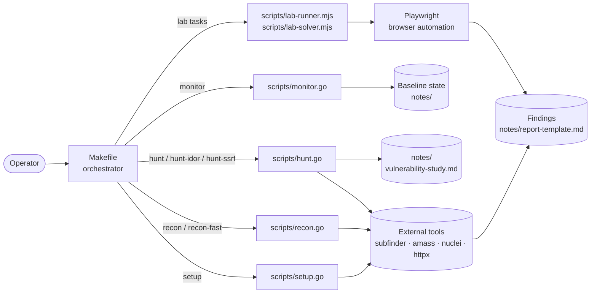

# Bug Bounty Automation Toolkit / 버그 바운티 자동화 툴킷

> Reconnaissance, monitoring, and targeted vulnerability hunting for
> responsible security research and bug bounty programs.
>
> 책임 있는 보안 연구 및 버그 바운티 프로그램을 위한 정찰, 모니터링,
> 표적형 취약점 헌팅 도구 모음입니다.

---

## Overview / 개요

This toolkit orchestrates a full bug-bounty workflow — from initial asset
discovery and continuous monitoring to targeted vulnerability scanning
(IDOR, SSRF, and more). It is built on a small set of Go binaries for
performance-critical tasks (recon, hunt, monitor) and Node.js scripts
for browser-driven lab exercises (Playwright).

이 툴킷은 초기 자산 발견과 지속적 모니터링부터 IDOR·SSRF 등 표적형
취약점 스캔에 이르는 버그 바운티 워크플로우를 오케스트레이션합니다.
성능이 중요한 단계(recon·hunt·monitor)는 Go 바이너리로, 브라우저
기반 실습 단계는 Node.js + Playwright로 구성되어 있습니다.

**Intended audience / 대상 사용자**

- Bug bounty hunters running structured engagements
- Application security engineers tracking asset changes over time
- CTF / lab participants practicing exploitation in a safe environment

---

## Features / 주요 기능

| Area / 영역 | Capability / 기능 |
|---|---|
| Setup / 설치 | Tool verification, wordlist bootstrap |
| Recon / 정찰 | Subdomain enumeration, endpoint discovery, nuclei templates |
| Recon-fast | Lightweight recon that skips the nuclei scan stage |
| Monitor / 모니터 | Differential scanning — surface new subdomains & endpoints |
| Hunt / 헌팅 | Targeted vulnerability hunting (generic mode) |
| Hunt — IDOR | Insecure Direct Object Reference checks |
| Hunt — SSRF | Server-Side Request Forgery checks |
| Lab runner / 실습 실행기 | Playwright-driven browser exercises (`lab-runner.mjs`) |
| Lab solver / 실습 솔버 | Automated lab walkthroughs (`lab-solver.mjs`) |

All entry points are exposed through a single `Makefile` so the workflow
remains consistent across operators.

---

## Architecture / 아키텍처



**Module responsibilities / 모듈 책임**

- `Makefile` — single entry point; resolves the `TARGET` variable and
  dispatches to the correct Go or Node script.
- `scripts/setup.go` — verifies that required external CLIs are present
  and downloads baseline wordlists.
- `scripts/recon.go` — full reconnaissance pipeline (subdomain
  enumeration, HTTP probing, nuclei templates). Accepts `-skip-nuclei`
  for a faster pass.
- `scripts/monitor.go` — compares the current run against a stored
  baseline and reports newly observed assets.
- `scripts/hunt.go` — launches targeted vulnerability scans. The
  `-type` flag selects a category (e.g. `idor`, `ssrf`).
- `scripts/lab-runner.mjs` / `scripts/lab-solver.mjs` — Node.js scripts
  that drive a headless browser through lab environments via Playwright.
- `config/targets.json` — structured target configuration consumed by
  the Go scripts.
- `notes/` — operator notes: study material, checklists, and report
  templates.

---

## Repository Layout / 저장소 구조

```
.
├── AGENTS.md
├── Makefile
├── README.md
├── package.json
├── package-lock.json
├── config/
│   └── targets.json
├── notes/
│   ├── phase2-checklist.md
│   ├── report-template.md
│   └── vulnerability-study.md
└── scripts/
    ├── hunt.go
    ├── lab-runner.mjs
    ├── lab-solver.mjs
    ├── monitor.go
    ├── recon.go
    └── setup.go
```

---

## Prerequisites / 사전 요구사항

- **Go** ≥ 1.21 — to compile and run the Go scripts in `scripts/`.
- **Node.js** ≥ 18 — to run the lab scripts and Playwright.
- **External CLI tools** — `make setup` verifies and reports any
  missing binaries (typical stack: `subfinder`, `amass`, `httpx`,
  `nuclei`, `dnsx`).
- **A `TARGET` variable** — every reconnaissance and hunting command
  requires a target domain.

Install Node.js dependencies once after cloning:

```bash
npm install
```

This pulls in Playwright. On first browser use you may also need:

```bash
npx playwright install
```

---

## Quick Start / 빠른 시작

```bash
# 1. Clone and enter the repository
git clone <your-fork-url> bug
cd bug

# 2. Install Node.js dependencies (Playwright)
npm install

# 3. Verify your local toolchain
make setup

# 4. Run a full reconnaissance sweep
make recon TARGET=example.com

# 5. Run a complete recon + hunt cycle
make full-scan TARGET=example.com
```

The `make help` target prints the full command catalog at any time.

---

## Configuration / 설정

### `config/targets.json`

The Go scripts read their target list from `config/targets.json`. The
exact schema is owned by `scripts/recon.go` and `scripts/hunt.go`;
keep entries aligned with the domains you have authorization to test.

### `notes/`

Operator-authored material — not consumed by the tooling itself, but
useful for tracking engagements:

- `phase2-checklist.md` — engagement-phase tasks.
- `report-template.md` — disclosure report skeleton.
- `vulnerability-study.md` — vulnerability class notes.

### Environment variables / 환경 변수

The Makefile exposes one user-facing variable:

| Variable | Default | Purpose |
|---|---|---|
| `TARGET` | _(empty)_ | Target domain passed via `-d` to the Go scripts. |

---

## Commands Reference / 명령어 레퍼런스

| Command | Description |
|---|---|
| `make help` | Print the catalog of available targets. |
| `make setup` | Verify external tools and download wordlists. |
| `make recon TARGET=<domain>` | Full reconnaissance pipeline. |
| `make recon-fast TARGET=<domain>` | Recon without the nuclei stage. |
| `make monitor TARGET=<domain>` | Diff-scan for new subdomains/endpoints. |
| `make hunt TARGET=<domain>` | Targeted vulnerability scan (generic). |
| `make hunt-idor TARGET=<domain>` | Hunt IDOR vulnerabilities. |
| `make hunt-ssrf TARGET=<domain>` | Hunt SSRF vulnerabilities. |
| `make full-scan TARGET=<domain>` | Recon + hunt end-to-end. |
| `make scan-target` | Alias for an extended scan profile. |
| `make clean` | Remove generated artifacts. |

Every command that takes a target will fail fast with a clear usage
message if `TARGET` is not set.

---

## Local Development / 로컬 개발

**Go scripts / Go 스크립트**

Each script in `scripts/` is a standalone `package main`. Run them
directly during development:

```bash
go run scripts/recon.go -d example.com -skip-nuclei
go run scripts/hunt.go  -d example.com -type idor
go run scripts/monitor.go -d example.com
```

**Node.js scripts / Node.js 스크립트**

Lab scripts use plain ES modules and can be executed with Node ≥ 18:

```bash
node scripts/lab-runner.mjs
node scripts/lab-solver.mjs
```

**Iteration loop / 반복 사이클**

1. Edit a script under `scripts/`.
2. Re-run the corresponding `make <target>` to verify the change.
3. Record findings or process notes under `notes/`.

---

## Testing / 테스트

This repository does not ship an automated test suite — the toolkit is
an operator-driven automation harness, and each script's correctness
is validated against live target environments.

When contributing fixes or new modules:

1. Run `make setup` to confirm the local toolchain.
2. Run `make recon-fast TARGET=<your-test-domain>` as a smoke test.
3. Exercise any new hunt type against a known lab target.
4. Document the new behavior in `notes/vulnerability-study.md` or the
   relevant checklist.

---

## Contribution Guide / 기여 가이드

1. Fork the repository and create a topic branch
   (`feat/<short-description>` or `fix/<short-description>`).
2. Keep changes scoped: one script per commit where possible.
3. Update `Makefile` help text when adding new public commands.
4. Update `README.md` and `notes/` when introducing new vulnerability
   classes or workflow phases.
5. Run `make full-scan` (against a permitted target) before opening a
   pull request.
6. Open a pull request describing motivation, scope, and any
   operational impact.

---

## Responsible Use & Disclaimer / 책임 있는 사용 및 면책

This toolkit is provided for **authorized security testing and bug
bounty research only**. Operators must obtain explicit permission from
the asset owner before running any scan. The maintainers disclaim all
responsibility for misuse.

이 툴킷은 **승인된 보안 테스트 및 버그 바운티 연구** 목적만으로
제공됩니다. 자산 소유자의 명시적 허가를 받은 경우에만 스캔을
실행해야 하며, 유지보수자는 오용에 대한 책임을 지지 않습니다.

---

## License / 라이선스

Released under the **ISC License** (see `package.json`). By
contributing, you agree that your contributions are licensed under the
same terms.