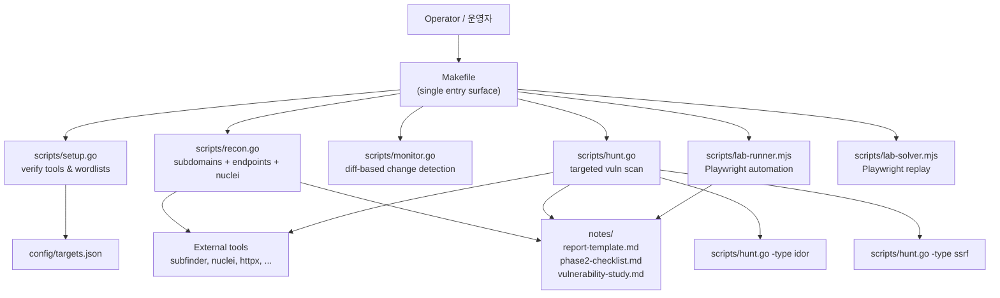

# Bug Bounty Automation Toolkit / 버그 바운티 자동화 툴킷

> Reconnaissance, monitoring, and targeted vulnerability hunting for
> responsible security research and bug bounty programs.
>
> 책임 있는 보안 연구 및 버그 바운티 프로그램을 위한 정찰, 모니터링,
> 표적형 취약점 헌팅 도구 모음입니다.

---

## Overview / 개요

This toolkit orchestrates a complete bug-bounty workflow — from initial
asset discovery and continuous monitoring to targeted vulnerability
scanning (IDOR, SSRF, …) and browser-driven lab exercises.
Performance-critical stages run as Go binaries, while Playwright-based
lab runners operate on safe, scoped platforms. A single `Makefile`
exposes consistent entry points across operators and machines.

이 툴킷은 초기 자산 발견과 지속적 모니터링부터 IDOR·SSRF 등 표적형
취약점 스캔, 브라우저 기반 실습까지 버그 바운티 워크플로우 전체를
오케스트레이션합니다. 성능이 중요한 단계는 Go 바이너리로, 실습
플랫폼에서는 Playwright(Node.js)가 동작하며, 단일 `Makefile`을 통해
운영자와 머신 전체에서 일관된 진입점을 제공합니다.

### Intended Audience / 대상 사용자

- **Bug bounty hunters** running structured engagements / 구조화된 업무를 진행하는 버그 바운티 헌터
- **Application security engineers** tracking asset changes over time / 자산 변화를 지속적으로 추적하는 애플리케이션 보안 엔지니어
- **CTF / lab participants** practicing exploitation in safe environments / 안전한 환경에서 익스플로잇을 연습하는 CTF·실습 참여자

### Responsible Use / 책임 있는 사용

Run this toolkit only against systems you are explicitly authorized to
test — your own assets, scoped bug bounty programs, or dedicated lab
platforms such as PortSwigger Web Security Academy, HackTheBox, or
TryHackMe. Unauthorized scanning may violate computer-misuse laws in
your jurisdiction.

본 툴킷은 명시적으로 테스트 권한을 부여받은 시스템(자체 자산, 스코프가
정의된 버그 바운티 프로그램, PortSwigger Web Security Academy ·
HackTheBox · TryHackMe 등 전용 실습 플랫폼)에 대해서만 실행하시기
바랍니다. 권한 없는 스캔은 관할권의 컴퓨터 오용 법령을 위반할 수
있습니다.

---

## Features / 주요 기능

| Area / 영역 | Capability / 기능 |
|---|---|
| Setup / 설치 | External tool verification, wordlist bootstrap / 외부 도구 검증, 워드리스트 부트스트랩 |
| Recon / 정찰 | Subdomain enumeration, endpoint discovery, nuclei scan / 서브도메인 열거, 엔드포인트 발견, nuclei 스캔 |
| Recon-fast / 빠른 정찰 | Skip nuclei for rapid iteration / nuclei 단계를 건너뛰어 빠른 반복 수행 |
| Monitor / 모니터링 | Diff-based change detection for subdomains and endpoints / 서브도메인·엔드포인트의 차분 기반 변경 감지 |
| Hunt / 헌팅 | Targeted vulnerability scan on a known asset / 알려진 자산에 대한 표적형 취약점 스캔 |
| Hunt-idor / IDOR 헌팅 | IDOR-specific focused scan / IDOR 집중 스캔 |
| Hunt-ssrf / SSRF 헌팅 | SSRF-specific focused scan / SSRF 집중 스캔 |
| Lab runner / 실습 러너 | Playwright-driven browser automation for safe lab platforms / 안전한 실습 플랫폼용 Playwright 브라우저 자동화 |
| Lab solver / 실습 솔버 | Playwright-driven solution playback for repeatable exercises / 반복 가능한 연습을 위한 Playwright 기반 솔루션 재생 |
| Reporting / 보고 | Markdown report template and phase-2 checklist under `notes/` / `notes/` 하위 마크다운 보고서 템플릿 및 2단계 체크리스트 |

---

## Architecture / 아키텍처



The tool layer is intentionally thin: `scripts/*.go` wraps external CLI
tools and orchestrates pipeline ordering, while `scripts/*.mjs` isolates
browser-based lab work so that scanning and labbing never share a
runtime.

도구 레이어는 의도적으로 얇게 설계되었습니다. `scripts/*.go`는 외부 CLI
도구를 래핑하고 파이프라인 순서를 오케스트레이션하며, `scripts/*.mjs`는
브라우저 기반 실습을 분리해 스캔과 실습이 런타임을 공유하지 않도록
합니다.

---

## Repository Structure / 저장소 구조

```
.
├── AGENTS.md
├── Makefile
├── README.md
├── package.json
├── package-lock.json
├── config/
│   └── targets.json
├── notes/
│   ├── phase2-checklist.md
│   ├── report-template.md
│   └── vulnerability-study.md
└── scripts/
    ├── hunt.go
    ├── lab-runner.mjs
    ├── lab-solver.mjs
    ├── monitor.go
    ├── recon.go
    └── setup.go
```

- `Makefile` — single entry surface that wraps every Go script.
- `scripts/*.go` — Go orchestration scripts (`setup`, `recon`, `monitor`, `hunt`).
- `scripts/*.mjs` — Playwright (Node.js) scripts for browser-based labs.
- `config/targets.json` — target list and per-target options.
- `notes/` — checklists, report template, and vulnerability study notes.
- `AGENTS.md` — repository-local agent guidance for collaborators.

---

## Quick Start / 빠른 시작

### Prerequisites / 사전 요구 사항

- **Go** (compatible with `go run` in `scripts/`) / `go run` 호환 Go
- **Node.js** with `npm` (for the Playwright scripts) / Playwright 스크립트용 Node.js + npm
- Standard external security tooling expected by `scripts/setup.go`
  (e.g. `subfinder`, `httpx`, `nuclei`, `jq`) / `scripts/setup.go`가
  검증하는 외부 보안 도구들
- An explicit, written scope for every target you intend to scan / 스캔 대상별 명시적 서면 스코프

### Install / 설치

```bash
git clone https://github.com/jclee941/.github
cd bug
make setup
npm install
```

`make setup` verifies the required external tools and bootstraps the
wordlists used by the recon pipeline. `npm install` pulls in Playwright
for the lab scripts.

`make setup`은 필요한 외부 도구를 검증하고 정찰 파이프라인이 사용하는
워드리스트를 부트스트랩합니다. `npm install`은 실습 스크립트를 위한
Playwright를 설치합니다.

### First Run / 첫 실행

```bash
# Full recon on a scoped target
make recon TARGET=example.com

# Detect new assets since the last run
make monitor TARGET=example.com

# Targeted vulnerability hunt
make hunt TARGET=example.com

# Everything in one shot
make full-scan TARGET=example.com
```

---

## Configuration / 설정

### `config/targets.json`

The Go scripts read `config/targets.json` to discover the canonical
target list, per-target scope metadata, and pipeline options consumed
by `setup`, `recon`, and `monitor`. Treat this file as sensitive — it
may contain program-specific notes.

Go 스크립트는 `config/targets.json`을 읽어 정식 대상 목록, 대상별
스코프 메타데이터, `setup`·`recon`·`monitor`가 소비하는 파이프라인
옵션을 파악합니다. 프로그램별 메모가 포함될 수 있으므로 민감 정보로
취급하세요.

### `TARGET` Make Variable / `TARGET` Make 변수

Most commands accept a `TARGET=` override on the command line so you do
not need to edit `config/targets.json` for ad-hoc engagements:

대부분의 명령은 명령줄의 `TARGET=` 오버라이드를 허용하므로 임시 업무를
위해 `config/targets.json`을 수정할 필요가 없습니다.

```bash
make recon TARGET=staging.example.com
make hunt-idor TARGET=api.example.com
```

### Per-Command Flags / 명령별 플래그

- `recon` — accepts `-skip-nuclei` for fast iteration.
- `hunt` — accepts `-type idor` or `-type ssrf` to focus the scan.

---

## Commands Reference / 명령 레퍼런스

| Command / 명령 | Purpose / 설명 |
|---|---|
| `make help` | Print the command help banner / 명령 도움말 배너 출력 |
| `make setup` | Verify tools and bootstrap wordlists / 도구 검증 및 워드리스트 부트스트랩 |
| `make recon TARGET=<domain>` | Full recon pipeline on a target / 대상에 대한 전체 정찰 파이프라인 |
| `make recon-fast TARGET=<domain>` | Recon without the nuclei stage / nuclei 단계 생략 정찰 |
| `make monitor TARGET=<domain>` | Diff monitor — detect new findings / 차분 모니터링 — 신규 발견 탐지 |
| `make hunt TARGET=<domain>` | Targeted vulnerability hunt / 표적형 취약점 헌팅 |
| `make hunt-idor TARGET=<domain>` | IDOR-only hunt / IDOR 전용 헌팅 |
| `make hunt-ssrf TARGET=<domain>` | SSRF-only hunt / SSRF 전용 헌팅 |
| `make full-scan TARGET=<domain>` | Run the entire pipeline / 전체 파이프라인 실행 |
| `make scan-target TARGET=<domain>` | Single-target scan profile / 단일 대상 스캔 프로파일 |
| `make clean` | Remove generated artifacts / 생성된 산출물 제거 |

### Playwright Lab Scripts / Playwright 실습 스크립트

The lab scripts are invoked directly through Node, not through `make`,
so that lab work stays decoupled from the Go pipelines:

실습 스크립트는 Go 파이프라인과 분리하기 위해 `make`가 아닌 Node로
직접 실행합니다.

```bash
# Run a lab scenario against a permitted lab platform
node scripts/lab-runner.mjs --scenario <name>

# Replay a recorded solution
node scripts/lab-solver.mjs --scenario <name>
```

Refer to the script headers and `AGENTS.md` for the latest flags and
required environment variables.

최신 플래그와 필요한 환경 변수는 스크립트 헤더와 `AGENTS.md`를
참조하세요.

---

## Local Development / 로컬 개발

- Go scripts live under `scripts/` and are executed through `go run`,
  so there is no separate build step during iteration. Add a new file
  there and expose it through the `Makefile` to keep a single entry
  surface.
  Go 스크립트는 `scripts/`에 있으며 `go run`으로 실행되므로 반복 개발
  중 별도의 빌드 단계가 필요하지 않습니다. 새 파일을 추가한 뒤
  `Makefile`을 통해 노출해 단일 진입점을 유지하세요.
- Node scripts use the project-level `package.json`. Install with
  `npm install` and run with `node scripts/<name>.mjs`.
  Node 스크립트는 프로젝트 루트의 `package.json`을 사용합니다.
  `npm install`로 설치하고 `node scripts/<name>.mjs`로 실행하세요.
- Update `config/targets.json` when you want a change to persist
  across sessions; use `TARGET=` for one-off runs.
  변경 사항을 세션 간 유지하려면 `config/targets.json`을 수정하고,
  일회성 실행에는 `TARGET=`을 사용하세요.
- Capture write-ups and methodology in `notes/` using
  `report-template.md` and `phase2-checklist.md`.
  분석 결과와 방법론은 `report-template.md`와 `phase2-checklist.md`
  형식을 따라 `notes/`에 기록하세요.

---

## Testing / 테스트

The repository does not ship an automated test suite — the `npm test`
script is a placeholder that exits with an error. Validate changes by:

이 저장소는 자동 테스트 스위트를 제공하지 않습니다. `npm test`는 오류를
발생시키는 자리표시자입니다. 다음 방법으로 변경 사항을 검증하세요.

1. Running `make help` and confirming the banner renders correctly /
   `make help`를 실행해 배너가 올바르게 표시되는지 확인합니다.
2. Executing `make setup` against a fresh environment / 신규 환경에서
   `make setup` 실행.
3. Pointing `make recon-fast` and `make hunt-idor` at a sanctioned lab
   target and inspecting generated artifacts under `notes/` and the
   output directory.
   `make recon-fast`와 `make hunt-idor`를 권한이 있는 실습 대상에
   실행하고 `notes/`와 출력 디렉터리의 산출물을 검토합니다.
4. For Node scripts, dry-run with `--dry-run` if the script supports
   it, or run against a local lab instance.
   Node 스크립트는 지원되는 경우 `--dry-run`으로 실행하거나 로컬
   실습 인스턴스에 대해 실행합니다.

---

## Contributing / 기여 가이드

1. **Scope first.** Never commit a target, screenshot, or payload that
   falls outside an authorized program. / 스코프 우선. 권한 있는
   프로그램 범위 밖의 대상, 스크린샷, 페이로드는 절대 커밋하지
   마세요.
2. **Keep the entry surface small.** Add new stages by introducing a
   `scripts/<name>.go` (or `.mjs`) and wiring it into `Makefile` rather
   than embedding logic in ad-hoc shell. / 진입점은 작게 유지하세요.
   새 단계는 `scripts/<name>.go`(또는 `.mjs`)로 추가하고 `Makefile`에
   연결해 임시 셸에 로직을 넣지 마세요.
3. **Document methodology.** When you discover a reusable technique,
   add it to `notes/vulnerability-study.md` and cross-reference from
   `notes/phase2-checklist.md`. / 방법론을 문서화하세요. 재사용 가능한
   기법을 발견하면 `notes/vulnerability-study.md`에 추가하고
   `notes/phase2-checklist.md`에서 상호 참조하세요.
4. **Respect secrets.** Do not commit API keys, cookies, or session
   tokens; rely on environment variables for runtime credentials. /
   비밀 정보를 존중하세요. API 키, 쿠키, 세션 토큰을 커밋하지 말고
   런타임 자격 증명은 환경 변수를 사용하세요.
5. **Coordinate via `AGENTS.md`.** Read the repository-local agent
   guidance before making structural changes. / `AGENTS.md`를 통해
   조율하세요. 구조적 변경 전 저장소 로컬 에이전트 지침을 읽어보세요.

---

## License / 라이선스

This project is released under the **ISC License** as declared in
`package.json`.

이 프로젝트는 `package.json`에 명시된 **ISC License** 하에 배포됩니다.