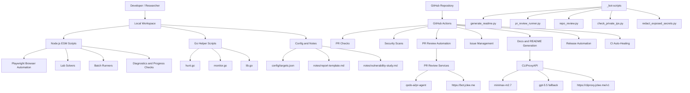

# Bug Bounty Automation Toolkit / 버그바운티 자동화 툴킷


## Overview / 개요

### English

Bug Bounty Automation Toolkit is a local automation workspace for authorized web security research, vulnerability-study exercises, and lab-solving workflows. The repository combines:

- Node.js ESM scripts for PortSwigger/Web Security Academy style lab automation and browser-driven workflows.
- Go helper programs for monitoring and vulnerability-hunting command orchestration.
- GitHub Actions workflows for PR checks, security scanning, PR review automation, issue management, release automation, documentation sync, and CI auto-healing.
- Bot-side helper scripts under `_bot-scripts/` for README generation, PR review running, repository review, secret redaction, and private IP checks.

The project is designed for authorized testing only. Do not run scans, lab payloads, or automated browser actions against systems you do not own or have explicit permission to test.

### 한국어

Bug Bounty Automation Toolkit은 허가된 웹 보안 연구, 취약점 학습, 실습 랩 자동화를 위한 로컬 자동화 워크스페이스입니다. 이 저장소는 다음 구성요소를 포함합니다.

- PortSwigger/Web Security Academy 유형 랩 자동화와 브라우저 기반 작업을 위한 Node.js ESM 스크립트
- 모니터링 및 취약점 헌팅 명령 오케스트레이션을 위한 Go 헬퍼 프로그램
- PR 검사, 보안 스캔, PR 리뷰 자동화, 이슈 관리, 릴리스 자동화, 문서 동기화, CI 자동 복구를 위한 GitHub Actions 워크플로
- README 생성, PR 리뷰 실행, 저장소 리뷰, 시크릿 마스킹, 사설 IP 검사 등을 위한 `_bot-scripts/`의 봇 보조 스크립트

이 프로젝트는 반드시 허가된 테스트에만 사용해야 합니다. 소유하지 않았거나 명시적 허가를 받지 않은 시스템을 대상으로 스캔, 페이로드, 자동 브라우저 동작을 실행하지 마세요.

---

## Features / 주요 기능

### English

- Browser-driven lab automation using Playwright.
- Multiple Node.js solver and batch-runner scripts for lab exploration, diagnosis, and retry workflows.
- Go-based helper scripts currently present for hunting and monitoring:
  - `scripts/hunt.go`
  - `scripts/monitor.go`
  - `scripts/lib.go`
- Target configuration through `config/targets.json`.
- Notes and reporting assets:
  - `notes/phase2-checklist.md`
  - `notes/report-template.md`
  - `notes/vulnerability-study.md`
- 29 GitHub Actions workflow files for repository automation.
- Security automation with gitleaks, CodeQL, dependency review, OpenSSF Scorecard, semantic PR validation, and reusable security workflows.
- README generation automation using `minimax-m2.7` with fallback `gpt-5.5` through CLIProxyAPI at `https://cliproxy.jclee.me/v1`.
- Bot endpoints can be integrated through `https://bot.jclee.me`.

### 한국어

- Playwright 기반 브라우저 자동화 랩 실행
- 랩 탐색, 진단, 재시도, 배치 실행을 위한 다수의 Node.js 스크립트
- 현재 저장소에 존재하는 Go 기반 헬퍼 스크립트:
  - `scripts/hunt.go`
  - `scripts/monitor.go`
  - `scripts/lib.go`
- `config/targets.json` 기반 타깃 설정
- 학습 및 리포팅 문서:
  - `notes/phase2-checklist.md`
  - `notes/report-template.md`
  - `notes/vulnerability-study.md`
- 저장소 자동화를 위한 29개 GitHub Actions 워크플로 파일
- gitleaks, CodeQL, dependency review, OpenSSF Scorecard, semantic PR 검증, 재사용 보안 워크플로를 포함한 보안 자동화
- CLIProxyAPI의 `https://cliproxy.jclee.me/v1`을 통해 `minimax-m2.7` 모델을 기본으로 사용하고 `gpt-5.5`를 fallback으로 사용하는 README 생성 자동화
- `https://bot.jclee.me` 기반 봇 엔드포인트 연동 가능

---

## Architecture / 아키텍처



---

## Repository Structure / 저장소 구조

```text
/
├── AGENTS.md
├── CONTRIBUTING.md
├── LICENSE
├── Makefile
├── README.md
├── interactsh_payload.txt
├── output-lab08.png
├── package-lock.json
├── package.json
├── _bot-scripts/
│   ├── AGENTS.md
│   ├── CODE_OF_CONDUCT.md
│   ├── CONTRIBUTING.md
│   ├── Dockerfile.github_action
│   ├── Dockerfile.github_app
│   ├── LICENSE
│   ├── MANIFEST.in
│   ├── Makefile
│   ├── NOTICE
│   ├── README.md
│   ├── SECURITY.md
│   ├── docker-compose.github_app.yml
│   ├── docker-compose.github_app.yml.lxc
│   ├── filebeat.yml
│   ├── pyproject.toml
│   ├── requirements-dev.txt
│   ├── requirements.txt
│   ├── setup.py
│   └── scripts/
├── notes/
│   ├── phase2-checklist.md
│   ├── report-template.md
│   └── vulnerability-study.md
├── config/
│   └── targets.json
└── scripts/
    ├── *.cjs
    ├── *.mjs
    ├── *.go
    └── *.sh
```

---

## Automation Inventory / 자동화 인벤토리

### GitHub Actions Workflows / GitHub Actions 워크플로

The repository contains 29 workflow files.

이 저장소에는 29개의 워크플로 파일이 있습니다.

| File | Purpose |
|---|---|
| `01_branch-to-pr.yml` | Branch-to-PR automation |
| `02_issue-to-branch.yml` | Issue-to-branch automation |
| `03_pr-checks.yml` | Pull request validation checks |
| `04_actionlint.yml` | GitHub Actions workflow linting |
| `05_gitleaks.yml` | Secret scanning with gitleaks |
| `06_codeql.yml` | CodeQL static analysis |
| `07_dependency-review.yml` | Dependency review for PRs |
| `08_scorecard.yml` | OpenSSF Scorecard security posture checks |
| `09_semantic-pr.yml` | Semantic pull request title validation |
| `10_pr-review.yml` | Automated PR review workflow |
| `12_dependabot-auto-merge.yml` | Dependabot auto-merge automation |
| `13_pr-auto-merge.yml` | PR auto-merge automation |
| `14_bot-auto-fix.yml` | Bot-driven auto-fix workflow |
| `15_merged-pr-cleanup.yml` | Cleanup after merged pull requests |
| `18_issue-management.yml` | Issue labeling, triage, or lifecycle management |
| `19_issue-backfill.yml` | Issue metadata backfill automation |
| `20_readme-gen.yml` | README generation automation |
| `21_docs-sync.yml` | Documentation synchronization |
| `24_release-notes.yml` | Release notes generation |
| `25_release-publish.yml` | Release publishing automation |
| `29_downstream-health-check.yml` | Downstream health checks |
| `37_ci-failure-issues.yml` | Create or manage issues for CI failures |
| `42_reusable-docs-sync.yml` | Reusable documentation sync workflow |
| `43_reusable-issue-management.yml` | Reusable issue management workflow |
| `44_reusable-pr-checks.yml` | Reusable PR checks workflow |
| `45_reusable-gitleaks.yml` | Reusable gitleaks workflow |
| `60_ci-auto-heal.yml` | CI auto-healing workflow |
| `ci.yml` | General CI workflow |
| `security/11_pr-review.yml` | Security-scoped PR review workflow |

### Bot and Repository Automation Tools / 봇 및 저장소 자동화 도구

| Tool | Location | Purpose |
|---|---|---|
| `generate_readme.py` | `_bot-scripts/scripts/generate_readme.py` | Generates or refreshes README content |
| `pr_review_runner.py` | `_bot-scripts/scripts/pr_review_runner.py` | Runs automated PR review logic |
| `repo_review.py` | `_bot-scripts/scripts/repo_review.py` | Repository-level review helper |
| `check_private_ips.py` | `_bot-scripts/scripts/check_private_ips.py` | Detects hardcoded private/internal IP patterns |
| `check_private_ips_test.py` | `_bot-scripts/scripts/check_private_ips_test.py` | Tests for private IP detection |
| `pr_review_runner_test.py` | `_bot-scripts/scripts/pr_review_runner_test.py` | Tests for PR review runner behavior |
| `redact_exposed_secrets.py` | `_bot-scripts/scripts/redact_exposed_secrets.py` | Redacts exposed secret-like values |
| `Dockerfile.github_action` | `_bot-scripts/Dockerfile.github_action` | Container image for GitHub Action execution |
| `Dockerfile.github_app` | `_bot-scripts/Dockerfile.github_app` | Container image for GitHub App execution |

### Local Node.js Automation Scripts / 로컬 Node.js 자동화 스크립트

| Category | Scripts |
|---|---|
| Lab runners | `lab-runner.mjs`, `lab-runner-aggressive.mjs`, `lab-batch-fast.mjs`, `lab-batch-slow.mjs`, `lab-batch-oob.mjs`, `lab-batch-smuggling.mjs`, `lab-batch-solver.mjs` |
| Lab solvers | `lab-solver.mjs`, `lab-gap-solver.mjs`, `lab-gap-helpers.mjs`, `auth-solver.cjs`, `essential-skills-solver.cjs`, `llm-attacks-solver.cjs`, `oob-solver.cjs`, `master-solver.cjs`, `comprehensive-solver.cjs` |
| Batch automation | `batch-a.cjs`, `batch-b.cjs`, `batch-b-fixed.cjs`, `batch-c.cjs`, `batch-collab.cjs`, `batch-d.cjs`, `batch-remaining.cjs`, `batch1-solver.cjs`, `comprehensive-batch.cjs`, `custom-batch2.cjs`, `custom-easy-solver.cjs`, `focused-batch.cjs` |
| Diagnostics | `diagnose-access.cjs`, `diagnose-access2.cjs`, `diagnose-deser.cjs`, `diagnose-essential.cjs`, `diagnose-essential2.cjs`, `diagnose-essential3.cjs`, `diagnose-nav.cjs`, `diagnose-topics.cjs` |
| Exploration and listing | `explore-essential.cjs`, `explore-essential2.cjs`, `explore-essential3.cjs`, `explore-race.cjs`, `list-essential.cjs`, `list-race.cjs`, `extract-labs.cjs` |
| Progress and forms | `check-form.cjs`, `check-progress.cjs`, `get-lab-urls.cjs`, `get-lab-urls2.cjs`, `get-lab-urls.sh` |
| Retry and finalization | `extended-retry.cjs`, `final-attempt.cjs` |
| OOB support | `interactsh-wrapper.sh` |

### Local Go Scripts / 로컬 Go 스크립트

| Script | Purpose |
|---|---|
| `scripts/hunt.go` | Targeted vulnerability hunting helper |
| `scripts/monitor.go` | Monitoring helper for target changes or findings |
| `scripts/lib.go` | Shared Go helper functions used by Go programs |

### Go Automation Tools / Go 자동화 도구

The provided inventory reports 0 standalone Go automation tools. The repository does contain Go scripts in `scripts/`, but they are not listed as separate packaged automation tools.

제공된 인벤토리 기준 독립 Go 자동화 도구 수는 0개입니다. 다만 `scripts/` 아래에 Go 스크립트는 존재하며, 별도 패키징된 자동화 도구로 집계되지는 않았습니다.

---

## Quick Start / 빠른 시작

### 1. Prerequisites / 사전 요구사항

Install the following locally:

다음을 로컬 환경에 설치하세요.

- Node.js 20 or later
- npm
- Go, if running Go helper scripts
- Git
- Playwright browser dependencies

### 2. Install dependencies / 의존성 설치

```bash
npm install
npx playwright install
```

### 3. Review target configuration / 타깃 설정 확인

```bash
cat config/targets.json
```

Use placeholders and authorized targets only. Do not hardcode private infrastructure addresses or sensitive internal endpoints.

허가된 타깃만 설정하세요. 사설 인프라 주소나 민감한 내부 엔드포인트를 하드코딩하지 마세요.

Example placeholder style:

```json
{
  "targets": [
    {
      "name": "authorized-program",
      "domain": "example.com",
      "notes": "Replace with an explicitly authorized target."
    }
  ]
}
```

### 4. Run a lab automation script / 랩 자동화 스크립트 실행

```bash
node scripts/lab-runner.mjs
```

For targeted scripts:

```bash
node scripts/lab-solver.mjs
node scripts/lab-gap-solver.mjs
node scripts/check-progress.cjs
```

### 5. Run Go helpers / Go 헬퍼 실행

```bash
go run scripts/monitor.go scripts/lib.go
go run scripts/hunt.go scripts/lib.go
```

Some Makefile targets reference Go files that are not present in the provided top-level script listing, such as `scripts/setup.go` and `scripts/recon.go`. If you intend to use those targets, verify that the required files exist in your checkout or restore them before running the commands.

제공된 스크립트 목록 기준으로 `scripts/setup.go`, `scripts/recon.go`는 존재하지 않지만 Makefile 일부 타깃에서 참조됩니다. 해당 타깃을 사용할 경우 먼저 파일 존재 여부를 확인하거나 복구하세요.

---

## Local Development / 로컬 개발

### Node.js development / Node.js 개발

The package is configured as an ES module project.

패키지는 ESM 프로젝트로 설정되어 있습니다.

```json
{
  "type": "module",
  "main": "scripts/lab-runner.mjs"
}
```

Common local workflow:

일반적인 로컬 작업 흐름:

```bash
npm install
npx playwright install
node scripts/lab-runner.mjs
```

The current `npm test` script is a placeholder and exits with an error:

현재 `npm test`는 placeholder이며 오류로 종료됩니다.

```bash
npm test
```

Expected behavior:

```text
Error: no test specified
```

### Python bot script development / Python 봇 스크립트 개발

Bot-side scripts live under `_bot-scripts/`.

봇 관련 스크립트는 `_bot-scripts/` 아래에 있습니다.

```bash
cd _bot-scripts
python -m venv .venv
. .venv/bin/activate
pip install -r requirements.txt -r requirements-dev.txt
```

Useful scripts:

유용한 스크립트:

```bash
python scripts/check_private_ips.py
python scripts/redact_exposed_secrets.py
python scripts/generate_readme.py
python scripts/repo_review.py
```

### README generation / README 생성

README automation is represented by:

README 자동화는 다음 구성요소로 표현됩니다.

- Workflow: `20_readme-gen.yml`
- Tool: `_bot-scripts/scripts/generate_readme.py`
- Primary model: `minimax-m2.7`
- Fallback model: `gpt-5.5`
- API endpoint: `https://cliproxy.jclee.me/v1`

### PR review automation / PR 리뷰 자동화

PR review automation is represented by:

PR 리뷰 자동화는 다음 구성요소로 표현됩니다.

- Workflow: `10_pr-review.yml`
- Security workflow: `security/11_pr-review.yml`
- Tool: `_bot-scripts/scripts/pr_review_runner.py`
- Supported integration reference: `qodo-ai/pr-agent`
- Bot endpoint reference: `https://bot.jclee.me`

---

## Commands Reference / 명령어 레퍼런스

### Makefile targets / Makefile 타깃

The Makefile defines the following commands. Some targets may depend on scripts that are not present in the provided project tree, so check file availability before use.

Makefile에는 다음 명령어가 정의되어 있습니다. 일부 타깃은 제공된 프로젝트 트리에 없는 스크립트에 의존할 수 있으므로 실행 전 파일 존재 여부를 확인하세요.

| Command | Description |
|---|---|
| `make help` | Show available commands |
| `make setup` | Initial setup; verifies tools and downloads wordlists if supporting script exists |
| `make recon TARGET=example.com` | Run full recon pipeline on an authorized target |
| `make recon-fast TARGET=example.com` | Run quick recon without nuclei if supporting script exists |
| `make monitor TARGET=example.com` | Run diff-style monitoring |
| `make hunt TARGET=example.com` | Run targeted vulnerability hunting |
| `make hunt-idor TARGET=example.com` | Hunt IDOR issues only |
| `make hunt-ssrf TARGET=example.com` | Hunt SSRF issues only |
| `make full-scan TARGET=example.com` | Run combined recon and hunting workflow if all supporting scripts exist |
| `make clean` | Remove generated scan output if implemented in the full Makefile |

### Node.js commands / Node.js 명령어

```bash
npm install
npx playwright install
node scripts/lab-runner.mjs
node scripts/lab-solver.mjs
node scripts/lab-gap-solver.mjs
node scripts/check-progress.cjs
node scripts/get-lab-urls.cjs
```

### Go commands / Go 명령어

```bash
go run scripts/monitor.go scripts/lib.go
go run scripts/hunt.go scripts/lib.go
```

### Shell helpers / Shell 헬퍼

```bash
bash scripts/get-lab-urls.sh
bash scripts/interactsh-wrapper.sh
```

### Bot script commands / 봇 스크립트 명령어

```bash
cd _bot-scripts
python scripts/check_private_ips.py
python scripts/redact_exposed_secrets.py
python scripts/generate_readme.py
python scripts/pr_review_runner.py
python scripts/repo_review.py
```

---

## Security and Responsible Use / 보안 및 책임 있는 사용

### English

Use this toolkit only for:

- Systems you own.
- Lab environments.
- Bug bounty programs where the target is explicitly in scope.
- Internal security testing with written authorization.

Do not use this toolkit for:

- Unauthorized scanning.
- Credential theft.
- Persistence.
- Exploitation of third-party systems outside scope.
- Exfiltration of data.
- Bypassing rate limits or program rules.

### 한국어

이 툴킷은 다음 경우에만 사용하세요.

- 본인이 소유한 시스템
- 실습 환경
- 명시적으로 scope에 포함된 버그바운티 프로그램
- 서면 허가를 받은 내부 보안 테스트

다음 용도로 사용하지 마세요.

- 무단 스캔
- 자격 증명 탈취
- 지속성 확보
- scope 밖의 제3자 시스템 악용
- 데이터 유출
- rate limit 또는 프로그램 규칙 우회

---

## Contribution Guide / 기여 가이드

### English

1. Read `CONTRIBUTING.md`.
2. Create a branch for your change.
3. Keep automation changes small and reviewable.
4. Update documentation when adding or changing scripts.
5. Do not commit scan results, credentials, tokens, cookies, private keys, or environment-specific secrets.
6. Use placeholders such as `<homelab-host>` or `<homelab-elk>` for local infrastructure references.
7. Run relevant local checks before opening a PR.
8. Ensure PR titles follow the semantic PR requirements enforced by `09_semantic-pr.yml`.

Recommended PR checklist:

- [ ] The change is authorized and safe.
- [ ] Scripts have clear names and usage comments.
- [ ] New automation is documented in this README.
- [ ] No secrets or private infrastructure details are committed.
- [ ] Workflow file names are referenced exactly as they exist on disk.
- [ ] Security-sensitive behavior has guardrails or explicit warnings.

### 한국어

1. `CONTRIBUTING.md`를 먼저 읽어주세요.
2. 변경사항용 브랜치를 생성하세요.
3. 자동화 변경은 작고 리뷰 가능하게 유지하세요.
4. 스크립트를 추가하거나 변경하면 문서도 함께 업데이트하세요.
5. 스캔 결과, 자격 증명, 토큰, 쿠키, 개인 키, 환경별 시크릿을 커밋하지 마세요.
6. 로컬 인프라 참조에는 `<homelab-host>`, `<homelab-elk>` 같은 placeholder를 사용하세요.
7. PR 생성 전에 관련 로컬 검사를 실행하세요.
8. PR 제목은 `09_semantic-pr.yml`에서 검사하는 semantic PR 규칙을 따르세요.

권장 PR 체크리스트:

- [ ] 변경사항이 허가된 범위이며 안전합니다.
- [ ] 스크립트 이름과 사용법이 명확합니다.
- [ ] 새로운 자동화가 README에 문서화되었습니다.
- [ ] 시크릿 또는 사설 인프라 정보가 커밋되지 않았습니다.
- [ ] 워크플로 파일명은 실제 디스크상의 이름과 정확히 일치합니다.
- [ ] 보안에 민감한 동작에는 보호장치 또는 명시적 경고가 있습니다.

---

## License / 라이선스

See `LICENSE`.

자세한 내용은 `LICENSE` 파일을 확인하세요.
