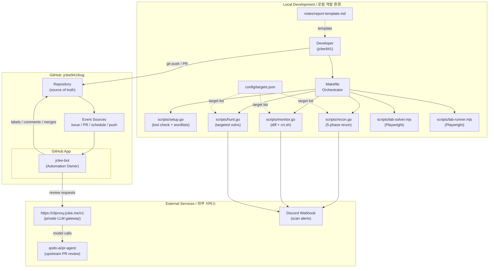

# Bug Bounty Automation Toolkit / 버그 바운티 자동화 툴킷

[](./LICENSE)
[](./scripts/)
[](./package.json)


[](./.github/workflows/welcome.yml)
[](#-architecture--아키텍처)
[](#-jclee-bot-automation-surfaces--jclee-bot-자동화-표면)
[](https://cliproxy.jclee.me/v1)
[](https://github.com/qodo-ai/pr-agent)

> A Go-driven bug bounty automation toolkit that orchestrates the **recon → monitor → hunt → report** lifecycle, paired with a GitHub App–owned automation layer (`jclee-bot`) that keeps the repository itself healthy.
>
> Go 표준 라이브러리 기반의 버그 바운티 자동화 툴킷. **정찰(recon) → 모니터링(monitor) → 헌팅(hunt) → 리포트(report)** 전 과정을 단일 인터페이스로 오케스트레이션하며, 저장소 자체의 건강 상태를 유지하는 `jclee-bot` 자동화 레이어를 함께 제공합니다.

---

## Table of Contents / 목차

- [Overview / 개요](#overview--개요)
- [Features / 주요 기능](#features--주요-기능)
- [Architecture / 아키텍처](#architecture--아키텍처)
- [Repository Structure / 저장소 구조](#repository-structure--저장소-구조)
- [jclee-bot Automation Surfaces / jclee-bot 자동화 표면](#jclee-bot-automation-surfaces--jclee-bot-자동화-표면)
- [Go Tools / Go 도구](#go-tools--go-도구)
- [Node.js Tools / Node.js 도구](#nodejs-tools--nodejs-도구)
- [Quick Start / 빠른 시작](#quick-start--빠른-시작)
- [Local Development / 로컬 개발](#local-development--로컬-개발)
- [Commands Reference / 명령어 참조](#commands-reference--명령어-참조)
- [Configuration / 설정](#configuration--설정)
- [Security & Ethics / 보안과 윤리](#security--ethics--보안과-윤리)
- [Contributing / 기여](#contributing--기여)
- [License / 라이선스](#license--라이선스)

---

## Overview / 개요

The **Bug Bounty Automation Toolkit** (`jclee941/bug`) is a personal, single-operator toolkit that automates the most repetitive parts of running a bug bounty program — from initial reconnaissance to targeted vulnerability hunting and report drafting — while enforcing consistent, auditable conventions through repository-level automation.

**Two layers, one repo:**

1. **Local hunt layer** — Go stdlib scripts orchestrated by a `Makefile`, plus two Playwright-based Node.js scripts for interactive lab challenges. The Go scripts are intentionally dependency-free (no `go.mod`) and run with `go run`.
2. **Repository automation layer** — `jclee-bot`, a GitHub App installed on the repo, owns every mutating action (labeling, commenting, closing, merging). The 10 GitHub workflow files under `.github/workflows/` are *triggers*, not the source of truth — `jclee-bot` is.

**버그 바운티 자동화 툴킷**은 버그 바운티 프로그램 운영에서 반복적인 부분을 자동화하는 단일 운영자용 툴킷입니다. 초기 정찰부터 타깃 취약점 헌팅, 리포트 작성까지의 흐름을 자동화하며, 저장소 수준의 자동화를 통해 일관되고 감사 가능한 컨벤션을 강제합니다.

**두 개의 레이어, 하나의 저장소:**

1. **로컬 헌트 레이어** — `Makefile`로 오케스트레이션되는 Go 표준 라이브러리 스크립트와, 인터랙티브 랩 챌린지용 Playwright 기반 Node.js 스크립트 2종. Go 스크립트는 의도적으로 의존성(`go.mod`)이 없으며 `go run`으로 실행합니다.
2. **저장소 자동화 레이어** — 저장소에 설치된 GitHub App인 `jclee-bot`이 모든 변이(mutating) 액션(라벨링, 코멘트, 이슈 종료, PR 머지)의 소유자입니다. `.github/workflows/`의 워크플로 10종은 *트리거*일 뿐 진실의 원천이 아니며, 그 권위는 `jclee-bot`에 있습니다.

---

## Features / 주요 기능

### Hunt pipeline / 헌트 파이프라인

- **Recon pipeline (5 phases)** — subdomain enumeration → HTTP probing → URL crawling → nuclei scanning → report assembly.
- **Diff monitoring** — detect *new* subdomains, endpoints, or exposed services between runs and alert via Discord.
- **Targeted hunting (4 phases)** — broad vulnerability scan, then drill-down by category (IDOR, SSRF, …).
- **Lab automation** — Playwright-driven browser flows for solving repeatable CTF-style lab challenges.
- **Idempotent setup** — first-run verifier that downloads wordlists and checks that all external CLIs (`subfinder`, `httpx`, `nuclei`, `naabu`, …) are installed.

### Repository automation / 저장소 자동화

- **Issue lifecycle** — triage new issues, apply initial labels, mark stale ones, close duplicates.
- **PR review** — AI-assisted code review through a private LLM gateway (`https://cliproxy.jclee.me/v1`) backed by `qodo-ai/pr-agent`.
- **PR normalization** — enforce conventional title format, trim noisy diffs, and apply area/size labels.
- **Auto-merge** — merge approved, green, low-risk PRs without human intervention.
- **Stale management** — close abandoned issues/PRs after a configurable inactivity window.
- **First-touch welcome** — greet first-time contributors automatically.

---

## Architecture / 아키텍처



### Read this as / 읽는 법

- **Solid arrows** = synchronous control flow (a call, an event delivery, a webhook).
- **Dotted arrows** = data flow (config consumed, template applied).
- The `GitHub` subgraph shows the **trust boundary**: the repository emits events, and `jclee-bot` is the only entity authorized to mutate repo state (labels, comments, merges, closures).
- `CLIProxy` is a private LLM gateway exposed at `https://cliproxy.jclee.me/v1`; it forwards requests to `qodo-ai/pr-agent` upstream. **No raw RFC1918 host or LXC ID ever appears in this diagram or in any script.**
- **실선**은 동기 제어 흐름, **점선**은 데이터 흐름입니다. `GitHub` 서브그래프는 신뢰 경계를 보여주며, `jclee-bot`이 저장소 상태를 변이할 수 있는 유일한 권위입니다. `CLIProxy`는 비공개 LLM 게이트웨이며 `qodo-ai/pr-agent`으로 요청을 전달합니다. **RFC1918 사설 IP나 LXC 컨테이너 번호는 다이어그램과 스크립트 어디에도 하드코딩되지 않습니다.**

---

## Repository Structure / 저장소 구조

```
.
├── AGENTS.md                       # Knowledge base (LLM / agent entry point)
├── Makefile                        # Orchestrator — `make help` for the full list
├── README.md                       # This document
├── package.json                    # Playwright (dev-only, for .mjs lab scripts)
├── package-lock.json
├── config/
│   └── targets.json                # Authorized targets + notification settings
├── scripts/
│   ├── setup.go                    # Tool verification + wordlist download
│   ├── recon.go                    # 5-phase recon pipeline
│   ├── monitor.go                  # Diff monitoring + crt.sh + Discord alerts
│   ├── hunt.go                     # 4-phase targeted vulnerability hunting
│   ├── lab-solver.mjs              # Playwright lab challenge solver
│   └── lab-runner.mjs              # Playwright lab challenge runner
├── notes/
│   ├── phase2-checklist.md         # Learning checklist
│   ├── report-template.md          # Bug report template
│   └── vulnerability-study.md      # Long-form study notes
└── .github/
    └── workflows/                  # 10 trigger files owned by jclee-bot
```

> **Not in the tree (and not a directory):** `_bot-scripts/` is *only* ever a transient CI checkout path. There is no such directory in this repository. If you see it referenced in a workflow file, it is a checkout path, not a tracked location.
>
> **트리에 없는 것:** `_bot-scripts/`는 일시적인 CI 체크아웃 경로일 뿐, 실제 추적되는 디렉터리가 아닙니다. 워크플로 파일에서 이 이름이 보인다면 그것은 체크아웃 경로이며 추적 대상이 아닙니다.

Generated artefacts (`recon/`, `targets/`, `reports/`, `wordlists/`) are gitignored and intentionally absent from the source tree.

---

## jclee-bot Automation Surfaces / jclee-bot 자동화 표면

`jclee-bot` is a **GitHub App** installed on `jclee941/bug`. It is the **sole owner of every mutating action** performed on the repository. The 10 workflow files under `.github/workflows/` are *event triggers* — they listen for activity and hand it off to `jclee-bot`. The App is the source of truth, not the YAML.

`jclee-bot`은 `jclee941/bug`에 설치된 **GitHub App**이며, 저장소에서 발생하는 모든 변이(mutating) 액션의 **유일한 소유자**입니다. `.github/workflows/`의 워크플로 10종은 이벤트 *트리거*일 뿐, 실제 권한과 책임은 `jclee-bot`에 있습니다.

### Automation surface 1 — Issue lifecycle / 이슈 라이프사이클

- **Triage** — when an issue is opened, `jclee-bot` classifies it (bug, question, report, duplicate candidate) and applies initial labels.
- **Auto-handled marker** — when an issue is fully resolved by automation without human involvement, `jclee-bot` posts a marker comment reading exactly: **jclee-bot에의해자동화됨** so contributors know the issue was closed by the bot.
- **Stale sweep** — issues with no activity for the configured window are pinged, then closed by `jclee-bot` if no reply follows.

### Automation surface 2 — Pull request review & quality / PR 리뷰 및 품질

- **AI review** — every PR triggers a code review call routed through the private gateway `https://cliproxy.jclee.me/v1` to `qodo-ai/pr-agent`. Results are posted back as a single review comment authored by `jclee-bot`.
- **Security review** — a parallel security-focused review pass is run by `jclee-bot`; findings are posted as a labeled comment.
- **Normalization** — PR title is rewritten to conventional-commit form and the body is trimmed of noise; both are done by `jclee-bot`.
- **Labeling** — `jclee-bot` applies `size/*`, `area/*`, and language labels based on diff analysis.

### Automation surface 3 — Auto-merge / 자동 머지

- `jclee-bot` merges PRs that pass all required checks, are approved, and match the auto-merge policy (e.g. dependency bumps, labeler config changes). The bot authors the merge commit and applies the merge label.

### Automation surface 4 — Welcome / 환영

- `jclee-bot` posts a welcome message on the first issue or PR from any new contributor, pointing them at `AGENTS.md` and the contribution guide below.

> **Trust model:** workflow files can be modified by any maintainer, but they cannot act on their own — every privileged action is performed by the `jclee-bot` App, which is auditable in the GitHub App settings and in the repo's audit log.
>
> **신뢰 모델:** 워크플로 파일은 어떤 유지보수자도 수정할 수 있지만 그 자체로는 권한이 없습니다. 모든 권한이 필요한 액션은 `jclee-bot` App이 수행하며, GitHub App 설정과 저장소 감사 로그에서 추적할 수 있습니다.

---

## Go Tools / Go 도구

All hunt-layer Go scripts are single-file programs with **no `go.mod`** and **no external dependencies** — they use the Go standard library only and are invoked through `go run scripts/<name>.go`. External tools (subfinder, httpx, nuclei, naabu, …) are called as subprocesses via `os/exec`.

| Script | Role | Key flags |
|--------|------|-----------|
| `scripts/setup.go` | Verify that every external CLI is on `$PATH`; download SecLists wordlists. | — |
| `scripts/recon.go` | 5-phase recon pipeline. | `-d <domain>`, `-skip-nuclei` |
| `scripts/monitor.go` | Diff-based change detection; crt.sh polling; Discord alerting on new findings. | `-d <domain>` |
| `scripts/hunt.go` | 4-phase targeted vulnerability hunting; supports category drill-down. | `-d <domain>`, `-type idor\|ssrf\|…` |

### Conventions

- Each script is **standalone** — no shared package, no module file. Run with `go run scripts/setup.go`.
- **All Go scripts use only the standard library.** External tools are CLI wrappers.
- Results are written to timestamped directories under `recon/`.
- Targets are read from `config/targets.json`, never hardcoded.

### Anti-patterns (enforced)

- Never commit scan results (`recon/`, `targets/`, `reports/`, `wordlists/`).
- Never hardcode target domains in any script.
- Never run scans without explicit program authorization.
- Never exceed `nuclei` rate limits (default cap: 100 req/s).

---

## Node.js Tools / Node.js 도구

Two Playwright-based scripts handle **interactive lab challenges** that the Go pipeline cannot solve headlessly:

- `scripts/lab-solver.mjs` — solves a single repeatable lab challenge end-to-end (login, navigate, exploit, capture flag, submit).
- `scripts/lab-runner.mjs` — orchestrates multiple solver runs across a queue of labs and emits a summary report.

Both scripts share the same Playwright install managed by `package.json` / `package-lock.json`. There is **no Node.js build step** — they are plain ESM `.mjs` files executed directly by Node.

> The Node.js stack is intentionally minimal. Heavy logic stays in Go; the Node side is the browser-automation shim.
>
> Node.js 스택은 의도적으로 최소로 유지됩니다. 무거운 로직은 Go에 두고, Node는 브라우저 자동화 어댑터 역할만 합니다.

---

## Quick Start / 빠른 시작

### Prerequisites / 사전 요구 사항

- **Go ≥ 1.22** on `$PATH`
- **Node.js ≥ 20** with Playwright (`npm install`, then `npx playwright install chromium`)
- Standard security toolchain: `subfinder`, `httpx`, `naabu`, `nuclei`, `katana`, `gau`, `waybackurls`
- `make`, `git`, `curl`

### Bootstrap / 부트스트랩

```bash
git clone https://github.com/jclee941/.github
cd bug
make setup          # verifies tools, downloads SecLists
npm install         # installs Playwright for the .mjs scripts
```

### First run / 첫 실행

```bash
make recon  TARGET=example.com   # 5-phase recon
make monitor TARGET=example.com  # detect NEW subdomains/endpoints
make hunt   TARGET=example.com   # targeted vulnerability scan
```

All three write to `recon/<timestamp>/` and a symbolic link `recon/latest/` is refreshed.

---

## Local Development / 로컬 개발

### Editing a Go script / Go 스크립트 편집

Go scripts are single-file programs — no `go.mod`, no module boundaries. To iterate:

```bash
# In-place run during development
go run scripts/recon.go -d testlab.local

# With extra verbosity (each script uses stdlib log)
go run scripts/recon.go -d testlab.local -v
```

### Adding a new hunt category / 헌트 카테고리 추가

1. Open `scripts/hunt.go`.
2. Add a new entry to the `huntTypes` slice near the top of the file.
3. Implement the corresponding branch in the dispatch switch.
4. Re-run `make hunt TARGET=example.com -type <new>` to verify.

### Editing a Playwright lab script / Playwright 랩 스크립트 편집

```bash
node scripts/lab-solver.mjs --lab=id-001   # or however the script accepts its target
```

The `.mjs` files are plain ESM — no bundler, no transpiler.

### Working with config / 설정 작업

Targets and notification channels live in `config/targets.json`. **Never hardcode a target inside a script** — always read it from this file or pass it via `TARGET=`.

### Agent entry point / 에이전트 진입점

`AGENTS.md` is the canonical knowledge base for any coding agent (or human) onboarding to this repo. It documents the directory layout, the conventions, the commands, and the anti-patterns. Read it before opening a PR.

---

## Commands Reference / 명령어 참조

| Command | Description |
|---------|-------------|
| `make help` | Print the full command list and examples. |
| `make setup` | First-time setup — verify tools, download wordlists. |
| `make recon TARGET=domain.com` | Full 5-phase recon pipeline. |
| `make recon-fast TARGET=domain.com` | Recon without the nuclei pass. |
| `make monitor TARGET=domain.com` | Diff-based change detection + Discord alert. |
| `make hunt TARGET=domain.com` | All vulnerability categories. |
| `make hunt-idor TARGET=domain.com` | IDOR-focused hunt only. |
| `make hunt-ssrf TARGET=domain.com` | SSRF-focused hunt only. |
| `make full-scan TARGET=domain.com` | Recon + hunt combined. |
| `make scan-target TARGET=domain.com` | Custom scan profile (see `Makefile`). |
| `make clean` | Remove generated artefacts under `recon/`. |

> `make` will refuse any target that requires `TARGET=` if the variable is empty — this is enforced at the `Makefile` level.

---

## Configuration / 설정

### `config/targets.json`

Defines authorized targets, scan profiles, and notification destinations. See the file for the exact schema. Do **not** commit changes that expand scope without an explicit program authorization.

### Environment variables / 환경 변수

- `DISCORD_WEBHOOK` — webhook URL for scan alerts (consumed by `monitor.go` and `hunt.go`).
- `GIT_AUTHOR_NAME`, `GIT_AUTHOR_EMAIL` — used by report generators.
- `NUCLEI_RATE` — overrides the default 100 req/s cap for `nuclei`.

### LLM gateway (PR review) / LLM 게이트웨이 (PR 리뷰)

PR review requests are routed through `https://cliproxy.jclee.me/v1`. The actual model is selected server-side; `qodo-ai/pr-agent` is the upstream automation engine. **Do not hardcode a model name in any workflow file** — the gateway is the only configured endpoint.

---

## Security & Ethics / 보안과 윤리

This toolkit is a **force multiplier**, not a license. The author is a single operator running only against programs they have explicit authorization for.

- ✅ **Authorized targets only.** A target is fair game only if it appears in `config/targets.json` *and* the corresponding bug bounty program permits the scan type.
- ✅ **Rate-limited by default.** `nuclei` is hard-capped at 100 req/s; `httpx` concurrency is bounded in `recon.go`.
- ✅ **Auditable.** Every scan produces a timestamped, gitignored directory under `recon/` that the operator reviews before any report is filed.
- ❌ **Never** point this toolkit at a target you are not authorized to test.
- ❌ **Never** commit scan results, target baselines, or submitted reports to this repository.
- ❌ **Never** exfiltrate data from a target — the toolkit reports vulnerabilities, not data.

> This is a personal research toolkit. It is **not** an "offensive security product". The maintainer does not provide scan-as-a-service, hosted recon, or any form of multi-tenant access.
>
> 본 툴킷은 개인 연구용입니다. **상용 보안 제품이 아니며**, 스캔-as-a-서비스, 호스팅 정찰, 멀티테넌트 접근을 제공하지 않습니다.

---

## Contributing / 기여

Contributions are welcome, but the bar is **convention + scope** rather than volume. Most PRs that touch the hunt layer will be auto-handled by `jclee-bot`.

### Workflow / 작업 흐름

1. **Read `AGENTS.md` first.** It is the single source of truth for the directory layout, conventions, and anti-patterns.
2. **Open an issue** describing the change *before* opening a PR, unless it is a trivial typo / doc fix.
3. **Fork → branch → PR.** Branch names should follow `<type>/<scope>` (e.g. `feat/hunt-graphql`, `fix/monitor-flake`).
4. **Expect bot interaction.** When you open the PR, `jclee-bot` will:
   - Post a code review (routed through `https://cliproxy.jclee.me/v1` → `qodo-ai/pr-agent`),
   - Apply `size/*` and `area/*` labels,
   - Normalize the PR title,
   - If your PR matches the auto-merge policy (e.g. `dependencies`, `labeler`), merge it on its own.
5. **Wait for a human reviewer only if the bot defers.** If `jclee-bot` posts a `needs-human-review` label, a maintainer will pick it up.

### Style guide / 스타일 가이드

- **Go:** `gofmt` + standard library only. No new external dependencies. If you need one, justify it in the PR.
- **Node.js:** ESM `.mjs`, no bundler, no TypeScript transpiler in this repo.
- **Markdown:** real `#` headings (no bold-as-heading), fenced code blocks, tables for parallel data.
- **Security:** never commit `recon/`, `targets/`, `reports/`, or `wordlists/`. Never hardcode a target.

### Reporting vulnerabilities in this repo / 본 저장소의 취약점 신고

Please **do not** open a public issue for security problems in this repo. Use GitHub's private vulnerability reporting (Security tab → "Report a vulnerability") so the maintainer can triage privately.

---

## License / 라이선스

[ISC](./LICENSE) — see the `LICENSE` file for the full text.

---

### Maintainer / 유지보수자

- **Repo:** `jclee941/bug`
- **Automation owner:** `jclee-bot` (GitHub App)
- **LLM gateway:** `https://cliproxy.jclee.me/v1`
- **PR review engine:** [`qodo-ai/pr-agent`](https://github.com/qodo-ai/pr-agent)