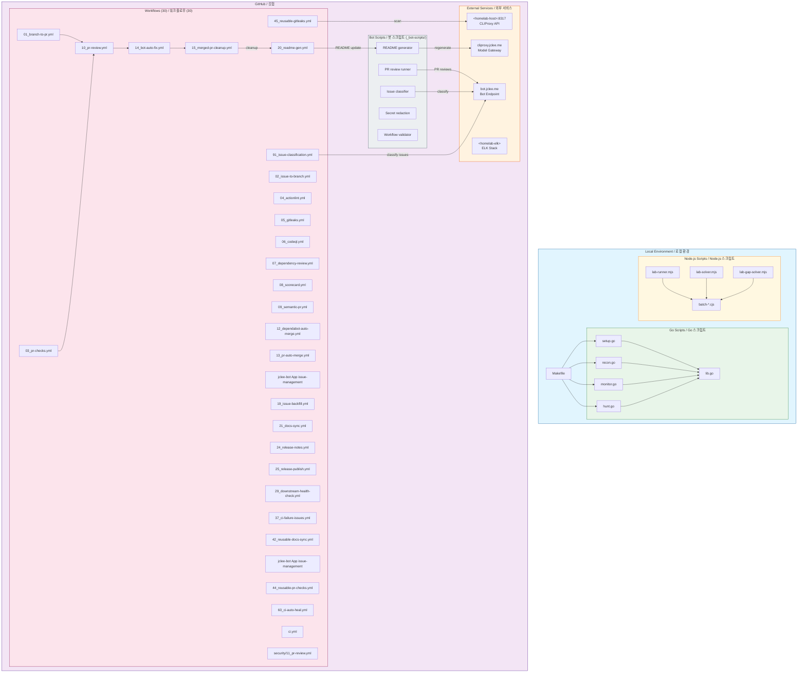

# Bug Bounty Automation Toolkit / 버그바운티 자동화 툴킷


[](https://nodejs.org/)
[](https://playwright.dev/)
[](https://go.dev/)
[](https://github.com/features/actions)
[](https://openssf.org/)
[](https://cliproxy.jclee.me)
[](LICENSE)

---

## Table of Contents / 목차

- [Overview / 개요](#overview--개요)
- [Features / 주요 기능](#features--주요-기능)
- [Architecture / 아키텍처](#architecture--아키텍처)
- [Automation Inventory / 자동화 목록](#automation-inventory--자동화-목록)
- [Quick Start / 빠른 시작](#quick-start--빠른-시작)
- [Local Development / 로컬 개발](#local-development--로컬-개발)
- [Commands Reference / 명령어 참조](#commands-reference--명령어-참조)
- [Repository Structure / 저장소 구조](#repository-structure--저장소-구조)
- [Contribution Guide / 기여 가이드](#contribution-guide--기여-가이드)

---

## Overview / 개요

### English

**Bug Bounty Automation Toolkit** is a local automation workspace for authorized web security research, vulnerability-study exercises, and lab-solving workflows. The repository combines:

- **Node.js ESM scripts** for PortSwigger/Web Security Academy style lab automation using Playwright
- **Go helper programs** for monitoring and vulnerability-hunting command orchestration
- **GitHub Actions workflows** (30 total) for PR checks, security scanning, PR review automation, issue management, release automation, documentation sync, and CI auto-healing
- **Bot-side helper scripts** for README generation, PR review enrichment, secret redaction, and repository analysis

### 한국어

**버그바운티 자동화 툴킷**은 인가된 웹 보안 연구, 취약점 학습 연습, 랩求解 워크플로우를 위한 로컬 자동화 작업 공간입니다. 다음을 결합합니다:

- **Playwright를 사용하는 Node.js ESM 스크립트** - PortSwigger/Web Security Academy 스타일 랩 자동화
- **모니터링 및 취약점 헌팅 명령 오케스트레이션을 위한 Go 헬퍼 프로그램**
- **PR 체크, 보안 스캐닝, PR 리뷰 자동화, 이슈 관리, 릴리스 자동화, 문서 동기화, CI 자동 복구를 위한 GitHub Actions 워크플로우** (30개)
- **README 생성, PR 리뷰 보강, 시크릿 삭제, 저장소 분석을 위한 봇 사이드 헬퍼 스크립트**

---

## Features / 주요 기능

### Local Automation (로컬 자동화)

| 기능 | 설명 |
|------|------|
| `make recon` | 5단계 리콘 파이프라인 (서브도메인 열거 → CDN/AWS 열거 → 포트 스캐닝 → 서비스 탐지 → nuclei 취약점 스캐닝) |
| `make monitor` | 차등 모니터링 — crt.sh 기반 신규 서브도메인/엔드포인트 감지, Discord 알림 |
| `make hunt` | 취약점 헌팅 — IDOR, SSRF, XSS, SQLi, SSTI, prototype pollution 등 |
| `make full-scan` | 리콘 + 헌팅 통합 실행 |

### Lab Automation (랩 자동화)

| 스크립트 | 용도 |
|----------|------|
| `lab-runner.mjs` | PortSwigger 공식 Python 스크립트 실행기 |
| `lab-solver.mjs` | Playwright 기반 커스텀 랩 솔버 |
| `lab-gap-solver.mjs` | Python 스크립트 없는 랩용 Gap 솔버 |

### GitHub Automation (GitHub 자동화)

- **PR 워크플로우**: 체크 → 리뷰 → 자동 병합 → 클린업
- **보안 스캐닝**: Gitleaks, CodeQL, Dependency Review, Scorecard
- **이슈 관리**: 분류, 백필, 자동 생성
- **릴리스**: 노트 생성 → 패키지 발행
- **CI 자동 복구**: 실패 시 자동 힐링

---

## Architecture / 아키텍처



---

## Automation Inventory / 자동화 목록

### GitHub Actions Workflows (30)

#### PR Lifecycle (10 workflows)

| 파일 | 설명 |
|------|------|
| `01_branch-to-pr.yml` | 브랜치 생성 시 자동 PR 링크 |
| `02_issue-to-branch.yml` | 이슈 기반 브랜치 생성 |
| `03_pr-checks.yml` | PR 체크 (lint, test, build) — reusable에서 호출 |
| `04_actionlint.yml` | 워크플로우 YAML 린트 |
| `09_semantic-pr.yml` | 시맨틱 PR 제목 검증 |
| `10_pr-review.yml` | AI-assisted PR 리뷰 (PR-Review runner) |
| `13_pr-auto-merge.yml` | 조건 충족 시 자동 병합 |
| `14_bot-auto-fix.yml` | 자동 수정-bot 트리거 |
| `15_merged-pr-cleanup.yml` | 병합 후 브랜치 정리 |
| `security/11_pr-review.yml` | 보안 포커스 PR 리뷰 |

#### Security Scanning (7 workflows)

| 파일 | 설명 |
|------|------|
| `05_gitleaks.yml` | 커밋 내 secrets 스캐닝 — reusable에서 호출 |
| `06_codeql.yml` | CodeQL 정적 분석 |
| `07_dependency-review.yml` | 의존성 취약점 검토 |
| `08_scorecard.yml` | OSSF Scorecard 보안 평가 |
| `44_reusable-pr-checks.yml` | 재사용 가능 PR 체크 템플릿 |
| `45_reusable-gitleaks.yml` | 재사용 가능 Gitleaks 템플릿 |
| `60_ci-auto-heal.yml` | CI 실패 자동 복구 |

#### Issue Management (6 workflows)

| 파일 | 설명 |
|------|------|
| `jclee-bot App issue-management` | 이슈 라벨링/정리 |
| `19_issue-backfill.yml` | 이슈 백필 automation |
| `37_ci-failure-issues.yml` | CI 실패 시 이슈 자동 생성 |
| `jclee-bot App issue-management` | 재사용 가능 이슈 관리 템플릿 |
| `91_issue-classification.yml` | AI 기반 이슈 분류 |
| `29_downstream-health-check.yml` | 다운스트림 상태 확인 |

#### Documentation & Release (7 workflows)

| 파일 | 설명 |
|------|------|
| `20_readme-gen.yml` | README 자동 생성 (README generator) |
| `21_docs-sync.yml` | 문서 동기화 |
| `24_release-notes.yml` | 자동 릴리스 노트 생성 |
| `25_release-publish.yml` | 릴리스 패키지 발행 |
| `42_reusable-docs-sync.yml` | 재사용 가능 문서 동기화 템플릿 |
| `12_dependabot-auto-merge.yml` | Dependabot PR 자동 병합 |
| `ci.yml` | 메인 CI 워크플로우 |

### Bot-Side Helper Scripts (_bot-scripts/)

| 스크립트 | 용도 |
|----------|------|
| `generate_readme.py` | README.md 자동 생성 |
| `pr_review_runner.py` | PR 리뷰 enrichment 실행 |
| `repo_review.py` | 저장소 리뷰 분석 |
| `redact_exposed_secrets.py` | 노출된 시크릿 삭제 |
| `check_workflow_scripts.py` | 워크플로우 스크립트 검증 |
| `check_private_ips.py` | RFC1918 IP 주소 검사 |
| `check_hardcode_scan_patterns.py` | 하드코딩된 스캔 패턴 검사 |
| `issue_classification_workflow.py` | 이슈 분류 워크플로우 |
| `readme_mermaid_test.py` | Mermaid 다이어그램 테스트 |

### Go Automation Tools (0)

> 이 저장소는 Go 스크립트를 `go run`로 직접 실행합니다 (별도의 바이너리 빌드 없음).

### External Integrations

| 서비스 | 용도 |
|--------|------|
| [cliproxy.jclee.me](https://cliproxy.jclee.me) | AI model gateway (README 생성, PR 리뷰) |
| [bot.jclee.me](https://bot.jclee.me) | Bot endpoint (이슈 분류, PR 리뷰 결과) |
| `&lt;homelab-host&gt;:8317` | CLIProxy API (AI inference) |
| `&lt;homelab-elk&gt;` | ELK Stack (로깅/모니터링) |

---

## Quick Start / 빠른 시작

### Prerequisites

- Go 1.21+
- Node.js 18+ (ESM)
- Playwright (`npx playwright install`)

### Setup

```bash
#克隆仓库
git clone https://github.com/jclee941/.github
cd bug

#첫 번째 설정 - 도구 확인 및 워드리스트 다운로드
make setup

#또는 Go 스크립트 직접 실행
go run scripts/setup.go scripts/lib.go
```

### Basic Usage / 기본 사용법

```bash
#전체 리콘 파이프라인
make recon TARGET=example.com

#빠른 리콘 (nuclei 스킵)
make recon-fast TARGET=example.com

#차등 모니터링 (신규 변경 감지)
make monitor TARGET=example.com

#취약점 헌팅
make hunt TARGET=example.com

#특정 유형 헌팅
make hunt-idor TARGET=example.com
make hunt-ssrf TARGET=example.com

#리콘 + 헌팅 통합
make full-scan TARGET=example.com
```

### PortSwigger Lab Solving

```bash
#Playwright 기반 랩 솔버
node scripts/lab-solver.mjs --lab <lab-id>

#Gap-solving 랩 (Python 스크립트 없음)
node scripts/lab-gap-solver.mjs --lab <lab-id>

#배치 솔버
node scripts/comprehensive-batch.cjs
```

---

## Local Development / 로컬 개발

### Directory Structure

```
bug/
├── _bot-scripts/          # GitHub Bot 사이드 스크립트
│   ├── scripts/           # Python/JS 봇 유틸리티
│   ├── Dockerfile.github_action
│   └── Dockerfile.github_app
├── scripts/               # Go 및 Node.js 자동화 스크립트
│   ├── setup.go          # 도구 확인
│   ├── recon.go          # 리콘 파이프라인
│   ├── monitor.go        # 차등 모니터링
│   ├── hunt.go           # 취약점 헌팅
│   ├── lib.go            # 공유 헬퍼
│   └── *.mjs / *.cjs     # 랩 자동화
├── config/
│   └── targets.json      # 타겟 설정
├── notes/                # 학습 자료 및 템플릿
└── Makefile             # 오케스트레이션
```

### Development Commands

```bash
#도구 확인
go run scripts/setup.go scripts/lib.go

#개별 스크립트 실행
go run scripts/recon.go scripts/lib.go -d target.com
go run scripts/monitor.go scripts/lib.go -d target.com
go run scripts/hunt.go scripts/lib.go -d target.com

#Node.js 스크립트 테스트
node scripts/lab-runner.mjs --help
node scripts/lab-solver.mjs --help
```

### Bot Scripts Development

```bash
cd _bot-scripts

#의존성 설치
pip install -r requirements.txt

#README 생성기 테스트
python scripts/generate_readme.py --test

#PR 리뷰ランナー 테스트
python scripts/pr_review_runner.py --dry-run

#시크릿 삭제 테스트
python scripts/redact_exposed_secrets.py --input <file>
```

---

## Commands Reference / 명령어 참조

### Makefile Targets

| 명령어 | 설명 | 예시 |
|--------|------|------|
| `make help` | 사용 가능한 명령어 표시 | `make help` |
| `make setup` | 첫 번째 설정 | `make setup` |
| `make recon` | 전체 리콘 파이프라인 | `make recon TARGET=example.com` |
| `make recon-fast` | 리콘 (nuclei 스킵) | `make recon-fast TARGET=example.com` |
| `make monitor` | 차등 모니터링 | `make monitor TARGET=example.com` |
| `make hunt` | 모든 취약점 유형 | `make hunt TARGET=example.com` |
| `make hunt-idor` | IDOR 취약점만 | `make hunt-idor TARGET=example.com` |
| `make hunt-ssrf` | SSRF 취약점만 | `make hunt-ssrf TARGET=example.com` |
| `make full-scan` | 리콘 + 헌팅 | `make full-scan TARGET=example.com` |
| `make clean` | 스캔 결과 삭제 | `make clean` |

### Go Script Flags

```bash
# recon.go
-d <domain>          # 타겟 도메인
-skip-nuclei         # nuclei 스跳过
-rate <limit>        #_rate_limit (기본: 100/s)

# monitor.go
-d <domain>          # 타겟 도메인
-webhook <url>       # Discord 웹훅 URL

# hunt.go
-d <domain>          # 타겟 도메인
-type <category>     # 취약점 유형 (idor/ssrf/xss 등)
-rate <limit>        # rate limit
```

### Node.js Lab Scripts

```bash
# lab-runner.mjs
node scripts/lab-runner.mjs --lab <id> --script <path>

# lab-solver.mjs
node scripts/lab-solver.mjs --lab <id>

# lab-gap-solver.mjs
node scripts/lab-gap-solver.mjs --lab <id> --url <url>

# 배치 스크립트
node scripts/comprehensive-batch.cjs
node scripts/batch-a.cjs
node scripts/batch-collab.cjs
```

---

## Repository Structure / 저장소 구조

```
bug/
├── .github/
│   └── workflows/           # GitHub Actions 워크플로우 (30개)
│       ├── 01_branch-to-pr.yml
│       ├── 02_issue-to-branch.yml
│       ├── 03_pr-checks.yml
│       ├── 04_actionlint.yml
│       ├── 05_gitleaks.yml
│       ├── 06_codeql.yml
│       ├── 07_dependency-review.yml
│       ├── 08_scorecard.yml
│       ├── 09_semantic-pr.yml
│       ├── 10_pr-review.yml
│       ├── 12_dependabot-auto-merge.yml
│       ├── 13_pr-auto-merge.yml
│       ├── 14_bot-auto-fix.yml
│       ├── 15_merged-pr-cleanup.yml
│       ├── jclee-bot App issue-management
│       ├── 19_issue-backfill.yml
│       ├── 20_readme-gen.yml
│       ├── 21_docs-sync.yml
│       ├── 24_release-notes.yml
│       ├── 25_release-publish.yml
│       ├── 29_downstream-health-check.yml
│       ├── 37_ci-failure-issues.yml
│       ├── 42_reusable-docs-sync.yml
│       ├── jclee-bot App issue-management
│       ├── 44_reusable-pr-checks.yml
│       ├── 45_reusable-gitleaks.yml
│       ├── 60_ci-auto-heal.yml
│       ├── 91_issue-classification.yml
│       ├── ci.yml
│       └── security/
│           └── 11_pr-review.yml
├── _bot-scripts/            # Bot-side helper scripts
│   ├── scripts/
│   │   ├── generate_readme.py
│   │   ├── pr_review_runner.py
│   │   ├── repo_review.py
│   │   ├── redact_exposed_secrets.py
│   │   ├── check_workflow_scripts.py
│   │   ├── check_private_ips.py
│   │   ├── check_hardcode_scan_patterns.py
│   │   ├── issue_classification_workflow.py
│   │   └── readme_mermaid_test.py
│   ├── Dockerfile.github_action
│   ├── Dockerfile.github_app
│   ├── docker-compose.github_app.yml
│   ├── requirements.txt
│   └── pyproject.toml
├── scripts/                 # 자동화 스크립트
│   ├── *.go                 # Go 리콘/모니터링/헌팅
│   ├── *.mjs                # 랩 솔버 (Playwright)
│   ├── *.cjs                # 배치/다agnostic 스크립트
│   └── lib.go               # 공유 헬퍼
├── config/
│   └── targets.json         # 타겟 및 알림 설정
├── notes/                   # 학습 자료
│   ├── phase2-checklist.md
│   ├── report-template.md
│   └── vulnerability-study.md
├── package.json             # Node.js 의존성
├── Makefile                 # 오케스트레이션
├── AGENTS.md                # AI 에이전트용 지식 베이스
├── CONTRIBUTING.md          # 기여 가이드
└── LICENSE                  # ISC 라이선스
```

---

## Contribution Guide / 기여 가이드

### Contributing Workflow / 기여 워크플로우

1. **이슈 생성** — 버그 또는 기능 요청을 이슈로 등록
2. **브랜치 생성** — `02_issue-to-branch.yml`이 자동 생성하거나 수동 생성
3. **개발** — 변경 내용 구현
4. **PR 제출** — `03_pr-checks.yml`이 자동 체크
5. **리뷰** — `10_pr-review.yml`이 AI-assisted 리뷰 수행
6. **병합** — `13_pr-auto-merge.yml`이 조건 충족 시 자동 병합

### Coding Conventions / 코딩 규칙

#### Go Scripts

- 스크립트ルは `go run scripts/x.go scripts/lib.go`로実行
- 외부 의존성 없음 (Go stdlib만 사용)
- 결과は `recon/`, `targets/`, `reports/` 디렉토리에 저장 (gitignore済)
- 타겟 도메인 하드코딩 금지

#### Node.js Scripts

- ESM 모듈 (`"type": "module"` in package.json)
- Playwright 1.60+ 사용
- 랩 ID/URL은命令行引数로 전달

#### GitHub Workflows

- Actionlint (`04_actionlint.yml`)로 YAML 검증
- 시크릿은 GitHub Secrets 사용 (절대 평문 고정값 금지)
- 재사용 가능한 템플릿은 `reusable-*.yml`命名規則

### Security Guidelines / 보안 가이드라인

- **인가된 연구만** — 버그 바운티 프로그램의授权된 타겟만 스캔
- **rate limit 준수** — 기본 100 req/s, 타겟 网站의robots.txt 참고
- **시크릿 관리** — 노출 시 `redact_exposed_secrets.py` 사용
- **취약점 보고** — 발견 시 적절한 채널로 보고 (절대 공개 금지)

### Getting Help / 도움말

```bash
# 도구 사용법
make help

# 특정 스크립트 도움말
go run scripts/recon.go -h

# 이슈 생성
https://github.com/jclee941/bug/issues/new
```

---

## License / 라이선스

이 프로젝트는 ISC 라이선스로 제공됩니다.  
자세한 내용은 [LICENSE](LICENSE) 파일을 참조하세요.

---

*Generated by [minimax-m2.7](https://cliproxy.jclee.me) via [CLIProxyAPI](https://cliproxy.jclee.me/v1)*
