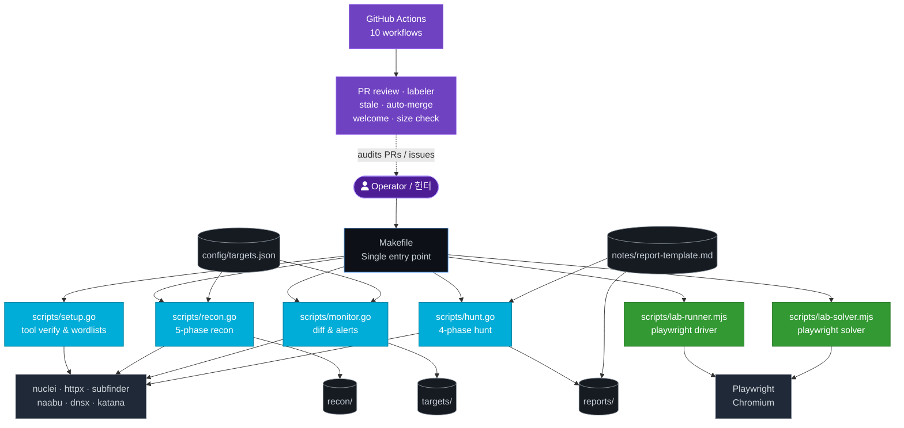

# Bug Bounty Automation Toolkit / 버그 바운티 자동화 툴킷

[](./LICENSE)
[](./scripts/)
[](./package.json)


[](./.github/workflows/welcome.yml)
[](#-architecture--아키텍처)

> A Go-driven bug bounty automation toolkit that orchestrates the **recon → monitor → hunt → report** lifecycle, paired with a GitHub-side automation layer that keeps the repository itself healthy.
>
> Go 표준 라이브러리 기반의 버그 바운티 자동화 툴킷. **정찰 → 모니터링 → 헌팅 → 리포트** 전 과정을 단일 인터페이스로 오케스트레이션하며, 저장소 자체의 건강 상태를 유지하는 GitHub 자동화 레이어를 함께 제공합니다.

---

## Table of Contents / 목차

- [Overview / 개요](#overview--개요)
- [Features / 주요 기능](#features--주요-기능)
- [Architecture / 아키텍처](#architecture--아키텍처)
- [Repository Structure / 저장소 구조](#repository-structure--저장소-구조)
- [Automation Inventory / 자동화 인벤토리](#automation-inventory--자동화-인벤토리)
  - [GitHub Workflows (10)](#github-workflows-10--github-워크플로-10)
  - [Local Go Tools (4)](#local-go-tools-4--로컬-go-도구-4)
  - [Local Node.js Tools (2)](#local-nodejs-tools-2--로컬-nodejs-도구-2)
- [Quick Start / 빠른 시작](#quick-start--빠른-시작)
- [Local Development / 로컬 개발](#local-development--로컬-개발)
- [Commands Reference / 명령어 참조](#commands-reference--명령어-참조)
- [Configuration / 설정](#configuration--설정)
- [Security & Ethics / 보안과 윤리](#security--ethics--보안과-윤리)
- [Contributing / 기여](#contributing--기여)
- [License / 라이선스](#license--라이선스)

---

## Overview / 개요

The **Bug Bounty Automation Toolkit** (`jclee941/bug`) is a personal security-research command center. It wraps the entire hunting workflow — **setup, recon, monitor, hunt, report** — behind a tiny `Makefile` interface, so the operator can move from a freshly cloned checkout to a structured finding with a single command per phase.

**Core philosophy / 핵심 설계 철학**

- **Stdlib-first Go** — Every Go script under `scripts/` is a single, dependency-free file. There is intentionally **no `go.mod`**: scripts are executed through `go run scripts/x.go`. This keeps the repo portable and easy to audit.
- **Thin orchestration** — The `Makefile` is the only entry point. Each target documents itself (`make help`) and validates its `TARGET` argument up front, so misuse fails fast.
- **GitHub-native hygiene** — A second, parallel automation layer (10 GitHub Actions workflows) takes care of *this repository itself*: PR review, labeling, auto-merge, staleness, first-issue welcome, and PR-size enforcement.
- **Reproducibility** — Scan results are timestamped and gitignored. Targets live in `config/targets.json`. Reports follow `notes/report-template.md`.

이 저장소는 개인 보안 연구 워크플로를 단일 인터페이스로 묶어둔 도구 모음입니다. **`Makefile` → `go run scripts/*.go`** 경로만 알면 새로운 타깃에 대한 정찰, 변경 감지, 취약점 헌팅, 리포트 작성을 일관된 절차로 수행할 수 있습니다. 저장소 운영(PR 리뷰·라벨링·자동 병합·정리)은 10개의 GitHub Actions 워크플로가 전담합니다.

---

## Features / 주요 기능

- **One-toolbox workflow** — `setup` → `recon` → `monitor` → `hunt` → `full-scan` from a single `Makefile`.
- **Go stdlib only** — No `go.mod`, no vendored dependencies, no transitive supply-chain risk. Every tool is a single file you can read end-to-end.
- **Phase-based recon pipeline** — `recon.go` runs a 5-phase pipeline (subdomain enumeration → HTTP probing → fingerprinting → URL collection → nuclei scanning).
- **Diff-based monitoring** — `monitor.go` compares a fresh scan against the stored baseline for a target and alerts on new subdomains or endpoints.
- **Targeted vulnerability hunting** — `hunt.go` ships with category-specific flags (e.g. `-type idor`, `-type ssrf`) over a 4-phase flow.
- **Playwright-powered labs** — `scripts/lab-runner.mjs` and `scripts/lab-solver.mjs` drive a headless Chromium for browser-based lab exercises.
- **Auditable automation** — 10 GitHub Actions workflows keep PRs labeled, sized, reviewed, and merged without manual toil.
- **Structured reporting** — `notes/report-template.md` plus the `make hunt` output feed straight into a submission-ready write-up.

---

## Architecture / 아키텍처

The toolkit has two parallel automation layers:

1. **Local pipeline** — the operator runs `make <target>`, which dispatches to a Go script (and optionally Node) that wraps external CLI security tools and writes timestamped output.
2. **Repository pipeline** — GitHub Actions workflows audit, label, merge, and clean up the repository itself.



**Reading the diagram / 다이어그램 읽기**

- `Makefile` is the only entry point the operator touches.
- Go tools call external CLIs (nuclei, httpx, subfinder, naabu, dnsx, katana …) via `os/exec`.
- Node tools drive Playwright's Chromium for browser-bound labs.
- Scan output lands in `recon/`, `targets/`, and `reports/` — all gitignored.
- The GitHub Actions layer is independent: it does not run security scans, it keeps the repo itself healthy.

---

## Repository Structure / 저장소 구조

```
.
├── AGENTS.md                       # Knowledge base for automated agents / 에이전트용 지식 베이스
├── Makefile                        # Orchestration: make help, make recon, make hunt, …
├── README.md                       # This document
├── package.json                    # Node manifest (playwright only)
├── package-lock.json               # Locked dependency graph
├── config/
│   └── targets.json                # Targets and notification configuration
├── notes/
│   ├── phase2-checklist.md         # Learning / progression checklist
│   ├── report-template.md          # Submission-ready report skeleton
│   └── vulnerability-study.md      # Per-class study notes
└── scripts/
    ├── setup.go                    # Tool verification + SecLists wordlist download
    ├── recon.go                    # 5-phase recon pipeline
    ├── monitor.go                  # Diff monitoring + crt.sh + Discord alerts
    ├── hunt.go                     # 4-phase targeted vulnerability hunting
    ├── lab-runner.mjs              # Playwright lab driver
    └── lab-solver.mjs              # Playwright lab solver
```

**Gitignored output directories (created on demand) / 실행 시 생성되는 디렉터리**

- `recon/` — timestamped recon results.
- `targets/` — per-target baselines used by `monitor`.
- `reports/` — finalized bug reports.
- `wordlists/` — SecLists downloads, populated by `make setup`.

> **Note / 참고** — `scripts/lab-runner.mjs` and `scripts/lab-solver.mjs` use the `playwright` dependency declared in `package.json`. Install with `npm ci` before invoking them.

---

## Automation Inventory / 자동화 인벤토리

This repository ships with two clearly separated automation layers. The local layer runs on the operator's machine; the GitHub layer runs in CI on every push, PR, and issue event.

### GitHub Workflows (10) / GitHub 워크플로 (10)

All workflow files live under `.github/workflows/`. The filenames below are the **actual on-disk names**.

| # | Workflow | Purpose |
|---|----------|---------|
| 1 | [`auto-merge.yml`](./.github/workflows/auto-merge.yml) | Auto-merge Dependabot and trusted PRs once checks pass. |
| 2 | [`issue-label.yml`](./.github/workflows/issue-label.yml) | Auto-apply labels to incoming issues from title/body heuristics. |
| 3 | [`issue-lifecycle.yml`](./.github/workflows/issue-lifecycle.yml) | Close resolved/abandoned issues and notify owners. |
| 4 | [`labeler.yml`](./.github/workflows/labeler.yml) | Apply path/target-based labels to PRs. |
| 5 | [`pr-normalize.yml`](./.github/workflows/pr-normalize.yml) | Normalize PR titles, branches, and commit messages. |
| 6 | [`pr-review-security.yml`](./.github/workflows/pr-review-security.yml) | Security-focused PR review pass. |
| 7 | [`pr-review.yml`](./.github/workflows/pr-review.yml) | General PR review and feedback. |
| 8 | [`pr-size.yml`](./.github/workflows/pr-size.yml) | Enforce PR size budget and warn on oversized diffs. |
| 9 | [`stale.yml`](./.github/workflows/stale.yml) | Mark inactive issues/PRs as stale and close after grace period. |
| 10 | [`welcome.yml`](./.github/workflows/welcome.yml) | Greet first-time contributors with a friendly message. |

> **Tip / 팁** — `pr-review.yml` and `pr-review-security.yml` are designed to be used together with the [qodo-ai/pr-agent](https://github.com/qodo-ai/pr-agent) family of actions.

### Local Go Tools (4) / 로컬 Go 도구 (4)

Each Go script is a single, dependency-free file under `scripts/`. There is **no `go.mod`** — run with `go run scripts/<name>.go`. See [`AGENTS.md`](./AGENTS.md) for line-level references.

| Script | Role | Notes |
|--------|------|-------|
| `scripts/setup.go` | First-run environment verifier | Confirms required CLIs are on `$PATH` and downloads SecLists wordlists into `wordlists/`. |
| `scripts/recon.go` | 5-phase recon pipeline | subdomains → HTTP probe → fingerprint → URL collection → nuclei. Use `-skip-nuclei` for a fast pass. |
| `scripts/monitor.go` | Diff-based change detection | Compares fresh scan vs. stored baseline in `targets/<domain>/baseline.json`; raises alerts on newly observed assets. |
| `scripts/hunt.go` | 4-phase vulnerability hunting | Supports `-type idor`, `-type ssrf`, etc. via the `huntTypes` slice. |

### Local Node.js Tools (2) / 로컬 Node.js 도구 (2)

Driven by [`playwright`](https://www.npmjs.com/package/playwright) (declared in `package.json`).

| Script | Role | Notes |
|--------|------|-------|
| `scripts/lab-runner.mjs` | Playwright lab driver | Launches headless Chromium and runs scripted lab exercises. |
| `scripts/lab-solver.mjs` | Playwright lab solver | Higher-level solver that orchestrates the runner against a target scenario. |

---

## Quick Start / 빠른 시작

Requires Linux, **Go 1.21+**, **Node.js 18+**, and the standard security CLI toolchain (`nuclei`, `httpx`, `subfinder`, `naabu`, `dnsx`, `katana`, …).

```bash
# 1. Clone
git clone https://github.com/jclee941/.github
cd bug

# 2. Inspect available commands
make help

# 3. First-time setup — verify tools, pull SecLists
make setup

# 4. Install Node dependencies (Playwright)
npm ci

# 5. Run the full recon pipeline
make recon TARGET=example.com

# 6. Diff the result against the stored baseline
make monitor TARGET=example.com

# 7. Hunt for vulnerabilities
make hunt TARGET=example.com

# 8. Or do everything in one shot
make full-scan TARGET=example.com
```

---

## Local Development / 로컬 개발

**Go scripts** — Edit any file under `scripts/`, then re-run. There is no build step.

```bash
go run scripts/recon.go -d example.com -skip-nuclei
go run scripts/hunt.go  -d example.com -type idor
```

**Node scripts** — Both `.mjs` files use ES modules and import `playwright`.

```bash
npm ci
node scripts/lab-runner.mjs
node scripts/lab-solver.mjs
```

**Adding a new hunt category** — Extend the `huntTypes` slice in `scripts/hunt.go` and add a new `make hunt-<type>` target to the `Makefile` mirroring `hunt-idor` / `hunt-ssrf`.

**Adding a new target** — Register the domain in `config/targets.json` (and any notification endpoints, if used by `monitor.go`).

**Editing reports** — `notes/report-template.md` is the source of truth. Keep it in sync with the program you are submitting to.

---

## Commands Reference / 명령어 참조

The full list is printed by `make help`. The most common entries:

| Command | Description |
|---------|-------------|
| `make help` | Print every available target with descriptions. |
| `make setup` | Verify CLI toolchain and download SecLists wordlists. |
| `make recon TARGET=<domain>` | Full 5-phase recon pipeline. |
| `make recon-fast TARGET=<domain>` | Recon without the nuclei phase. |
| `make monitor TARGET=<domain>` | Diff fresh scan vs. stored baseline; raise alerts. |
| `make hunt TARGET=<domain>` | All vulnerability categories. |
| `make hunt-idor TARGET=<domain>` | IDOR-only hunt. |
| `make hunt-ssrf TARGET=<domain>` | SSRF-only hunt. |
| `make full-scan TARGET=<domain>` | Recon + hunt combined. |
| `make clean` | Remove generated scan output. |

---

## Configuration / 설정

`config/targets.json` is the single configuration file read by the Go scripts. It owns:

- The list of authorized targets.
- Per-target scan profile overrides (rate limits, nuclei severity floor, etc.).
- Notification endpoints consumed by `monitor.go` (e.g. Discord webhook keys — keep these out of git).

See the file itself for the latest schema; the `Where to look` table in [`AGENTS.md`](./AGENTS.md) is the canonical reference.

---

## Security & Ethics / 보안과 윤리

> **Read this before you run any command.**
>
> 이 섹션을 읽기 전에는 어떤 명령도 실행하지 마세요.

- **Only scan targets you are explicitly authorized to test.** Add the domain to `config/targets.json` only after the bug-bounty program has accepted your application and the target is in scope.
- **Honor the program's rate limits.** The Go scripts default to 100 req/s for nuclei; lower it for fragile targets.
- **Never commit scan results.** `recon/`, `targets/`, `reports/`, and `wordlists/` are gitignored. Do not override that.
- **Never hardcode target domains in scripts.** Always pass `TARGET=...` on the command line or via `config/targets.json`.
- **Responsible disclosure.** Use [`notes/report-template.md`](./notes/report-template.md) and follow the program's disclosure policy end-to-end.
- **Credentials and webhooks stay local.** Do not paste webhook URLs, API keys, or session tokens into issues, PRs, or commit messages.

---

## Contributing / 기여

Issues and PRs are welcome — the [`welcome.yml`](./.github/workflows/welcome.yml) workflow will greet you on your first interaction. Before opening a PR, please:

1. Read [`AGENTS.md`](./AGENTS.md) for layout, conventions, and anti-patterns.
2. Keep Go scripts dependency-free and runnable via `go run scripts/<name>.go`.
3. Run `make help` and confirm your change does not break the documented targets.
4. For new hunt categories, add a matching `make hunt-<type>` target.
5. Prefer small, focused PRs — [`pr-size.yml`](./.github/workflows/pr-size.yml) will nudge you if you go over budget.

The CI pipeline will run `pr-review.yml`, `pr-review-security.yml`, `pr-normalize.yml`, and `pr-size.yml` on every PR.

---

## License / 라이선스

[ISC](./LICENSE) — see the `LICENSE` file for the full text.