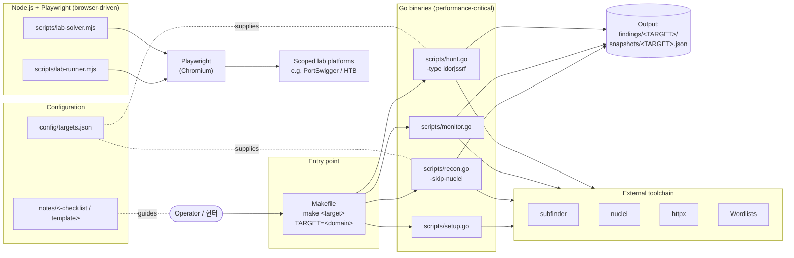

# Bug Bounty Automation Toolkit / 버그 바운티 자동화 툴킷

> Reconnaissance, monitoring, and targeted vulnerability hunting for
> responsible security research and bug bounty programs.
>
> 책임 있는 보안 연구 및 버그 바운티 프로그램을 위한 정찰, 모니터링,
> 표적형 취약점 헌팅 도구 모음입니다.

---

## Overview / 개요

This toolkit orchestrates a complete bug-bounty workflow — from initial
asset discovery and continuous monitoring to targeted vulnerability
scanning (IDOR, SSRF, …) and browser-driven lab exercises. Performance-
critical stages are implemented as Go binaries, while Playwright-based
lab runners solve exercises on safe, scoped platforms. A single
`Makefile` provides consistent entry points across operators and
machines.

이 툴킷은 초기 자산 발견과 지속적 모니터링부터 IDOR·SSRF 등 표적형
취약점 스캔, 브라우저 기반 실습에 이르는 버그 바운티 워크플로우를
오케스트레이션합니다. 성능이 중요한 단계는 Go 바이너리로, Playwright
기반 실습 러너는 Node.js로 구성되어 있으며, 단일 `Makefile`을 통해
운영자와 머신 전체에 일관된 진입점을 제공합니다.

### Intended Audience / 대상 사용자

- Bug bounty hunters running structured engagements / 구조화된 업무를 진행하는 버그 바운티 헌터
- Application security engineers tracking asset changes over time / 자산 변화를 지속적으로 추적하는 애플리케이션 보안 엔지니어
- CTF / lab participants practicing exploitation in safe environments / 안전한 환경에서 익스플로잇을 연습하는 CTF·실습 참여자

### Responsible Use / 책임 있는 사용

Run this toolkit only against systems you are explicitly authorized to
test — your own assets, scoped bug bounty programs, or dedicated lab
platforms such as PortSwigger Web Security Academy, HackTheBox, or
TryHackMe. Unauthorized scanning may violate computer-misuse laws in
your jurisdiction.

본 툴킷은 명시적으로 테스트 권한을 부여받은 시스템(자체 자산, 스코프가
정의된 버그 바운티 프로그램, PortSwigger Web Security Academy ·
HackTheBox · TryHackMe 등 전용 실습 플랫폼)에 대해서만 실행하시기
바랍니다. 권한 없는 스캔은 관련 컴퓨터 오용 법령을 위반할 수 있습니다.

---

## Features / 주요 기능

| Area / 영역 | Capability / 기능 |
|---|---|
| Setup / 설치 | Tool verification, wordlist bootstrap / 도구 검증 및 워드리스트 부트스트랩 |
| Recon / 정찰 | Subdomain enumeration, endpoint discovery, nuclei templates / 서브도메인 열거, 엔드포인트 발견, nuclei 템플릿 |
| Recon-fast | Lightweight recon that skips the nuclei stage / nuclei 단계를 건너뛰는 경량 정찰 |
| Monitor / 모니터링 | Differential checks against previous snapshots — detect new subdomains/endpoints / 이전 스냅샷 대비 차분 검사 — 신규 서브도메인·엔드포인트 탐지 |
| Hunt / 헌팅 | Targeted vulnerability scanning driven by pluggable `hunt-type` modules / 플러거블 `hunt-type` 모듈 기반 표적형 취약점 스캔 |
| Hunt IDOR | Insecure Direct Object Reference checks / IDOR 점검 |
| Hunt SSRF | Server-Side Request Forgery checks / SSRF 점검 |
| Full Scan | Recon + Hunt end-to-end / 정찰 + 헌팅 종단 실행 |
| Lab Runner / 실습 러너 | Playwright-driven automation against scoped lab targets / 스코프된 실습 대상에 대한 Playwright 자동화 |
| Lab Solver / 실습 솔버 | Automated solution harness for practice exercises / 연습 문제 자동 풀이 하니스 |
| Targets / 대상 관리 | JSON-driven target registry under `config/targets.json` / `config/targets.json` 기반 JSON 대상 레지스트리 |
| Reporting / 보고 | Markdown report template and phase-2 checklist / 마크다운 보고서 템플릿 및 2단계 점검표 |

---

## Repository Structure / 저장소 구조

```
.
├── AGENTS.md                  # Operator / agent guidance
├── Makefile                   # Single entry point for all commands
├── README.md                  # This file
├── package.json               # Node.js deps (Playwright)
├── package-lock.json
├── config/
│   └── targets.json           # Target registry for recon / hunt
├── notes/
│   ├── phase2-checklist.md    # Phase-2 engagement checklist
│   ├── report-template.md     # Vulnerability report template
│   └── vulnerability-study.md # Study notes
└── scripts/
    ├── hunt.go                # Targeted vulnerability hunting
    ├── lab-runner.mjs         # Playwright lab automation runner
    ├── lab-solver.mjs         # Playwright lab solver
    ├── monitor.go             # Differential monitoring
    ├── recon.go               # Full recon pipeline
    └── setup.go               # First-time setup / verification
```

---

## Architecture / 아키텍처



### Component Roles / 컴포넌트 역할

- **`Makefile`** — Single command surface. Every workflow starts here so
  flags and environment variables stay consistent.
  모든 워크플로우의 단일 진입점. 플래그와 환경 변수의 일관성을 유지합니다.
- **Go scripts** — Concurrency-friendly recon, monitoring, and hunting.
  `setup.go` verifies the toolchain; `recon.go` runs the full pipeline;
  `monitor.go` performs snapshot diffs; `hunt.go` dispatches on `-type`.
  동시성에 강한 정찰·모니터링·헌팅 단계. `setup.go`가 도구 체인을
  검증하고, `recon.go`가 전체 파이프라인을 실행하며, `monitor.go`가
  스냅샷 차분을 수행하고, `hunt.go`는 `-type`으로 분기합니다.
- **Node.js lab scripts** — `lab-runner.mjs` automates user actions;
  `lab-solver.mjs` drives solver logic against scoped lab platforms via
  Playwright (Chromium).
  `lab-runner.mjs`는 사용자 동작을 자동화하고, `lab-solver.mjs`는
  Playwright(Chromium)로 스코프된 실습 플랫폼에 대한 풀이 로직을 구동합니다.
- **`config/targets.json`** — Declarative target registry shared by recon
  and hunt stages.
  recon과 hunt 단계가 공유하는 선언적 대상 레지스트리입니다.
- **`notes/`** — Operator-facing checklists and report templates. Not
  consumed by scripts.
  운영자용 점검표와 보고서 템플릿입니다. 스크립트에서 직접 읽지는 않습니다.

---

## Quick Start / 빠른 시작

### Prerequisites / 사전 준비

| Tool / 도구 | Version / 버전 | Purpose / 용도 |
|---|---|---|
| Go | 1.21+ | Runs `scripts/*.go` |
| Node.js | 18+ | Runs `scripts/*.mjs` |
| npm | 9+ | Installs Playwright |
| `subfinder`, `httpx`, `nuclei` | latest / 최신 | External recon chain |
| `git`, `curl`, `unzip` | system / 시스템 | Setup helpers |

### Installation / 설치

```bash
# 1. Clone
git clone https://github.com/jclee941/.github
cd bug

# 2. Install Node dependencies
npm install
npx playwright install chromium

# 3. Verify toolchain and bootstrap wordlists
make setup
```

### First Scan / 첫 스캔

```bash
# Full reconnaissance on a target you are authorized to test
# 권한을 보유한 대상에 대한 전체 정찰
make recon TARGET=example.com

# Differential monitoring (after a baseline snapshot exists)
# 기준 스냅샷이 존재하는 경우의 차분 모니터링
make monitor TARGET=example.com

# Targeted vulnerability hunt
# 표적형 취약점 헌팅
make hunt-idor TARGET=example.com
make hunt-ssrf TARGET=example.com

# End-to-end: recon + hunt
make full-scan TARGET=example.com
```

---

## Configuration / 설정

### `config/targets.json`

The target registry is a JSON document consumed by recon and hunt stages.
Adjust it to match your engagement scope.

대상 레지스트리는 recon·hunt 단계가 참조하는 JSON 문서입니다. 업무
스코프에 맞춰 편집합니다.

```json
{
  "targets": [
    {
      "name": "example",
      "domain": "example.com",
      "scope": ["*.example.com"],
      "out_of_scope": ["blog.example.com"],
      "notes": "Authorized via program ABC-123"
    }
  ]
}
```

### Environment Variables / 환경 변수

| Variable / 변수 | Default / 기본값 | Description / 설명 |
|---|---|---|
| `TARGET` | _(required)_ / _(필수)_ | Target domain passed to scripts via `-d` |
| `GO` | `go run` | Override Go runner for pre-built binaries / 사전 빌드 바이너리로 교체 시 |

### `Makefile` Variables / Makefile 변수

The `Makefile` exposes `TARGET` for every workflow target and `GO` for
swapping the Go runner (e.g., `GO=./bin/recon make recon TARGET=…`).

`Makefile`은 모든 워크플로우 타깃에 `TARGET`을 노출하며, Go 러너를
교체할 수 있도록 `GO` 변수도 제공합니다 (예: `GO=./bin/recon make recon TARGET=…`).

---

## Commands Reference / 명령어 레퍼런스

| Command / 명령어 | Description / 설명 |
|---|---|
| `make help` | Print available targets with descriptions / 사용 가능한 타깃과 설명 출력 |
| `make setup` | Verify tools, download wordlists / 도구 검증, 워드리스트 다운로드 |
| `make recon TARGET=…` | Full recon pipeline on `TARGET` / `TARGET`에 대한 전체 정찰 파이프라인 |
| `make recon-fast TARGET=…` | Recon without the nuclei stage / nuclei 단계 생략 정찰 |
| `make monitor TARGET=…` | Diff against previous snapshots / 이전 스냅샷과의 차분 검사 |
| `make hunt TARGET=…` | Targeted vulnerability hunt (default type) / 표적형 헌팅(기본 타입) |
| `make hunt-idor TARGET=…` | IDOR-only hunt / IDOR 전용 헌팅 |
| `make hunt-ssrf TARGET=…` | SSRF-only hunt / SSRF 전용 헌팅 |
| `make full-scan TARGET=…` | Recon + Hunt end-to-end / 정찰 + 헌팅 종단 실행 |
| `make scan-target TARGET=…` | Single-target convenience wrapper / 단일 대상 편의 래퍼 |
| `make clean` | Remove generated artifacts / 생성된 산출물 제거 |

### Go Script Flags / Go 스크립트 플래그

| Script / 스크립트 | Flag / 플래그 | Description / 설명 |
|---|---|---|
| `recon.go` | `-d <domain>` | Target domain / 대상 도메인 |
| `recon.go` | `-skip-nuclei` | Skip nuclei template scan / nuclei 템플릿 스캔 생략 |
| `monitor.go` | `-d <domain>` | Target domain / 대상 도메인 |
| `hunt.go` | `-d <domain>` | Target domain / 대상 도메인 |
| `hunt.go` | `-type <idor\|ssrf>` | Hunt module selector / 헌팅 모듈 선택 |

---

## Lab Exercises / 실습

Browser-driven exercises live under `scripts/` as ESM Node.js files and
run on top of Playwright Chromium.

브라우저 기반 실습은 `scripts/` 아래 ESM Node.js 파일로 존재하며
Playwright Chromium 위에서 실행됩니다.

```bash
# Run a lab automation script directly
node scripts/lab-runner.mjs

# Or solve a lab
node scripts/lab-solver.mjs
```

> Labs must be run only against authorized lab platforms. Do not point
> lab scripts at production targets.
> 실습 스크립트는 권한이 부여된 실습 플랫폼에서만 실행하세요. 운영
> 대상에는 절대 연결하지 마세요.

---

## Output Layout / 산출물

Scripts write per-target artifacts. Replace `<TARGET>` with your
authorized domain (e.g., `example.com`).

스크립트는 대상별로 산출물을 기록합니다. `<TARGET>`은 권한을 보유한
도메인(예: `example.com`)으로 교체하세요.

```
findings/
└── <TARGET>/
    ├── recon/         # Subdomains, endpoints, nuclei results
    ├── monitor/       # Snapshot diffs vs. baseline
    └── hunt/          # Per-type vulnerability output
snapshots/
└── <TARGET>.json      # Baseline snapshot consumed by monitor
```

Report generation should follow `notes/report-template.md`, and each
engagement should track progress against `notes/phase2-checklist.md`.

보고서는 `notes/report-template.md` 양식을 따르며, 각 업무의 진행
상황은 `notes/phase2-checklist.md`로 추적하세요.

---

## Local Development / 로컬 개발

### Layout Conventions / 디렉터리 규칙

- Go scripts live in `scripts/` and are invoked via `go run` from the
  Makefile so a single source-of-truth is used in CI and locally.
  Go 스크립트는 `scripts/`에 위치하며, Makefile에서 `go run`으로
  호출됩니다. CI와 로컬이 동일한 단일 소스를 사용하도록 하기 위함입니다.
- Node.js lab scripts use ESM (`.mjs`) and consume Playwright through
  the project-root `package.json`.
  Node.js 실습 스크립트는 ESM(`.mjs`)을 사용하며 프로젝트 루트의
  `package.json`을 통해 Playwright를 참조합니다.

### Building / 빌드

```bash
# Compile a script into a static binary for faster repeated runs
go build -o bin/recon    scripts/recon.go
go build -o bin/monitor  scripts/monitor.go
go build -o bin/hunt     scripts/hunt.go
go build -o bin/setup    scripts/setup.go

# Then point Makefile at the binaries
GO=./bin/recon    make recon   TARGET=example.com
GO=./bin/monitor  make monitor TARGET=example.com
GO=./bin/hunt     make hunt    TARGET=example.com
```

### Adding a Hunt Module / 헌팅 모듈 추가

1. Implement the new module in `scripts/hunt.go` behind a new `-type`
   branch.
   `scripts/hunt.go`에 새 `-type` 분기를 추가합니다.
2. Add a convenience Makefile target if it should be exposed
   independently (e.g., `hunt-<name>`).
   독립적으로 노출할 경우 `hunt-<name>` 형태의 Makefile 타깃을 추가합니다.
3. Document the module in this README's **Commands Reference** and
   **Features** tables.
   본 README의 **명령어 레퍼런스** 및 **주요 기능** 표에 기재합니다.

---

## Testing / 테스트

The repository currently ships a placeholder test entrypoint that
requires `npm test` to be configured before use:

저장소에는 현재 `npm test` 구성을 전제로 하는 플레이스홀더 테스트
진입점만 포함되어 있습니다.

```bash
npm test
```

Before contributing new functionality, add tests in the relevant
language (Go `_test.go` for binaries, Node test runner for `.mjs` files)
and wire them into `make` or `npm test` as appropriate.

새 기능을 기여하기 전에 관련 언어의 테스트(바이너리는 Go `_test.go`,
`.mjs` 파일은 Node 테스트 러너)를 추가하고 `make` 또는 `npm test`에
연결하세요.

---

## Contributing / 기여 가이드

1. Fork the repository and create a feature branch.
   저장소를 포크하고 기능 브랜치를 만듭니다.
2. Follow the existing layout — Go for pipelines, ESM Node.js for
   browser automation.
   기존 디렉터리 규칙(파이프라인은 Go, 브라우저 자동화는 ESM Node.js)을
   따릅니다.
3. Keep changes scoped and update `notes/` templates when behavior
   changes affect report content.
   변경 범위를 최소화하고, 보고서 내용에 영향이 있다면 `notes/` 템플릿을
   함께 갱신합니다.
4. Run `make setup` after pulling new dependencies and verify with
   `make recon-fast TARGET=<your-lab-domain>` before opening a PR.
   새 의존성을 받은 후에는 `make setup`을 실행하고 PR을 열기 전에
   `make recon-fast TARGET=<your-lab-domain>`으로 검증합니다.
5. Open a pull request describing the engagement impact and any new
   flags, env vars, or output artifacts.
   업무에 미치는 영향과 새 플래그·환경 변수·산출물을 설명하는 PR을
   엽니다.

Bug reports and feature requests are tracked at
`https://github.com/jclee941/bug/issues`.

버그 리포트와 기능 요청은 `https://github.com/jclee941/bug/issues`에서
관리합니다.

---

## Security & Ethics / 보안과 윤리

- **Authorization first.** Confirm scope in writing before running any
  workflow.
  **권한 최우선.** 워크플로우를 실행하기 전에 스코프를 서면으로
  확인하세요.
- **Rate-limit awareness.** Tune external tool concurrency to avoid
  disrupting target services.
  **요청 비율 인식.** 대상 서비스에 부담을 주지 않도록 외부 도구의
  동시성을 조정하세요.
- **Sensitive data hygiene.** Generated artifacts can contain
  credentials or PII — store them outside version control.
  **민감 데이터 위생.** 산출물에는 자격 증명이나 PII가 포함될 수
  있으므로 버전 관리 외부에 보관하세요.
- **Legal compliance.** You are responsible for compliance with
  applicable laws and program rules.
  **법적 준수.** 관련 법령과 프로그램 규칙의 준수 책임은 사용자에게
  있습니다.

---

## License / 라이선스

This project is released under the **ISC License** (see `package.json`).

본 프로젝트는 **ISC 라이선스** 하에 배포됩니다 (`package.json` 참조).