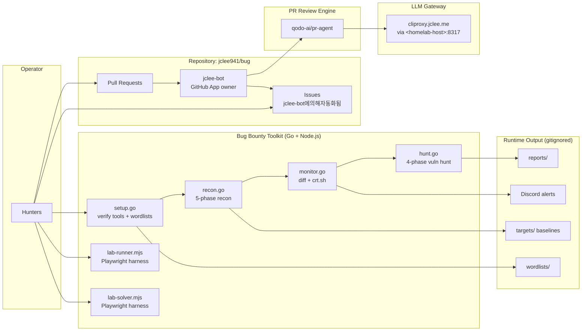

# Bug Bounty Automation Toolkit / 버그 바운티 자동화 툴킷

[](./LICENSE)
[](./scripts/)
[](./package.json)


[](#-contribution-guide--기여-가이드)
[](#-architecture--아키텍처)
[](#-jclee-bot-automation-surfaces--jclee-bot-자동화-표면)
[](https://cliproxy.jclee.me/v1)
[](https://github.com/qodo-ai/pr-agent)

> A Go-driven bug bounty automation toolkit that orchestrates the **recon → monitor → hunt → report** lifecycle, paired with a GitHub App–owned automation layer (`jclee-bot`) that keeps the repository itself healthy.
>
> Go 표준 라이브러리 기반의 버그 바운티 자동화 툴킷. **정찰(recon) → 모니터링(monitor) → 헌팅(hunt) → 리포트(report)** 전 과정을 단일 인터페이스로 오케스트레이션하며, 저장소 자체의 건강 상태를 유지하는 `jclee-bot` 자동화 레이어를 함께 제공합니다.

---

## Table of Contents / 목차

- [Overview / 개요](#overview--개요)
- [Features / 주요 기능](#features--주요-기능)
- [Architecture / 아키텍처](#architecture--아키텍처)
- [Repository Structure / 저장소 구조](#repository-structure--저장소-구조)
- [jclee-bot Automation Surfaces / jclee-bot 자동화 표면](#jclee-bot-automation-surfaces--jclee-bot-자동화-표면)
- [Go Tools / Go 도구](#go-tools--go-도구)
- [Node.js Tools / Node.js 도구](#nodejs-tools--nodejs-도구)
- [Configuration / 설정](#configuration--설정)
- [Quick Start / 빠른 시작](#quick-start--빠른-시작)
- [Local Development / 로컬 개발](#local-development--로컬-개발)
- [Commands Reference / 명령어 레퍼런스](#commands-reference--명령어-레퍼런스)
- [Output & Conventions / 출력과 컨벤션](#output--conventions--출력과-컨벤션)
- [Contribution Guide / 기여 가이드](#contribution-guide--기여-가이드)
- [Security & Ethics / 보안과 윤리](#security--ethics--보안과-윤리)

---

## Overview / 개요

This repository contains a self-contained bug-bounty automation stack organized around a small number of single-file Go programs that shell out to industry-standard reconnaissance and offensive tools. The `Makefile` is the public entry point — every operation is reachable via `make <command> TARGET=<domain>`.

Companion Node.js modules (`lab-runner.mjs`, `lab-solver.mjs`) provide a small Playwright-based harness for browser-driven lab challenges, which is why Playwright is declared in `package.json`.

Above the application code sits a repository-automation layer owned by the `jclee-bot` GitHub App. `jclee-bot` is the **single source of truth** for all mutating actions performed on issues and pull requests (labeling, normalization, welcome, stale, auto-merge, reviews, security review, size enforcement). The GitHub Actions workflow files exist only as the execution triggers that materialize those decisions — they are not the source of truth, and should not be edited to add new behavior without coordinating with the App.

LLM-driven surfaces (PR review, security review, intelligent normalization) are routed through the public LLM gateway at `https://cliproxy.jclee.me/v1`, with `qodo-ai/pr-agent` as the review engine.

> 본 저장소는 단일 파일 Go 프로그램들을 중심으로 한 자급자족형 버그 바운티 자동화 스택입니다. `Makefile`이 공용 진입점이며, 모든 작업은 `make <command> TARGET=<도메인>` 형태로 실행됩니다. `jclee-bot` GitHub App은 이슈/PR에 대한 모든 변경 자동화(라벨링, 정규화, 환영, stale 처리, 자동 머지, 리뷰, 보안 리뷰, 크기 제한 등)의 단일 진실 공급원(Single Source of Truth)이며, GitHub Actions 워크플로우 파일은 그 결정을 실행하는 트리거일 뿐, 진실의 원천이 아닙니다.

---

## Features / 주요 기능

- **Single-binary Go stdlib architecture** — no `go.mod`, no vendored dependencies. Every tool is a standalone `*.go` file run via `go run`.
- **Five-phase reconnaissance pipeline** — subdomain enumeration → HTTP probing → fingerprinting → URL discovery → nuclei scanning, all driven by `scripts/recon.go`.
- **Diff-based monitoring** — `scripts/monitor.go` watches for newly observed subdomains, endpoints, and certificate transparency entries, with optional Discord alerts.
- **Targeted vulnerability hunting** — `scripts/hunt.go` runs four hunting phases with category flags (`-type idor`, `-type ssrf`, …).
- **First-time onboarding** — `scripts/setup.go` verifies required CLI tools and downloads SecLists-style wordlists before the first scan.
- **Single-command orchestration** — `make full-scan TARGET=…` chains recon + hunt end to end.
- **GitHub App–owned automation** — `jclee-bot` owns all mutating repository automation, surfaced through GitHub Actions for execution.
- **LLM-assisted PR review** — `qodo-ai/pr-agent` reviews pull requests through the public LLM gateway at `https://cliproxy.jclee.me/v1`.

---

## Architecture / 아키텍처

The system is split into two cooperating planes:

1. **Application plane** — the bug-bounty toolkit itself (Go + Node.js scripts, `Makefile`, configuration, runtime output).
2. **Repository plane** — the `jclee-bot` GitHub App and the GitHub Actions workflows that implement its decisions on issues and pull requests.



Key invariants encoded by the diagram:

- `jclee-bot` is the **owner** of all mutating issue/PR behavior. Workflow files are downstream triggers.
- Issue automation is marked `jclee-bot에의해자동화됨` to make App ownership visible to readers and contributors.
- LLM-driven review surfaces route through `cliproxy.jclee.me`, which fronts the homelab-hosted LLM backend.
- `recon/`, `targets/`, `reports/`, and `wordlists/` are runtime artifacts and never committed.

---

## Repository Structure / 저장소 구조

The tracked layout of this repository:

```
.
├── AGENTS.md                # Knowledge base for agents and contributors
├── Makefile                 # Orchestration entry point (make help)
├── README.md                # This file
├── package.json             # Node.js metadata (Playwright dependency)
├── package-lock.json
├── config/
│   └── targets.json         # Target and notification configuration
├── notes/
│   ├── phase2-checklist.md  # Learning checklist
│   ├── report-template.md   # Bug report template
│   └── vulnerability-study.md
└── scripts/
    ├── setup.go             # Tool verification + wordlist download
    ├── recon.go             # 5-phase recon pipeline
    ├── monitor.go           # Diff monitoring + crt.sh + Discord alerts
    ├── hunt.go              # 4-phase targeted vulnerability hunting
    ├── lab-runner.mjs       # Playwright-based lab harness
    └── lab-solver.mjs       # Playwright-based lab harness
```

Runtime directories that are **created on demand and gitignored** (do not commit):

```
recon/        # Timestamp-stamped scan results
targets/      # Per-target baselines for diff monitoring
reports/      # Submitted reports
wordlists/    # SecLists-style wordlist cache
```

> The `_bot-scripts/` path may appear transiently as a CI checkout location; it is not a tracked directory in this repository. Do not add it to documentation, automation, or imports.

---

## jclee-bot Automation Surfaces / jclee-bot 자동화 표면

All mutating repository automation is owned by the `jclee-bot` GitHub App. The App declares the desired behavior; GitHub Actions workflow files only implement the execution triggers. When you see automation in this repository, it is **`jclee-bot에의해자동화됨`**.

### Issue surfaces

- **Welcome new contributors** — first-time issue/PR authors receive a greeting pointing to the contribution guide.
- **Issue labeling** — incoming issues are classified by content signals so they can be routed to the right owner.
- **Issue lifecycle** — `jclee-bot` tracks open issues, applies state transitions (needs-info, duplicate, wontfix, …), and closes stale threads.
- **Stale management** — long-inactive issues and PRs are flagged and rotated per the project's rotation policy.

### Pull request surfaces

- **PR labeling** — `labeler.yml` ensures every PR carries the right topical labels.
- **PR title/body normalization** — PRs are normalized to a conventional format before review.
- **PR size enforcement** — oversize PRs are flagged with a size label so reviewers can scope the change.
- **PR review** — `qodo-ai/pr-agent` is invoked by `jclee-bot` to provide an LLM-assisted review through `https://cliproxy.jclee.me/v1`.
- **PR security review** — a dedicated security-focused review pass runs on diffs that touch sensitive paths.
- **Auto-merge** — qualifying PRs (passing checks, approvals, conventional title) are merged by `jclee-bot` without manual intervention.

### Why this matters / 왜 이렇게 구성했는가

Treating the App as the source of truth means contributors never need to edit workflow files to add new automation — they extend the App's policy and the workflows follow. Workflow files should be read as **execution triggers**, not as policy. The marker `jclee-bot에의해자동화됨` is the contract that signals this ownership on every issue surface.

> GitHub Actions 워크플로우 파일은 자동화의 진실 원천이 아니라 실행 트리거입니다. 새로운 자동화를 추가할 때는 워크플로우를 직접 수정하지 말고 `jclee-bot`의 정책 레이어를 확장하세요.

---

## Go Tools / Go 도구

Every Go tool is a single-file program with **no `go.mod`** — they are executed via `go run scripts/<name>.go` and depend only on the Go standard library. External tools are invoked through `os/exec`.

| Tool | File | Role |
|------|------|------|
| `setup.go` | `scripts/setup.go` | First-time onboarding. Verifies that required CLI tools (`nuclei`, `httpx`, `subfinder`, `naabu`, `gau`, `waybackurls`, …) are present and downloads SecLists-style wordlists into `wordlists/`. |
| `recon.go` | `scripts/recon.go` | Five-phase reconnaissance pipeline. Subdomain enumeration → HTTP probing → fingerprinting → URL discovery → nuclei scanning. Supports `-skip-nuclei` for fast mode. |
| `monitor.go` | `scripts/monitor.go` | Diff-based change detection. Compares current scan output against the stored baseline under `targets/<domain>/`, surfaces new subdomains, new endpoints, and fresh crt.sh entries, and emits optional Discord alerts. |
| `hunt.go` | `scripts/hunt.go` | Four-phase targeted vulnerability hunting. Supports `-type idor`, `-type ssrf`, and other categories enumerated in the `huntTypes` slice. |

Add a new hunt category by appending to the `huntTypes` slice in `scripts/hunt.go` and providing a runner function. Add a new recon phase by extending the phase slice in `scripts/recon.go`. Add a new CLI tool dependency by listing it in the verification block of `scripts/setup.go`.

> 표준 라이브러리 외 의존성은 없습니다. 모든 외부 도구는 `os/exec` 셸아웃으로 호출되므로, Go 도구 자체는 언제든 `go run`만으로 실행할 수 있습니다.

---

## Node.js Tools / Node.js 도구

Two Playwright-based lab harnesses live alongside the Go tools. They are intentionally small and self-contained, and they share the same `Makefile` orchestration philosophy (single command, optional target).

| Tool | File | Role |
|------|------|------|
| `lab-runner.mjs` | `scripts/lab-runner.mjs` | Playwright-driven runner for browser-based lab challenges. Boots a headless browser, navigates to the target, and exercises the configured scenario. |
| `lab-solver.mjs` | `scripts/lab-solver.mjs` | Playwright-driven solver companion. Pairs with `lab-runner.mjs` to attempt automated resolution of the same scenarios. |

The only declared Node.js dependency is Playwright (`playwright@^1.61.0`). Run with:

```bash
node scripts/lab-runner.mjs
node scripts/lab-solver.mjs
```

---

## Configuration / 설정

`config/targets.json` is the single configuration file consumed by the Go tools. It defines:

- the list of authorized targets (and their associated program metadata),
- notification endpoints (e.g. Discord webhook URL for `monitor.go` alerts),
- per-target rate-limit overrides (default: 100 req/s for nuclei).

A new target is added by appending an entry to `config/targets.json` — never by hardcoding the domain into a script.

> 새 타겟은 반드시 `config/targets.json`에 등록하고, 절대 스크립트 안에 도메인을 하드코딩하지 마세요.

---

## Quick Start / 빠른 시작

### 1. Clone and verify / 클론 및 검증

```bash
git clone https://github.com/jclee941/.github
cd bug
make setup
```

`make setup` will check that every required CLI tool is on `$PATH` and populate `wordlists/`.

### 2. Configure a target / 타겟 설정

Edit `config/targets.json` and add the authorized target and a notification endpoint.

### 3. Run the full pipeline / 전체 파이프라인 실행

```bash
make full-scan TARGET=example.com
```

This chains `recon` and `hunt`. For finer-grained control, use the individual targets described in [Commands Reference](#commands-reference--명령어-레퍼런스).

### 4. Enable change monitoring / 변경 모니터링 활성화

```bash
make monitor TARGET=example.com
```

`monitor.go` will diff the latest scan against the baseline under `targets/example.com/` and push alerts to the configured Discord webhook.

---

## Local Development / 로컬 개발

### Prerequisites / 사전 요구 사항

- **Go** (recent stable) — used to run the Go tools via `go run`.
- **Node.js** (recent LTS) — used to run the lab harnesses.
- **External CLI tools** — the verification step in `scripts/setup.go` will tell you which ones are missing. The typical set includes: `subfinder`, `httpx`, `naabu`, `gau`, `waybackurls`, `nuclei`.
- **Wordlists** — downloaded by `make setup` into `wordlists/`.

### Workflow / 작업 흐름

1. **Branch** — create a feature branch off `main`.
2. **Edit** — modify a Go tool, the `Makefile`, the configuration, or a node of documentation.
3. **Smoke test** — `make setup` for tool/wordlist changes; `make recon-fast TARGET=<your-test-target>` for recon changes; `make hunt TYPE=idor TARGET=<your-test-target>` for hunt changes.
4. **Open a PR** — the PR surfaces (`jclee-bot에의해자동화됨`) will normalize the title, label the change, run size enforcement, and trigger `qodo-ai/pr-agent` review via `https://cliproxy.jclee.me/v1`.
5. **Auto-merge** — once checks and reviews pass, `jclee-bot` will merge the PR.

### Adding a new hunt category / 새 헌트 카테고리 추가

```go
// in scripts/hunt.go
var huntTypes = []string{"idor", "ssrf", "your-new-category"}
```

Provide a runner function in the same file and call it from the dispatcher.

### Adding a new recon phase / 새 정찰 단계 추가

```go
// in scripts/recon.go — extend the phase slice
var phases = []Phase{
    {Name: "subdomain-enum", Run: runSubdomainEnum},
    // ...
    {Name: "your-new-phase", Run: runYourNewPhase},
}
```

---

## Commands Reference / 명령어 레퍼런스

All commands are defined in the `Makefile` and are listed by `make help`.

| Command | Purpose |
|---------|---------|
| `make help` | Show the full command catalog with descriptions. |
| `make setup` | First-time setup: verify tools, download wordlists. |
| `make recon TARGET=example.com` | Run the full 5-phase recon pipeline. |
| `make recon-fast TARGET=example.com` | Run recon without the nuclei phase. |
| `make monitor TARGET=example.com` | Diff current state against the baseline and alert on new findings. |
| `make hunt TARGET=example.com` | Run all hunt categories. |
| `make hunt-idor TARGET=example.com` | Hunt IDOR vulnerabilities only. |
| `make hunt-ssrf TARGET=example.com` | Hunt SSRF vulnerabilities only. |
| `make full-scan TARGET=example.com` | Chain recon + hunt in one pass. |
| `make clean` | Remove runtime output (`recon/`, `targets/`, `reports/`, `wordlists/`). |

Every `TARGET=` command also accepts the underlying Go tool's native flags by extending the `Makefile` target.

---

## Output & Conventions / 출력과 컨벤션

- **Stdlib-only Go** — no `go.mod`, no vendored modules. Run with `go run scripts/<name>.go`.
- **External tools** — invoked through `os/exec`. The Go tools themselves are thin orchestrators.
- **Timestamped output** — scan results land in `recon/<timestamp>/` so multiple runs never overwrite each other.
- **Per-target baselines** — `targets/<domain>/` stores the last-known good state used by `monitor.go` for diffing.
- **Gitignored runtime** — `recon/`, `targets/`, `reports/`, and `wordlists/` are never committed.
- **Rate limit** — default 100 req/s for nuclei; override per target in `config/targets.json`.
- **Korean / English** — documentation is bilingual by convention. Code identifiers stay in English; user-facing strings may carry both languages.

---

## Contribution Guide / 기여 가이드

Contributions of all sizes are welcome — bug fixes, new hunt categories, new recon phases, additional lab harnesses, and documentation improvements.

### Process / 절차

1. **Open an issue first** for non-trivial changes so `jclee-bot` can label it correctly and route it to the right owner. Issue handling is `jclee-bot에의해자동화됨`.
2. **Fork and branch** from `main`.
3. **Follow the conventions** in [Output & Conventions](#output--conventions--출력과-컨벤션). Keep Go tools stdlib-only.
4. **Write a clear PR title** in conventional format. `jclee-bot` will normalize titles that don't comply.
5. **Wait for the review surfaces** — `qodo-ai/pr-agent` (via `https://cliproxy.jclee.me/v1`) will produce an LLM review, and the security review pass will run on sensitive-path diffs. Both are owned by `jclee-bot`.
6. **Pass size enforcement** — keep PRs small. Oversize PRs are labeled, not blocked, but reviewers may request a split.
7. **Auto-merge** — once checks and approvals land, `jclee-bot` merges the PR for you.

### Code of conduct / 행동 강령

- Only scan targets for which you have explicit program authorization.
- Never exceed published rate limits.
- Never commit scan output, baselines, or reports.
- Be respectful in issues and reviews — automation is owned by `jclee-bot`; tone is owned by humans.

> 모든 mutating 자동화는 `jclee-bot`이 소유합니다. 워크플로우 파일을 직접 수정해 새로운 동작을 추가하지 마세요. 정책 변경은 App 레이어에서, 실행 트리거는 워크플로우에서 다루는 것이 이 저장소의 규약입니다.

---

## Security & Ethics / 보안과 윤리

This toolkit is intended for **authorized security testing only** — bug-bounty programs, red-team engagements with written authorization, and personal lab environments. The authors and the `jclee-bot` App disclaim all responsibility for use against unauthorized targets.

- Never hardcode targets into scripts.
- Never commit scan results, baselines, or reports.
- Always respect program scope and rate limits.
- Treat all findings as confidential until coordinated disclosure is complete.

---

## Acknowledgments / 감사의 말

- **PR review engine** — [qodo-ai/pr-agent](https://github.com/qodo-ai/pr-agent)
- **LLM gateway** — [cliproxy.jclee.me](https://cliproxy.jclee.me/v1)
- **Repository automation owner** — `jclee-bot` (GitHub App)
- **README generation** — primary model `gpt-5.5`, fallback `minimax-m3` via the CLIProxyAPI gateway.

---

## License / 라이선스

ISC — see the [`LICENSE`](./LICENSE) file.