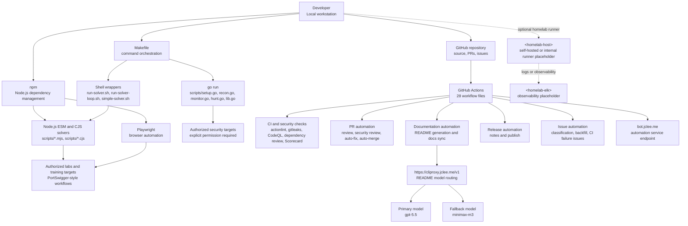

# Bug Bounty Automation Toolkit / 버그바운티 자동화 툴킷

## Badges / 배지

`Node.js ESM` `Playwright ^1.60.0` `Go Script Orchestration` `GitHub Actions 28 Workflows` `Security Automation` `ISC License` `README Model: gpt-5.5` `Fallback: minimax-m3 via CLIProxyAPI`

---

## Overview / 개요

### English

Bug Bounty Automation Toolkit is a local automation workspace for authorized web security research, vulnerability-study labs, and repeatable reconnaissance workflows.

This repository combines:

- Node.js ESM automation scripts for browser-driven lab solving and web workflow automation
- Playwright-based interaction tooling
- Go source files executed through `go run` from the Makefile
- Shell and Python helper wrappers for solver orchestration
- GitHub Actions workflows for CI, security checks, PR review, issue automation, docs generation, release automation, and self-healing automation

The project is designed for controlled environments such as CTF labs, PortSwigger Web Security Academy-style exercises, internal security testing, and explicitly authorized bug bounty programs.

### 한국어

Bug Bounty Automation Toolkit은 승인된 웹 보안 연구, 취약점 학습 랩, 반복 가능한 정찰 자동화를 위한 로컬 자동화 워크스페이스입니다.

이 저장소는 다음을 포함합니다.

- 브라우저 기반 랩 풀이 및 웹 워크플로 자동화를 위한 Node.js ESM 스크립트
- Playwright 기반 상호작용 자동화 도구
- Makefile에서 `go run`으로 실행되는 Go 소스 파일
- Solver 오케스트레이션을 위한 Shell 및 Python 헬퍼 래퍼
- CI, 보안 검사, PR 리뷰, 이슈 자동화, 문서 생성, 릴리스 자동화, 자동 복구를 위한 GitHub Actions 워크플로

이 프로젝트는 CTF 랩, PortSwigger Web Security Academy 유형의 학습 환경, 내부 보안 테스트, 명시적으로 승인된 버그바운티 프로그램과 같은 통제된 환경을 대상으로 합니다.

---

## Features / 주요 기능

### English

- Lab automation with Playwright and Node.js ESM scripts
- Batch-oriented solver scripts for multiple vulnerability categories
- Reconnaissance and hunting orchestration through Makefile targets
- Wrapper scripts for interactive and out-of-band testing workflows
- GitHub Actions-based automation for:
  - Branch-to-PR and issue-to-branch flows
  - PR checks and semantic PR validation
  - Actionlint, Gitleaks, CodeQL, dependency review, and Scorecard checks
  - Automated PR review and security review
  - Dependabot and PR auto-merge
  - Documentation generation and sync
  - Release notes and release publishing
  - CI failure issue creation and CI auto-healing
  - Issue classification and backfill automation
- README generation model policy:
  - Primary model: `gpt-5.5`
  - Fallback model: `minimax-m3 via CLIProxyAPI`
  - Public CLIProxy endpoint: `https://cliproxy.jclee.me/v1`

### 한국어

- Playwright 및 Node.js ESM 스크립트를 이용한 랩 자동화
- 여러 취약점 유형을 대상으로 하는 배치 기반 solver 스크립트
- Makefile 타깃을 통한 정찰 및 취약점 헌팅 오케스트레이션
- 인터랙티브 및 OOB 테스트 워크플로를 위한 래퍼 스크립트
- GitHub Actions 기반 자동화:
  - Branch-to-PR 및 Issue-to-Branch 흐름
  - PR 검사 및 Semantic PR 검증
  - Actionlint, Gitleaks, CodeQL, Dependency Review, Scorecard 검사
  - 자동 PR 리뷰 및 보안 리뷰
  - Dependabot 및 PR 자동 병합
  - 문서 생성 및 동기화
  - 릴리스 노트 및 릴리스 배포
  - CI 실패 이슈 생성 및 CI 자동 복구
  - 이슈 분류 및 백필 자동화
- README 생성 모델 정책:
  - 기본 모델: `gpt-5.5`
  - 대체 모델: `minimax-m3 via CLIProxyAPI`
  - 공개 CLIProxy 엔드포인트: `https://cliproxy.jclee.me/v1`

---

## Architecture / 아키텍처



---

## Automation Inventory / 자동화 목록

### GitHub Actions Workflows / GitHub Actions 워크플로

The repository contains 28 workflow files.

이 저장소에는 28개의 워크플로 파일이 있습니다.

| File | Purpose |
|---|---|
| `01_branch-to-pr.yml` | Creates or supports PR flow from branches |
| `02_issue-to-branch.yml` | Creates branches from issues or issue events |
| `03_pr-checks.yml` | Runs standard pull request checks |
| `04_actionlint.yml` | Lints GitHub Actions workflow files |
| `05_gitleaks.yml` | Scans for committed secrets with Gitleaks |
| `06_codeql.yml` | Runs CodeQL security analysis |
| `07_dependency-review.yml` | Reviews dependency changes in pull requests |
| `08_scorecard.yml` | Runs OpenSSF Scorecard-style supply-chain checks |
| `09_semantic-pr.yml` | Validates semantic PR title or metadata conventions |
| `10_pr-review.yml` | Performs automated PR review |
| `11_security-pr-review.yml` | Performs automated security-focused PR review |
| `12_dependabot-auto-merge.yml` | Handles Dependabot auto-merge policy |
| `13_pr-auto-merge.yml` | Handles general PR auto-merge policy |
| `14_bot-auto-fix.yml` | Applies bot-generated fixes where configured |
| `15_merged-pr-cleanup.yml` | Cleans up after merged pull requests |
| `19_issue-backfill.yml` | Backfills or normalizes issue metadata |
| `20_readme-gen.yml` | Generates or updates README documentation |
| `21_docs-sync.yml` | Synchronizes documentation artifacts |
| `24_release-notes.yml` | Generates release notes |
| `25_release-publish.yml` | Publishes releases |
| `29_downstream-health-check.yml` | Checks downstream automation health |
| `37_ci-failure-issues.yml` | Creates or updates issues for CI failures |
| `42_reusable-docs-sync.yml` | Reusable documentation sync workflow |
| `44_reusable-pr-checks.yml` | Reusable PR checks workflow |
| `45_reusable-gitleaks.yml` | Reusable Gitleaks workflow |
| `60_ci-auto-heal.yml` | Attempts CI auto-healing or automated repair flows |
| `91_issue-classification.yml` | Classifies issues automatically |
| `ci.yml` | General CI workflow |

### Automation Tooling / 자동화 도구

#### Node.js and Playwright Solvers / Node.js 및 Playwright Solver

| Tool | Type | Description |
|---|---|---|
| `scripts/lab-runner.mjs` | Node.js ESM | Main lab runner entry point configured as `package.json` main |
| `scripts/lab-solver.mjs` | Node.js ESM | Playwright-based lab solver |
| `scripts/lab-gap-solver.mjs` | Node.js ESM | Gap solver for labs not covered by simpler scripts |
| `scripts/lab-gap-helpers.mjs` | Node.js ESM | Shared helper logic for gap solving |
| `scripts/lab-batch-solver.mjs` | Node.js ESM | Batch lab solver |
| `scripts/lab-batch-fast.mjs` | Node.js ESM | Fast batch-solving mode |
| `scripts/lab-batch-slow.mjs` | Node.js ESM | Slower or more cautious batch-solving mode |
| `scripts/lab-batch-oob.mjs` | Node.js ESM | Batch workflow for out-of-band style labs |
| `scripts/lab-batch-smuggling.mjs` | Node.js ESM | Batch workflow for request smuggling-style labs |
| `scripts/lab-runner-aggressive.mjs` | Node.js ESM | Aggressive lab runner variant |
| `scripts/wave1-verify.mjs` | Node.js ESM | Verification helper for a wave/batch of labs |

#### CommonJS Solver Scripts / CommonJS Solver 스크립트

| Tool | Type | Description |
|---|---|---|
| `scripts/auth-solver.cjs` | CJS | Authentication-related solver |
| `scripts/batch-a.cjs` | CJS | Batch solver group A |
| `scripts/batch-b.cjs` | CJS | Batch solver group B |
| `scripts/batch-b-fixed.cjs` | CJS | Fixed variant of batch B |
| `scripts/batch-c.cjs` | CJS | Batch solver group C |
| `scripts/batch-collab.cjs` | CJS | Batch solver with collaborator/OOB behavior |
| `scripts/batch-d.cjs` | CJS | Batch solver group D |
| `scripts/batch-remaining.cjs` | CJS | Solver for remaining labs |
| `scripts/batch1-solver.cjs` | CJS | First batch solver |
| `scripts/comprehensive-batch.cjs` | CJS | Comprehensive batch execution |
| `scripts/comprehensive-solver.cjs` | CJS | Comprehensive solver |
| `scripts/custom-batch2.cjs` | CJS | Custom batch 2 solver |
| `scripts/custom-easy-solver.cjs` | CJS | Custom easy-lab solver |
| `scripts/essential-skills-solver.cjs` | CJS | Essential skills lab solver |
| `scripts/focused-batch.cjs` | CJS | Focused batch execution |
| `scripts/llm-attacks-solver.cjs` | CJS | LLM attack lab solver |
| `scripts/master-solver.cjs` | CJS | Master orchestration solver |
| `scripts/oob-solver.cjs` | CJS | Out-of-band lab solver |
| `scripts/quick-wins.cjs` | CJS | Quick-win solver pass |
| `scripts/quick-wins2.cjs` | CJS | Quick-win solver pass 2 |
| `scripts/quick-wins3.cjs` | CJS | Quick-win solver pass 3 |
| `scripts/race-conditions-solver.cjs` | CJS | Race condition solver |
| `scripts/race-solver.cjs` | CJS | Race-oriented solver |
| `scripts/retry-batch3.cjs` | CJS | Retry batch 3 |
| `scripts/retry-high-prob.cjs` | CJS | Retry high-probability targets |
| `scripts/retry-solver.cjs` | CJS | General retry solver |
| `scripts/robust-solver.cjs` | CJS | More robust solver variant |
| `scripts/sequential-solver.cjs` | CJS | Sequential solver |
| `scripts/single-lab-solver.cjs` | CJS | Single lab solver |
| `scripts/single-lab.cjs` | CJS | Single lab execution helper |
| `scripts/solve-all.cjs` | CJS | Solve all configured labs |
| `scripts/solve-batch.cjs` | CJS | Batch solve workflow |
| `scripts/solve-batch2.cjs` | CJS | Batch solve workflow 2 |
| `scripts/solve-clickjacking.cjs` | CJS | Clickjacking lab solver |
| `scripts/solve-comprehensive.cjs` | CJS | Comprehensive solve workflow |
| `scripts/solve-easy-labs.cjs` | CJS | Easy lab solver |
| `scripts/solve-hostheader3.cjs` | CJS | Host header lab solver |
| `scripts/solve-improved.cjs` | CJS | Improved solving workflow |
| `scripts/solve-jwt8.cjs` | CJS | JWT lab solver |
| `scripts/solve-race.cjs` | CJS | Race lab solver |
| `scripts/systematic-solver.cjs` | CJS | Systematic solver |
| `scripts/test-batch.cjs` | CJS | Batch test helper |
| `scripts/test-deser-fix.cjs` | CJS | Deserialization fix test helper |
| `scripts/test-lab06.cjs` | CJS | Lab 06 test helper |
| `scripts/web-cache-deception-solver.cjs` | CJS | Web cache deception solver |

#### Diagnostic and Discovery Scripts / 진단 및 탐색 스크립트

| Tool | Type | Description |
|---|---|---|
| `scripts/check-form.cjs` | CJS | Form inspection helper |
| `scripts/check-progress.cjs` | CJS | Progress checker |
| `scripts/diagnose-access.cjs` | CJS | Access-control diagnostic |
| `scripts/diagnose-access2.cjs` | CJS | Access-control diagnostic variant |
| `scripts/diagnose-deser.cjs` | CJS | Deserialization diagnostic |
| `scripts/diagnose-essential.cjs` | CJS | Essential lab diagnostic |
| `scripts/diagnose-essential2.cjs` | CJS | Essential lab diagnostic variant |
| `scripts/diagnose-essential3.cjs` | CJS | Essential lab diagnostic variant |
| `scripts/diagnose-nav.cjs` | CJS | Navigation diagnostic |
| `scripts/diagnose-topics.cjs` | CJS | Topic diagnostic |
| `scripts/explore-essential.cjs` | CJS | Essential lab exploration |
| `scripts/explore-essential2.cjs` | CJS | Essential lab exploration variant |
| `scripts/explore-essential3.cjs` | CJS | Essential lab exploration variant |
| `scripts/explore-race.cjs` | CJS | Race condition exploration |
| `scripts/extract-labs.cjs` | CJS | Lab extraction helper |
| `scripts/get-lab-urls.cjs` | CJS | Lab URL extraction |
| `scripts/get-lab-urls2.cjs` | CJS | Lab URL extraction variant |
| `scripts/list-essential.cjs` | CJS | List essential labs |
| `scripts/list-race.cjs` | CJS | List race labs |

#### Shell and Python Helpers / Shell 및 Python 헬퍼

| Tool | Type | Description |
|---|---|---|
| `scripts/get-lab-urls.sh` | Shell | Lab URL helper wrapper |
| `scripts/interactsh-wrapper.sh` | Shell | Interactsh helper wrapper |
| `scripts/run-solver-loop.sh` | Shell | Repeated solver execution loop |
| `scripts/run-solver.sh` | Shell | Solver execution wrapper |
| `scripts/simple-solver.sh` | Shell | Simple shell-based solver wrapper |
| `scripts/portswigger-solver-wrapper.py` | Python | PortSwigger solver wrapper |

#### Go Source Files / Go 소스 파일

The automation inventory reports `0` standalone Go automation tools, but the repository contains Go source files used by the Makefile with `go run`.

자동화 인벤토리 기준 독립 Go 자동화 도구 수는 `0`개이지만, 저장소에는 Makefile에서 `go run`으로 실행되는 Go 소스 파일이 포함되어 있습니다.

| File | Used by | Description |
|---|---|---|
| `scripts/setup.go` | `make setup` | Initial setup and tool verification |
| `scripts/recon.go` | `make recon`, `make recon-fast` | Reconnaissance pipeline |
| `scripts/monitor.go` | `make monitor` | Change monitoring workflow |
| `scripts/hunt.go` | `make hunt`, `make hunt-idor`, `make hunt-ssrf` | Targeted vulnerability hunting workflow |
| `scripts/lib.go` | Shared | Shared helper functions for Go scripts |

---

## Quick Start / 빠른 시작

### Prerequisites / 사전 요구 사항

Install the following locally:

- Node.js compatible with ESM modules
- npm
- Playwright dependencies
- Go toolchain
- Bash-compatible shell
- Optional external security CLIs used by your local recon or hunting workflow

### Installation / 설치

```bash
npm install
npx playwright install
```

### Show Available Make Commands / Make 명령어 확인

```bash
make help
```

### First-Time Setup / 최초 설정

```bash
make setup
```

### Run Reconnaissance / 정찰 실행

Use only against targets where you have explicit authorization.

명시적으로 허가받은 대상에 대해서만 실행하세요.

```bash
make recon TARGET=example.com
```

### Run Fast Reconnaissance / 빠른 정찰 실행

```bash
make recon-fast TARGET=example.com
```

### Monitor for Changes / 변경 사항 모니터링

```bash
make monitor TARGET=example.com
```

### Run Vulnerability Hunting / 취약점 헌팅 실행

```bash
make hunt TARGET=example.com
```

### Run Specific Hunt Types / 특정 유형 헌팅 실행

```bash
make hunt-idor TARGET=example.com
make hunt-ssrf TARGET=example.com
```

### Run a Lab Solver / 랩 Solver 실행

```bash
node scripts/lab-runner.mjs
```

You can also run specific solver files directly when they are designed for standalone execution.

개별 solver가 단독 실행을 지원하는 경우 직접 실행할 수도 있습니다.

```bash
node scripts/lab-solver.mjs
node scripts/lab-batch-solver.mjs
node scripts/solve-easy-labs.cjs
```

---

## Local Development / 로컬 개발

### Install Dependencies / 의존성 설치

```bash
npm install
```

### Playwright Browser Setup / Playwright 브라우저 설치

```bash
npx playwright install
```

### Package Metadata / 패키지 메타데이터

| Field | Value |
|---|---|
| Package name | `bug` |
| Version | `1.0.0` |
| Type | `module` |
| Main | `scripts/lab-runner.mjs` |
| License | `ISC` |
| Runtime dependency | `playwright ^1.60.0` |

### Test Command / 테스트 명령

The current `package.json` test script is a placeholder and exits with an error.

현재 `package.json`의 테스트 스크립트는 자리표시자이며 오류로 종료됩니다.

```bash
npm test
```

Current behavior:

```text
Error: no test specified
```

### Development Notes / 개발 참고 사항

- Node scripts use a mix of ESM `.mjs` and CommonJS `.cjs`.
- The package is configured with `"type": "module"`.
- The main Node entry point is `scripts/lab-runner.mjs`.
- Go files are executed directly through `go run`; no `go.mod` is shown in the current project structure.
- Keep target-specific data, lab credentials, cookies, tokens, and scan output out of version control.
- Do not hardcode private infrastructure details in source code or documentation.

---

## Commands Reference / 명령어 참조

### Makefile Commands / Makefile 명령어

| Command | Description |
|---|---|
| `make help` | Show available commands |
| `make setup` | Initial setup; verify tools and download required resources |
| `make recon TARGET=example.com` | Run full reconnaissance pipeline on the target |
| `make recon-fast TARGET=example.com` | Run quick reconnaissance and skip nuclei scan |
| `make monitor TARGET=example.com` | Run diff monitoring to detect new subdomains or endpoints |
| `make hunt TARGET=example.com` | Run targeted vulnerability hunting |
| `make hunt-idor TARGET=example.com` | Hunt IDOR vulnerabilities only |
| `make hunt-ssrf TARGET=example.com` | Hunt SSRF vulnerabilities only |

The Makefile may contain additional commands after the visible excerpt. Run `make help` to list the authoritative command set.

Makefile의 전체 명령 목록은 `make help`가 가장 정확합니다.

### npm Commands / npm 명령어

| Command | Description |
|---|---|
| `npm install` | Install Node.js dependencies |
| `npm test` | Placeholder test command; currently exits with an error |
| `npx playwright install` | Install Playwright browser binaries |

### Direct Script Execution / 직접 스크립트 실행

Examples:

```bash
node scripts/lab-runner.mjs
node scripts/lab-solver.mjs
node scripts/lab-gap-solver.mjs
node scripts/solve-all.cjs
bash scripts/run-solver.sh
python3 scripts/portswigger-solver-wrapper.py
```

Go examples:

```bash
go run scripts/setup.go scripts/lib.go
go run scripts/recon.go scripts/lib.go -d example.com
go run scripts/monitor.go scripts/lib.go -d example.com
go run scripts/hunt.go scripts/lib.go -d example.com
```

---

## Repository Structure / 저장소 구조

The top-level layout below reflects the provided on-disk project structure.

아래 구조는 제공된 실제 최상위 저장소 구조를 기준으로 합니다.

```text
/
├── AGENTS.md
├── CONTRIBUTING.md
├── LICENSE
├── Makefile
├── README.md
├── interactsh_payload.txt
├── output-lab08.png
├── package-lock.json
├── package.json
└── scripts/
    ├── auth-solver.cjs
    ├── batch-a.cjs
    ├── batch-b-fixed.cjs
    ├── batch-b.cjs
    ├── batch-c.cjs
    ├── batch-collab.cjs
    ├── batch-d.cjs
    ├── batch-remaining.cjs
    ├── batch1-solver.cjs
    ├── check-form.cjs
    ├── check-progress.cjs
    ├── comprehensive-batch.cjs
    ├── comprehensive-solver.cjs
    ├── custom-batch2.cjs
    ├── custom-easy-solver.cjs
    ├── custom-solvers/
    ├── diagnose-access.cjs
    ├── diagnose-access2.cjs
    ├── diagnose-deser.cjs
    ├── diagnose-essential.cjs
    ├── diagnose-essential2.cjs
    ├── diagnose-essential3.cjs
    ├── diagnose-nav.cjs
    ├── diagnose-topics.cjs
    ├── essential-skills-solver.cjs
    ├── explore-essential.cjs
    ├── explore-essential2.cjs
    ├── explore-essential3.cjs
    ├── explore-race.cjs
    ├── extended-retry.cjs
    ├── extract-labs.cjs
    ├── final-attempt.cjs
    ├── focused-batch.cjs
    ├── get-lab-urls.cjs
    ├── get-lab-urls.sh
    ├── get-lab-urls2.cjs
    ├── hunt.go
    ├── interactsh-wrapper.sh
    ├── lab-batch-fast.mjs
    ├── lab-batch-oob.mjs
    ├── lab-batch-slow.mjs
    ├── lab-batch-smuggling.mjs
    ├── lab-batch-solver.mjs
    ├── lab-gap-helpers.mjs
    ├── lab-gap-solver.mjs
    ├── lab-runner-aggressive.mjs
    ├── lab-runner.mjs
    ├── lab-solver.mjs
    ├── lib.go
    ├── list-essential.cjs
    ├── list-race.cjs
    ├── llm-attacks-solver.cjs
    ├── master-solver.cjs
    ├── monitor.go
    ├── oob-solver.cjs
    ├── portswigger-solver-wrapper.py
    ├── quick-wins.cjs
    ├── quick-wins2.cjs
    ├── quick-wins3.cjs
    ├── race-conditions-solver.cjs
    ├── race-solver.cjs
    ├── recon.go
    ├── retry-batch3.cjs
    ├── retry-high-prob.cjs
    ├── retry-solver.cjs
    ├── robust-solver.cjs
    ├── run-solver-loop.sh
    ├── run-solver.sh
    ├── sequential-solver.cjs
    ├── setup.go
    ├── simple-solver.sh
    ├── single-lab-solver.cjs
    ├── single-lab.cjs
    ├── solve-all.cjs
    ├── solve-batch.cjs
    ├── solve-batch2.cjs
    ├── solve-clickjacking.cjs
    ├── solve-comprehensive.cjs
    ├── solve-easy-labs.cjs
    ├── solve-hostheader3.cjs
    ├── solve-improved.cjs
    ├── solve-jwt8.cjs
    ├── solve-race.cjs
    ├── systematic-solver.cjs
    ├── test-batch.cjs
    ├── test-deser-fix.cjs
    ├── test-lab06.cjs
    ├── wave1-verify.mjs
    └── web-cache-deception-solver.cjs
```

---

## Security and Responsible Use / 보안 및 책임 있는 사용

### English

This toolkit is intended only for:

- Labs and CTF-style environments
- Systems you own
- Systems where you have explicit written authorization
- Bug bounty programs where your activity is within scope and within rate limits

Do not use this project for unauthorized scanning, exploitation, credential attacks, service disruption, or data exfiltration.

### 한국어

이 툴킷은 다음 환경에서만 사용해야 합니다.

- 랩 및 CTF 유형 환경
- 본인이 소유한 시스템
- 명시적인 서면 허가를 받은 시스템
- 범위와 속도 제한을 준수하는 버그바운티 프로그램

무단 스캔, 악용, 인증 정보 공격, 서비스 장애 유발, 데이터 유출 목적으로 사용하지 마세요.

---

## Contribution Guide / 기여 가이드

### English

Before contributing:

1. Read `CONTRIBUTING.md`.
2. Keep changes small and reviewable.
3. Use descriptive branch names and PR titles.
4. Do not commit credentials, cookies, tokens, scan output, private infrastructure details, or target-specific sensitive data.
5. Run local checks where possible.
6. Update documentation when behavior changes.

Recommended workflow:

```bash
git checkout -b feature/short-description
npm install
npx playwright install
make help
```

For solver changes:

- Include a short explanation of what lab or workflow the solver targets.
- Avoid hardcoded target domains unless they are safe examples such as `example.com`.
- Avoid storing session cookies or credentials in committed files.
- Prefer environment variables for local secrets.

For workflow changes:

- Preserve real workflow filenames, including numeric prefixes.
- Validate workflow syntax before opening a PR.
- Keep reusable workflow behavior compatible with:
  - `42_reusable-docs-sync.yml`
  - `44_reusable-pr-checks.yml`
  - `45_reusable-gitleaks.yml`

### 한국어

기여 전 확인 사항:

1. `CONTRIBUTING.md`를 읽어주세요.
2. 변경 사항은 작고 리뷰 가능하게 유지하세요.
3. 명확한 브랜치 이름과 PR 제목을 사용하세요.
4. 인증 정보, 쿠키, 토큰, 스캔 결과, 사설 인프라 정보, 대상별 민감 정보를 커밋하지 마세요.
5. 가능한 경우 로컬 검사를 실행하세요.
6. 동작이 변경되면 문서도 함께 업데이트하세요.

권장 작업 흐름:

```bash
git checkout -b feature/short-description
npm install
npx playwright install
make help
```

Solver 변경 시:

- 어떤 랩 또는 워크플로를 대상으로 하는지 간단히 설명하세요.
- `example.com` 같은 안전한 예시가 아닌 실제 대상 도메인을 하드코딩하지 마세요.
- 세션 쿠키나 인증 정보를 커밋하지 마세요.
- 로컬 비밀값은 환경 변수를 사용하는 방식을 선호하세요.

Workflow 변경 시:

- 숫자 접두사를 포함한 실제 워크플로 파일명을 유지하세요.
- PR을 열기 전에 워크플로 문법을 검증하세요.
- 다음 재사용 워크플로와의 호환성을 유지하세요.
  - `42_reusable-docs-sync.yml`
  - `44_reusable-pr-checks.yml`
  - `45_reusable-gitleaks.yml`

---

## License / 라이선스

This project is licensed under the ISC License. See `LICENSE` for details.

이 프로젝트는 ISC License를 따릅니다. 자세한 내용은 `LICENSE`를 확인하세요.