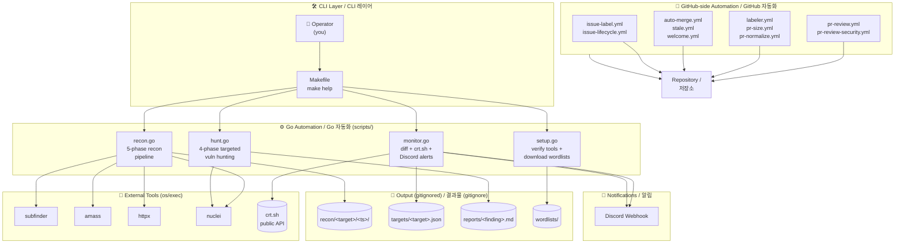

# Bug Bounty Automation Toolkit / 버그 바운티 자동화 툴킷

[](./LICENSE)
[](./scripts/)
[](./package.json)


> A Go-driven bug bounty automation toolkit that orchestrates the **recon → monitor → hunt → report** lifecycle, with GitHub-side workflows that keep the repository itself tidy.

---

## Overview

The **Bug Bounty Automation Toolkit** (`jclee941/bug`) is a personal security-research harness written almost entirely in Go's standard library. It wraps industry-standard reconnaissance and exploitation tooling (subfinder, amass, httpx, nuclei, crt.sh, etc.) behind a single, opinionated `make` interface, and ships with a curated GitHub-side automation layer so that the repository stays healthy while you hunt on real targets.

The toolkit is designed around four operating modes:

| Mode | Purpose |
|---|---|
| `setup` | One-time environment verification + SecLists download |
| `recon` | 5-phase reconnaissance pipeline on a target domain |
| `monitor` | Diff-based change detection (new subdomains / endpoints) with Discord alerting |
| `hunt` | Targeted vulnerability hunting (IDOR, SSRF, XSS, etc.) against an existing recon baseline |

All scan output is gitignored; only code, configuration, templates, and notes are versioned.

## 개요

**Bug Bounty Automation Toolkit**(`jclee941/bug`)은 Go 표준 라이브러리만으로 작성된 개인용 보안 연구 자동화 도구입니다.业界 표준 정찰/공격 도구(subfinder, amass, httpx, nuclei, crt.sh 등)를 단일 `make` 인터페이스 뒤에 감싸고, 저장소 자체의 건강 상태를 유지하기 위한 GitHub 자동화 레이어를 함께 제공합니다.

툴킷은 다음 네 가지 운용 모드를 중심으로 설계되었습니다:

| 모드 | 목적 |
|---|---|
| `setup` | 최초 환경 검증 + SecLists 다운로드 |
| `recon` | 대상 도메인에 대한 5단계 정찰 파이프라인 |
| `monitor` | 새로운 서브도메인/엔드포인트의 차분 기반 탐지 + 디스코드 알림 |
| `hunt` | 기존 정찰 베이스라인을 대상으로 한 표적형 취약점 헌팅 (IDOR, SSRF, XSS 등) |

스캔 결과물은 모두 `.gitignore` 대상이며, 코드·설정·템플릿·노트만 버전 관리됩니다.

---

## Key Features / 주요 기능

- 🛰 **End-to-end recon pipeline** — subdomain enumeration → resolution → HTTP probing → URL collection → nuclei scanning, all driven by a single `make` target.
- 🛰 **엔드투엔드 정찰 파이프라인** — 서브도메인 수집 → 해석 → HTTP 프로빙 → URL 수집 → nuclei 스캔을 단일 `make` 타깃으로 실행.
- 🔁 **Continuous monitor mode** — diff-aware scanning that fires only on new findings, with optional Discord webhook notifications via `monitor.go`.
- 🔁 **연속 모니터링 모드** — 신규 발견에 대해서만 동작하는 차분 기반 스캔과 `monitor.go`의 디스코드 웹훅 알림 지원.
- 🎯 **Pluggable hunt categories** — vulnerability classes are encoded as a `huntTypes` slice in `scripts/hunt.go`; new categories (IDOR, SSRF, …) can be added with minimal changes.
- 🎯 **플러그인형 헌팅 카테고리** — 취약점 분류는 `scripts/hunt.go`의 `huntTypes` 슬라이스로 표현되어 신규 카테고리(IDOR, SSRF 등)를 최소한의 수정으로 추가 가능.
- 🪶 **Zero-dependency core** — every Go script is a single standalone file using only the standard library; tools are invoked via `os/exec` wrappers.
- 🪶 **무의존성 코어** — 모든 Go 스크립트는 표준 라이브러리만 사용하는 단일 독립 파일이며, 외부 도구는 `os/exec` 래퍼를 통해 호출.
- 📝 **Report-ready templates** — `notes/report-template.md` and `notes/phase2-checklist.md` ship in the repo to standardize submission and learning loops.
- 📝 **리포트 즉시 사용 가능** — `notes/report-template.md`, `notes/phase2-checklist.md`를 저장소에서 기본 제공하여 제출과 학습 루프를 표준화.
- 🤖 **Repository-side automation** — 10 GitHub workflows cover PR review, sizing, normalization, labeling, auto-merge, stale handling, and contributor welcome.
- 🤖 **저장소 자동화** — PR 리뷰·사이즈 측정·정규화·라벨링·자동 머지·stale 처리·기여자 환영을 다루는 10개의 GitHub 워크플로우 포함.

---

## Architecture / 아키텍처



> All node labels with angle-bracket placeholders are HTML-escaped (`&lt;…&gt;`) so the block renders correctly on GitHub. Mermaid `flowchart TB` is used to keep the layout deterministic on both light and dark themes.

> 꺾쇠 괄호가 포함된 노드 레이블은 HTML 이스케이프(`&lt;…&gt;`) 처리되어 GitHub에서 올바르게 렌더링됩니다. Mermaid `flowchart TB`로 라이트/다크 테마 모두에서 안정적인 레이아웃을 보장합니다.

---

## Repository Structure / 저장소 구조

```text
bug/
├── AGENTS.md                    # Knowledge base (LLM/agent context)
├── Makefile                     # `make` orchestration entry point
├── package.json                 # Node-side metadata (playwright dep)
├── package-lock.json
├── config/
│   └── targets.json             # Target & notification configuration
├── scripts/
│   ├── setup.go                 # Tool verification + wordlist bootstrap
│   ├── recon.go                 # 5-phase recon pipeline
│   ├── monitor.go               # Diff monitor + crt.sh + Discord
│   ├── hunt.go                  # 4-phase targeted vuln hunting
│   ├── lab-runner.mjs           # Node.js lab driver (playwright)
│   └── lab-solver.mjs           # Node.js lab solver (playwright)
├── notes/
│   ├── phase2-checklist.md      # Learning checklist
│   ├── report-template.md       # Bug report template
│   └── vulnerability-study.md   # Personal vulnerability notes
└── (gitignored)
    ├── recon/                   # Timestamped scan output
    ├── targets/                 # Per-target baselines
    ├── reports/                 # Submitted reports
    └── wordlists/               # SecLists downloads
```

---

## Automation Inventory / 자동화 인벤토리

### 🔁 GitHub Workflows (`.github/workflows/`)

| Workflow File | Purpose / 목적 |
|---|---|
| `auto-merge.yml` | Auto-merge approved/Dependabot PRs after checks. / 승인된 PR 또는 Dependabot PR의 자동 머지. |
| `issue-label.yml` | Apply labels to issues based on title/body patterns. / 제목·본문 패턴으로 이슈에 라벨 부여. |
| `issue-lifecycle.yml` | Drive issue lifecycle (state transitions, auto-close on resolution). / 이슈 생명주기 관리 및 해결 시 자동 종료. |
| `labeler.yml` | Apply labels to PRs based on changed paths. / 변경 경로에 따라 PR에 라벨 부여. |
| `pr-normalize.yml` | Normalize PR title/branch conventions (Conventional Commits, etc.). / PR 제목·브랜치 규칙 정규화. |
| `pr-review-security.yml` | Security-focused review pass on PRs touching sensitive files. / 민감 파일이 변경된 PR에 대한 보안 리뷰 패스. |
| `pr-review.yml` | General PR review (typically backed by [`qodo-ai/pr-agent`](https://github.com/qodo-ai/pr-agent)). / 일반 PR 리뷰(주로 `qodo-ai/pr-agent` 기반). |
| `pr-size.yml` | Size label (XS/S/M/L/XL) based on diff stats. / diff 통계에 따른 사이즈 라벨 부여. |
| `stale.yml` | Mark issues/PRs as stale after inactivity; auto-close after grace. / 비활성 이슈/PR을 stale로 표시하고 유예 기간 후 자동 종료. |
| `welcome.yml` | Greet first-time contributors. / 첫 기여자에게 환영 메시지 게시. |

### ⚙️ Go Automation Tools (`scripts/`)

The core is intentionally a flat directory of standalone Go files — **no `go.mod`**, **no external imports**, run with `go run scripts/<file>.go`. Per the project's own conventions, tooling is invoked via `os/exec` and results are dropped into timestamped directories.

| File | Lines (approx.) | Role |
|---|---|---|
| `scripts/setup.go` | ~223 | First-time environment setup; verifies external CLIs, downloads SecLists wordlists into `wordlists/`. |
| `scripts/recon.go` | ~350 | 5-phase recon pipeline (subdomain enum → resolve → HTTP probe → URL collect → nuclei). Supports `-skip-nuclei`. |
| `scripts/monitor.go` | ~312 | Diff-based continuous monitor. Pulls from crt.sh, diffs against a stored baseline, posts new findings to Discord. |
| `scripts/hunt.go` | ~509 | 4-phase targeted vulnerability hunting. Categories live in a `huntTypes` slice (default: IDOR, SSRF, XSS, …) and can be filtered via `-type`. |

### 🧪 Node.js Lab Scripts (`scripts/`)

These are **not** documented in `AGENTS.md` and live alongside the Go core as an experimental side-channel. The single declared dependency is `playwright`, suggesting they are used for browser-based lab exercises.

| File | Notes |
|---|---|
| `scripts/lab-runner.mjs` | Node.js (ESM) entry point for browser-driven lab scenarios. |
| `scripts/lab-solver.mjs` | Companion solver / harness for the same lab scenarios. |

If you intend to use them, install dependencies first with `npm ci` and invoke with `node scripts/<file>.mjs`.

---

## Quick Start / 빠른 시작

### Prerequisites / 사전 준비

| Tool | Why / 용도 |
|---|---|
| Go ≥ 1.21 | Run the core automation scripts. / 코어 자동화 스크립트 실행 |
| `make` | Invoke the Makefile entry points. / Makefile 진입점 호출 |
| `subfinder`, `amass`, `httpx`, `nuclei` | External recon/scan CLIs invoked by the Go scripts. / Go 스크립트가 호출하는 외부 정찰·스캔 CLI |
| Node.js ≥ 18 + `npm` | Optional: only required for the `lab-*.mjs` scripts. / 선택: `lab-*.mjs` 스크립트를 사용할 때만 필요 |
| Discord webhook URL | Optional: required for `monitor.go` alerts. / 선택: `monitor.go` 알림에 필요 |

### One-time setup / 최초 설정

```bash
# 1. Clone
git clone https://github.com/jclee941/.github
cd bug

# 2. Verify environment + download SecLists
make setup

# 3. (optional) For Node.js lab scripts
npm ci
```

### First recon / 첫 정찰

```bash
# Full 5-phase recon (subfinder → amass → httpx → nuclei)
make recon TARGET=example.com

# Faster: skip the nuclei pass
make recon-fast TARGET=example.com

# Full chain: recon + hunt
make full-scan TARGET=example.com
```

---

## Local Development / 로컬 개발

| Task | Command |
|---|---|
| Show all `make` targets | `make help` |
| Edit the recon pipeline | Open `scripts/recon.go` and re-run `go run scripts/recon.go -d <target>` |
| Add a hunt category | Append an entry to the `huntTypes` slice in `scripts/hunt.go` |
| Tune rate limits | Adjust per-script flag defaults (e.g. nuclei rate) |
| Reset all scan output | `make clean` (removes `recon/`, `targets/`, `reports/`, `wordlists/`) |
| Tweak workflow behavior | Edit files under `.github/workflows/` and push to a branch |

### Edit loop / 편집 루프

```bash
# 1. Edit a script
$EDITOR scripts/recon.go

# 2. Run directly (no go.mod needed)
go run scripts/recon.go -d example.com -skip-nuclei

# 3. Once satisfied, commit
git add scripts/recon.go
git commit -m "recon: tighten httpx timeout"
```

---

## Commands Reference / 명령어 레퍼런스

All commands are thin wrappers around the Go entry points under `scripts/`. `TARGET` is required for every command except `help`, `setup`, and `clean`.

| Command | Korean | Description |
|---|---|---|
| `make help` | 도움말 | Show the help banner and the command list. / 도움말 배너와 명령어 목록 출력 |
| `make setup` | 초기 설정 | Verify external tools and download SecLists. / 외부 도구 검증 + SecLists 다운로드 |
| `make recon TARGET=x` | 정찰 | Full 5-phase recon pipeline. / 5단계 정찰 파이프라인 전체 실행 |
| `make recon-fast TARGET=x` | 빠른 정찰 | Recon with nuclei skipped. / nuclei를 건너뛴 정찰 |
| `make monitor TARGET=x` | 모니터링 | Diff-based change detection, optional Discord alerts. / 차분 기반 변경 탐지, 디스코드 알림 옵션 |
| `make hunt TARGET=x` | 헌팅 | All vulnerability categories. / 모든 취약점 카테고리 실행 |
| `make hunt-idor TARGET=x` | IDOR 헌팅 | IDOR hunt only. / IDOR만 표적 헌팅 |
| `make hunt-ssrf TARGET=x` | SSRF 헌팅 | SSRF hunt only. / SSRF만 표적 헌팅 |
| `make full-scan TARGET=x` | 전체 스캔 | Recon + hunt combined. / 정찰 + 헌팅 통합 |
| `make clean` | 정리 | Remove generated scan output. / 생성된 스캔 결과물 제거 |

---

## Configuration / 설정

Targets and notification endpoints live in [`config/targets.json`](./config/targets.json). Edit this file to:

- declare a new in-scope target,
- wire a Discord webhook URL for `monitor.go`,
- pin per-target nuclei tags or rate limits (depending on the schema your local copy uses).

> ⚠️ The repo's own convention explicitly forbids hardcoding target domains inside the Go scripts — all targets must flow through `config/targets.json` (or the `TARGET=…` make variable).

> ⚠️ 저장소의 컨벤션은 Go 스크립트 내에 대상 도메인을 하드코딩하는 것을 명시적으로 금지합니다. 모든 대상은 `config/targets.json`(또는 `TARGET=…` make 변수)을 통해 전달되어야 합니다.

---

## Where to Look / 참조 위치

| Task / 작업 | Location / 위치 |
|---|---|
| Add a new target / 대상 추가 | `config/targets.json` |
| Run full recon / 정찰 실행 | `make recon TARGET=x.com` |
| Monitor for changes / 변경 모니터링 | `make monitor TARGET=x.com` |
| Hunt vulnerabilities / 취약점 헌팅 | `make hunt TARGET=x.com` |
| Modify recon pipeline / 정찰 파이프라인 수정 | `scripts/recon.go` |
| Add hunt categories / 헌팅 카테고리 추가 | `scripts/hunt.go` → `huntTypes` slice |
| Change nuclei settings / nuclei 설정 변경 | Per-script flag defaults |
| Report template / 리포트 템플릿 | `notes/report-template.md` |
| Learning checklist / 학습 체크리스트 | `notes/phase2-checklist.md` |
| Personal vulnerability study / 개인 취약점 연구 | `notes/vulnerability-study.md` |

---

## Contribution Guide / 기여 가이드

1. **Fork & branch** — create a topic branch off `main` (the `pr-normalize.yml` workflow enforces Conventional-Commit-style titles).
2. **Keep scripts standalone** — every Go file under `scripts/` must remain a single self-contained file with **no external dependencies** beyond the standard library.
3. **Never commit scan output** — `recon/`, `targets/`, `reports/`, and `wordlists/` are gitignored. Double-check `git status` before pushing.
4. **Tune the right file** — small behavior changes go in the per-script flag defaults; new capabilities go in a new `scripts/<name>.go` and a new `make <name>` target.
5. **Update `AGENTS.md`** if you add a new file, target, or convention — it is the project's source of truth for tooling layout.
6. **Respect the automations** — `labeler.yml`, `pr-size.yml`, and `pr-review.yml` will run automatically. Expect label-driven review and size feedback on your PR.
7. **Open a PR** — push your branch and open a PR; `auto-merge.yml` may pick it up once approvals + checks pass.

### PR hygiene / PR 위생

- Title format: `<scope>: <imperative summary>` (e.g. `hunt: add blind xss category`).
- Keep PRs small; `pr-size.yml` will label anything over the configured threshold.
- If your change touches a sensitive path, expect an additional pass from `pr-review-security.yml`.

---

## Security & Ethics / 보안 및 윤리

This toolkit is intended exclusively for **authorized security research** on programs that explicitly permit it.

- ✅ Only run scans against targets you are **explicitly authorized** to test.
- ✅ Always respect the program's scope, rate limits, and rules of engagement.
- ✅ Default nuclei rate (per `AGENTS.md`): **100 req/s** — lower it if a program requests it.
- 🚫 Never commit scan results, harvested credentials, or personal data.
- 🚫 Never run scans against out-of-scope assets, even by accident — review the target's scope before every `make` invocation.

이 툴킷은 **명시적으로 허가된 보안 연구** 전용입니다.

- ✅ 권한을 받은 대상에 대해서만 스캔을 실행하세요.
- ✅ 항상 프로그램의 스코프, 속도 제한, 규칙을 준수하세요.
- ✅ 기본 nuclei 속도(AGENTS.md 기준)는 **100 req/s**이며, 프로그램이 더 낮게 요구하면 조정하세요.
- 🚫 스캔 결과, 탈취한 자격증명, 개인정보는 절대 커밋하지 마세요.
- 🚫 실수로라도 스코프 외 자산을 스캔하지 마세요. `make` 실행 전 반드시 대상의 스코프를 확인하세요.

---

## Conventions Recap / 컨벤션 요약

- All Go scripts are standalone files — no `go.mod`, no external imports; run via `go run scripts/<file>.go`.
- Tools are invoked through `os/exec` CLI wrappers.
- Results are stored in timestamped directories under `recon/`.
- Sensitive scan data is gitignored.
- Hardcoded target domains inside scripts are forbidden.

- 모든 Go 스크립트는 단독 실행 파일입니다 — `go.mod` 없음, 외부 임포트 없음; `go run scripts/<file>.go`로 실행.
- 도구는 `os/exec` CLI 래퍼를 통해 호출됩니다.
- 결과는 `recon/` 아래의 타임스탬프 디렉터리에 저장됩니다.
- 민감한 스캔 데이터는 gitignore됩니다.
- 스크립트 내 대상 도메인 하드코딩은 금지됩니다.

---

## License / 라이선스

This project is released under the **ISC License** (see `package.json`).

본 프로젝트는 **ISC 라이선스**로 배포됩니다(`package.json` 참조).

---

<sub>📝 Documentation generated with the assistance of `gpt-5.5` (fallback: `minimax-m3` via CLIProxyAPI). External links are limited to `qodo-ai/pr-agent`, `cliproxy.jclee.me`, and `bot.jclee.me`. No private RFC1918 addresses or container numbers appear in this README; placeholders are used where the underlying environment would otherwise expose them.</sub>