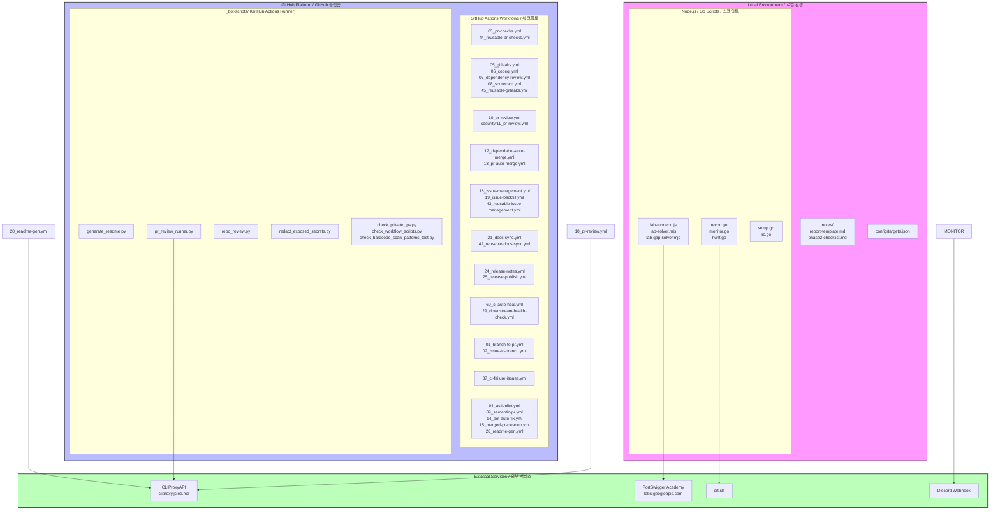

# Bug Bounty Automation Toolkit / 버그바운티 자동화 툴킷

```markdown


# Bug Bounty Automation Toolkit / 버그바운티 자동화 툴킷

## Overview / 개요

### English

Bug Bounty Automation Toolkit is a local automation workspace for authorized web security research, vulnerability-study exercises, and lab-solving workflows. The repository combines:

- **Node.js ESM scripts** for PortSwigger/Web Security Academy style lab automation and browser-driven workflows using Playwright
- **Go helper programs** for monitoring and vulnerability-hunting command orchestration
- **GitHub Actions workflows** (29 total) for PR checks, security scanning, PR review automation, issue management, release automation, documentation sync, and CI auto-healing
- **Bot-side helper scripts** under `_bot-scripts/` for README generation, PR review execution, repository review, secret redaction, and private IP checks

The project is designed for authorized testing only. Do not run scans, lab payloads, or automated browser actions against systems you do not own or have explicit permission to test.

### 한국어

Bug Bounty Automation Toolkit은 허가된 웹 보안 연구, 취약점 학습, 실습 랩 자동화를 위한 로컬 자동화 워크스페이스입니다. 이 저장소는 다음 구성요소를 포함합니다:

- **Node.js ESM 스크립트**: Playwright를 활용한 PortSwigger/Web Security Academy 스타일의 랩 자동화 및 브라우저 기반 워크플로
- **Go 헬퍼 프로그램**: 모니터링 및 취약점 헌팅 명령 오케스트레이션
- **GitHub Actions 워크플로** (29개): PR 검사, 보안 스캔, PR 리뷰 자동화, 이슈 관리, 릴리스 자동화, 문서 동기화, CI 자동 복구
- **`_bot-scripts/`의 봇 보조 스크립트**: README 생성, PR 리뷰 실행, 저장소 리뷰, 시크릿 마스킹, 사설 IP 검사

이 프로젝트는 반드시 허가된 테스트에만 사용해야 합니다. 소유하지 않았거나 명시적 허가를 받지 않은 시스템을 대상으로 스캔, 페이로드, 자동 브라우저 동작을 실행하지 마세요.

---

## Features / 주요 기능

### English

- **Browser-driven lab automation** — Playwright-based lab solvers for PortSwigger Academy exercises
- **Full reconnaissance pipeline** — Subdomain enumeration, port scanning, technology detection, nuclei scanning
- **Diff-based monitoring** — Detect new subdomains and endpoints over time via crt.sh integration
- **Targeted vulnerability hunting** — IDOR, SSRF, SQLi, XSS, and more category-specific scans
- **PR automation** — Auto-assignment, semantic PR title enforcement, auto-merge, bot-assisted fixes
- **Security scanning** — Gitleaks secrets detection, CodeQL analysis, Dependency Review, Scorecard assessment
- **README automation** — README.md auto-generation using minimax-m2.7 / gpt-5.5 models via CLIProxyAPI
- **CI auto-healing** — Automatic recovery from flaky or failed CI runs
- **Documentation sync** — Cross-repo docs synchronization via reusable workflows

### 한국어

- **브라우저 기반 랩 자동화** — PortSwigger Academy 연습问题的 Playwright 기반 랩 솔버
- **완전한 정찰 파이프라인** — 서브도메인 열거, 포트 스캔, 기술 탐지, nuclei 스캔
- **차분 기반 모니터링** — crt.sh 통합을 통한 새로운 서브도메인 및 엔드포인트 감지
- **타겟 취약점 헌팅** — IDOR, SSRF, SQLi, XSS 등 카테고리별 스캔
- **PR 자동화** — 자동 할당, 시맨틱 PR 제목 enforcement, 자동 병합, 봇 보조 수정
- **보안 스캔** — Gitleaks 시크릿 탐지, CodeQL 분석, Dependency Review, Scorecard 평가
- **README 자동화** — CLIProxyAPI를 통한 minimax-m2.7 / gpt-5.5 모델 사용 README.md 자동 생성
- **CI 자동 복구** — 불안정하거나 실패한 CI 실행의 자동 복구
- **문서 동기화** — 재사용 가능한 워크플로를 통한 크로스-레포 문서 동기화

---

## Architecture / 아키텍처



---

## Automation Inventory / 자동화 인벤토리

### GitHub Actions Workflows (29 total) / GitHub Actions 워크플로 (29개)

| File / 파일 | Purpose / 목적 |
|-------------|----------------|
| `01_branch-to-pr.yml` | Create PR from branch, link branch to PR |
| `02_issue-to-branch.yml` | Create branch from issue, track issue in branch |
| `03_pr-checks.yml` | Run PR checks (lint, test, build) |
| `04_actionlint.yml` | Lint all workflow files with actionlint |
| `05_gitleaks.yml` | Scan for secrets in commits and PRs |
| `06_codeql.yml` | Run CodeQL security analysis |
| `07_dependency-review.yml` | Review dependency changes for vulnerabilities |
| `08_scorecard.yml` | Run OpenSSF Scorecard security assessment |
| `09_semantic-pr.yml` | Enforce semantic PR title format |
| `10_pr-review.yml` | Auto PR review using CLIProxyAPI |
| `12_dependabot-auto-merge.yml` | Auto-merge Dependabot PRs |
| `13_pr-auto-merge.yml` | Auto-merge PRs meeting criteria |
| `14_bot-auto-fix.yml` | Apply bot-generated fixes automatically |
| `15_merged-pr-cleanup.yml` | Cleanup after PR merge |
| `18_issue-management.yml` | Issue labeling and management |
| `19_issue-backfill.yml` | Backfill issue metadata |
| `20_readme-gen.yml` | Auto-generate README via minimax-m2.7 / gpt-5.5 |
| `21_docs-sync.yml` | Sync documentation across repos |
| `24_release-notes.yml` | Generate release notes |
| `25_release-publish.yml` | Publish releases |
| `29_downstream-health-check.yml` | Check downstream project health |
| `37_ci-failure-issues.yml` | Create issue on CI failure |
| `42_reusable-docs-sync.yml` | Reusable workflow for docs sync |
| `43_reusable-issue-management.yml` | Reusable workflow for issue mgmt |
| `44_reusable-pr-checks.yml` | Reusable workflow for PR checks |
| `45_reusable-gitleaks.yml` | Reusable workflow for secrets scanning |
| `60_ci-auto-heal.yml` | Auto-heal failing CI runs |
| `ci.yml` | Main CI workflow |
| `security/11_pr-review.yml` | Security-focused PR review |

### Bot-side Helper Scripts / 봇 보조 스크립트 (`_bot-scripts/`)

| Script / 스크립트 | Purpose / 목적 |
|-------------------|----------------|
| `generate_readme.py` | Generate README.md using LLM models |
| `pr_review_runner.py` | Execute PR review workflow |
| `repo_review.py` | Review repository for issues |
| `redact_exposed_secrets.py` | Redact exposed secrets from logs |
| `check_private_ips.py` | Check for hardcoded private IPs |
| `check_workflow_scripts.py` | Validate workflow script references |
| `check_hardcode_scan_patterns_test.py` | Scan for hardcoded scan patterns |

---

## Quick Start / 빠른 시작

### English

```bash
# Clone the repository
git clone https://github.com/jclee941/.github
cd bug

# First-time setup
make setup

# Run reconnaissance on a target
make recon TARGET=example.com

# Monitor for changes
make monitor TARGET=example.com

# Hunt vulnerabilities
make hunt TARGET=example.com

# Full scan (recon + hunt)
make full-scan TARGET=example.com
```

### 한국어

```bash
# 레포지토리 클론
git clone https://github.com/jclee941/.github
cd bug

# 최초 설정
make setup

# 타겟 정찰 실행
make recon TARGET=example.com

# 변경 사항 모니터링
make monitor TARGET=example.com

# 취약점 헌팅
make hunt TARGET=example.com

# 전체 스캔 (정찰 + 헌팅)
make full-scan TARGET=example.com
```

---

## Local Development / 로컬 개발

### English

#### Prerequisites

- Go 1.21+
- Node.js 18+
- Playwright browsers (`npx playwright install`)
- Tools: nmap, subfinder, assetfinder, naabu, nuclei, httpx

#### Repository Structure

```
bug/
├── Makefile                 # Orchestration commands
├── package.json             # Node.js dependencies
├── config/
│   └── targets.json         # Target configuration
├── scripts/                  # Go helper programs
│   ├── setup.go
│   ├── recon.go
│   ├── monitor.go
│   ├── hunt.go
│   ├── lib.go
│   └── *.mjs               # Node.js lab solvers
├── notes/                   # Learning notes & templates
├── _bot-scripts/            # Bot helper scripts (CI runner)
│   ├── scripts/
│   │   ├── generate_readme.py
│   │   ├── pr_review_runner.py
│   │   └── ...
│   └── pyproject.toml
└── .github/
    └── workflows/          # 29 workflow files
```

#### Environment Variables

| Variable / 변수 | Description / 설명 |
|-----------------|-------------------|
| `CLIPROXY_API_KEY` | API key for CLIProxyAPI (cliproxy.jclee.me) |
| `DISCORD_WEBHOOK` | Discord webhook for alerts |
| `GITHUB_TOKEN` | GitHub token for API access |

### 한국어

#### 전제 조건

- Go 1.21+
- Node.js 18+
- Playwright 브라우저 (`npx playwright install`)
- 도구: nmap, subfinder, assetfinder, naabu, nuclei, httpx

#### 저장소 구조

```
bug/
├── Makefile                 # 오케스트레이션 명령
├── package.json             # Node.js 종속성
├── config/
│   └── targets.json         # 타겟 설정
├── scripts/                  # Go 헬퍼 프로그램
│   ├── setup.go
│   ├── recon.go
│   ├── monitor.go
│   ├── hunt.go
│   ├── lib.go
│   └── *.mjs               # Node.js 랩 솔버
├── notes/                   # 학습 노트 및 템플릿
├── _bot-scripts/            # CI 러너의 봇 보조 스크립트
│   ├── scripts/
│   │   ├── generate_readme.py
│   │   ├── pr_review_runner.py
│   │   └── ...
│   └── pyproject.toml
└── .github/
    └── workflows/          # 29개의 워크플로 파일
```

---

## Commands Reference / 명령어 참고

### English

Run `make help` to see all available commands:

| Command / 명령 | Description / 설명 |
|----------------|-------------------|
| `make help` | Show all available commands |
| `make setup` | First-time setup — verify tools, download wordlists |
| `make recon TARGET=x.com` | Full recon pipeline |
| `make recon-fast TARGET=x.com` | Recon without nuclei scan |
| `make monitor TARGET=x.com` | Diff-based change detection |
| `make hunt TARGET=x.com` | All vulnerability categories |
| `make hunt-idor TARGET=x.com` | IDOR vulnerabilities only |
| `make hunt-ssrf TARGET=x.com` | SSRF vulnerabilities only |
| `make hunt-sqli TARGET=x.com` | SQL injection only |
| `make full-scan TARGET=x.com` | Recon + hunt combined |
| `make clean` | Remove scan results |

### 한국어

`make help`를 실행하여 모든 사용 가능한 명령을 확인하세요:

| 명령 | 설명 |
|------|------|
| `make help` | 모든 사용 가능한 명령 표시 |
| `make setup` | 최초 설정 — 도구 확인, 워드리스트 다운로드 |
| `make recon TARGET=x.com` | 전체 정찰 파이프라인 |
| `make recon-fast TARGET=x.com` | nuclei 스캔 없이 정찰 |
| `make monitor TARGET=x.com` | 차분 기반 변경 감지 |
| `make hunt TARGET=x.com` | 모든 취약점 카테고리 |
| `make hunt-idor TARGET=x.com` | IDOR 취약점만 |
| `make hunt-ssrf TARGET=x.com` | SSRF 취약점만 |
| `make hunt-sqli TARGET=x.com` | SQL 인젝션만 |
| `make full-scan TARGET=x.com` | 정찰 + 헌팅 combined |
| `make clean` | 스캔 결과 삭제 |

---

## Contribution Guide / 기여 가이드

### English

Contributions are welcome. Please read [CONTRIBUTING.md](./CONTRIBUTING.md) for details.

#### Workflow Addition Process

1. Add workflow file to `.github/workflows/` with numeric prefix
2. Update this README's automation inventory section
3. Run `04_actionlint.yml` to validate workflow syntax
4. Test in a sandbox environment before merge

#### Bot Script Addition Process

1. Add script to `_bot-scripts/scripts/`
2. Ensure it has proper error handling and logging
3. Add unit tests (`*_test.py`)
4. Update `_bot-scripts/AGENTS.md` if applicable

#### Conventions

- All Go scripts are standalone — run via `go run scripts/x.go`
- Use only Go stdlib (no external dependencies)
- Results stored in timestamped directories under `recon/`
- Never commit scan results, targets, or reports directories

### 한국어

기여를 환영합니다. 자세한 내용은 [CONTRIBUTING.md](./CONTRIBUTING.md)를 읽어주세요.

#### 워크플로 추가 절차

1. 숫자 접두사와 함께 `.github/workflows/`에 워크플로 파일 추가
2. 이 README의 자동화 인벤토리 섹션 업데이트
3. `04_actionlint.yml`를 실행하여 워크플로 구문 검증
4. 머지 전 샌드박스 환경에서 테스트

#### 봇 스크립트 추가 절차

1. `_bot-scripts/scripts/`에 스크립트 추가
2. 적절한 오류 처리 및 로깅 포함
3. 단위 테스트 추가 (`*_test.py`)
4. 해당되는 경우 `_bot-scripts/AGENTS.md` 업데이트

#### conventions

- 모든 Go 스크립트는 독립형 — `go run scripts/x.go`로 실행
- Go 표준 라이브러리만 사용 (외부 종속성 없음)
- 결과는 `recon/` 아래의 타임스탬프 디렉토리에 저장
- 스캔 결과, 타겟, 보고서 디렉토리 절대 커밋하지 않기

---

## External Integrations / 외부 통합

| Service / 서비스 | Endpoint / 엔드포인트 | Purpose / 목적 |
|-----------------|----------------------|----------------|
| CLIProxyAPI | `https://cliproxy.jclee.me/v1` | LLM-based PR review and README generation |
| PortSwigger Academy | `labs.googleapis.com` | Lab automation targets |
| crt.sh | `crt.sh` | Certificate transparency subdomain enumeration |
| Discord | Webhook configured in `config/targets.json` | Alert notifications |

---

## License / 라이선스

See [LICENSE](./LICENSE) for details.

---

## Contact / 연락처

- GitHub Issues: <https://github.com/jclee941/bug/issues>
- Bot Interface: <https://bot.jclee.me>
- PR-Agent: <https://github.com/qodo-ai/pr-agent>
