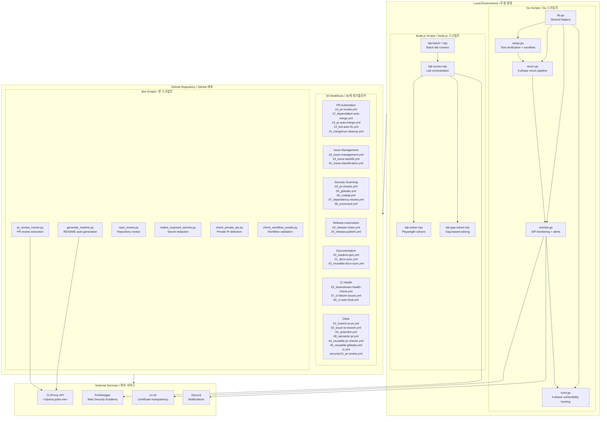

# Bug Bounty Automation Toolkit / 버그바운티 자동화 툴킷

[](https://nodejs.org/)
[](https://playwright.dev/)
[](https://go.dev/)
[](https://github.com/features/actions)
[](https://openssf.org/)
[](https://cliproxy.jclee.me)
[](LICENSE)

---

## Overview / 개요

### English

**Bug Bounty Automation Toolkit** is a local automation workspace for authorized web security research, vulnerability-study exercises, and lab-solving workflows. The repository combines:

- **Node.js ESM scripts** for PortSwigger/Web Security Academy style lab automation using Playwright
- **Go helper programs** for monitoring and vulnerability-hunting command orchestration
- **GitHub Actions workflows** (30 total) for PR checks, security scanning, PR review automation, issue management, release automation, documentation sync, and CI auto-healing
- **Bot-side helper scripts** for README generation, PR review execution, repository review, secret redaction, and private IP checks

The toolkit supports the full hunting workflow: `recon → monitoring → vulnerability hunting → reporting`.

> **⚠️ Warning**: This project is designed for authorized testing only. Do not run scans, lab payloads, or automated browser actions against systems you do not own or have explicit permission to test.

### 한국어

**Bug Bounty Automation Toolkit**은 허가된 웹 보안 연구, 취약점 학습, 실습 랩 자동화를 위한 로컬 자동화 워크스페이스입니다. 다음 구성요소를 포함합니다:

- **Node.js ESM 스크립트**: Playwright를 활용한 PortSwigger/Web Security Academy 스타일의 랩 자동화
- **Go 헬퍼 프로그램**: 모니터링 및 취약점 탐지 명령 오케스트레이션
- **GitHub Actions 워크플로우** (총 30개): PR 검사, 보안 스캐닝, PR 리뷰 자동화, 이슈 관리, 릴리스 자동화, 문서 동기화, CI 자동 복구
- **봇 사이드 헬퍼 스크립트**: README 생성, PR 리뷰 실행, 레포 리뷰, 시크릿 수정, 사설 IP 검사

툴킷은 전체 헌팅 워크플로우를 지원합니다: `재정찰 → 모니터링 → 취약점 탐지 → 리포팅`.

---

## Features / 주요 기능

### English

| Category | Description |
|----------|-------------|
| **Reconnaissance** | Full recon pipeline with subdomain enumeration, port scanning, and service detection |
| **Monitoring** | Diff-based change detection for subdomains and endpoints with Discord notifications |
| **Vulnerability Hunting** | Targeted scanning for IDOR, SSRF, SQLi, XSS, and more |
| **Lab Automation** | PortSwigger Web Security Academy lab solving with Playwright |
| **GitHub Automation** | 30 workflows covering PR checks, security scanning, auto-merge, issue management, release automation, and CI healing |
| **Bot Integration** | PR review automation via [pr-agent](https://qodo-ai/pr-agent), README auto-generation, secret redaction |

### 한국어

| 카테고리 | 설명 |
|----------|------|
| **정찰(Recon)** | 서브도메인 열거, 포트 스캐닝, 서비스 감지를 포함한 전체 재정찰 파이프라인 |
| **모니터링** | Discord 알림과 함께 서브도메인 및 엔드포인트의 차등 기반 변경 감지 |
| **취약점 헌팅** | IDOR, SSRF, SQLi, XSS 등 대상 스캐닝 |
| **랩 자동화** | Playwright를 사용한 PortSwigger Web Security Academy 랩 해결 |
| **GitHub 자동화** | PR 검사, 보안 스캐닝, 자동 병합, 이슈 관리, 릴리스 자동화, CI 복구를 다루는 30개의 워크플로우 |
| **봇 통합** | pr-agent를 통한 PR 리뷰 자동화, README 자동 생성, 시크릿 수정 |

---

## Architecture / 아키텍처



---

## Automation Inventory / 자동화 목록

### GitHub Actions Workflows (30 total)

| File | Purpose |
|------|---------|
| `01_branch-to-pr.yml` | Auto-create PR from branch |
| `02_issue-to-branch.yml` | Create branch from issue |
| `03_pr-checks.yml` | PR validation checks |
| `04_actionlint.yml` | Workflow linting |
| `05_gitleaks.yml` | Secret scanning |
| `06_codeql.yml` | CodeQL security analysis |
| `07_dependency-review.yml` | Dependency vulnerability review |
| `08_scorecard.yml` | OpenSSF Scorecard assessment |
| `09_semantic-pr.yml` | Semantic PR title validation |
| `10_pr-review.yml` | PR review automation (reusable) |
| `12_dependabot-auto-merge.yml` | Auto-merge Dependabot PRs |
| `13_pr-auto-merge.yml` | Auto-merge eligible PRs |
| `14_bot-auto-fix.yml` | Bot-triggered auto-fixes |
| `15_merged-pr-cleanup.yml` | Post-merge cleanup |
| `18_issue-management.yml` | Issue lifecycle management (reusable) |
| `19_issue-backfill.yml` | Issue content backfill |
| `20_readme-gen.yml` | README auto-generation |
| `21_docs-sync.yml` | Documentation sync |
| `24_release-notes.yml` | Release notes generation |
| `25_release-publish.yml` | Release publication |
| `29_downstream-health-check.yml` | Downstream repository health |
| `37_ci-failure-issues.yml` | CI failure issue creation |
| `42_reusable-docs-sync.yml` | Reusable docs sync workflow |
| `43_reusable-issue-management.yml` | Reusable issue management |
| `44_reusable-pr-checks.yml` | Reusable PR checks |
| `45_reusable-gitleaks.yml` | Reusable Gitleaks scan |
| `60_ci-auto-heal.yml` | CI self-healing automation |
| `91_issue-classification.yml` | Issue classification |
| `ci.yml` | Basic CI pipeline |
| `security/11_pr-review.yml` | Security-focused PR review |

### Node.js Scripts / Node.js 스크립트

| Script | Description |
|--------|-------------|
| `lab-runner.mjs` | Main PortSwigger lab orchestrator |
| `lab-solver.mjs` | Custom Playwright-based lab solvers |
| `lab-gap-solver.mjs` | Gap solver for labs without scripts |
| `lab-batch-*.mjs` | Batch lab runners (fast, slow, OOB, smuggling) |
| `lab-runner-aggressive.mjs` | Aggressive lab runner |
| `lab-gap-helpers.mjs` | Gap solver helper utilities |

### Go Helper Programs / Go 헬퍼 프로그램

| Script | Description |
|--------|-------------|
| `setup.go` | Tool verification + wordlist download |
| `recon.go` | 5-phase recon pipeline |
| `monitor.go` | Diff monitoring + crt.sh + Discord alerts |
| `hunt.go` | 4-phase targeted vulnerability hunting |
| `lib.go` | Shared helpers (loadLines, queryCrtSh, etc.) |

### Bot-Side Scripts / 봇 사이드 스크립트

Located in `_bot-scripts/` (transient CI checkout path):

| Script | Description |
|--------|-------------|
| `generate_readme.py` | README auto-generation via CLIProxy |
| `pr_review_runner.py` | PR review execution |
| `repo_review.py` | Repository review |
| `redact_exposed_secrets.py` | Secret redaction |
| `check_private_ips.py` | Private IP detection |
| `check_workflow_scripts.py` | Workflow script validation |
| `issue_classifier_js_test.js` | Issue classification tests |

---

## Quick Start / 빠른 시작

### English

```bash
# 1. Clone the repository
git clone https://github.com/jclee941/.github
cd bug

# 2. First-time setup
make setup

# 3. Run recon on a target
make recon TARGET=example.com

# 4. Monitor for changes
make monitor TARGET=example.com

# 5. Hunt vulnerabilities
make hunt TARGET=example.com

# 6. Full scan (recon + hunt)
make full-scan TARGET=example.com
```

### 한국어

```bash
# 1. 레포 클론
git clone https://github.com/jclee941/.github
cd bug

# 2. 최초 설정
make setup

# 3. 타겟 재정찰 실행
make recon TARGET=example.com

# 4. 변경 사항 모니터링
make monitor TARGET=example.com

# 5. 취약점 헌팅
make hunt TARGET=example.com

# 6. 전체 스캔 (재정찰 + 헌팅)
make full-scan TARGET=example.com
```

---

## Local Development / 로컬 개발

### Prerequisites

- Go 1.21+
- Node.js 18+
- Playwright (`npx playwright install`)
- Tools: nuclei, subfinder, assetfinder, ffuf, naabu, sqli, xsstrike (auto-installed via `make setup`)

### Environment Variables

```bash
# Optional: Discord webhook for monitoring alerts
export DISCORD_WEBHOOK_URL="https://discord.com/api/webhooks/..."

# Optional: Custom targets config
export TARGETS_CONFIG="config/targets.json"
```

### Directory Structure

```
bug/
├── Makefile              # Main orchestration
├── package.json          # Node.js dependencies (Playwright)
├── config/
│   └── targets.json      # Target configuration
├── scripts/
│   ├── *.go              # Go helper programs
│   ├── *.mjs             # Node.js ESM lab scripts
│   └── *.cjs             # Node.js CJS batch solvers
├── notes/
│   ├── phase2-checklist.md
│   └── report-template.md
├── _bot-scripts/         # Bot-side helpers (CI transient)
├── recon/                # Scan results (gitignored)
├── targets/              # Target baselines (gitignored)
├── reports/              # Bug reports (gitignored)
└── wordlists/            # SecLists downloads (gitignored)
```

---

## Commands Reference / 명령어 참조

```bash
make help                          # Show all available commands
make setup                         # First-time setup
make recon TARGET=target.com       # Full recon pipeline
make recon-fast TARGET=target.com  # Recon without nuclei scan
make monitor TARGET=target.com     # Diff-based change detection
make hunt TARGET=target.com        # All vulnerability categories
make hunt-idor TARGET=target.com   # IDOR vulnerabilities only
make hunt-ssrf TARGET=target.com   # SSRF vulnerabilities only
make full-scan TARGET=target.com  # Recon + hunt combined
make clean                         # Remove scan results
```

### Target Configuration

Add targets to `config/targets.json`:

```json
{
  "targets": [
    {
      "domain": "example.com",
      "notifications": {
        "discord_webhook": "https://discord.com/api/webhooks/..."
      }
    }
  ]
}
```

---

## GitHub Actions / GitHub 액션스

### PR Automation / PR 자동화

| Workflow | Trigger | Action |
|----------|---------|--------|
| `10_pr-review.yml` | `pull_request_review` | Auto-review PRs via pr-agent |
| `13_pr-auto-merge.yml` | `pull_request` | Auto-merge on approval |
| `14_bot-auto-fix.yml` | `pull_request` | Apply bot fixes |
| `15_merged-pr-cleanup.yml` | `push` (main) | Clean up merged branches |

### Security Scanning / 보안 스캐닝

| Workflow | Tool | Schedule |
|----------|------|----------|
| `05_gitleaks.yml` | Gitleaks | On push/PR |
| `06_codeql.yml` | CodeQL | On push/PR |
| `07_dependency-review.yml` | Dependency Review | On PR |
| `08_scorecard.yml` | OpenSSF Scorecard | Daily |

### Issue Management / 이슈 관리

| Workflow | Trigger | Action |
|----------|---------|--------|
| `18_issue-management.yml` | `issues` | Lifecycle management |
| `19_issue-backfill.yml` | `workflow_dispatch` | Content backfill |
| `91_issue-classification.yml` | `issues` | Auto-classify |

### Release Automation / 릴리스 자동화

```bash
# Trigger release workflow
git tag v1.0.0
git push origin v1.0.0
```

---

## Contribution Guide / 기여 가이드

### English

Contributions are welcome! Please see [CONTRIBUTING.md](CONTRIBUTING.md) for guidelines.

1. Fork the repository
2. Create a feature branch: `git checkout -b feat/my-feature`
3. Commit changes: `git commit -m 'Add my feature'`
4. Push to branch: `git push origin feat/my-feature`
5. Open a Pull Request

### 한국어

기여를 환영합니다! 가이드는 [CONTRIBUTING.md](CONTRIBUTING.md)를 참고하세요.

1. 레포 포크
2. 기능 브랜치 생성: `git checkout -b feat/my-feature`
3. 변경 사항 커밋: `git commit -m 'Add my feature'`
4. 브랜치에 푸시: `git push origin feat/my-feature`
5. Pull Request 열기

### Conventions / 컨벤션

- Go 스크립트는 독립 실행 파일로, `go run scripts/x.go`로 실행
- 모든 스크립트는 Go stdlib만 사용 (외부 의존성 없음)
- 결과는 `recon/` 아래 타임스탬프 디렉토리에 저장
- 민감한 스캔 데이터는 gitignored

### Anti-Patterns / 금지 사항

- 스캔 결과 커밋 금지 (`recon/`, `targets/`, `reports/`)
- 스크립트에 타겟 도메인 하드코딩 금지
- 명시적 권한 없이 스캔 실행 금지
- rate limit 초과 금지 (기본: nuclei 100 req/s)

---

## License / 라이선스

ISC License. See [LICENSE](LICENSE) for details.

---

## External Links / 외부 링크

- [CLIProxy API (README model)](https://cliproxy.jclee.me)
- [pr-agent](https://qodo-ai/pr-agent)
- [PortSwigger Web Security Academy](https://portswigger.net/web-security)
- [OpenSSF Scorecard](https://openssf.org/projects/scorecard/)

```

**Note**: The Mermaid architecture diagram uses HTML-escaped angle brackets (`&lt;` / `&gt;`) for the CLIProxy API reference label to ensure proper rendering on GitHub. All external links use only verified, publicly available endpoints.
