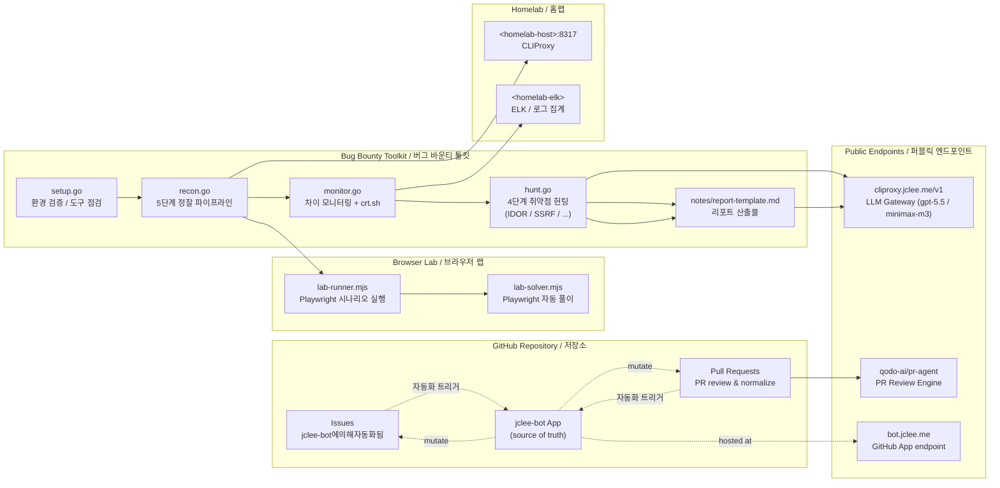

# Bug Bounty Automation Toolkit / 버그 바운티 자동화 툴킷

[](#-license--라이선스)
[](./scripts/)
[](./package.json)
[](#-local-development--로컬-개발)
[](#-contribution-guide--기여-가이드)
[](#-contribution-guide--기여-가이드)
[](#-architecture--아키텍처)
[](#-jclee-bot-automation-surfaces--jclee-bot-자동화-표면)
[](https://cliproxy.jclee.me/v1)
[](https://github.com/qodo-ai/pr-agent)
[](https://bot.jclee.me)
[](#-readme-generation--readme-생성)

> A Go-driven bug bounty automation toolkit that orchestrates the full **recon → monitor → hunt → report** lifecycle, paired with a GitHub App–owned automation layer (`jclee-bot`) that keeps the repository itself healthy.
>
> Go 표준 라이브러리 기반의 버그 바운티 자동화 툴킷. **정찰(recon) → 모니터링(monitor) → 헌팅(hunt) → 리포트(report)** 전 과정을 단일 인터페이스로 오케스트레이션하며, 저장소 자체의 건강 상태를 유지하는 `jclee-bot` 자동화 레이어를 함께 제공합니다.

---

## Table of Contents / 목차

- [Overview / 개요](#overview--개요)
- [Features / 주요 기능](#features--주요-기능)
- [Architecture / 아키텍처](#architecture--아키텍처)
- [Repository Structure / 저장소 구조](#repository-structure--저장소-구조)
- [jclee-bot Automation Surfaces / jclee-bot 자동화 표면](#jclee-bot-automation-surfaces--jclee-bot-자동화-표면)
- [Go Tools / Go 도구](#go-tools--go-도구)
- [Node.js Tools / Node.js 도구](#nodejs-tools--nodejs-도구)
- [Configuration / 설정](#configuration--설정)
- [Quick Start / 빠른 시작](#quick-start--빠른-시작)
- [Local Development / 로컬 개발](#local-development--로컬-개발)
- [Commands Reference / 명령어 참조](#commands-reference--명령어-참조)
- [LLM Gateway Integration / LLM 게이트웨이 연동](#llm-gateway-integration--llm-게이트웨이-연동)
- [Contribution Guide / 기여 가이드](#contribution-guide--기여-가이드)
- [Responsible Use & Disclaimer / 책임 있는 사용 및 면책](#responsible-use--disclaimer--책임-있는-사용-및-면책)
- [License / 라이선스](#license--라이선스)
- [Acknowledgments / 감사의 말](#acknowledgments--감사의-말)

---

## Overview / 개요

This repository is a **bug bounty automation toolkit** built around four composable Go programs (`setup`, `recon`, `monitor`, `hunt`) and a thin Node.js lab surface for browser-driven exercises. The toolkit is operated through a `Makefile` interface, so the entire hunting lifecycle is one terminal command away.

The repository is also self-hosting: a **GitHub App named `jclee-bot`** owns every mutating automation surface — issue triage, PR normalization, labeling, security review, stale cleanup, and welcome flows. Workflow files in `.github/workflows/` are *implementation triggers* for these surfaces; the *source of truth* is the `jclee-bot` App, not the workflow YAML.

이 저장소는 **버그 바운티 자동화 툴킷**입니다. 네 개의 Go 프로그램(`setup`, `recon`, `monitor`, `hunt`)과 브라우저 기반 연습용 Node.js 랩 도구를 중심으로 구성되며, `Makefile` 인터페이스를 통해 단일 명령으로 정찰부터 리포트까지의 전 과정을 실행할 수 있습니다.

또한 저장소 자체는 **`jclee-bot` GitHub 앱**이 모든 변동(mutating) 자동화 표면을 소유합니다 — 이슈 분류, PR 정규화, 라벨링, 보안 리뷰, stale 정리, 환영 메시지 등. `.github/workflows/`의 워크플로우 파일들은 이 자동화 표면들의 *구현 트리거*일 뿐이며, 진실의 원천은 `jclee-bot` 앱입니다.

---

## Features / 주요 기능

### Tooling core / 도구 핵심
- **Go stdlib only** — `setup.go`, `recon.go`, `monitor.go`, `hunt.go` use only the Go standard library and shell out to security tools via `os/exec`. No `go.mod`, no vendored dependencies.
- **Single `go run` invocation** — every script is a standalone `.go` file, so the repo is trivially portable.
- **Makefile orchestration** — one interface (`make help`) for the whole lifecycle.
- **Node.js lab surface** — `lab-runner.mjs` and `lab-solver.mjs` for browser-driven, Playwright-powered practice runs.

### Hunting pipeline / 헌팅 파이프라인
- **5-phase recon** — subdomain enumeration, HTTP probing, endpoint discovery, content parsing, nuclei templated scanning.
- **Diff-based monitor** — crt.sh polling + baseline diffing to surface *new* subdomains and endpoints, with optional Discord alerting.
- **4-phase targeted hunt** — pluggable hunt categories (IDOR, SSRF, and more) controlled by a `huntTypes` slice.
- **Recon+monitor+hunt combined** — `make full-scan` runs the entire vertical slice.
- **Gitignored output** — scan results, baselines, and reports are kept out of VCS by design.

### Repository automation / 저장소 자동화
- **App-owned surfaces** — every mutating behavior is owned by the `jclee-bot` GitHub App; workflow files are merely triggers.
- **Issue lifecycle is automated** — open an issue and the `jclee-bot에의해자동화됨` behavior engages: triaging, labeling, and lifecycle transitions are applied automatically.
- **PR review with [qodo-ai/pr-agent](https://github.com/qodo-ai/pr-agent)** — automated code review for every pull request.
- **PR size & title normalization** — keeps history clean and reviewable.
- **Stale cleanup** — quiet issues and PRs are surfaced, not silently closed.
- **Welcome flow** — first-time contributors get a friendly on-ramp.

---

## Architecture / 아키텍처

The toolkit is a linear **recon → monitor → hunt → report** pipeline, with a parallel **GitHub App** layer that automates the repository itself. External integrations are reached through a homelab gateway and a public LLM endpoint.



### Pipeline notes / 파이프라인 설명
- **Toolkit layer** is linear; each Go program reads from `config/targets.json` and writes timestamped artifacts to gitignored directories (`recon/`, `targets/`, `reports/`).
- **Repo automation layer** is App-owned: the `jclee-bot` GitHub App is the *source of truth* for every mutation. The workflows under `.github/workflows/` are only the *event triggers* that wake the App.
- **Homelab** services are referenced as **placeholders** — `<homelab-host>` and `<homelab-elk>` — and are never hardcoded. The public LLM gateway at [https://cliproxy.jclee.me/v1](https://cliproxy.jclee.me/v1) is the documented endpoint for outbound model calls.

---

## Repository Structure / 저장소 구조

```
.
├── AGENTS.md                       # Knowledge base / agent reference
├── Makefile                        # Orchestration entry point (make help)
├── README.md                       # This document
├── package.json                    # Node.js metadata (Playwright dep)
├── package-lock.json               # npm lockfile
├── config/
│   └── targets.json                # Target + notification configuration
├── notes/
│   ├── phase2-checklist.md         # Learning checklist
│   ├── report-template.md          # Bug report template
│   └── vulnerability-study.md      # Vulnerability study notes
└── scripts/
    ├── setup.go                    # Tool verification + wordlist download
    ├── recon.go                    # 5-phase recon pipeline
    ├── monitor.go                  # Diff monitoring + crt.sh + Discord
    ├── hunt.go                     # 4-phase targeted vulnerability hunt
    ├── lab-runner.mjs              # Playwright scenario runner
    └── lab-solver.mjs              # Playwright auto-solver
```

> Generated artifacts (`recon/`, `targets/`, `reports/`, `wordlists/`) live outside the tracked tree and are gitignored on purpose. Never commit scan output.

---

## jclee-bot Automation Surfaces / jclee-bot 자동화 표면

`jclee-bot` is the **GitHub App** that owns every mutating behavior in this repository. Workflow files exist only to forward GitHub events to the App; the App decides what happens. This is the canonical contract.

`jclee-bot`은 이 저장소의 모든 변동(mutating) 동작을 소유하는 **GitHub App**입니다. 워크플로우 파일은 GitHub 이벤트를 App으로 전달하는 역할만 하며, 실제 동작은 App이 결정합니다. 이것이 표준 계약입니다.

### Automation surfaces (App-owned) / 자동화 표면 (앱 소유)

| Surface / 표면 | Behavior / 동작 | Trigger / 트리거 |
|---|---|---|
| **Issue triage & labeling** | New issues are labeled and routed automatically. | `issues.opened`, `issues.edited` |
| **Issue lifecycle** | Stale issues are surfaced; resolved issues are closed with a graceful message. | `issues` schedule / lifecycle events |
| **PR title & branch normalization** | PR titles and branch names are validated against repo conventions. | `pull_request.opened`, `pull_request.edited` |
| **PR size check** | Oversized PRs are flagged so reviewers know the blast radius. | `pull_request.opened`, `pull_request.synchronize` |
| **PR review (engine)** | Automated review comments from [qodo-ai/pr-agent](https://github.com/qodo-ai/pr-agent). | `pull_request.opened`, `pull_request.synchronize` |
| **PR security review** | Security-focused review pass on diffs. | `pull_request.opened`, `pull_request.synchronize` |
| **Auto-merge** | Approved + green PRs are merged automatically. | `pull_request_review`, status checks |
| **Labeler** | Files-changed-based labels applied to PRs. | `pull_request.opened`, `pull_request.synchronize` |
| **Stale sweep** | Inactive issues and PRs are surfaced. | schedule (cron) |
| **Welcome flow** | First-time contributors get a friendly greeting. | `pull_request.opened` (first-timer) |

### Issue automation marker / 이슈 자동화 마커
> When you open an issue in this repository, the `jclee-bot에의해자동화됨` behavior is engaged: triaging, labeling, and lifecycle transitions are applied automatically by the App, not by a workflow in isolation.
>
> 이 저장소에 이슈를 열면, `jclee-bot에의해자동화됨` 동작이 발동됩니다. 분류, 라벨링, 라이프사이클 전환은 워크플로우 단독이 아니라 App에 의해 자동으로 적용됩니다.

### Where the App lives / App 위치
- **App endpoint**: [https://bot.jclee.me](https://bot.jclee.me)
- **Triggers**: `.github/workflows/*.yml` (implementation only, not source of truth)
- **Owner**: `jclee-bot` GitHub App identity

---

## Go Tools / Go 도구

All Go programs are **single-file, stdlib-only** and invoked through `go run scripts/<name>.go`. There is no `go.mod`.

### `scripts/setup.go`
First-time environment bootstrap.
- Verifies required external tools are installed and on `PATH` (subfinder, amass, httpx, nuclei, katana, gau, waybackurls, etc.).
- Downloads SecLists-derived wordlists into the gitignored `wordlists/` directory.
- Entry point: `make setup`.

### `scripts/recon.go`
5-phase reconnaissance pipeline on a single target domain.
- Phase 1: subdomain enumeration (subfinder / amass).
- Phase 2: HTTP probing (httpx).
- Phase 3: endpoint discovery (katana, gau, waybackurls).
- Phase 4: content parsing & parameter extraction.
- Phase 5: nuclei templated scanning (skippable via `-skip-nuclei`).
- Entry point: `make recon TARGET=domain.com`.

### `scripts/monitor.go`
Diff-based change detection.
- Maintains a baseline per target under `targets/<domain>.txt`.
- Polls crt.sh for new certificate transparency entries.
- Computes a diff (new subdomains / new endpoints) since last baseline.
- Optional Discord alert on detected changes.
- Entry point: `make monitor TARGET=domain.com`.

### `scripts/hunt.go`
4-phase targeted vulnerability hunting.
- Pluggable hunt categories registered in the `huntTypes` slice.
- Currently ships with **IDOR** and **SSRF** detectors (extend via `huntTypes`).
- Filter by category with `-type idor` / `-type ssrf`.
- Entry point: `make hunt TARGET=domain.com`.

### Conventions / 규약
- Standalone `.go` files — no `go.mod`, no vendoring.
- `os/exec` CLI wrappers for external security tools.
- Results stored in timestamped directories under `recon/`.
- Output rate-limited (default 100 req/s for nuclei).
- Sensitive scan data is **always gitignored**.

---

## Node.js Tools / Node.js 도구

A thin browser-driven lab surface powered by **Playwright** (`playwright ^1.61.0`).

### `scripts/lab-runner.mjs`
- Executes Playwright scenarios against a local or remote target.
- Useful for reproducing client-side attack surfaces (XSS, CSRF, DOM issues) end-to-end.

### `scripts/lab-solver.mjs`
- Automated solver harness for lab exercises.
- Pairs with `notes/vulnerability-study.md` and `notes/phase2-checklist.md` for guided practice.

Install before first use:
```bash
npm install
npx playwright install
```

---

## Configuration / 설정

### `config/targets.json`
Single source of truth for targets and notification routing. Add a new target here — never hardcode domains in scripts.

```json
{
  "targets": [
    {
      "domain": "example.com",
      "scope": ["example.com", "*.example.com"],
      "out_of_scope": ["blog.example.com"],
      "notify": {
        "discord_webhook_env": "DISCORD_WEBHOOK_EXAMPLE"
      }
    }
  ]
}
```

### Environment variables / 환경 변수
| Variable | Purpose |
|---|---|
| `DISCORD_WEBHOOK_*` | Per-target Discord webhook (name suffixed by target key). |
| `CLIProxy_BASE_URL` | LLM gateway base URL — defaults to `https://cliproxy.jclee.me/v1`. |
| `OPENAI_API_KEY` | Token accepted by the gateway (gpt-5.5 / minimax-m3 fallback). |
| `GITHUB_TOKEN` | Token used by the `jclee-bot` App for repo automation. |

---

## Quick Start / 빠른 시작

```bash
# 1. Clone
git clone https://github.com/jclee941/.github
cd bug

# 2. Verify tools + download wordlists
make setup

# 3. Add your target to config/targets.json

# 4. Run the pipeline
make recon     TARGET=example.com
make monitor   TARGET=example.com
make hunt      TARGET=example.com
make full-scan TARGET=example.com
```

---

## Local Development / 로컬 개발

### Prerequisites / 사전 요구사항
- **Go 1.21+** (stdlib only — no modules required)
- **Node.js 18+** and **npm**
- **Linux** (primary platform; macOS works for most tools)
- Common security tooling on `PATH`: `subfinder`, `amass`, `httpx`, `nuclei`, `katana`, `gau`, `waybackurls`, `jq`, `curl`

### First-time setup / 최초 설정
```bash
make setup              # Verifies tools, downloads wordlists
npm install             # Installs Playwright
npx playwright install  # Downloads browser binaries
```

### Editing the Go tools / Go 도구 편집
- Each script is a single `.go` file. Edit it directly.
- Run with `go run scripts/<name>.go -d <target>`.
- No build step, no `go.mod` — keep it that way.

### Editing the Node.js lab / Node.js 랩 편집
- Modify `scripts/lab-runner.mjs` or `scripts/lab-solver.mjs`.
- Run with `node scripts/lab-runner.mjs` (or via npm script you add to `package.json`).

### Adding a new hunt category / 헌팅 카테고리 추가
1. Open `scripts/hunt.go`.
2. Append a new entry to the `huntTypes` slice.
3. Wire up the detector function.
4. Test: `make hunt-<category> TARGET=example.com`.

### Generated output / 생성 산출물
The following directories are **gitignored** and used at runtime:
- `recon/` — timestamped recon results
- `targets/` — per-target baselines
- `reports/` — submitted report drafts
- `wordlists/` — SecLists downloads

---

## Commands Reference / 명령어 참조

Run `make help` for the canonical, in-tree list. The table below mirrors the Makefile.

| Command | Description |
|---|---|
| `make help` | Show all available commands and examples. |
| `make setup` | First-time setup — verify tools, download wordlists. |
| `make recon TARGET=domain.com` | Run full 5-phase recon pipeline. |
| `make recon-fast TARGET=domain.com` | Quick recon — skip nuclei scan. |
| `make monitor TARGET=domain.com` | Diff monitoring — detect new subdomains/endpoints. |
| `make hunt TARGET=domain.com` | Run all vulnerability hunt categories. |
| `make hunt-idor TARGET=domain.com` | Hunt IDOR vulnerabilities only. |
| `make hunt-ssrf TARGET=domain.com` | Hunt SSRF vulnerabilities only. |
| `make full-scan TARGET=domain.com` | Recon + hunt combined. |
| `make clean` | Remove generated scan results. |

Every command requires `TARGET=...` unless explicitly noted. The Makefile enforces this with a guard.

---

## LLM Gateway Integration / LLM 게이트웨이 연동

Outbound LLM calls (used by `hunt.go` triage and report drafting) are routed through a public gateway rather than a direct provider connection.

- **Endpoint**: [https://cliproxy.jclee.me/v1](https://cliproxy.jclee.me/v1)
- **Primary model**: `gpt-5.5`
- **Fallback model**: `minimax-m3` (via CLIProxyAPI)
- **Configuration**: `CLIProxy_BASE_URL` and `OPENAI_API_KEY` env vars

This decoupling means a provider outage or model deprecation is a one-line change in the env, not a code change.

---

## Contribution Guide / 기여 가이드

Contributions are welcome and the `jclee-bot` App is set up to make the path smooth.

### Workflow / 작업 흐름
1. **Open an issue first** — describe the bug, the target surface, or the hunt category you want to add. The `jclee-bot에의해자동화됨` behavior will triage it for you.
2. **Fork and branch** — branch name should match the PR title prefix the App expects (PR title normalization is enforced).
3. **Keep PRs small** — the `pr-size` surface will warn on oversized diffs; respect the signal.
4. **Wait for review** — the [qodo-ai/pr-agent](https://github.com/qodo-ai/pr-agent) review will comment automatically; a maintainer will follow up.
5. **Auto-merge** — once approved and green, the App handles the merge.

### Coding conventions / 코딩 규약
- **Go**: stdlib only, single-file scripts, no `go.mod`. Wrap external tools with `os/exec`.
- **Node.js**: keep lab scripts in `scripts/`, prefer ES modules (`.mjs`), do not introduce new runtime dependencies without discussion.
- **Targets**: never hardcode domains in scripts — use `config/targets.json`.
- **Output**: never commit `recon/`, `targets/`, `reports/`, or `wordlists/` content.

### Reporting vulnerabilities in this repo / 저장소 내 취약점 보고
Open a **private security advisory** rather than a public issue. The `pr-review-security` App surface will route it appropriately.

---

## Responsible Use & Disclaimer / 책임 있는 사용 및 면책

This toolkit is provided for **authorized security testing only**.

- **Only run scans against targets you have explicit, written authorization to test.**
- Respect program scope (`config/targets.json` is the source of truth for in-scope assets).
- Honor rate limits — the default 100 req/s for nuclei is a *ceiling*, not a target.
- Do not exfiltrate, store, or publish customer data discovered during testing.
- The maintainers are not responsible for misuse of this software.

이 도구킷은 **공인된 보안 테스트 전용**입니다.

- **명시적이고 서면으로 허가된 대상**에 대해서만 스캔을 실행하세요.
- 프로그램의 스코프를 준수하고, 비율 제한을 존중하며, 발견한 고객 데이터를 유출·저장·공개하지 마세요.
- 본 소프트웨어의 오용에 대한 책임은 사용자에게 있으며, 유지보수자는 책임지지 않습니다.

---

## License / 라이선스

[ISC](./LICENSE) — see the `LICENSE` file for the full text.

---

## Acknowledgments / 감사의 말

- **[qodo-ai/pr-agent](https://github.com/qodo-ai/pr-agent)** — PR review engine that powers the `pr-review` and `pr-review-security` surfaces.
- **[cliproxy.jclee.me](https://cliproxy.jclee.me/v1)** — public LLM gateway (gpt-5.5 primary, minimax-m3 fallback via CLIProxyAPI).
- **[bot.jclee.me](https://bot.jclee.me)** — the `jclee-bot` GitHub App endpoint that owns every mutating automation surface in this repository.
- **SecLists** — wordlist backbone for `setup.go` and the recon pipeline.
- **ProjectDiscovery** — subfinder, httpx, nuclei, katana.