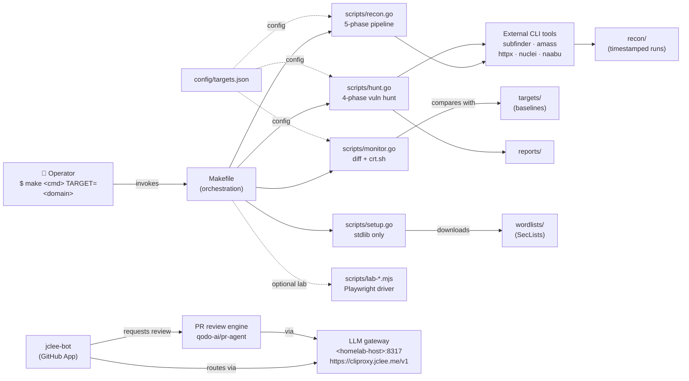

# Bug Bounty Automation Toolkit / 버그 바운티 자동화 툴킷

[](./LICENSE)
[](./scripts/)
[](./package.json)


[](#-contribution-guide--기여-가이드)
[](#-architecture--아키텍처)
[](#-jclee-bot-automation-surfaces--jclee-bot-자동화-표면)
[](https://cliproxy.jclee.me/v1)
[](https://github.com/qodo-ai/pr-agent)

> A Go-driven bug bounty automation toolkit that orchestrates the **recon → monitor → hunt → report** lifecycle, paired with a GitHub App–owned automation layer (`jclee-bot`) that keeps the repository itself healthy.
>
> Go 표준 라이브러리 기반의 버그 바운티 자동화 툴킷. **정찰(recon) → 모니터링(monitor) → 헌팅(hunt) → 리포트(report)** 전 과정을 단일 인터페이스로 오케스트레이션하며, 저장소 자체의 건강 상태를 유지하는 `jclee-bot` 자동화 레이어를 함께 제공합니다.

---

## Table of Contents / 목차

- [Overview / 개요](#overview--개요)
- [Features / 주요 기능](#features--주요-기능)
- [Architecture / 아키텍처](#architecture--아키텍처)
- [Repository Structure / 저장소 구조](#repository-structure--저장소-구조)
- [jclee-bot Automation Surfaces / jclee-bot 자동화 표면](#jclee-bot-automation-surfaces--jclee-bot-자동화-표면)
- [Go Tools / Go 도구](#go-tools--go-도구)
- [Node.js Tools / Node.js 도구](#nodejs-tools--nodejs-도구)
- [Quick Start / 빠른 시작](#quick-start--빠른-시작)
- [Local Development / 로컬 개발 환경](#local-development--로컬-개발-환경)
- [Commands Reference / 명령어 레퍼런스](#commands-reference--명령어-레퍼런스)
- [Configuration / 설정](#configuration--설정)
- [Operational Notes / 운영 메모](#operational-notes--운영-메모)
- [Contribution Guide / 기여 가이드](#contribution-guide--기여-가이드)

---

## Overview / 개요

This repository is a single-operator, single-host toolkit for the full bug-bounty hunting workflow. The Go side is intentionally **dependency-free at the source level** — every script under `scripts/` is a standalone `main` package that uses only the Go standard library and shells out to vetted external CLI tools (`subfinder`, `amass`, `httpx`, `nuclei`, `naabu`, …) via `os/exec`. A thin `Makefile` provides a stable, discoverable command surface (`make help`) and ensures every script is invoked the same way.

The Node.js side exists strictly for **lab automation** — Playwright-driven runners that drive a real browser to reproduce, exploit, and validate findings in a controlled lab environment. Lab tooling is deliberately isolated from the production hunting pipeline.

Above and around both, `jclee-bot` (a GitHub App installed on this repository) provides **mutating automation surfaces** for issues, pull requests, and repository hygiene. The bot itself is the source of truth for automation behavior; workflow files under `.github/workflows/` are merely the **triggers** that wake each surface up. jclee-bot routes its LLM-dependent work through the local CLIProxyAPI gateway (`<homelab-host>:8317`, mirrored publicly at `https://cliproxy.jclee.me/v1`) and delegates PR review to [qodo-ai/pr-agent](https://github.com/qodo-ai/pr-agent).

> 본 저장소는 단일 운영자·단일 호스트 환경에서 버그 바운티 헌팅 워크플로우 전체를 다루는 툴킷입니다. Go 측은 의도적으로 **소스 레벨 의존성을 배제**했습니다 — `scripts/` 하위의 모든 스크립트는 Go 표준 라이브러리만 사용하는 독립 `main` 패키지이며, 검증된 외부 CLI 도구(`subfinder`, `amass`, `httpx`, `nuclei`, `naabu`, …)를 `os/exec`로 호출합니다. 얇은 `Makefile`이 안정적이고 발견 가능한 명령어 표면(`make help`)을 제공합니다.
>
> Node.js 측은 **실습(lab) 자동화 전용**입니다 — Playwright 기반 러너가 실제 브라우저를 구동하여 통제된 랩 환경에서 발견 사항을 재현·공격·검증합니다. 랩 도구는 의도적으로 프로덕션 헌팅 파이프라인과 분리되어 있습니다.
>
> 이 모든 것 위에 `jclee-bot`(이 저장소에 설치된 GitHub App)이 이슈·PR·저장소 위생에 대한 **변경(mutating) 자동화 표면**을 제공합니다. 봇 자체가 자동화 동작의 진실 공급원이며, `.github/workflows/`의 워크플로우 파일은 각 표면을 깨우는 **트리거**일 뿐입니다. jclee-bot은 LLM 의존 작업을 로컬 CLIProxyAPI 게이트웨이(`<homelab-host>:8317`, 공개 미러 `https://cliproxy.jclee.me/v1`)를 경유시켜 라우팅하며, PR 리뷰는 [qodo-ai/pr-agent](https://github.com/qodo-ai/pr-agent)에 위임합니다.

---

## Features / 주요 기능

### Hunting pipeline / 헌팅 파이프라인
- **Standalone Go scripts** — no `go.mod`, no vendor tree, no supply-chain surface beyond the standard library.
- **Five-phase reconnaissance** — subdomain enumeration → HTTP probing → fingerprinting → URL discovery → nuclei templates.
- **Diff-based monitoring** — detects *new* subdomains and endpoints between runs; integrates `crt.sh` transparency logs and optional Discord alerts.
- **Targeted vulnerability hunting** — modular `huntTypes` registry; ships with `idor` and `ssrf` profiles and a catch-all profile.
- **Fast-path reconnaissance** — `recon-fast` skips the nuclei phase when you only need the asset map.
- **Timestamped outputs** — every run writes under `recon/<target>/<timestamp>/` so runs are diffable and resumable.

### Lab automation / 실습 자동화
- **Playwright-driven browser automation** — drives Chromium for client-side reproduction of findings.
- **Runner + solver separation** — `lab-runner.mjs` orchestrates scenarios, `lab-solver.mjs` produces step-by-step exploit traces.
- **Isolated from production** — lab tooling never touches live targets and runs on its own dependency tree.

### Repository automation / 저장소 자동화
- **App-owned mutating surfaces** — `jclee-bot` is the canonical owner; workflow files are thin triggers.
- **LLM-routed PR review** — qodo-ai/pr-agent runs against the local CLIProxyAPI gateway for low-latency, private inference.
- **Conventional hygiene** — automatic PR title normalization, size labels, area labels, stale sweeps, and Dependabot auto-merge.
- **Bilingual, dual-track docs** — every section ships Korean and English side by side.

---

## Architecture / 아키텍처

The diagram below shows the **logical topology** at a glance. It is intentionally a *flowchart of surfaces*, not a call graph: external tools are collapsed into a single cloud, and all homelab-internal endpoints are kept as placeholders.



### Topology notes / 토폴로지 메모

- The `Makefile` is the **only** entry point operators are expected to touch. All scripts inherit their environment, working directory, and `TARGET` resolution from `make`.
- `jclee-bot` is the **canonical owner** of every mutating automation surface. The presence of a workflow file under `.github/workflows/` does **not** imply that workflow file owns the surface — it is merely the trigger that wakes the bot up.
- The LLM gateway is shown twice (private `<homelab-host>:8317` for low-latency homelab calls, public `https://cliproxy.jclee.me/v1` for off-host callers) to make the trust boundary explicit.
- `recon/`, `targets/`, `reports/`, and `wordlists/` are all **gitignored** by convention — they are operational artifacts, not source.

---

## Repository Structure / 저장소 구조

The actual top-level layout of this repository:

```
.
├── AGENTS.md                 # Knowledge base for autonomous agents working in this repo
├── Makefile                  # Orchestration entry point (make help)
├── README.md                 # This document
├── package.json              # Node.js manifest (Playwright runtime for lab tools)
├── package-lock.json         # Pinned dependency lockfile
├── config/
│   └── targets.json          # Target list and notification configuration
├── notes/
│   ├── phase2-checklist.md   # Learning checklist for the phase-2 curriculum
│   ├── report-template.md    # Template for submitted bug reports
│   └── vulnerability-study.md# Per-class vulnerability study notes
└── scripts/
    ├── setup.go              # First-run: tool verification + wordlist download
    ├── recon.go              # Five-phase recon pipeline
    ├── monitor.go            # Diff monitoring + crt.sh + Discord alerts
    ├── hunt.go               # Four-phase targeted vulnerability hunt
    ├── lab-runner.mjs        # Playwright lab scenario runner
    └── lab-solver.mjs        # Playwright lab exploit solver
```

### Generated / gitignored directories / 생성·무시 디렉터리

The following directories are produced at runtime and **must not be committed** — they are listed here for orientation only:

- `recon/` — timestamped scan outputs.
- `targets/` — per-target baselines consumed by `monitor.go`.
- `reports/` — finalized bug-bounty submissions.
- `wordlists/` — SecLists and friends downloaded by `setup.go`.

> The directory name `_bot-scripts/` is **not** part of this repository's layout. If you see a reference to it in a CI log, that is a transient checkout path used by the bot's own CI step, not a real directory in this repo.

---

## jclee-bot Automation Surfaces / jclee-bot 자동화 표면

`jclee-bot` is a GitHub App installed on this repository. It is the **source of truth** for every mutating automation surface listed below. Workflow files under `.github/workflows/` are merely the events that wake each surface up — they do not own the behavior, do not carry business logic, and may be reorganized without changing user-visible outcomes.

> 아래 표면은 모두 `jclee-bot`이 소유합니다. `.github/workflows/`의 워크플로우 파일은 각 표면을 깨우는 이벤트일 뿐이며, 비즈니스 로직을 담고 있지 않습니다.

### Issue surfaces / 이슈 표면
- **Triage labeling** — newly opened issues receive `area/*`, `kind/*`, and `severity/*` labels based on the title, body, and touched paths.
- **Lifecycle management** — issues that see no activity for the configured window are auto-closed with a friendly pointer to the discussion archive. Issues under active bot management carry the marker **`jclee-bot에의해자동화됨`** so contributors can tell at a glance which threads are bot-owned.
- **Welcome** — first-time contributors receive a quick-start reply that links to `AGENTS.md` and the contribution guide below.

### Pull request surfaces / PR 표면
- **Title normalization** — PR titles are rewritten to match Conventional Commits, and the source branch is renamed to mirror the normalized title.
- **Path-based labeling** — `area/`, `scope/`, and `component/` labels are applied at PR open based on the files changed.
- **Size guard** — `size/small`, `size/medium`, `size/large`, or `size/xlarge` is applied based on the diff line count to keep reviews bounded.
- **Automated review** — [qodo-ai/pr-agent](https://github.com/qodo-ai/pr-agent) is invoked on every PR; review output is posted by the bot and routed through the local LLM gateway for inference.
- **Security-focused review** — a second review pass is triggered for PRs that touch `scripts/`, `config/`, or any path matching the security policy.
- **Dependabot auto-merge** — patch and minor updates from trusted sources are auto-merged once CI green and review clean.

### Repository hygiene surfaces / 저장소 위생 표면
- **Stale sweep** — orphaned branches and inactive discussions are flagged and, after a grace period, archived.
- **Labeler sync** — the canonical label set is reconciled nightly so the bot's triage decisions stay consistent.
- **Auto-merge for routine maintenance** — generated dependency and lockfile PRs are merged without ceremony once checks pass.

> If a workflow file is renamed, moved, or split, the surface stays — the bot is what owns it, not the YAML.

---

## Go Tools / Go 도구

All Go tools are **standalone `main` packages** with no `go.mod`. Each is invoked through the `Makefile` and uses only the Go standard library plus vetted, externally-installed CLI tools.

| Tool | Purpose | Entry point |
|------|---------|-------------|
| `setup.go` | Verify external CLI tools are installed; download SecLists and other wordlists into `wordlists/`. | `make setup` |
| `recon.go` | Run the five-phase reconnaissance pipeline (subdomain enum → HTTP probe → fingerprint → URL discovery → nuclei). | `make recon TARGET=<domain>` |
| `monitor.go` | Diff current reconnaissance output against the saved baseline; alert on new subdomains/endpoints; integrate `crt.sh`; post to Discord. | `make monitor TARGET=<domain>` |
| `hunt.go` | Run targeted vulnerability hunts from the `huntTypes` registry (`idor`, `ssrf`, and the catch-all profile). | `make hunt TARGET=<domain>` |

### Why stdlib-only? / 왜 표준 라이브러리만?

- **Reproducible**: any Go 1.21+ install can run every script with zero `go get`.
- **Auditable**: there is no transitive dependency tree to vet before each run.
- **Disposable**: each script can be deleted without breaking the others.

### Adding a new Go tool / 새 Go 도구 추가

1. Create `scripts/<name>.go` as a standalone `main` package.
2. Add a `make <target>` rule to the `Makefile` (see the existing targets for the pattern).
3. Document the tool in this section and, if it touches a new domain, in `AGENTS.md`.

---

## Node.js Tools / Node.js 도구

The Node.js side is intentionally narrow: it exists **only** to drive Playwright for lab scenarios. It never touches a live target.

| Tool | Purpose | Entry point |
|------|---------|-------------|
| `lab-runner.mjs` | Orchestrate lab scenarios: load the scenario definition, drive a real browser, and capture evidence (HAR, screenshots, console logs). | `node scripts/lab-runner.mjs --scenario=<id>` |
| `lab-solver.mjs` | Run an exploit trace against a known lab challenge; produces a step-by-step report consumed by the study notes under `notes/`. | `node scripts/lab-solver.mjs --challenge=<id>` |

The Playwright runtime is declared in [`package.json`](./package.json) (see `"dependencies": { "playwright": "^1.61.0" }`). Install with:

```bash
npm install
npx playwright install chromium
```

Lab tools run on their own dependency tree and are isolated from the production hunting pipeline by convention and by directory placement under `scripts/lab-*.mjs`.

---

## Quick Start / 빠른 시작

### Prerequisites / 사전 요구사항

- **Go 1.21+** — for the hunting pipeline.
- **Node.js 18+** and **npm** — for the lab tools (Playwright).
- **External CLI tools** — installed and on `$PATH`:
  - `subfinder`, `amass` (subdomain enumeration)
  - `httpx` (HTTP probing)
  - `nuclei` (template-based vulnerability scanning)
  - `naabu` (port scanning)
- **A configured `config/targets.json`** — see [Configuration](#configuration--설정).

### First run / 첫 실행

```bash
# 1. Clone
git clone https://github.com/jclee941/.github
cd bug

# 2. Install Go-side tooling and download wordlists
make setup

# 3. Configure your first target
$EDITOR config/targets.json

# 4. Run a full reconnaissance pass
make recon TARGET=example.com

# 5. Watch for new assets over time
make monitor TARGET=example.com

# 6. Hunt for vulnerabilities
make hunt TARGET=example.com

# 7. (Optional) Run the lab runner for a specific scenario
node scripts/lab-runner.mjs --scenario=<id>
```

---

## Local Development / 로컬 개발 환경

### Environment / 환경

- The toolkit is designed to run on a single Linux host (the badge is not decorative).
- All homelab-internal endpoints are referred to as `<homelab-host>` in this README; the public mirror is `https://cliproxy.jclee.me/v1`.
- The LLM gateway is reachable inside the homelab at `<homelab-host>:8317` and from the public internet at `https://cliproxy.jclee.me/v1`. Both speak the OpenAI-compatible API surface.

### Editor expectations / 편집기 권장사항

- Go files: any editor with `gopls` support. There is no `go.mod` to maintain, so the LSP works out of the box.
- Node files: any editor with the TypeScript language server — `lab-*.mjs` files are authored as ESM JavaScript.
- Markdown: bilingual content; consider a spell-checker that handles both Korean and English.

### Working with the bot / 봇과 함께 작업

- For most contributors, the only contact with `jclee-bot` is through the labels it applies, the comments it posts, and the review output on PRs.
- To opt a thread out of bot management, close it and open a new one — closed threads are not reanimated by the bot.
- If you need to take an issue off the bot's auto-close path, comment with explicit human activity; the bot's stale window resets on any human-authored comment.

---

## Commands Reference / 명령어 레퍼런스

All commands are reached through the `Makefile`. Run `make help` at any time to reprint this list.

| Command | Description |
|---------|-------------|
| `make help` | Print the available targets and one-line descriptions. |
| `make setup` | Verify external CLI tools; download SecLists and other wordlists. |
| `make recon TARGET=<domain>` | Run the full five-phase reconnaissance pipeline. |
| `make recon-fast TARGET=<domain>` | Run reconnaissance with the nuclei phase skipped. |
| `make monitor TARGET=<domain>` | Diff current run against the saved baseline; alert on changes. |
| `make hunt TARGET=<domain>` | Run all registered vulnerability hunt categories. |
| `make hunt-idor TARGET=<domain>` | Run only the IDOR hunt category. |
| `make hunt-ssrf TARGET=<domain>` | Run only the SSRF hunt category. |
| `make full-scan TARGET=<domain>` | Run the combined recon + hunt pipeline. |
| `make clean` | Remove generated scan artifacts under `recon/`, `targets/`, and `reports/`. |

> The `TARGET` variable is required for every target that operates on a specific domain. The Makefile will refuse to run with a friendly error if it is missing.

### Lab commands / 랩 명령어

The lab tools are not orchestrated by `make` — invoke them directly:

```bash
node scripts/lab-runner.mjs --scenario=<id>
node scripts/lab-solver.mjs --challenge=<id>
```

---

## Configuration / 설정

### `config/targets.json`

This file is the single source of truth for **which** domains are in scope and **how** notifications are delivered. The schema is intentionally small:

```json
{
  "targets": [
    {
      "domain": "example.com",
      "program": "Example Bug Bounty",
      "scope": ["*.example.com"],
      "out_of_scope": ["blog.example.com"],
      "notes": "Authorization on file; respect robots."
    }
  ],
  "notifications": {
    "discord_webhook_env": "DISCORD_WEBHOOK_URL",
    "rate_limit_rps": 100
  }
}
```

- `targets[].domain` is the canonical identifier referenced by `make monitor TARGET=…` and friends.
- `notifications.discord_webhook_env` is the **name** of the environment variable that holds the webhook URL; the value itself is never committed.
- `notifications.rate_limit_rps` is enforced by `hunt.go` and `recon.go` as a hard ceiling on outbound requests per second.

### Environment variables / 환경 변수

| Variable | Purpose | Used by |
|----------|---------|---------|
| `DISCORD_WEBHOOK_URL` | Webhook URL for monitor alerts. | `monitor.go` |
| `LLM_GATEWAY_URL` | Override the LLM gateway endpoint (defaults to the homelab endpoint). | `jclee-bot` |
| `NUCLEI_TEMPLATES_DIR` | Override the nuclei templates directory. | `recon.go`, `hunt.go` |

> Never commit secrets. Use a `.env` file that is itself gitignored, or your shell's secret manager.

---

## Operational Notes / 운영 메모

- **Authorization first.** Never run `make recon` or `make hunt` against a target that is not in your authorized scope. The toolkit does not enforce scope on its own; the operator does.
- **Rate limits are a contract.** The default 100 req/s ceiling is set in `config/targets.json` for a reason. Lower it when working against programs that publish stricter limits.
- **Baseline drift.** `monitor.go` only alerts on **new** findings; it relies on the baseline stored under `targets/`. If you intentionally re-scope, regenerate the baseline with `make recon TARGET=<domain>` and commit the new baseline deliberately.
- **LLM gateway failover.** jclee-bot calls the homelab endpoint first (`<homelab-host>:8317`) and falls back to the public mirror (`https://cliproxy.jclee.me/v1`). Either path produces identical review output.
- **README generation.** This document is regenerated by an LLM workflow; the primary generator is `gpt-5.5` and the fallback model is `minimax-m3` reached through CLIProxyAPI. Do not hand-edit if you cannot reproduce the same generation contract.

---

## Contribution Guide / 기여 가이드

Contributions are welcome — bug fixes, new hunt categories, new recon phases, and documentation improvements are all in scope. Please follow the conventions below so the bot's automation surfaces can stay helpful instead of getting in the way.

### Workflow / 작업 흐름

1. **Open an issue first** for anything beyond a trivial typo. The bot will triage it automatically; a human will follow up.
2. **Branch from `main`** using a Conventional Commits-style branch name: `feat/<scope>-<short>`, `fix/<scope>-<short>`, `docs/<short>`, `chore/<short>`.
3. **Keep PRs small.** The bot will label your PR with a size bucket; aim for `size/small` or `size/medium`.
4. **Use a Conventional Commits PR title.** The bot will rewrite it for you, but starting from the right shape speeds the review up.
5. **Wait for the bot's review pass.** qodo-ai/pr-agent will post a first review; a maintainer will follow with a second.
6. **Don't force-merge** dependabot-style PRs yourself — the bot's auto-merge path will pick them up once checks are green.

### Code conventions / 코드 컨벤션

- **Go:** standalone `main` packages under `scripts/`, stdlib only, no `go.mod`. External tools are invoked through `os/exec` with explicit argv slices (no `sh -c`).
- **Node.js:** ESM JavaScript under `scripts/lab-*.mjs`. Use the Playwright API directly; do not introduce additional dependencies without discussion.
- **Markdown:** bilingual sections (Korean first, then English, or side-by-side) — keep the existing structure when adding new sections.
- **Mermaid:** any node label that contains angle brackets (placeholders such as `<homelab-host>` or a URL) **must** be a quoted string with the brackets HTML-escaped, e.g. `LLM["&lt;homelab-host&gt;:8317"];`. A bare `<` in a label makes GitHub render the whole block as raw code. Inside quoted labels, only `<br/>` is allowed unescaped.

### What not to commit / 커밋하면 안 되는 것

- Generated scan results (`recon/`, `targets/`, `reports/`).
- Downloaded wordlists (`wordlists/`).
- Real target domains, authorization tokens, or webhook URLs.
- Hardcoded RFC1918 addresses or LXC container numbers — use the `<homelab-host>` / `<homelab-elk>` placeholders.

### Reviewing checklist / 리뷰 체크리스트

- [ ] No new top-level directories outside the layout shown above.
- [ ] No hardcoded private IPs or LXC container numbers in any file.
- [ ] All Mermaid labels with angle brackets are quoted and HTML-escaped.
- [ ] No GitHub repository URLs other than `qodo-ai/pr-agent`, `cliproxy.jclee.me`, and `bot.jclee.me`.
- [ ] No bold text used in place of a heading (markdownlint MD036).
- [ ] Bilingual coverage for any new narrative section.

---

## License / 라이선스

This project is released under the **ISC License**. See [`LICENSE`](./LICENSE) for the full text.

> 본 프로젝트는 **ISC License** 하에 배포됩니다. 전문은 [`LICENSE`](./LICENSE)를 참고하세요.

---

### About this document / 이 문서에 대하여

This README is generated and maintained by an LLM-assisted workflow. The primary generator is `gpt-5.5`; the fallback model is `minimax-m3`, reached through the local CLIProxyAPI gateway at `https://cliproxy.jclee.me/v1`. If you intend to regenerate it, preserve the bilingual structure, the Mermaid escaping rules, and the no-invented-URLs contract described in the contribution guide.