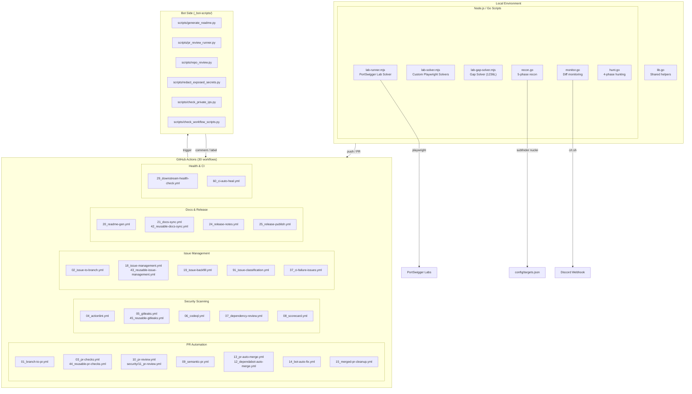

# Bug Bounty Automation Toolkit / 버그바운티 자동화 툴킷

[](https://nodejs.org/)
[](https://playwright.dev/)
[](https://go.dev/)
[](https://github.com/features/actions)
[](https://openssf.org/)
[](https://cliproxy.jclee.me)
[](LICENSE)

---

## Overview / 개요

### English

**Bug Bounty Automation Toolkit** is a local automation workspace for authorized web security research, vulnerability-study exercises, and lab-solving workflows. The repository combines:

- **Node.js ESM scripts** for PortSwigger/Web Security Academy style lab automation using Playwright
- **Go helper programs** for monitoring and vulnerability-hunting command orchestration
- **GitHub Actions workflows** (30 total) for PR checks, security scanning, PR review automation, issue management, release automation, documentation sync, and CI auto-healing
- **Bot-side helper scripts** for README generation, PR review execution, repository review, secret redaction, and private IP checks

The toolkit supports the full hunting workflow: `recon → monitoring → vulnerability hunting → reporting`.

> **⚠️ Warning**: This project is designed for authorized testing only. Do not run scans, lab payloads, or automated browser actions against systems you do not own or have explicit permission to test.

### 한국어

**Bug Bounty Automation Toolkit**은 허가된 웹 보안 연구, 취약점 학습, 실습 랩 자동화를 위한 로컬 자동화 워크스페이스입니다. 다음 구성요소를 포함합니다:

- **Node.js ESM 스크립트**: Playwright를 사용한 PortSwigger/Web Security Academy 스타일 랩 자동화
- **Go 헬퍼 프로그램**: 모니터링 및 취약점 탐지 명령 오케스트레이션
- **GitHub Actions 워크플로우** (총 30개): PR 检查, 보안 스캐닝, PR 리뷰 자동화, 이슈 관리, 릴리스 자동화, 문서 동기화, CI 자동 복구
- **봇 사이드 헬퍼 스크립트**: README 생성, PR 리뷰 실행, 리포지토리 리뷰, 시크릿 삭제, 프라이빗 IP 체크

본 툴킷은 전체 헌팅 워크플로우를 지원합니다: `recon → monitoring → vulnerability hunting → reporting`.

> **⚠️ 경고**: 본 프로젝트는 허가된 테스트 전용으로 설계되었습니다. 소유하거나 명시적 허가를 받은 시스템이 아닌 경우 스캔, 랩 페이로드, 자동 브라우저 작업을 실행하지 마십시오.

---

## Features / 기능

| Category | Description |
|----------|-------------|
| **Lab Automation** | PortSwigger Web Security Academy 랩 자동求解 (Playwright + Node.js ESM) |
| **Recon Pipeline** | 5단계 서브도메인 열거 → 웹 크롤링 → nuclei 스캐닝 → 결과 통합 |
| **Diff Monitoring** | crt.sh 기반 서브도메인 변경 감지 → Discord 알림 |
| **Vulnerability Hunting** | IDOR, SSRF, SQLi, XSS, CSRF 등 카테고리별 탐지 |
| **GitHub Automation** | 30개 워크플로우: PR checks, security scanning, auto-merge, issue management, CI healing |
| **Bot Scripts** | README 생성, PR 리뷰 실행기, 리포지토리 리뷰, 시크릿 삭제, 프라이빗 IP 체크 |
| **Self-Healing CI** | 실패한 CI 실행 자동 분석 및 재실행 |

---

## Architecture / 아키텍처



---

## Repository Structure / 리포지토리 구조

```
.
├── Makefile                      # Orchestration (make help for commands)
├── package.json                  # Node.js ESM deps (Playwright)
├── AGENTS.md                     # AI agents knowledge base
├── CONTRIBUTING.md               # Contribution guidelines
├── LICENSE                       # ISC License
├── README.md                     # This file
├── interactsh_payload.txt        # OOB testing payload
├── output-lab08.png              # Lab screenshot
├── config/
│   └── targets.json              # Target & notification configuration
├── scripts/
│   ├── lab-runner.mjs            # PortSwigger lab solver (262L)
│   ├── lab-solver.mjs            # Custom Playwright solvers (559L)
│   ├── lab-gap-solver.mjs        # Gap solver for labs without scripts (1236L)
│   ├── lab-batch-*.mjs          # Batch lab solvers (fast, slow, OOB, smuggling)
│   ├── lab-runner-*.mjs          # Runner variants (aggressive, standard)
│   ├── lib.go                    # Shared Go helpers
│   ├── hunt.go                   # 4-phase vulnerability hunting (464L)
│   ├── monitor.go                # Diff monitoring + Discord alerts (254L)
│   ├── recon.go                  # 5-phase recon pipeline (282L)
│   ├── setup.go                  # Tool verification + wordlists
│   ├── auth-solver.cjs           # Auth-focused solvers
│   ├── batch-*.cjs               # Various batch solvers
│   ├── diagnose-*.cjs            # Diagnostic scripts
│   ├── get-lab-urls.*           # Lab URL fetchers
│   ├── extract-labs.cjs          # Lab extractor
│   └── interactsh-wrapper.sh     # OOB testing wrapper
├── _bot-scripts/                 # (CI transient checkout path)
│   ├── README.md
│   ├── requirements.txt
│   ├── requirements-dev.txt
│   ├── setup.py
│   ├── pyproject.toml
│   ├── Dockerfile.github_action
│   ├── Dockerfile.github_app
│   ├── docker-compose.github_app.yml
│   ├── scripts/
│   │   ├── generate_readme.py    # README generator
│   │   ├── pr_review_runner.py   # PR review executor
│   │   ├── repo_review.py        # Repository reviewer
│   │   ├── redact_exposed_secrets.py
│   │   ├── check_private_ips.py
│   │   ├── check_workflow_scripts.py
│   │   ├── issue_classification_workflow_test.py
│   │   └── *.test.py             # Test files
│   └── notes/
│       ├── phase2-checklist.md
│       ├── report-template.md
│       └── vulnerability-study.md
├── .github/
│   └── workflows/
│       ├── 01_branch-to-pr.yml
│       ├── 02_issue-to-branch.yml
│       ├── 03_pr-checks.yml
│       ├── 04_actionlint.yml
│       ├── 05_gitleaks.yml
│       ├── 06_codeql.yml
│       ├── 07_dependency-review.yml
│       ├── 08_scorecard.yml
│       ├── 09_semantic-pr.yml
│       ├── 10_pr-review.yml
│       ├── 12_dependabot-auto-merge.yml
│       ├── 13_pr-auto-merge.yml
│       ├── 14_bot-auto-fix.yml
│       ├── 15_merged-pr-cleanup.yml
│       ├── 18_issue-management.yml
│       ├── 19_issue-backfill.yml
│       ├── 20_readme-gen.yml
│       ├── 21_docs-sync.yml
│       ├── 24_release-notes.yml
│       ├── 25_release-publish.yml
│       ├── 29_downstream-health-check.yml
│       ├── 37_ci-failure-issues.yml
│       ├── 42_reusable-docs-sync.yml
│       ├── 43_reusable-issue-management.yml
│       ├── 44_reusable-pr-checks.yml
│       ├── 45_reusable-gitleaks.yml
│       ├── 60_ci-auto-heal.yml
│       ├── 91_issue-classification.yml
│       ├── ci.yml
│       └── security/
│           └── 11_pr-review.yml
├── notes/                        # (gitignored in real repo)
│   ├── phase2-checklist.md
│   ├── report-template.md
│   └── vulnerability-study.md
├── wordlists/                    # SecLists (gitignored)
├── targets/                      # Target baselines (gitignored)
├── recon/                       # Scan results (gitignored)
└── reports/                     # Submitted reports (gitignored)
```

---

## Automation Inventory / 자동화 인벤토리

### GitHub Actions Workflows (30 total)

| File | Purpose |
|------|---------|
| `01_branch-to-pr.yml` | Convert branch to PR with auto-labeling |
| `02_issue-to-branch.yml` | Create branch from issue for contribution |
| `03_pr-checks.yml` | Reusable PR validation (lint, test, build) |
| `04_actionlint.yml` | GitHub Actions workflow linting |
| `05_gitleaks.yml` | Secret scanning in commits/PRs |
| `06_codeql.yml` | CodeQL static analysis |
| `07_dependency-review.yml` | Dependency vulnerability review |
| `08_scorecard.yml` | OpenSSF Scorecard security assessment |
| `09_semantic-pr.yml` | Enforce semantic PR title format |
| `10_pr-review.yml` | Bot PR review (external: qodo-ai/pr-agent) |
| `security/11_pr-review.yml` | Security-focused PR review |
| `12_dependabot-auto-merge.yml` | Auto-merge Dependabot PRs |
| `13_pr-auto-merge.yml` | Auto-merge on CI pass + approval |
| `14_bot-auto-fix.yml` | Apply bot-generated fixes |
| `15_merged-pr-cleanup.yml` | Post-merge cleanup (branch deletion) |
| `18_issue-management.yml` | Issue lifecycle automation |
| `19_issue-backfill.yml` | Backfill issues from commits |
| `20_readme-gen.yml` | Auto-regenerate README on structure change |
| `21_docs-sync.yml` | Sync documentation across repos |
| `24_release-notes.yml` | Generate release notes from changelog |
| `25_release-publish.yml` | Publish release artifacts |
| `29_downstream-health-check.yml` | Monitor downstream repo health |
| `37_ci-failure-issues.yml` | Create issue on CI failure |
| `42_reusable-docs-sync.yml` | Reusable docs sync workflow |
| `43_reusable-issue-management.yml` | Reusable issue management |
| `44_reusable-pr-checks.yml` | Reusable PR checks |
| `45_reusable-gitleaks.yml` | Reusable secret scanning |
| `60_ci-auto-heal.yml` | Auto-diagnose and retry failed CI |
| `91_issue-classification.yml` | Classify issues with AI |
| `ci.yml` | Main CI pipeline |

### Bot Scripts (inside `_bot-scripts/scripts/`)

| Script | Purpose |
|--------|---------|
| `generate_readme.py` | README auto-generation |
| `pr_review_runner.py` | PR review execution |
| `repo_review.py` | Repository security review |
| `redact_exposed_secrets.py` | Redact leaked secrets |
| `check_private_ips.py` | Detect hardcoded private IPs |
| `check_workflow_scripts.py` | Validate workflow scripts |
| `check_hardcode_scan_patterns_test.py` | Scan pattern validation |
| `issue_classification_workflow_test.py` | Issue classification test |
| `issue_classifier_js_test.py` | JS issue classifier test |
| `pr_review_runner_test.py` | PR runner unit tests |
| `readme_mermaid_test.py` | Mermaid diagram validation |

---

## Quick Start / 빠른 시작

### Prerequisites

- **Go** 1.21+
- **Node.js** 18+ (ESM modules)
- **Playwright** (`npx playwright install`)
- **Tools**: subfinder, nuclei, httpx, naabu, assetfinder, amass

### Setup

```bash
git clone https://github.com/jclee941/.github
cd bug
make setup
```

### Basic Commands

```bash
make help                    # Show all available commands

make recon TARGET=target.com     # Full recon pipeline
make monitor TARGET=target.com   # Monitor for changes
make hunt TARGET=target.com      # Vulnerability hunting
make full-scan TARGET=target.com # Recon + hunt combined
```

### Lab Solving (PortSwigger)

```bash
node scripts/lab-runner.mjs <lab-url>   # Single lab
node scripts/lab-batch-fast.mjs         # Fast batch mode
node scripts/lab-batch-oob.mjs          # OOB techniques
```

### Bot Script Execution (CI context)

```bash
# Via CLIProxy API endpoint (cliproxy.jclee.me)
curl -X POST https://cliproxy.jclee.me/v1/chat/completions \
  -H "Content-Type: application/json" \
  -d '{"model":"minimax-m2.7","messages":[{"role":"user","content":"..."}]}'

# Or local Python execution
cd _bot-scripts
pip install -r requirements.txt
python scripts/generate_readme.py
```

---

## Commands Reference / 명령어 참조

### Make targets

| Command | Description |
|---------|-------------|
| `make help` | Display all available commands |
| `make setup` | First-time setup — verify tools, download SecLists wordlists |
| `make recon TARGET=x.com` | 5-phase recon: subdomains → HTTP probing → nuclei → crawling → merge |
| `make recon-fast TARGET=x.com` | Recon without nuclei scan |
| `make monitor TARGET=x.com` | Diff monitoring via crt.sh + Discord webhook |
| `make hunt TARGET=x.com` | 4-phase vulnerability hunting (all categories) |
| `make hunt-idor TARGET=x.com` | IDOR vulnerabilities only |
| `make hunt-ssrf TARGET=x.com` | SSRF vulnerabilities only |
| `make hunt-sqli TARGET=x.com` | SQL injection only |
| `make full-scan TARGET=x.com` | Recon + hunt combined |
| `make clean` | Remove scan results (recon/, targets/) |

### Go scripts (direct execution)

```bash
go run scripts/setup.go scripts/lib.go           # Tool verification + wordlists
go run scripts/recon.go scripts/lib.go -d target.com
go run scripts/monitor.go scripts/lib.go -d target.com
go run scripts/hunt.go scripts/lib.go -d target.com
```

### Node.js scripts

```bash
node scripts/lab-runner.mjs <lab-url>
node scripts/lab-solver.mjs <lab-url> [options]
node scripts/lab-gap-solver.mjs <lab-url>
node scripts/lab-batch-fast.mjs
```

---

## Local Development / 로컬 개발

### Adding a new target

Edit `config/targets.json`:

```json
{
  "targets": [
    {
      "domain": "example.com",
      "notifications": {
        "discord_webhook": "https://discord.com/api/webhooks/..."
      }
    }
  ]
}
```

### Adding a new hunt category

Edit `scripts/hunt.go` → add to `huntTypes` slice:

```go
var huntTypes = []string{
    "idor", "ssrf", "sqli", "xss", "csrf", "openredirect",
    // add new category here
}
```

### Modifying the recon pipeline

Edit `scripts/recon.go` — each phase is a separate function:

1. `phaseSubdomainEnumeration`
2. `phaseHttpProbing`
3. `phaseNucleiScan`
4. `phaseWebCrawling`
5. `phaseResultMerge`

### Bot script development

```bash
cd _bot-scripts

# Install dependencies
pip install -r requirements.txt
pip install -r requirements-dev.txt

# Run tests
python -m pytest scripts/*.py

# Lint
flake8 scripts/*.py
```

---

## Contribution Guide / 기여 가이드

Contributions are welcome. Please read `CONTRIBUTING.md` before submitting PRs.

### Key conventions

- **Standalone Go scripts**: No `go.mod`, run via `go run scripts/x.go scripts/lib.go`
- **Go stdlib only**: No external Go dependencies (use `os/exec` for CLI tools)
- **Node.js ESM**: All `.mjs`/`.cjs` scripts use ES modules
- **No hardcoded targets**: Use `config/targets.json` or environment variables
- **Gitignored artifacts**: Never commit `recon/`, `targets/`, `reports/`, `wordlists/`

### Workflow naming

- Workflow files use numeric prefixes (e.g., `03_pr-checks.yml`) for sort order
- Reusable workflows are prefixed with `4x_`, `9x_` for category grouping
- Security-specific workflows live under `security/` directory

### Bot script conventions

- All bot scripts in `_bot-scripts/scripts/` are Python-based
- Tests use `_test.py` suffix
- Use `requirements.txt` for runtime, `requirements-dev.txt` for development

---

## External Resources / 외부 리소스

| Resource | Link |
|----------|------|
| PR Review Agent | [qodo-ai/pr-agent](https://github.com/qodo-ai/pr-agent) |
| CLIProxy API | [cliproxy.jclee.me](https://cliproxy.jclee.me) |
| Bot Dashboard | [bot.jclee.me](https://bot.jclee.me) |
| PortSwigger Lab | [portswigger.net/web-security](https://portswigger.net/web-security) |
| OpenSSF Security | [openssf.org](https://openssf.org/) |

---

## License

ISC License. See [LICENSE](LICENSE).
