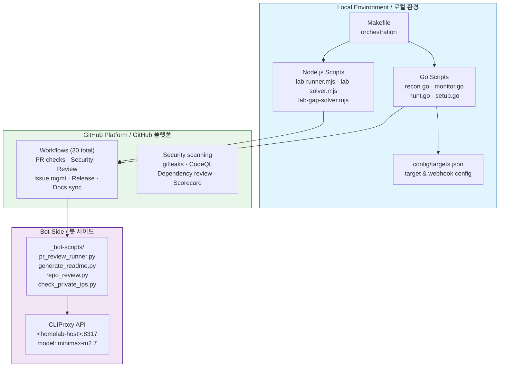

# Bug Bounty Automation Toolkit / 버그바운티 자동화 툴킷

[](https://nodejs.org/)
[](https://playwright.dev/)
[](https://go.dev/)
[](https://github.com/features/actions)
[](https://openssf.org/)
[](https://cliproxy.jclee.me)
[](LICENSE)

---

## Overview / 개요

### English

**Bug Bounty Automation Toolkit** is a local automation workspace for authorized web security research, vulnerability-study exercises, and lab-solving workflows. The repository combines:

- **Node.js ESM scripts** for PortSwigger/Web Security Academy style lab automation using Playwright
- **Go helper programs** for monitoring and vulnerability-hunting command orchestration
- **GitHub Actions workflows** (30 total) for PR checks, security scanning, PR review automation, issue management, release automation, documentation sync, and CI auto-healing
- **Bot-side helper scripts** for README generation, PR review execution, repository review, secret redaction, and private IP checks

The toolkit supports the full hunting workflow: `recon → monitoring → vulnerability hunting → reporting`.

> **⚠️ Warning**: This project is designed for authorized testing only. Do not run scans, lab payloads, or automated browser actions against systems you do not own or have explicit permission to test.

### 한국어

**Bug Bounty Automation Toolkit**은 허가된 웹 보안 연구, 취약점 학습, 실습 랩 자동화를 위한 로컬 자동화 워크스페이스입니다. 다음 구성요소를 포함합니다:

- **Node.js ESM 스크립트**: Playwright 기반 PortSwigger/Web Security Academy 스타일 랩 자동화
- **Go 헬퍼 프로그램**: 모니터링 및 취약점 탐지 커맨드 오케스트레이션
- **GitHub Actions 워크플로** (30개): PR 검사, 보안 스캔, PR 리뷰 자동화, 이슈 관리, 릴리스 자동화, 문서 동기화, CI 자동 복구
- **봇 사이드 헬퍼 스크립트**: README 생성, PR 리뷰 실행, 리포지토리 검토, 시크릿 삭제, 사설 IP 검사

도구킷은 전체 헌팅 워크플로를 지원합니다: `recon → monitoring → vulnerability hunting → reporting`.

> **⚠️ 경고**: 이 프로젝트는 허가된 테스트 전용입니다. 소유하거나 명시적 권한이 없는 시스템에 대해 스캔, 랩 페이로드 또는 자동화된 브라우저 동작을 실행하지 마십시오.

---

## Features / 주요 기능

### English

| Feature | Description |
|---------|-------------|
| **Full Recon Pipeline** | Subdomain enumeration → port scanning → screenshot → nuclei scan → report merge |
| **Diff Monitoring** | Track new subdomains/endpoints over time using crt.sh and alert via Discord webhook |
| **Targeted Hunt** | Categorized vulnerability scanning (IDOR, SSRF, SQLi, XSS, etc.) using nuclei templates |
| **PortSwigger Lab Solver** | Automated browser-driven lab solving via Playwright + custom Node.js solvers |
| **GitHub Automation** | 30 workflows covering PR checks, security scanning, review automation, issue management, release engineering, and CI auto-healing |
| **Bot-Side Tools** | README generation, PR review execution, repository review, secret redaction, private IP detection |

### 한국어

| 기능 | 설명 |
|------|------|
| **전체 Recon 파이프라인** | 서브도메인 열거 → 포트 스캔 → 스크린샷 → nuclei 스캔 → 리포트 병합 |
| **Diff 모니터링** | crt.sh 기반 새 서브도메인/엔드포인트 추적 및 Discord 웹훽 알림 |
| **타겟 헌팅** | nuclei 템플릿 기반 분류 취약점 스캔 (IDOR, SSRF, SQLi, XSS 등) |
| **PortSwigger 랩 솔버** | Playwright + 커스텀 Node.js 솔버 기반 자동 브라우저 랩 해결 |
| **GitHub 자동화** | PR 검사, 보안 스캔, 리뷰 자동화, 이슈 관리, 릴리스 엔지니어링, CI 자동 복구 커버하는 30개 워크플로 |
| **봇 사이드 도구** | README 생성, PR 리뷰 실행, 리포지토리 검토, 시크릿 삭제, 사설 IP 탐지 |

---

## Architecture / 아키텍처



---

## Automation Inventory / 자동화 인벤토리

### GitHub Actions Workflows (30 workflows)

#### Pull Request Automation

| File | Name | Description |
|------|------|-------------|
| `01_branch-to-pr.yml` | Branch to PR | Link branch to PR |
| `02_issue-to-branch.yml` | Issue to Branch | Create branch from issue |
| `03_pr-checks.yml` | PR Checks | Core PR validation (reusable: `44_reusable-pr-checks.yml`) |
| `09_semantic-pr.yml` | Semantic PR | Enforce semantic PR title format |
| `10_pr-review.yml` | PR Review | Automated PR review (security: `security/11_pr-review.yml`) |
| `13_pr-auto-merge.yml` | PR Auto Merge | Auto-merge on CI pass |
| `14_bot-auto-fix.yml` | Bot Auto Fix | Trigger bot fix pipeline |
| `15_merged-pr-cleanup.yml` | Merged PR Cleanup | Clean up after PR merge |

#### Security Scanning

| File | Name | Description |
|------|------|-------------|
| `04_actionlint.yml` | Actionlint | Lint GitHub Actions YAML |
| `05_gitleaks.yml` | Gitleaks | Scan for secrets (reusable: `45_reusable-gitleaks.yml`) |
| `06_codeql.yml` | CodeQL | Static code analysis |
| `07_dependency-review.yml` | Dependency Review | Dependency vulnerability check |
| `08_scorecard.yml` | Scorecard | OpenSSF security scorecard |

#### Issue Management

| File | Name | Description |
|------|------|-------------|
| `18_issue-management.yml` | Issue Management | Issue lifecycle automation (reusable: `43_reusable-issue-management.yml`) |
| `19_issue-backfill.yml` | Issue Backfill | Backfill issue metadata |
| `37_ci-failure-issues.yml` | CI Failure Issues | Auto-file issues on CI failure |
| `91_issue-classification.yml` | Issue Classification | AI-powered issue classification |

#### Documentation & README

| File | Name | Description |
|------|------|-------------|
| `20_readme-gen.yml` | README Generation | Auto-generate/update README |
| `21_docs-sync.yml` | Docs Sync | Sync documentation (reusable: `42_reusable-docs-sync.yml`) |

#### Release Engineering

| File | Name | Description |
|------|------|-------------|
| `24_release-notes.yml` | Release Notes | Auto-generate release notes |
| `25_release-publish.yml` | Release Publish | Publish release artifacts |

#### Dependency Management

| File | Name | Description |
|------|------|-------------|
| `12_dependabot-auto-merge.yml` | Dependabot Auto Merge | Auto-merge Dependabot PRs |

#### Health & Monitoring

| File | Name | Description |
|------|------|-------------|
| `29_downstream-health-check.yml` | Downstream Health Check | Monitor downstream repo health |
| `60_ci-auto-heal.yml` | CI Auto Heal | Auto-heal broken CI |
| `ci.yml` | CI | Main CI pipeline |

### Bot-Side Helper Tools (`_bot-scripts/`)

| Script | Purpose |
|--------|---------|
| `generate_readme.py` | README generation (model: minimax-m2.7 via CLIProxy) |
| `pr_review_runner.py` | PR review execution |
| `repo_review.py` | Repository review automation |
| `redact_exposed_secrets.py` | Secret redaction in logs |
| `check_private_ips.py` | RFC1918 IP address detection |
| `check_workflow_scripts.py` | Workflow script validation |
| `check_hardcode_scan_patterns_test.py` | Hardcoded pattern scanning |
| `issue_classification_workflow_test.py` | Issue classification testing |
| `issue_classifier_js_test.js` | JS-based issue classifier test |
| `pr_review_runner_test.py` | PR review runner tests |

### Local Go Scripts (`scripts/`)

| Script | Purpose |
|--------|---------|
| `setup.go` | Tool verification + wordlist download |
| `recon.go` | 5-phase recon pipeline |
| `monitor.go` | Diff monitoring + crt.sh + Discord alerts |
| `hunt.go` | 4-phase targeted vulnerability hunting |
| `lib.go` | Shared helpers |

### Node.js Lab Automation (`scripts/`)

| Script | Purpose |
|--------|---------|
| `lab-runner.mjs` | PortSwigger lab solver using Playwright |
| `lab-solver.mjs` | Custom Playwright lab solvers |
| `lab-gap-solver.mjs` | Gap solver for labs without scripts |
| `lab-batch-*.mjs` | Batch lab solving scripts |
| `hunt.go`, `lib.go` | Go-based hunting utilities |

---

## Quick Start / 빠르게 시작하기

### English

```bash
# 1. Clone and setup
git clone https://github.com/jclee941/.github
cd bug
make setup

# 2. Configure targets
# Edit config/targets.json

# 3. Run full recon
make recon TARGET=example.com

# 4. Monitor for changes
make monitor TARGET=example.com

# 5. Hunt vulnerabilities
make hunt TARGET=example.com

# 6. Full scan (recon + hunt)
make full-scan TARGET=example.com
```

### 한국어

```bash
# 1. 클론 및 설정
git clone https://github.com/jclee941/.github
cd bug
make setup

# 2. 타겟 설정
# config/targets.json 편집

# 3. 전체 recon 실행
make recon TARGET=example.com

# 4. 변경 사항 모니터링
make monitor TARGET=example.com

# 5. 취약점 헌팅
make hunt TARGET=example.com

# 6. 전체 스캔 (recon + hunt)
make full-scan TARGET=example.com
```

---

## Local Development / 로컬 개발

### Requirements

- Go 1.21+
- Node.js 18+ (ESM)
- Playwright (`npm i`)
- External tools: `subfinder`, `nuclei`, `amass`, `naabu`, `httpx`, `dnsx`

### Environment Setup

```bash
# Install dependencies
npm install

# Verify tools and download wordlists
make setup

# Show all available commands
make help
```

### Running Scripts Directly

```bash
# Go scripts (standalone, no go.mod required)
go run scripts/setup.go scripts/lib.go
go run scripts/recon.go scripts/lib.go -d target.com
go run scripts/monitor.go scripts/lib.go -d target.com
go run scripts/hunt.go scripts/lib.go -d target.com

# Node.js lab automation
node scripts/lab-runner.mjs --target https://example.com
node scripts/lab-solver.mjs --lab-id LabName
```

---

## Commands Reference / 명령어 참고

### Makefile Targets

| Command | Description |
|---------|-------------|
| `make help` | Show all available commands |
| `make setup` | First-time setup — verify tools, download wordlists |
| `make recon TARGET=domain.com` | Full 5-phase recon pipeline |
| `make recon-fast TARGET=domain.com` | Quick recon (skip nuclei) |
| `make monitor TARGET=domain.com` | Diff-based change detection |
| `make hunt TARGET=domain.com` | All vulnerability categories |
| `make hunt-idor TARGET=domain.com` | IDOR vulnerabilities only |
| `make hunt-ssrf TARGET=domain.com` | SSRF vulnerabilities only |
| `make hunt-sqli TARGET=domain.com` | SQL injection only |
| `make hunt-xss TARGET=domain.com` | XSS vulnerabilities only |
| `make full-scan TARGET=domain.com` | Recon + hunt combined |
| `make clean` | Remove scan results |

---

## Repository Structure / 리포지토리 구조

```
.
├── AGENTS.md                  # AI agent knowledge base
├── CONTRIBUTING.md            # Contribution guidelines
├── LICENSE                    # ISC License
├── Makefile                   # Orchestration (make help)
├── README.md                  # This file
├── package.json               # Node.js dependencies (Playwright)
├── config/
│   └── targets.json           # Target & notification configuration
├── scripts/
│   ├── setup.go               # Tool verification + wordlist download
│   ├── recon.go               # 5-phase recon pipeline
│   ├── monitor.go             # Diff monitoring + crt.sh + Discord
│   ├── hunt.go                # 4-phase targeted vuln hunting
│   ├── lib.go                 # Shared helpers
│   ├── lab-runner.mjs         # PortSwigger lab solver
│   ├── lab-solver.mjs         # Custom Playwright solvers
│   ├── lab-gap-solver.mjs     # Gap solver (1236L)
│   ├── lab-batch-*.mjs        # Batch solving scripts
│   ├── batch-*.cjs            # Collaboration batch scripts
│   ├── diagnose-*.cjs          # Diagnostic utilities
│   ├── get-lab-urls.*         # Lab URL extraction
│   └── hunt.go                # Go-based hunt utility
├── notes/
│   ├── phase2-checklist.md    # Learning checklist
│   ├── report-template.md     # Bug report template
│   ├── vulnerability-study.md # Vulnerability research notes
│   └── report-template.md     # Report format guide
├── _bot-scripts/              # Bot-side helper scripts
│   ├── AGENTS.md              # Bot agent knowledge base
│   ├── README.md              # Bot-side documentation
│   ├── generate_readme.py     # README auto-generation
│   ├── pr_review_runner.py    # PR review executor
│   ├── repo_review.py         # Repository reviewer
│   ├── check_private_ips.py    # RFC1918 IP detection
│   ├── redact_exposed_secrets.py # Secret redaction
│   ├── check_workflow_scripts.py # Workflow validation
│   ├── scripts/               # Additional bot utilities
│   ├── pyproject.toml         # Python package config
│   ├── requirements.txt       # Python dependencies
│   ├── Dockerfile.github_action # GitHub Action container
│   ├── Dockerfile.github_app   # GitHub App container
│   └── docker-compose.github_app.yml # App deployment
└── .github/
    └── workflows/             # 30 GitHub Actions workflows
        ├── 01_branch-to-pr.yml
        ├── 02_issue-to-branch.yml
        ├── 03_pr-checks.yml
        ├── 04_actionlint.yml
        ├── 05_gitleaks.yml
        ├── 06_codeql.yml
        ├── 07_dependency-review.yml
        ├── 08_scorecard.yml
        ├── 09_semantic-pr.yml
        ├── 10_pr-review.yml
        ├── 12_dependabot-auto-merge.yml
        ├── 13_pr-auto-merge.yml
        ├── 14_bot-auto-fix.yml
        ├── 15_merged-pr-cleanup.yml
        ├── 18_issue-management.yml
        ├── 19_issue-backfill.yml
        ├── 20_readme-gen.yml
        ├── 21_docs-sync.yml
        ├── 24_release-notes.yml
        ├── 25_release-publish.yml
        ├── 29_downstream-health-check.yml
        ├── 37_ci-failure-issues.yml
        ├── 42_reusable-docs-sync.yml
        ├── 43_reusable-issue-management.yml
        ├── 44_reusable-pr-checks.yml
        ├── 45_reusable-gitleaks.yml
        ├── 60_ci-auto-heal.yml
        ├── 91_issue-classification.yml
        ├── ci.yml
        └── security/
            └── 11_pr-review.yml
```

---

## Security Scanning Stack / 보안 스캔 스택

| Tool | Workflow | Purpose |
|------|----------|---------|
| **Gitleaks** | `05_gitleaks.yml`, `45_reusable-gitleaks.yml` | Detect secrets in code |
| **CodeQL** | `06_codeql.yml` | Semantic static analysis |
| **Dependency Review** | `07_dependency-review.yml` | Dependency vulnerability scanning |
| **Scorecard** | `08_scorecard.yml` | OpenSSF security posture assessment |
| **Actionlint** | `04_actionlint.yml` | GitHub Actions YAML linting |

---

## Contributing / 기여하기

### English

Contributions are welcome. Please read [`CONTRIBUTING.md`](CONTRIBUTING.md) for guidelines.

- All Go scripts are standalone (no external dependencies beyond stdlib)
- Node.js scripts use ESM (`"type": "module"`)
- Follow existing code conventions
- Test locally before submitting PRs
- Do not hardcode target domains or private IPs

### 한국어

기여를 환영합니다. 지침은 [`CONTRIBUTING.md`](CONTRIBUTING.md)를 참고하세요.

- 모든 Go 스크립트는 독립 실행형 (stdlib 외 외부 의존성 없음)
- Node.js 스크립트는 ESM (`"type": "module"`) 사용
- 기존 코드 규칙을 따르세요
- 제출 전 로컬에서 테스트하세요
- 타겟 도메인이나 사설 IP를 하드코딩하지 마세요

---

## External Links / 외부 링크

| Resource | URL |
|----------|-----|
| CLIProxy API (README model) | <https://cliproxy.jclee.me/v1> |
| PR-Agent | <https://qodo-ai/pr-agent> |
| Bot Dashboard | <https://bot.jclee.me> |
| Repository Issues | <https://github.com/jclee941/bug/issues> |

---

## License / 라이선스

ISC License. See [`LICENSE`](LICENSE) for details.
